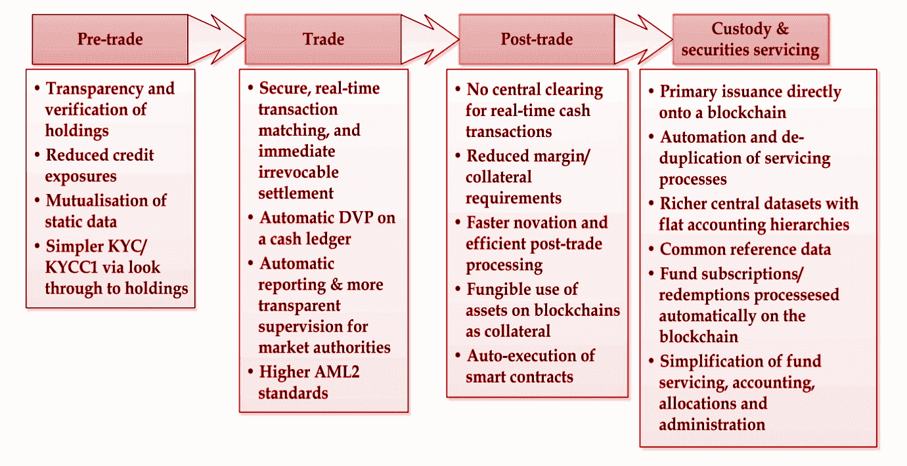

# 区块链:这只是炒作吗？

> 原文：<https://medium.com/hackernoon/blockchain-is-it-just-a-hype-fbcaaca91b1d>

**摘要**

区块链是金融行业正在进行的数字革命背后的主要驱动力之一，被称为 fin tech[金融科技]。它旨在挑战传统的金融市场结构，这种结构在适应市场和监管需求方面行动缓慢，这在全球金融危机的后果中显而易见。随着全球投资迅速增加，金融科技最近受到了很多关注，这可以归功于比特币技术的成功和影响。比特币催生了分布式账本技术(Distributed Ledger Technology，DLT)，这是一个松散的术语，指的是区块链、点对点网络、分布式数据存储、自动化业务逻辑、密码术等几个组件的组合。DLT 的目标是提供一种新的处理数字资产的创新方法，如记录保存、存储和转移。在这份报告中，我们深入探讨了区块链的技术细节，以及它的一个显著成功——比特币。

**分解区块链**

“区块链技术”是最近的流行语，一些人声称这是一个革命性的想法，将从根本上改变经济的形态。然而，这是一个非常抽象的概念，大多数业内人士对它只有模糊的理解。本质上，它指的是分布式公共分类账，以分散的方式保存任何有价值的交易记录。目标是使用密码术和各种共识协议来得到单一版本的真相。下面，我们描述区块链的基本原理:

**分布式数据库:**区块链存储了自数据库创建以来执行的所有交易记录。这是以分布式方式完成的，因此数据库的副本在整个网络中复制，消除了任何单点故障的风险，并提高了数据透明度。

**去中心化:**在区块链技术的背景下，去中心化特指以下两个维度；**建筑**和**政治**。体系结构分散意味着在网络中有多台计算机组成区块链系统。政治分权是指没有中央控制点，因此单个组织或个人无法维持和管理区块链。相反，监管是通过在组成区块链网络的节点上运行的协议和加密安全措施来实现的。正是这种去中心化的维度使得区块链成为一个引人注目的概念，并将其与需要可信中介来监管交易的传统方法区分开来。

**不变性:**区块链通过共识验证协议进行更新，该协议使网络能够集中插入新交易，从而确保在任何时候都有单一版本的分类账。这些协议进一步防止任何恶意节点操纵或插入欺诈性交易，从而确保区块链的真实性。

**比特币**

比特币是 2009 年 1 月诞生的区块链的第一个成功概念。2008 年 10 月，一位化名为中本聪的程序员写了一份题为“比特币:一种点对点电子现金系统”的白皮书，描述了比特币协议。该论文旨在解决的主要问题是“双重消费问题”，这是数字货币特有的问题，因为它可以很容易地复制和消费两次。目前，银行监管数字货币的流动，确保不会发生重复消费。中本聪想出了一个巧妙的方法来解决这个问题，使用一个点对点网络和一个“工作证明”系统，消除了由一个可信的第三方机构监管的需要。为了更好地理解这个工作证明系统是如何工作的，对公钥加密、数字签名和加密散列函数的理解是必不可少的。

**工作证明**

Nakamoto 提出的 P2P 解决方案本质上是让任何人通过存储共享的公共账本、参与验证交易并保持更新来成为银行。这种共享公共分类账由顺序链接在一起的离散块组成。每个块由一定数量的事务和链接到前一个块的公共头组成。参与区块链的唯一要求是为其贡献计算资源，这是运行工作证明系统所必需的。

图 3:比特币挖掘过程

工作验证背后的关键思想是让任何想要验证事务并向区块链贡献块的人在计算上变得昂贵。这是通过让想要为区块链做出贡献的节点解决加密哈希难题来实现的，也称为“挖掘”。解决这个难题的唯一方法是不断尝试猜测答案，但当找到答案时，验证它是否是正确答案是一个一步到位的过程。因此得名“工作证明”。一旦矿工解决了难题并将其广播到网络，每个人都可以立即验证它是否被正确解决，如果是，他们可以将其添加到区块链。每开采一个区块也会产生少量的比特币，奖励给矿工。

这刺激了矿工开采区块，并有助于逐步增加比特币的供应。工作证明确保某人对整个区块链的影响与他们对验证事务所贡献的总 CPU 能力成正比。只要专用于区块链的大部分 CPU 能力(50%以上)不是来自一个集中的来源，就几乎不可能创建双重消费攻击或在区块链中插入欺诈交易。

工作证明只是解决重复支出问题的一种方式。自其诞生以来，其他加密货币已经通过对协议进行一些修改而产生，这些修改具有额外的功能或克服了比特币的一些限制。

**比特币——“并非真正匿名”**

最近出现的勒索软件要求支付比特币作为赎金，让公众觉得比特币是一个匿名的电子现金系统。尽管比特币的地址与其用户的身份无关，但它应该被视为一个假名系统，因为所有交易都位于一个公共区块链上，任何人都可以分析这些交易。此外，一些研究表明，基于使用交易图或其他外部数据源的方法，消除比特币用户的匿名是可能的。尽管如此，犯罪分子仍然有动机使用比特币，因为有一些技术使追踪比特币用户变得极其困难。其中一种技术是利用 Bitmix 或 bit Washington 等服务对比特币进行洗钱。正因为如此，比特币很可能仍将是收取赎金的主要来源，除非另一种加密货币被创造出来，具有让用户 100%匿名的功能。

**安全事故**

尽管该协议非常稳健，并且使用加密技术采取了安全措施，但比特币和其他加密货币不应被视为 100%安全。软件漏洞是不可避免的，区块链协议日益增加的复杂性只会增加软件中出现错误的风险。以下是加密货币领域因软件漏洞而被利用的一些漏洞:

*   Inputs.io:免费在线比特币钱包被黑客攻击，损失 120 万美元
*   Mt. Gox:一家处理 70%比特币交易的比特币交易所在被黑客攻击后破产，损失了 4.6 亿美元。
*   以太坊:平价，一种数字钱包服务被黑客利用，使他们能够窃取价值 3400 万美元的以太货币。

此外，加密货币引发了网络空间的新型威胁。一个这样的例子是 Cerber 勒索软件，它被更新为寻找存储在计算机中的比特币钱包数据，并感染勒索软件。另一个最近出现的威胁是让恶意软件感染多台机器，并使用它们来挖掘比特币。由于比特币使用需要计算能力的工作证明来挖掘比特币，因此计算能力的使用将永远有需求。2015 年，据报道发生了一起恶意软件感染大学网络并利用计算资源挖掘比特币的事件。

**区块链炒作**

自比特币诞生以来，区块链的初创公司以及对区块链技术的投资呈指数级增长。大多数全球性银行已经开始以多种方式试验区块链技术，比如与金融科技初创公司合作，加入技术联盟，或者开发自己的内部技术。区块链领域的一个主要参与者是 R3 财团，该财团于 2015 年 9 月成立，由 80 多家全球金融机构组成(例如，美国银行、汇丰银行、英特尔、SBI 集团等)，它们共同合作开发和试验区块链技术。具体来说，R3 宣布他们正在开发一个名为 *Corda* 的分布式分类账平台，该平台专为受监管的金融机构设计，用于管理金融交易。应该注意的是，Corda 不是区块链，但它深受当前区块链系统的影响和启发。采用这种方法是因为当前的区块链应用程序不能直接应用于金融机构，金融机构应该考虑监管、隐私和可扩展性的需要。在首轮融资的前两个阶段，他们成功筹集了 1.07 亿美元，这是迄今为止 DLT 最大的一笔投资。下图显示了几个大财团和他们各自的一些成员。

由于区块链空间的创新和投资，它似乎正在收集不必要的炒作，其好处被媒体夸大，媒体没有考虑到有效所需的巨大技术进步。此外，区块链科技旨在从根本上改变当前的金融基础设施，这不可能在一夜之间实现，肯定会遭到监管机构和政府的抵制，因为它们担心新技术带来的风险。由于这一点，区块链技术已经作为“膨胀的预期峰值”登上了 Gartner 炒作周期曲线的顶端，表明它是一项具有巨大潜力的技术，但需要大量的时间和努力才能在全球采用。

图 5:2016 年 Gartner 新兴技术炒作周期

**总而言之**

麻省理工学院斯隆管理学院最近的一篇题为“区块链的一些简单经济学”的研究论文断言，分布式账本技术(DLT)影响了两个关键成本，验证成本和联网成本。这对金融业来说是机遇也是威胁。由于 DLT 为金融机构使用的传统基础技术提供了替代品，采用它将显著降低成本并创造新的交易类型。资本市场特有的一些优势如下所示:

图 6:资本市场采用区块链的好处

然而，金融业也应该警惕 DLT 带来的威胁，因为它可以通过提供另一种创造价值并在全球范围内分配价值的方式，来取代当今的金融机构。例如，人们当然可以想象比特币或其他加密货币取代 SWIFT 和 ACH 等服务的角色，并通过降低审计和监管成本更有效地提供这些服务。