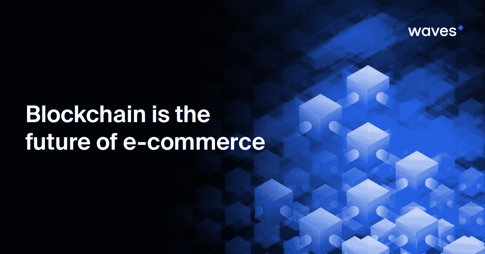

# 区块链是电子商务的未来

> 原文：<https://medium.com/hackernoon/blockchain-is-the-future-of-e-commerce-5d6b118ddb68>

随着第一批支付插件甚至整个市场平台的推出，区块链和加密货币可以为传统电子商务世界提供很多东西。

20 世纪 90 年代末，随着网络的成熟，电子商务从亚马逊和其他早期在线零售商的不稳定起步，迅速确立了自己的地位，现在已经成为一个庞大且仍在快速增长的行业。亚马逊、易贝和阿里巴巴等少数巨头主导着市场，还有贝宝，贝宝于 2002 年被易贝收购，并充当其默认支付处理器。

尽管电子商务很受欢迎，市场渗透率也很高，但它也有缺点。其中大多数与市场平台的集中化及其背后企业的规模有关。

# 费用

卖家通常需要支付高额佣金，但如果他们想获得顶级电子商务平台享有的大量受众，他们几乎没有选择。在某些情况下，费用可能高达 20%。还需要考虑信用卡或支付处理费。例如，PayPal 通常收取 3%左右的费用。所有这些都必须包含在价格中，并传递给消费者。

# 门卫

在传统的电子商务中，平台及其背后的公司扮演着把关人的角色，限制买家和卖家之间的联系。商家努力与客户建立长期关系，因为市场公司不希望他们在其电子商务平台之外进行交易。沟通通常受到限制，或者在严格的参数范围内进行，平台能够查看买卖双方之间交换的任何信息。

# 个人信息的使用

每一项大型在线服务都会从用户那里收集大量个人数据，并以各种方式加以利用，从定制广告到出售或与第三方分享。此外，数据泄露是司空见惯的事情。个人数据被称为互联网的石油，其价值使其成为黑客的热门目标。尽管 GDPR 在这方面有所改善，但在许多司法管辖区，有关数据使用的法律远没有那么清晰。对于公司在数据泄露的情况下应该如何行动，可能没有直接的程序，他们可能不会告诉客户他们的个人信息已经被泄露了几个月，如果有的话。简而言之，数据丢失已经从一家公司的尴尬或不便变成了做生意的代价。

# 加密集成的优势

区块链和加密货币为这些问题提供了许多解决方案。尽管比特币最初是作为网络黑市上的(非法)电子商务工具而崭露头角的，但有充分的理由将其整合到主流市场平台中。

第一批完全去中心化的市场正在上线。这些公司旨在用一个基于区块链的解决方案取代易贝、亚马逊和其他公司的整个基础设施，利用智能合约重建后端和库存数据库。例如， [BitBoost](https://www.bitboost.net/) 正在以太坊网络上开创这样一个市场。这种方法的优势之一是它实现了一种完全不同的商业模式，这种模式不收取佣金——这是一种点对点的方法，不涉及公司，也不需要任何看门人。

# 加密支付

对于拥有自己的网站商店的个体商户来说，集成加密货币支付作为 PayPal 或信用卡等传统支付方式的替代或补充仍然有巨大的好处。

加密支付是真正无国界的，所以无论你是从几英里外的邻村还是世界的另一端购买都没有区别。这立刻就取消了一部分费用。(银行通常会对国外支付收取额外费用，并提供一个远离市场现货价格的汇率——一个额外的秘密费用。)

对于卖家来说，加密支付提供了一种近乎即时的收款方式:没有三天的延迟，就像等待信用卡支付结算一样。费用很低，所以没有很大的成本转嫁给消费者。虽然比特币费用在 2017 年底飙升，接近 20 美元，但 SegWit 和交易批处理已经将它们降至多年来的最低水平。其他有意将自己定位为日常交易平台的加密货币的费用要低得多——Waves 的收费仅为 0.001 WAVES，或每 tx 不到 0.5 美分。

作为一个高通量、低成本、人性化的区块链平台， [Waves](https://wavesplatform.com/) 是电子商务整合的理想选择。该平台拥有强大、快速的网络和强大的令牌管理设施，使商家能够接收加密令牌作为支付，甚至可以根据自己的意愿创建自己的货币。

Waves 最近发布了一个支付 API，可以轻松地将 WAVES 和 Waves token [支付集成到任何网站](https://docs.wavesplatform.com/development-and-api/client-api/payments-api.html)。此外，Mageworx 与 Waves 合作[，通过流行的 Magento 网站插件实现加密支付。](https://www.mageworx.com/waves-crypto-payments-magento2-extension.html)

商家还享有 crypto 不可逆交易的好处，这杜绝了欺诈性退款。没有支付处理器可以单方面撤销交易，这种情况经常发生在顾客不诚实地声称他们从未收到商品的时候。在政策上，电子商务公司的支持团队经常站在客户一边，由卖家承担费用。