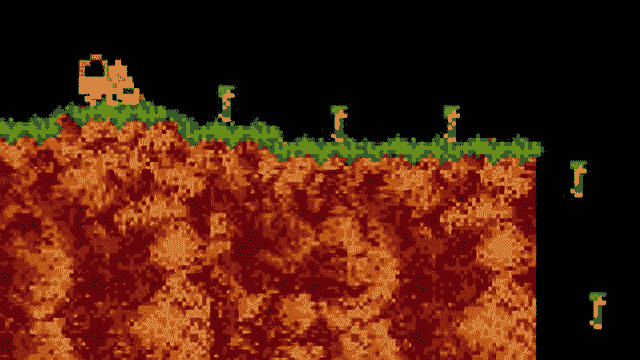
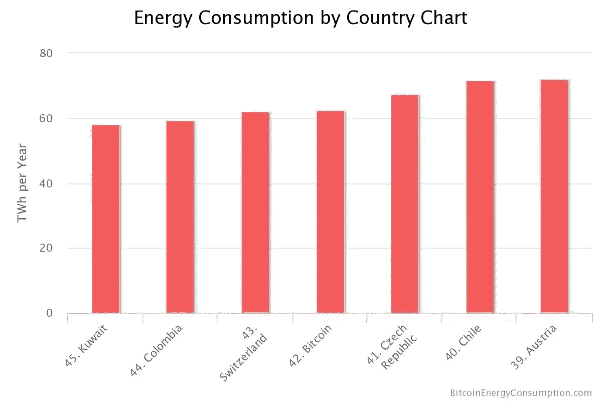
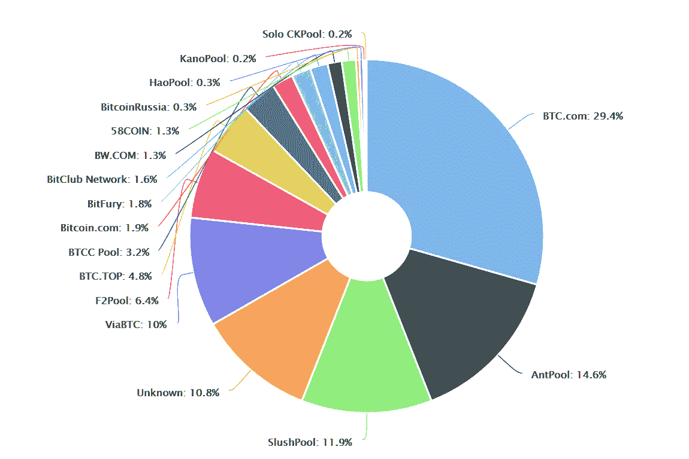
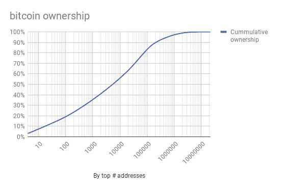

# 区块链是终极的愚人节玩笑

> 原文：<https://medium.com/hackernoon/blockchain-is-the-ultimate-april-fools-joke-9f6d1085ef2e>

## 一个被认真对待的笑话展示了比特币、区块链和加密货币背后的神话

Unrelated screenshot of the game Lemmings, 1991

为了愚人节，我在脸书和推特上发了一条消息，告诉大家从现在开始我将如何关注 T2 和区块链。不幸的是，我的一些朋友搞混了，把它当真了。

> 在新话做了两个月的研究员后，我意识到，虽然人工智能和人工智能非常有趣，但它们并不是真正的游戏规则改变者。真正改变游戏规则的是加密货币和区块链！人工智能和自动化离改变我们的社会还很远，只会进一步将财富集中在少数人手中，而区块链现在正在发生。
> 
> 区块链可以带来去中心化和真正的公平:每个人都可以开采比特币，每个人都可以轻松转账，去中心化将使类似剑桥分析公司(Cambridge Analytica)和相关隐私泄露的灾难变得不可能。
> 
> 没有人能把你所有的信息都放在一个地方让每个人查看和分析，区块链账本提供了保证公平和分配财富所必需的透明度。
> 
> 分散化将使一个玩家不可能像脸书和 YouTube 那样控制你的大部分数据和所有视频，错误信息的传播将成为过去。
> 
> 从今天起，我将集中精力追求密码算法和区块链，造福大众！

几个朋友找我解释。这些说法在比特币、加密货币或去中心化的讨论中相当常见，那么它们有什么问题呢？

## 权力下放并不能阻止错误信息

> 分散化将使一个玩家不可能像脸书和 YouTube 那样控制你的大部分数据和所有视频，错误信息的传播将成为过去。

权力下放不会阻止错误信息的传播。通常，当谷歌/YouTube 或脸书因为在这些平台上发生了一些不受欢迎的事情而成为头条新闻时，[人们呼吁去中心化](https://techcrunch.com/2016/10/09/a-decentralized-web-would-give-power-back-to-the-people-online/)并希望[解散](https://www.theguardian.com/technology/2018/apr/19/cable-calls-for-tech-titans-google-facebook-and-amazon-to-be-broken-up) [这些公司](https://www.theguardian.com/business/2018/mar/25/is-it-time-to-break-up-the-tech-giants-such-as-facebook)，[但这真的能解决任何问题吗](https://www.telegraph.co.uk/business/2018/04/19/lagarde-joins-tech-backlash-warning-monopolies-may-impossible/)？他们说，对大型科技公司进行检查太难了。现在，要求消费者选择更加多样化是有道理的，但如果有许多不同的 YouTubes 或 Facebooks，是否真的更容易监控正在发生的事情？谁会注意到这一点？政府和非政府组织已经很难跟上现状。如果社交媒体流更加分散，会有人能够发现过滤泡沫和假新闻的传播吗？

这实际上会变得非常非常困难。去中心化的铁杆粉丝求[全面去中心化](https://techcrunch.com/2017/01/08/the-future-is-a-decentralized-internet/)。这意味着每个人本质上都在运行自己的社交网络和视频共享服务，没有中央权力来控制任何事情，也无法轻松跟踪最基本的指标。这对反抗独裁政府(如果有效的话)很有好处，但也会让有关方面更难理解正在发生的事情并防止操纵。

## 区块链不会保护你的隐私

> 没有人能把你所有的信息都放在一个地方让每个人查看和分析，区块链账本提供了保证公平和分配财富所必需的透明度。

区块链分类账实际上把所有的交易都存放在一个地方。它被复制了很多很多次，并且不能追溯更改。区块链发生的事，留在区块链。

任何人都可以验证分类账，以确保其中的所有交易都是有效的。在中央集权的金融系统中，如银行系统，银行和监督机构确保交易是有效的，我们作为消费者知道它们是有效的，因为我们信任这些机构。然而，在区块链上，由于没有授权的实体，所以没有中央权力机构可以强制执行这种信任，所以必须通过其他方式来建立对系统的信任。

具体来说，对区块链的信任是由矿工创造的。他们下载并复制账本。为了确保一个坏演员不能改变过去的交易，矿工们花费大量的工作来挖掘所谓的“工作证明”。这些是加密封条，如果任何交易发生变化，就必须重新创建。

在过去，您希望更改交易的时间越长，区块链上需要重新开采的区块就越多(打个比方，需要重新密封)，这很快就会变得令人望而却步，因为这需要太多的工作。

然而，创建原始工作证明以建立对账本的信任所需的电力是目前真正令人担忧的问题。很多精力都浪费在这上面了。到目前为止，开采各种加密货币消耗的电力比整个瑞士加起来还要多。

Source: [https://digiconomist.net/bitcoin-energy-consumption](https://digiconomist.net/bitcoin-energy-consumption)

由于信息永远存储在区块链上，无法更改，所以矿工们遇到了一个意想不到的问题:[一些用户在账本上存储了实际上非法的数据(如儿童色情网站的链接)](https://themarketmogul.com/blockchain-child-pornography/)。执法部门现在必须决定如何处理这个问题，因为每个挖掘分类帐的人都不可避免地下载了非法资料作为他们的分类帐副本的一部分。

同样，人们的个人数据已经泄露到了区块链，现在再也无法移除了。最后，交易通常可以追溯到用户，因为交易不是孤立发生的，而[辅助数据可能会泄露你的身份](https://www.technologyreview.com/s/608716/bitcoin-transactions-arent-as-anonymous-as-everyone-hoped/)。

所以，再说一次，区块链本身并不是解决方案，它本身也有风险。

## 比特币实际上是相当集中的

> 区块链可以带来去中心化和真正的公平:每个人都可以开采比特币，每个人都可以轻松转账，去中心化将使类似剑桥分析公司(Cambridge Analytica)和相关隐私泄露的灾难变得不可能。

区块链的分权有点像共产主义把工人从困境中解救出来。理论上，共产主义有自由选举，但实际上，你只能投票给一个领导人，生活在极权主义政权中。比特币也是如此。

理论上，它的结构是相当分散的，但是，实际上，对采矿的控制是非常集中的，很少人拥有大部分的硬币。矿工的分布遵循一个权力法则:[三个最大的矿工控制了大部分的矿池](https://blockchain.info/pools)。

bitcoin mining pools by size. Source: [https://blockchain.info/pools?timespan=4days](https://blockchain.info/pools?timespan=4days)

同样，比特币的分布也很不平衡:[排名前 100 的比特币地址拥有全部比特币的 20%](https://bitinfocharts.com/top-100-richest-bitcoin-addresses.html)。一个人可以有多个地址，所以可以更加集中。

The top 100 addresses control 20% of all bitcoins. The majority of bitcoins is held by about 5000 addresses. Based on data from [https://bitinfocharts.com/top-100-richest-bitcoin-addresses.html](https://bitinfocharts.com/top-100-richest-bitcoin-addresses.html) on 4/23/2018.

这个分析是针对比特币的。你可以查看 https://arewedecentralizedyet.com/的[来了解其他加密货币的统计数据，但它们看起来都没有任何好转。](https://arewedecentralizedyet.com/)

所有主要的加密货币都由少数矿池控制，大多数代币由几个地址持有。

## 没有游戏规则改变者

> 虽然 AI 和 ML 非常有趣，但它们并不是真正的游戏改变者。真正改变游戏规则的是加密货币和区块链！人工智能和自动化离改变我们的社会还很远，只会进一步将财富集中在少数人手中，而区块链现在正在发生。

虽然挖掘比特币和其他加密货币会浪费大量能源来证明也可以由中央系统处理的交易，但它不会像工业革命那样改变游戏规则。虽然机器学习对自动化的影响是可以衡量的，也值得讨论，但我们不能说同样适用于区块链应用。

对于从区块链和加密货币中赚钱的人，以及因为相信泡沫而失去储蓄的人来说，区块链和加密货币只是游戏规则的改变者。除了创造比特币等投机性金融资产，区块链还没有一个好的或有用的应用

# 对区块链应用程序的另一种看法

区块链不会改变金钱是我们经济的主要驱动力这一事实。脸书和谷歌正在努力做正确的事情，但他们仍然是盈利性公司，需要赚钱，主要是广告。区块链的算法只允许我们创建一个市场，在这个市场中，参与者之间的信任不再是必要的。因此，虽然区块链可以帮助我们摆脱集中清算机构，但总体而言，这是一个非常特殊的好处。它不会以任何方式改变我们的经济。

也就是说，对于黑客和想要避开独裁政权中被封锁的服务的人来说，去中心化可能是一件好事。然而，这些目标与赚大钱的愿望相冲突，钱是几乎所有区块链创业公司和 ico 的驱动力。你就是不能一边为你的股东赚很多钱，一边蔑视你公司所在的政府。

总部设在区块链的谷歌或脸书最终将与我们目前拥有的没有什么不同。只是很多区块链公司听起来像是快速致富的计划。我们不应该责怪现在的玩家，而应该责怪游戏，并找出如何在必要的地方用规则来解决它。没有必要转向区块链来实现这一点。

这让我们从系统设计中得到一个重要的启示:我们真的很不擅长。一个系统越大越复杂，我们对它的预测就越少，失败就越糟糕，越出乎意料。

一个典型的例子是脸书，它拥有 20 亿可以相互交流的用户，可能是有史以来最大的系统之一。或者 YouTube，它是仅次于谷歌的第二大搜索引擎，每分钟有 300 个小时的视频被它的 10 亿用户上传。虽然这些系统在许多方面都起作用，但我们只是在慢慢发现脸书和 YouTube 的算法如何影响社会，以及它们能产生什么样的影响。

由于以前没有太多使用这种系统的经验，这些平台背后的软件工程师和产品设计师不得不一路学习并调整系统，以防止过去的错误再次发生。

从系统设计中我们还知道，系统知识不容易从一个系统转移到另一个系统，并且当我们建立一个新的、不同的或更大的系统时，我们很容易遇到许多新旧问题，因为我们不知道如何预测新系统的新兴行为。格言“永远不要改变正在运行的系统”非常简洁地总结了这一点。

现在考虑这种混合中的分散系统。权力下放不会让事情变得更容易。相反，它使事情更难理解和预测，因为你有更多的移动部分。

我们有理由假设，例如，一个去中心化的社交网络会有许多自身的问题，考虑到增加的复杂性，这些问题不会比我们目前在脸书遇到的问题更容易发现和解决。

让我们反思一下我们当前竞争市场的现实:分散式系统目前不太常见，因为更集中的系统在当前的技术环境下工作得更好更快。对于大的技术公司来说，他们有更少的开销和维护成本。

区块链有利于以分散的方式启动交易账本，参与者互不信任，但它的规模不大。虽然目前许多初创公司都在“做 XYZ，但用区块链和分权来解决世界和平”，但目前“做 XYZ”的大型科技公司正在用他们的方式做，因为这在目前更好。如果这种情况发生变化，他们有资源和技术知识来改变这种情况。这是一个简化的观点，但是脸书、谷歌等仍然足够敏捷，这种观点还会持续一段时间。

总之，权力下放和区块链不是我们需要的解决方案，大量的宣传完全没有必要。当你看到所有承诺的背后时，你从人们那里听到的许多陈述都是自相矛盾的。

不要盲目相信投资比特币、区块链或加密货币的人所说的话。没有会下蛋的鹅。除了少数幸运儿。