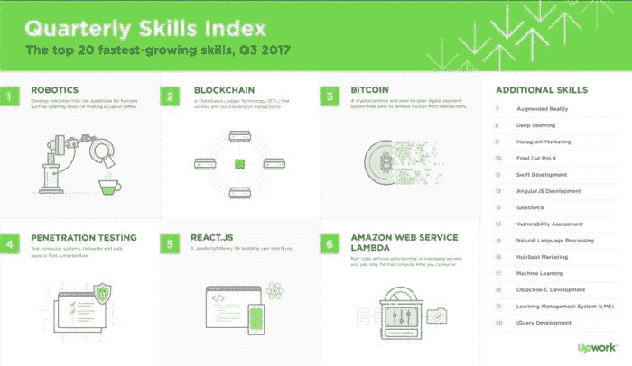

# 区块链工作和薪水-2018 年报告

> 原文：<https://medium.com/hackernoon/blockchain-jobs-and-salaries-2018-report-45d3e7741c19>

区块链开发在最需要程序员技能的领域占据了领先地位。根据 2017 年底到 2018 年初的结果, [Upwork](https://www.upwork.com/blog/2017/11/freelance-skills-upwork-q3-2017/) 报告称，区块链工程技术在全球劳动力市场最需要的技能中排名第二(机器人专家排名第一)(以下是更深入的[区块链开发者薪资](https://howtotoken.com/career/blockchain-developer-salaries-2018-report/)报告)。这样的差异很容易解释。区块链技术在商业和金融领域越来越受欢迎，这类公司的数量也在增加。此外，区块链技术在金融领域的经典公司，如美洲银行、Visa 和其他公司的实施也显著增长。

大公司和初创公司都在美国、欧洲和世界各地寻找区块链开发领域的开发人员和架构师，但找到真正的专业人员通常是一个巨大的挑战。在 2017 年最后一个季度，区块链技术人员的职位空缺仍在继续，其出版物的增长翻了一番。

编外专家提供每小时 150 美元的自由职业服务。据[计算机世界](https://www.computerworld.com/article/3235972/it-careers/blockchain-jobs-continue-to-explode-offer-salary-premiums.html)估计，美国区块链开发者年收入高达 13 万美元。与此同时，软件开发人员的年薪高达 10.5 万美元。这些数据是由 Matt Siegelman 发布的，他是燃烧玻璃技术公司 performance 的数据分析活动的首席执行官。

在美国的高科技地区，如硅谷、纽约州和波斯顿，区块链开发人员的平均年薪为 15.8 万美元，软件开发人员约为 14 万美元。我们谈论的是美国公司的全职员工。我们将在下面提供这样的公司的例子，我们将单独指定自由职业者的价格。

在繁荣的瑞士，由于 ICO 和加密货币的积极发展，区块链开发者的收入甚至超过了美国——从每年 12 万美元到 18 万美元。

在英国，初创公司给新区块链开发者的年薪不超过 5-6 万美元，大公司的年薪从 9 万美元到 14 万美元不等。

区块链开发工程师顾问在自由职业市场每小时的收入从 50 美元到 100 美元不等。

Matt Siegelman 关于区块链开发商需求的燃烧玻璃技术的[研究](http://burning-glass.com/job-postings-blockchain-skills-double-2016/)使他得出结论，“五年前，2012 年，我们只能找到几个需要区块链技能的职位空缺。到 2016 年，这一数字增长到 1838 条消息，2017 年年中发出了 3958 条消息。比 2016 年多了 115%。”

根据 LinkedIn 的数据，2017 年，与区块链、加密货币和 ico 相关的空缺数量至少增加了四倍。在本文撰写之时，仅在美国的 Linkedin 上就发布了超过 150 万个区块链的职位空缺。而且这些空缺中还有 CEO、软件开发者、联合创始人、技术总监、创始人等职位。

## 2.特化作用

web 开发人员必须有使用开源代码的项目经验，才能在区块链项目中找到工作。有 Github 的工作经验就是一个很好的例子，对 C ++的深入了解也很重要。坚固也是可取的。

C/C ++对区块链开发人员来说很重要，因为大多数项目都是用它编写的。但是由于许多项目也是用 Java 编写的，所以了解这些代码也是必要的。尽管许多人声称专业的区块链开发人员可以用任何编程语言构建区块链。

如果开发人员可以不用框架而用本地语言编码，他们找到一个好地方的机会就会增加。数学和算法的基础知识是必要的。请注意公司概述部分，因为要被美国公司雇用，通常需要出示数学或计算机科学的文凭。

**区块链开发者:C ++/Go**

技能:开发 web 应用程序、开发 Android/iOS 移动应用程序、面向对象编程、C/C ++、Java/C #知识、比特币核心、区块链应用程序、了解比特币、altcoins、区块链

自由职业者:每小时 35 美元起。

全职工作——每年高达 10 万美元。

该项目的付款:从 2000 美元。

简历示例:

**以太坊开发者:坚固度**

技能:在区块链、ico、以太坊 DApps、钱包、Solidity 智能合约、新加密货币和加密货币交易所的工作经验。

自由职业者:每小时 50 美元起。

全职工作——年薪 11 万美元。

项目付款:三千美元起。

简历示例:

**ICO 智能合约的作者**

技能:智能合同开发经验，基于比特币和以太坊的程序，跟踪和使用加密货币。扎实的语言技能，以及用于撰写智能合同的以太坊，以及以太坊结构的开发。DApps(分散应用)技能。此外，在 Javascript 和 Python 的网络编程经验是必要的。

自由职业者:每小时 50 美元起。

全职工作——最高年薪 120 美元。

项目付款:从 4，000 美元

简历示例:

**Ripple 平台的开发者**

技能:以太坊创建测试，技能的技术实现，ICOs 的技术知识:— Python，JavaScript/node.js，PHP/Laravel，OOP，设计模式—以太坊，智能合约，ERC20。有 C/C ++、Go 或 Java 系统编程经验。来自为 Linux 编写内核的专业人员的模拟。

自由职业者:每小时 50 美元起。

全职工作——年薪高达 15 万美元。

该项目的付款:从 3k 美元。

简历示例:

我们谈论的是国际自由职业者交流的收入。基于项目的支付，收入增加。

## 3.雇主，职位空缺示例

正如区块链开发者(专门从事区块链的招聘机构)的主要招聘人员 Catherine Griffith Hill 所指出的那样，工作量显示了 2018 年区块链专家需求增长的巨大前景。大公司经常为内部项目雇佣区块链专家，他们的工作类似于创业公司。区块链开发者的主要雇主在软件开发和金融服务行业。

万事达卡[于 2017 年秋季在区块链开始](https://www.computerworld.com/article/3234372/financial-it/mastercard-launches-its-own-blockchain-payments-network.html)自己的网络。该项目的目标是为客户和合作银行加速和提高跨境支付的安全性。

2017 年 10 月，摩根大通还[启动了](https://www.jpmorgan.com/global/detail/1320562088910)全球支付试点区块链计划，将交易速度从几周提高到几个小时。

这两个例子告诉我们，需要区块链开发商的领域数量在迅速增长。

## **经典公司**

**IBM 全球商业服务**

对 IBM 来说，向区块链发展的第一步是创建新的金融服务，作为几家银行的新的跨境货币交易所。

IBM 在 2017 年有超过 400 个区块链项目，超过 1600 名员工在那里工作，同年 10 月，超过 150 个与区块链有关的职位空缺[产生](https://www.ibm.com/blogs/blockchain/2017/10/blockchain-in-demand-breaking-into-the-growing-job-market/)。

IBM 今年在招聘网站上也有很多区块链发展的职位空缺。

IBM 全球业务服务部正在寻找一名拥有 CISSP 认证的区块链架构师，负责实施区块链技术以及安全、支持基础设施、集成以及项目理念的开发和部署。工资在 94-145，000 美元之间。

IBM 在金融市场也有一个区块链安全顾问的空缺。工资从 69 美元到 11.9 万美元不等。

金融市场区块链项目的 af 高级管理顾问职位空缺。工资是 122-179 万美元。要求:3 年开发经验，5 年编程经验，至少半年区块链技术公司工作经验，包括 Solidity 中以太坊智能合约的实际编程，或另一种专有语言。有 Javascript、HTML5、CSS、Python 或 Go 的应用编程经验。至少一年使用基于云计算或微服务平台、MongoDB/SQL 数据库技术的应用程序编程经验，以及两年在银行或保险公司的工作经验。

## 匹配点解决方案

Matchpoint Solutions 正在寻找一名全职的区块链开发人员，薪酬为 8.5-13 万美元。

申请人需要懂 C ++，Rust，或者 Python。他或她必须有与固体，脚本，或 RSK 语言的工作经验。启动程序原型的技能，与大规模分布式系统的硬件测试也是必要的。他必须了解等离子/雷电，桅杆，闪电网络，根茎等区块链技术，并有智能合同的工作经验。

## 博思艾伦汉密尔顿

Booz Allen Hamilton 正在寻找一名区块链开发商，年薪约为 9.9 万美元。密码编程知识，C/C ++和 Java 或 Python 的工作经验也是必要的。必须有 JSON 或 XML 的经验。需要计算机工程或数学领域的学士学位，以及五年面向对象编程环境的经验。

## VISA 全球商业支付

VISA 正在寻找一名区块链工程师，年薪为 11-14 万美元。候选人必须在计算机技术方面受过高等教育。两年 Java 或 Go 工作经验。他或她还必须在软件开发的所有方面都有经验，包括服务器和用户界面的经验，并有开放源码背景。他必须了解密码学的原理，并面向简单的校验代码和可伸缩性。

## **加密货币公司**

## 铸币交易所

作为最大的加密货币交易所之一，CoinBase 正在寻找一名工程师程序员，负责维护交易所网站，支持网站上的安全认证功能，实施适当的定价，平衡投资组合，以及开发投标服务。要想在这里找到工作，你必须有至少两年的开发经验，同时还要有创建、扩展和支持生产服务的经验。工作经验与 RoR，或反应，并开发一个系统的财务和安全限制是必要的。不幸的是，薪水没有具体说明。

## BiblePay

BiblePay 是一个基督教的加密项目。该职位假设开发人员了解 C ++区块链。五年 C ++编程经验和一年区块链编程经验是必要的。Github 结帐和登记的知识也是必要的。没有具体说明薪水。

## 食盐借贷

Salt Lending 是区块链的一个现金贷款项目。Salt Lending 正在寻找一个了解集成和模块化测试、有能力与其他开发人员合作、有快速诊断和纠错的 QC 渠道的开发人员。API 和数据库的开发经验也是必要的。比特币和以太坊的知识，包括他们工作的场景和智能合约，也很重要。对密码原语的理解也很重要，如哈希、MAC、PK-crypt。工资不具体，但必须能在丹佛工作。

## 齐柏林解决方案

Zeppelin Solutions 是一家通过提供智能合同分析来确保代币销售安全的公司。该公司还为客户创建代币和智能合约。该公司正在寻找软件工程师来布宜诺斯艾利斯或在家工作。要求是:计算机科学或数学学士或硕士学位，对区块链协议、分布式注册表和智能编程语言(如 Solidity)有深刻的了解。需要有 P2P 和分布式系统的工作经验。必须了解 PoS、PoW、PoA 的分布式算法。还需要了解密码学，包括非对称(pub/priv key)和对称、散列函数和加密/签名。(ECDH、ECDSA、PGP 和 AES)。薪资水平未具体说明。

来源:

 [## 区块链的增长使开发者成为热门商品

### 具有区块链开发技能的技术人员的职位空缺在第四季度持续上升…

www.computerworld.com](https://www.computerworld.com/article/3235972/it-careers/blockchain-jobs-continue-to-explode-offer-salary-premiums.html) 

[https://www . up work . com/blog/2017/11/freelance-skills-up work-Q3-2017/](https://www.upwork.com/blog/2017/11/freelance-skills-upwork-q3-2017/)

 [## Glassdoor 求职|找到适合你生活的工作

### 搜索数百万份工作，通过员工评论、个性化薪资工具和…

www.glassdoor.com](https://www.glassdoor.com/index.htm) 

【https://www.upwork.com 号

[https://www . ccn . com/switzerlands-区块链-开发者-领取-180000-薪水-工资/](https://www.ccn.com/switzerlands-blockchain-developers-receive-180000-salary-pay/)

[https://www . computer world uk . com/careers/how-get-job-as-区块链-developer-3640764/](https://www.computerworlduk.com/careers/how-get-job-as-blockchain-developer-3640764/)

[https://angel . co/talent-hacks/how-to-get-a-job-at-a-crypto-startup](https://angel.co/talent-hacks/how-to-get-a-job-at-a-crypto-startup)

[https://howtotoken.com](https://howtotoken.com)

## 关于作者:

[基里尔·希洛夫](http://twitter.com/kirills4ilov)——geek forge . io 和 Howtotoken.com 的创始人。采访全球 10，000 名顶尖专家，他们揭示了通往技术奇点的道路上最大的问题。加入我的**# 10k QA challenge:**[geek forge 公式](https://formula.geekforge.io/)。