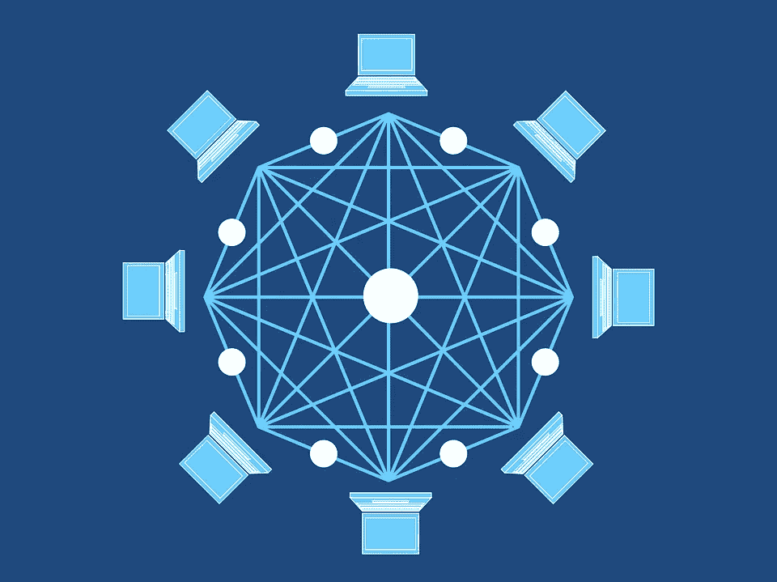

# 区块链是透明商业的关键吗？

> 原文：<https://medium.com/hackernoon/blockchain-key-transparent-business-f34d3cd8606a>

2014 年，监管机构透明国际[报告](https://www.theguardian.com/global-development/datablog/2014/nov/05/worlds-top-companies-fall-short-on-transparency)称，世界上最大的公司未能披露其海外业务运营的财务细节。该报告涵盖了 124 家公司，发现英国公司是最透明的企业之一，而中国公司和美国大型科技公司在这方面做得不够。

举个例子，脸书早些时候面临公众审查，并因未能干预俄罗斯在 2016 年美国大选中的影响力而受到立法者的抨击——通过从美国科技巨头那里购买大量广告植入。

尽管要求披露俄罗斯从他们那里购买的广告数量的压力越来越大，这家社交媒体公司拒绝公开披露数字，只在国会公布了数字。脸书推理出这样做会导致违反联邦法律，但公司[未能举出](https://www.theverge.com/2017/9/8/16277144/facebook-russian-ads-political-explainer-credibility)他们所属的具体法律。

# **创业公司通过区块链努力提高透明度**

在这种为了公众利益而要求透明度的情况下，Chain 的联合创始人兼首席执行官 Adam Ludwin 提出，区块链扮演着重要的角色。

区块链是一个公共账本，旨在存储不记录所做更改就无法更改的信息。它作为加密交易的工具而普及，但后来被用于一些商业追求以提高透明度。

“与此同时，他们从这项技术中看到和获得的价值是能够用密码向第三方证明他们没有操纵数据；他们公司没有人有意或无意地操纵过任何数据；没有黑客改变过任何状态，”路丁在接受《商业内幕》采访时说。

这就是为什么许多公司希望将这项技术最大限度地应用于一些旨在提高透明度的应用中。

其中之一是总部位于内华达州的灯丝公司，这是一家区块链的初创公司，它正在改变航运业。该公司已经在 T2 制造了一种微芯片，可以让集装箱通过一种叫做 Blocklet 的软件进行交流和完成交易。有了这种 Blocklet 微芯片，海运集装箱不必经过几个监管部门的批准就能到达最终目的地。Blocklet 不仅使这一过程变得更容易、更快捷，还能完整地显示零售商和消费者之间的交易。

与此同时，一家早期公司采用区块链来展示捐赠是如何影响无家可归者慈善机构的。总部位于伦敦的社交科技初创公司 Alice 利用区块链暂停捐款，直到之前在圣芒戈斯制定的慈善项目实现。爱丽丝[的创始人说](http://fundraising.co.uk/2017/05/04/blockchain-startup-offers-transparency-tool-to-track-donations-to-charity)他们希望它的技术“将鼓励更多的捐赠，支持第三部门更大的透明度。”

# 更多的公司寻求加入竞争

不可否认，区块链继续扰乱着几个行业。但是这项技术被引进的金融部门现在已经发生了变化。区块链使得通过虚拟货币提高交易透明度成为可能。因此，它也催生了现在市场上的数百种加密货币。

但是，尽管市场上出现了几十种新的加密硬币，但只有少数能够存活下来，尤其是那些旨在进一步改善透明度环境的硬币。支撑这一趋势的是数字货币，其价值通过商品价格来衡量。一些人认为这个系统不仅提供了交易的透明度，还提供了便利和更少的波动性。

其中一个类似的例子是 Qu Ltd .的 Silverback 初始硬币发行，即[可兑换为白银。](https://born2invest.com/articles/mining-enterprises-crypto-bandwagon/)通过这种方式，这些硬币的价值不会受到加密货币不稳定运动的影响。相反，它的价值是基于当前的白银价格。

代币的银金属将由[曼斯菲尔德-马丁勘探采矿有限公司](http://mansfieldmartin.com/) ( [OTCMKTS: MCPI](https://finance.yahoo.com/quote/mcpi?ltr=1) )收购，该公司同意供应高达 500 万盎司。来支持新的加密货币。MCPI 可以选择用银背代币或美元支付。

另一个例子是英国皇家铸币厂今年推出的皇家铸币厂黄金。基本上，这个想法是一枚加密硬币代表 1 克黄金。该公司表示，该系统提供了透明度，投资者可以监控其 RMG 库存，并以实时价格进行交易。

不可否认，这项技术正在为企业，尤其是今天的金融部门提供机会，在交易和其他交易中以前所未有的方式提供透明度。毫无疑问，再过几年，这项技术就会渗透到我们的日常生活中。