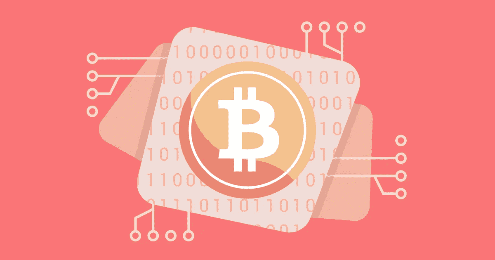

# 区块链学习路径 2019

> 原文：<https://medium.com/hackernoon/blockchain-learning-path-2019-e54d6763dd6c>

[Source](https://www.flickr.com/photos/159526894@N02/24357432498)

在这篇文章中，我将列出可以帮助你开始区块链领域的在线资源。

## 资源列表:

1.  [比特币与加密货币 Bootcamp](https://www.udemy.com/bitcoin-and-cryptocurrency-bootcamp/) on Udemy:本课程有助于理解比特币区块链的基本理论及其底层密码学。它还涵盖以太坊区块链的基础知识。
2.  [区块链 A-Z:学习如何在 Udemy 上建立你的第一个区块链](https://www.udemy.com/build-your-blockchain-az/):这个课程应该在完成上面列出的课程后进行。在本课程中，你将开发三个项目。在第一个项目中，你将开发一个区块链。在第二个项目中，加密货币将部署在这个区块链上。第三个项目涉及在这种加密货币上设置 ICO。
3.  [以太坊和 Solidity:Udemy 上的完整开发者指南](https://www.udemy.com/ethereum-and-solidity-the-complete-developers-guide/):本课程深入探讨以太坊区块链和 Solidity 编程语言。在本课程中，您将学习如何开发全栈分散式应用程序。
4.  [区块链精要](https://cognitiveclass.ai/courses/blockchain-course/)来自认知类:这个由 IBM 提供的免费课程是对 Hyperledger 和私人区块链的介绍。
5.  [IBM block chain Foundation Developer](https://cognitiveclass.ai/courses/ibm-blockchain-foundation-dev/)来自认知类:IBM 的这个免费课程将帮助你理解 Hyperledger 框架中的应用开发。
6.  [布法罗大学](https://www.coursera.org/specializations/blockchain)提供的区块链专业&纽约州立大学 Coursera 上:这是美国大学在线提供的唯一专业。它由四门课程组成，涵盖区块链、智能合约、去中心化应用开发和各种区块链平台。这种专业化可以被审计为**免费**。
7.  [普林斯顿大学在 Coursera 上提供的比特币和加密货币技术](https://www.coursera.org/learn/cryptocurrency):普林斯顿大学的这门免费课程非常好地介绍了比特币以及它在幕后是如何工作的。您还将了解 Altcoins 及其生态系统。
8.  [区块链:基础与用例](https://www.coursera.org/learn/blockchain-foundations-and-use-cases)由 Consensys Academy 在 Coursera 上提供:为了理解区块链的各种用例，要做这个课程。它还深入探讨了以太坊区块链及其应用。你可以免费旁听**这门课。**
9.  [杜克大学在 Coursera 上提供的金融科技法律与政策](https://www.coursera.org/learn/fintechlawandpolicy):你**必须**学习这门课程，了解美国监管加密货币的主要法律。这些知识将对你决定加密货币的设计规格有很大帮助。你可以免费**旁听**这门课。
10.  [区块链基础知识](https://www.edx.org/professional-certificate/uc-berkeleyx-blockchain-fundamentals)由加州大学伯克利分校在 Edx 上提供:Edx 上的这个专业证书项目涵盖了加密货币和区块链技术。尽管相对于上述课程，有些内容可能是多余的，但您可以免费**旁听这门课程**，并利用它来修改您的概念。
11.  [GitHub 上的区块链研究论文精选列表](https://github.com/RaysKai/BlockChain):GitHub 上的这个知识库对于试图了解区块链技术核心的研究人员和学生来说非常有价值。它会帮助你想出一个新产品或研究领域的主意。
12.  [区块链革命:比特币和其他加密货币背后的技术如何改变世界](https://www.amazon.com/Blockchain-Revolution-Technology-Cryptocurrencies-Changing/dp/1101980141/)作者:唐·塔斯考特和亚历克斯·塔普斯科特:我推荐这本书，这样你就可以获得如何实现区块链来解决问题的新想法。就我个人而言，我通过阅读这本书在 [Hackernoon](https://hackernoon.com/) 上发表了[这篇](https://hackernoon.com/how-blockchain-can-solve-identity-theft-problem-5c105214296a)文章(感谢！).确保你买的是最新版本。
13.  [区块链和信任的新架构](https://www.amazon.com/gp/product/0262038935/)作者:凯文·沃巴赫(Kevin Werbach):作者:沃顿商学院教授这本书是理解区块链的必读书。现在就揭开区块链的神秘面纱！

**进一步的步骤**

完成上述课程后，您将对区块链开发和去中心化应用程序开发的基础有一个很好的了解。要获得更多曝光，请在 [Github](https://github.com/search?q=blockchain) 上查看几个区块链项目，看看哪个项目引起了你的注意。

对于一个快速发展的领域，保持与最新趋势、协议和包含该技术的产品同步也是非常重要的。为了跟上时代，你应该阅读发表在热门博客上的文章，比如 [Hackernoon](https://hackernoon.com/blockchain/home) 。

以下引文是我写这篇文章的灵感来源:

> "区块链将用市场取代网络."~海军拉维坎特

该列表将随着新课程的发布而更新。

更新 1:增加了 12 号资源。

更新 2:增加了 13 号资源。

*如有任何问题，欢迎随时给我发* [*邮件*](mailto:pamanalionline@gmail.com) *。也可以通过*[*Linkedin*](https://www.linkedin.com/in/amanali1/)*联系我。你也可以关注我的* [*微博*](https://twitter.com/aliandco) *。*

