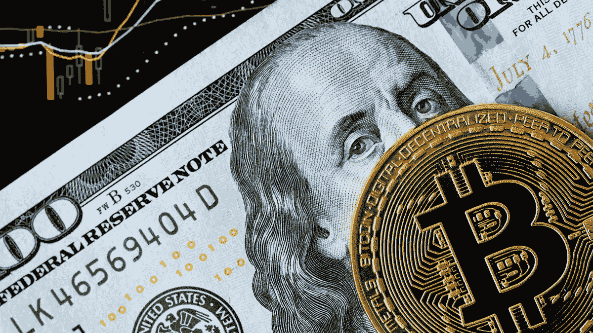

# 区块链市场:过去、现在和未来

> 原文：<https://medium.com/hackernoon/blockchain-marketplaces-the-past-present-and-future-f05830a1e1ae>

没有人想到互联网有一天会超越地理界限将人们联系起来，而且是实时联系。同样，当中本聪创造区块链技术时，没有人会想到它有可能颠覆银行和支付、供应链管理、网络安全、网络和物联网、保险等行业。第三代区块链技术现在准备在“市场或电子商务行业”的大饼上咬一口！

区块链是一种数字账本，比特币和其他加密货币使用它来按时间顺序公开记录交易。人们经常将区块链和 TCP/IP 进行比较。TCP/IP 是一组将计算机系统连接到互联网的规则，它支持双向电子邮件通信。这将与当代的区块链相遇，并推动双边金融交易。像互联网一样，区块链被设计成去中心化的，和互联网一样，分布式账本也有层次，公司和个人可以在其中建立产品和服务。作为一个共享的公共分类账，维护着一个点对点网络上所有交易的记录，我们可以想象未来区块链将被用来记录合同，嵌入数字代码，并存储在透明的数据库中，不会被篡改或删除。

最初，这个想法是由一个化名中本聪首先提出的。他或她写了一篇名为“比特币:点对点电子现金系统”的论文，其中讨论了一个开创性的概念。简而言之，这篇论文提出了“一种纯粹的点对点版本的电子现金，允许在线支付直接从一方发送到另一方，而不经过金融机构”。

然而，论文发表后不久，比特币就诞生了。比特币背后的技术区块链已经开始在许多行业创造一个范式转变。基于区块链的市场具有颠覆电子商务行业的潜在灵活性，因为它们挑战克服在线市场的局限性。迄今为止，基于区块链的市场已经使用智能合约、分散平台和分布式分类账属性来缓解 P2P 交易。毫无疑问，这些特点使得区块链市场——

-安全

-可靠

-透明

-成本效益高，因为消除了中介

区块链的实施正在消除中介，从而降低各种市场的成本和时间。实时清算和结算流程将消除交易对手风险，降低结算风险，并减少数据错误的范围。

在接下来的几天、几周、几个月和几年里，比特币会起起落落。然而，区块链有一个更具体的未来。通常比特币和其他加密货币是作为区块链的主要用途提供的，然而，这只是区块链的应用之一。世界各地的公司都在采用这项技术，以提高效率，为客户增加价值。这方面的一个例子是，区块链正在被公司内部用作管理物理和数字资产、记录内部交易和验证身份等应用程序的数据库。对于努力协调和维护多个内部数据库的公司来说，这是一个有用的解决方案。

区块链革命已经到来，并逐渐颠覆了每一个行业。一家这样的颠覆性公司正努力为“约会和关系”创建一个基于人工智能的世界级智能区块链市场。这个区块链市场正在解决“人的问题”,如友谊和爱，通过整合

-市场

-人工智能

-区块链技术

它叫做[中提琴。AI](https://viola.ai/?utm_source=FYN&utm_medium=Article) ，他的主要动机是解决 P2P 交易的“人道”需求。[中提琴。AI](https://viola.ai/?utm_source=FYN&utm_medium=Article) 使用人工智能来验证用户的详细信息，为他们找到合适的匹配，并安排约会。因此，如果用户订阅了 Viola 的这项服务，他们首先会共享他们的数据，这些数据将被彻底验证。验证后，使用区块链技术和分布式账本，它将被加密和存储。[中提琴。人工智能](https://viola.ai/?utm_source=FYN&utm_medium=Article)有可能扰乱约会服务、礼物、约会和浪漫相关费用等市场，其价值高达 8000 亿美元。

*渴望了解更多关于 FundYourselfNow 的信息吗？在我们的*[*Telegram*](https://t.me/fundyourselfnow)*群上加入我们的众筹革命对话，或者在* [*Twitter 上关注我们。*](https://twitter.com/fundyourselfnow)