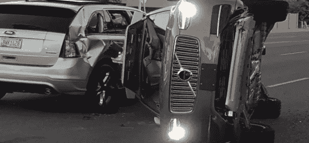

# 区块链可能是让自动驾驶汽车更安全的答案

> 原文：<https://medium.com/hackernoon/blockchain-may-be-the-answer-to-making-self-driving-cars-safer-7d8e18067ed0>

Image source: [BBC News](http://www.bbc.com/news/technology-39397211)

几天前，世界上最大的出租车共享公司优步陷入困境，因为它的一辆自动驾驶汽车在亚利桑那州坦佩撞死了一名行人。

据《卫报》报道，警方发布的录像显示，尽管在碰撞前受害者在车前是可见的，但 SUV 的激光雷达和雷达系统未能探测到受害者。

优步事故凸显了我们大多数人心中的想法；与人类驾驶的汽车相比，自动驾驶汽车有多安全？

虽然没有足够的数据来确定自动驾驶汽车是否比人类驾驶的汽车更安全，但这项技术背后的前提似乎表明了这一点。自动驾驶技术涉及高度敏感的摄像头和传感器，配备了人工智能和机器学习的最新技术。

但是从优步的例子中可以明显看出，这项技术还不完善，在推广到大众消费之前还有很多工作要做。传感器和摄像头的准确性、速度和一致性需要提高，以便它们能够在数毫秒内检测到物体并做出相应的响应。

即使这主要是人工智能和机器学习的功能，区块链，加密货币背后的技术可能会对提高自动驾驶汽车的安全性做出一些贡献。无人驾驶汽车背后的技术在很大程度上依赖于大数据，这些数据必须在瞬间以高精度收集、分析和利用。

另一方面，区块链更多的是确保数据的透明度和准确性，同时保护数据免受操纵。根据《麻省理工技术评论》的一份[报告](https://www.technologyreview.com/s/608618/hackers-are-the-real-obstacle-for-self-driving-vehicles/)，恶意网络攻击是采用自动驾驶汽车技术的一个重大挑战。虽然人工智能和机器学习的进步可能会解决由于技术错误而发生的碰撞问题，但它们可能无法解决技术对黑客攻击的脆弱性。

想象一下，如果恐怖黑客在拥挤的街道或高速公路上访问一些自动驾驶汽车的数据库，会发生什么？后果将是灾难性的，尤其是当汽车被改造成由中央机构控制时。

区块链引入了透明和分散的分类账概念，数据可以在其中得到验证和安全存储。这项技术可以帮助无人驾驶汽车在从环境中收集数据时验证数据的准确性，这意味着出错的空间将非常小。

此外，鉴于技术的不可改变性，将数据存储在区块链系统中可以保证安全，免受黑客攻击。尽管理论上黑掉区块链是可能的，但黑掉区块链上所有电脑的计算能力水平几乎是不可能的。同样，有了区块链驱动的无人驾驶汽车，网络连接就不会出现宕机。在像优步所使用的中央系统中，连接问题可能会引发系统故障。这意味着在网络故障期间发生事故的可能性很高。

无人驾驶汽车技术中区块链的应用不仅可以确保撞车事故的安全，还可以向用户保证他们的个人数据是安全的。在传统模式中，黑客可以很容易地访问用户的数据，如他们的姓名、地址和支付细节，并用它来对付他们。

在由区块链提供动力的无人驾驶出租车中，包括用户姓名和具体上下车地点在内的用户信息被存储在一个分布式的高度安全的账本中，黑客无法访问。

除了确保安全之外，这项技术还将改进出租车向客户收费和记录客户账户的方式。智能合同技术能够确保每一方都遵守自己的承诺，从而使支付过程更加顺利，并且在发生争议时，可以在没有第三方参与的情况下达成友好的解决方案。出租车车主也会发现追踪和安全存储他们的财务记录变得更加容易。

随着无人驾驶汽车技术的不断进步，区块链有很多领域有待探索。也许在未来几年，将人工智能、机器学习和区块链完美结合的解决方案将会问世，从而完善无人驾驶汽车技术。