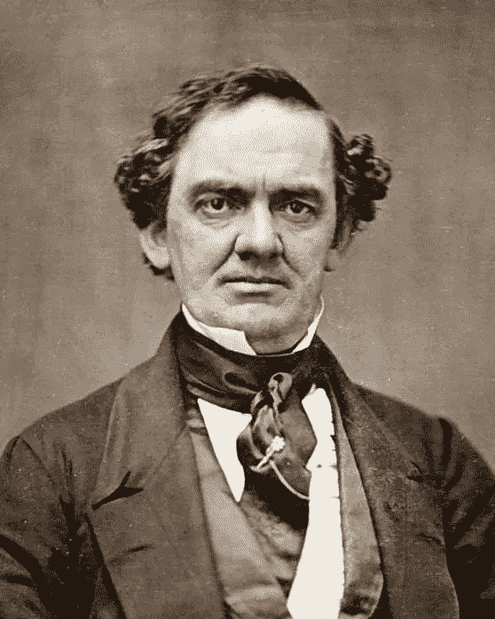

# 区块链的人、地球和利润世界观

> 原文：<https://medium.com/hackernoon/blockchain-people-planet-profit-something-for-everyone-e609885dbc8d>

Phineas Taylor (PT) Barnum; creator of Barnum and Bailey Circus

从[人](https://hackernoon.com/tagged/people)、地球和利润(PPP)的角度来看，比特币证明了人类现在可以给任何东西赋予数字价值，这一点意义更大。由[区块链](https://hackernoon.com/tagged/blockchain)提供的新功能经济以及用加密货币激励行为的力量，将 PT Barnum 的格言“每个人都有东西”提升到了一个新的水平。

将多年在边境和冲突地区工作的经验与对区块链激励行为的能力的新认识相结合，让我探索了稳定和公民治理的企业责任的新领域。区块链允许任何人给任何东西赋值——这对于尚未在中央银行系统中找到一席之地的半个地球来说是一个革命性的概念。

将赚钱与做好地球和人类的事情分割开来，将使下一代行业领导者成为建立最有效率和影响力的公司的人。既然利润与社会和环境影响相辅相成，微调业务流程将意味着通过创建更具包容性和可持续性的系统来创造更多的企业价值。

区块链非常适合 PPP 世界观；开创人类生产力的新时代，让社会各阶层都能创造价值。

将赋予任何事物数字价值的权力民主化，可以让人们建立满足其自私需求的系统。最后，我找到了一个工具，它将帮助我创建全球可扩展的*团队。*自主决定的能力和途径是区块链所代表的——无论条件如何，区块链都是我们可以满足和组织我们自私努力的“共同点”。