# 区块链平台:一条链统治所有平台？

> 原文：<https://medium.com/hackernoon/blockchain-platforms-one-chain-to-rule-them-all-f3f7dda84bae>

## 大家问:世界准备好区块链了吗？但更重要的是，区块链为我们做好准备了吗？

由诺姆·莱文森合著

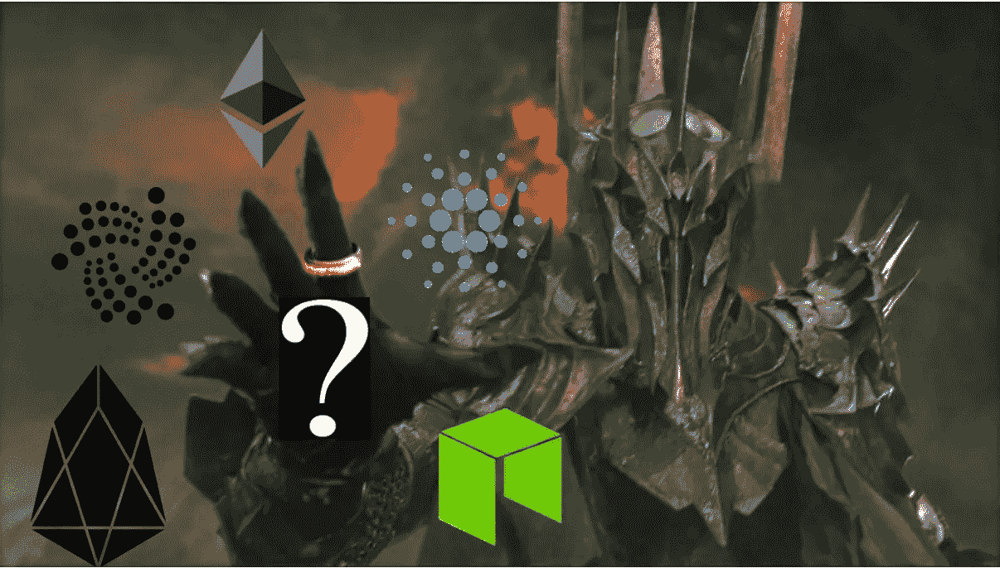

2017 年是[区块链](https://hackernoon.com/tagged/blockchain)进入主流意识的一年。对*外界*，今天的热门话题是“比特币是泡沫吗”，以及“我在哪里可以得到涟漪？”但是人们忽略了这一点。他们忽略了我们都应该问的基本问题。我不认为今天的焦点应该围绕几年后比特币是否还会存在。一个更耐人寻味的问题是:“区块链将如何真正改变世界？”甚至这个问题也没有考虑到我们今天拥有的区块链是否真的能够支持这些改变世界的应用。2018 年将是区块链的决定性一年，许多项目将发布工作产品或应用程序，并可能出现大量新转换的机构资金。然而，这个指数级增长的市场将继续突出区块链是否能够支持一个去中心化的世界。

在这篇文章中，我们将介绍一些概念和想法，并深入一些技术方面。我将尽量不去深究个别概念，所以请随意深入研究我们涉及的任何主题。

# **区块链的进化&区块链 2.0**

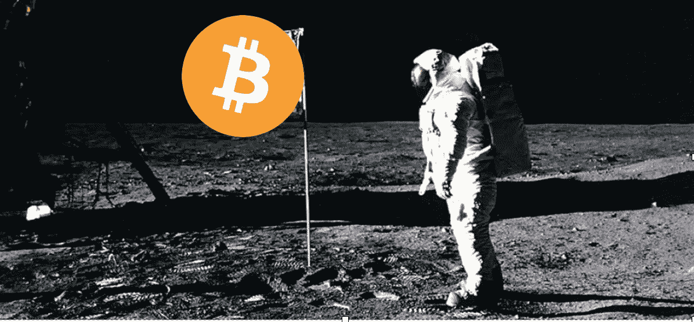

比特币是第一个。令人兴奋。革命性的。史蒂夫·乔布斯在他的地下室里，尼尔·阿姆斯特朗在月球上行走，穴居人在利用火。*这是第一笔数字化稀缺资产。它解决了困扰开发者多年的问题。它是这种全新资产类别的基础。然而，就像大多数新的革命性发展一样，它的技术是有限的，只专注于交易。这就像试图在 Windows 98 上开发一个现代应用程序。不会发生的。比特币目前只能作为价值储存手段。除非采取大规模措施，否则这种情况不会改变。*

**如果说比特币奠定了蓝图，以太坊建造了房子。那栋房子是明智的选择。**智能合同(数字合同)为区块链打开了一个充满可能性和发展的全新世界。实施智能合约让我们有机会彻底改变我们的世界，省去中间人，并在我们的数字世界中建立信任。以太坊是开发 dapp 的平台，dapp(以及 ERC20 代币)的出现催生了一种新经济。今天，以太坊拥有近 85%的有价值的项目，并使用其可定制的区块链作为基础。

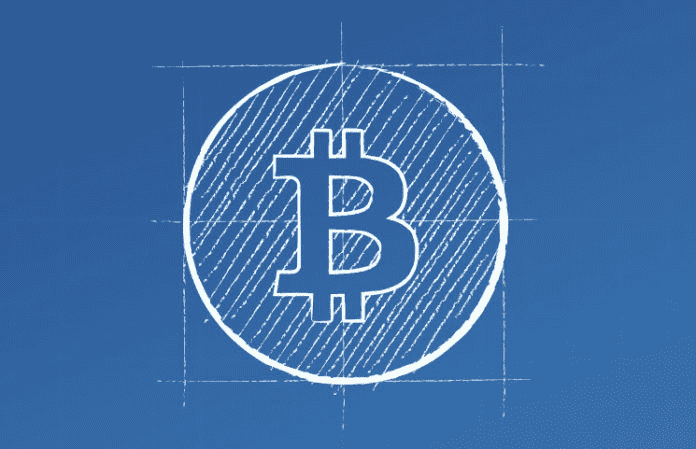

The Blueprint

以太坊在聚集业内最有才华的玩家方面非常成功。Vitalik 和以太坊社区开创了区块链应用的未来。但伴随其先发优势而来的是一些严峻的挑战。以 2002 年的 [Sidekick](https://www.technobuffalo.com/wp-content/uploads/2011/04/sidekick-4g-400x400-2-300x250@2x.jpg) 手机的[技术](https://hackernoon.com/tagged/technology)为例。在那个时候，没有哪个青少年会在他们的口袋里没有这个而被抓到。谁会想到第一个触摸屏会把 Sidekick 变成一件博物馆艺术品。**不是说以太坊已经属于博物馆了，但是要记住，一群数码猫反复让以太坊屈服。**

12 月初，Cryptokitties 的受欢迎程度激增，以太坊网络*喘不过气来。11 月 28 日至 12 月 12 日期间，平均交易价格上涨了 465%，这一特定时段是区块链世界的决定性时刻。在一些人看来，一个缓慢而拥挤的以太坊网络开始看起来更像是一个不可能实现的梦想。炒作会不会是放错了地方？以太坊难道不是一个真正去中心化的世界，一个“互联网 3.0”的终极解决方案吗？讨论从投机性的幻想转向以太坊是否真的是新世界的先驱。大约在同一时间，不出所料，第三代区块链开始获得关注。像 [EOS](https://eos.io/) 和 [Cardano](https://www.cardanohub.org/en/home/) 这样的项目的显著增长意义重大。他们绝对不应该被忽视。但是我们稍后将详细探讨这个主题。*

The real Ethereum killers

2017 年是区块链主流日历上的第一年。2017 年市场大幅增长。dApps 之间不可思议的发展。解决世界上一些最大问题的创新想法。越来越多真正出色的项目和平台表明，智能合同的信心和力量也在不断增强。然而，社区也一直在努力实现这些项目中的一小部分，并实际将它们投入使用。最突出的例子是以太坊。我们非常清楚地看到，拥有最多理论应用的平台(DApps 的数量)没有真正的方法来大规模实现它。

**现在我们有了一些背景知识，让我们暂时缩小一下:**

> 每个人心中的问题是，我们的社会是否“准备好”接受区块链教。担忧的根源在于社会对一个相当技术性和概念上困难的想法的(错误)理解。对于这个问题，每个人和他们的母亲都有不同的看法。*但我们应该问的真正问题是:“区块链为我们做好准备了吗？”*

我理解这个问题可能有点宽泛。我已经把它分解成**另外三个问题**，我认为这将有助于我们回答主要的问题。

# **1。以太坊行得通吗？**

以太坊显然有许多第三代平台试图解决的一些问题——这将变得有点技术性，所以请原谅我。以太坊的主要不足是它的协议。目前，以太坊的货币 *ether* 是使用工作证明(PoW)挖掘的，这与比特币使用的协议相同。

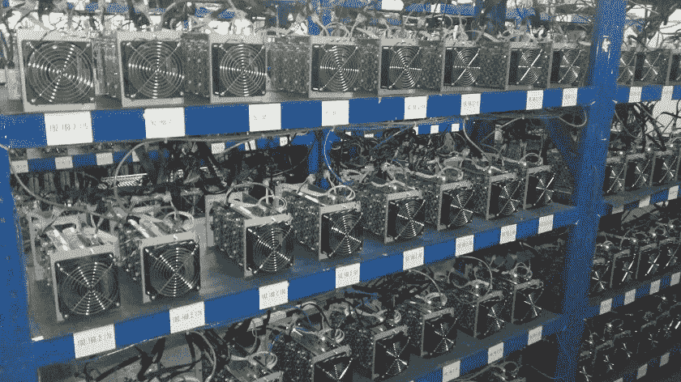

**Noam** :有了工作证明，网络上的计算机竞争解决数学公式，赢得进入区块链的交易确认权，从而保障网络安全。PoW 协议的两个主要缺点是 51%攻击的危险和网络安全所需的大量能量消耗。出于这些原因，我认为，随着区块链向一种叫做利益证明(PoS)的新协议过渡，PoW 将很快成为一种过时的系统。

利益证明的工作方式与 PoW 类似，只是 PoS 使用令牌持有者，而不是计算机验证网络并获得与其相对计算能力相当的奖励。那些持有代币的人可以“下注”他们的代币(下注是指将代币暂时放在锁定的智能合约中，直到下注结束)，作为交换，他们可以根据所持代币的相对数量确认交易并获得奖励。在 PoW 中，如果你操作了网络总计算能力的 5%，你可以期望获得 5%的区块奖励。在 PoS 中，如果您拥有 5%的代币，您还可以获得 5%的块奖励。

PoS 为困扰 PoW 的问题提供了一个解决方案，主要是 PoS 的运行几乎不需要任何能源，而且不影响安全性。我认为这实际上提高了安全性。对于以太坊和所有其他 PoW 协议，难度算法(求解数学公式有多难)必须不断更新，以考虑更好的计算机硬件和更强大的采矿组。有了 PoS，就不需要这么做了。有了以太坊，你可以购买足够的计算硬件来实现 51%的攻击；即使在组成网络后，你仍然拥有所有的硬件，并有可能用它来攻击其他 PoW 平台。在 PoS 中，因为您必须下注您的硬币，任何恶意行为都会导致所有下注硬币的损失。因此，如果你购买了 51%的代币，你将立即失去你的大量投资。此外，购买 51%网络令牌的成本对每个人来说都是一样的。获得 51%计算机能力的成本——由于大规模购买计算机的折扣和电力极其便宜的国家——并没有。

**回到 Lior:** 以太坊的设计师目前正试图将其网络过渡到 PoS 协议。我相信这是以太坊唯一的避难所，如果它还想继续存在的话。它当前的模型并没有为一个适用的生态系统提供必要的基础。以太坊要成为整个产业的基础，需要一个重大的升级。如果目标是 Visa 每秒超过 440，000 笔交易的能力，那么以太坊网络微薄的 15 不会削减它。第一个智能合同背后的天才头脑 Vitalik Buterin 正在寻找一个解决方案，使网络不仅仅是一个理论上的乌托邦。

***为了确保以太坊在这样一个不断进化的空间中的长寿，开发者提供了几个答案:***

## **雷电网络**

[**雷登网络**](https://raiden.network/) 是一个开源项目，旨在作为一个链外网络，促进 ERC 20 令牌的传输。瑞登网络利用**国家渠道技术**，支持链上令牌的链外传输。这些转移是通过直接从交易双方传递一个签名和盖章的信息来完成的，而主区块链本身并不参与。由于只有双方能够接触到智能合同本身，转移本身不受双重支出的影响，这使得它像链上交易一样安全。它使网络能够随着用户数量的增加而扩展。**这基本上意味着网络中的用户越多，吞吐量就越高。** *吞吐量是节点复制事务的速度，而不是 TPS 的数量。*我相信，Raiden 可能会成为物联网和机器对机器生态系统的一个强大层。它的创建者将瑞登网络比作一家银行，该银行将确保“一旦您收到某人的瑞登支票，您就可以绝对肯定这张支票是真的，并且您现在比刚才更富有了。”**所以从纸面上看，雷登很不错，但它们还有多远？**截至目前，它们仍在开发中，工作预览即将发布。因此，他们还远远没有实现最终的工作解决方案。一个更强大的迭代版本(我们不会在本文中讨论)正在计划中，但仍未开发。

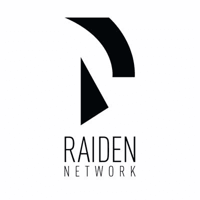

Ethereum’s Lightning Network

## **切屑**

分片是另一个可能的答案，旨在使以太坊不仅仅是一个梦想。等离子体(soon)和雷电网络等解决方案是第二层协议，这意味着它们脱离了以太坊主链。分片正在处理基础层区块链协议架构，这意味着它直接应用于以太坊的主链。这最终有助于维持一个更加分散的网络，因为分片将需要更小比例的节点来监督和授权每笔交易，从而允许网络可能同时授权数千笔交易。以太坊的设计师们确信，分片和第二层协议(如雷电网络)将协同工作，以使以太坊更好地支持智能经济。以太坊共识的真正问题是每个节点都需要验证每笔交易，这大大降低了网络速度。以太坊的目标是在不久的将来，在没有主节点或任何其他会阻碍其去中心化的条件下，在链上扩展到每秒数千笔交易。Vitalik Buterin 认为这是以太坊改进可扩展性的解决方案的一部分。他说，分片的概念类似于拥有数百个相似但独特的宇宙。这些是连接在一起共享共识的独立的区块链。干涉其中一个“世界”将意味着干涉所有共享共识和授权的“世界”。分片本质上是创造一个新的“世界”，以及更多，而不影响主链。

一个无需太多技术细节就能帮助我理解分片概念的例子:想象三个节点 A、B、C 必须验证数据 T。不是每个节点都验证所有数据，而是将数据 T 分成 3 个**分片** : T1、T2、T3。节点 A、B、C 不是单独授权整个数据 T，而是同时验证每个碎片，以便于数据验证，从而减少延迟。

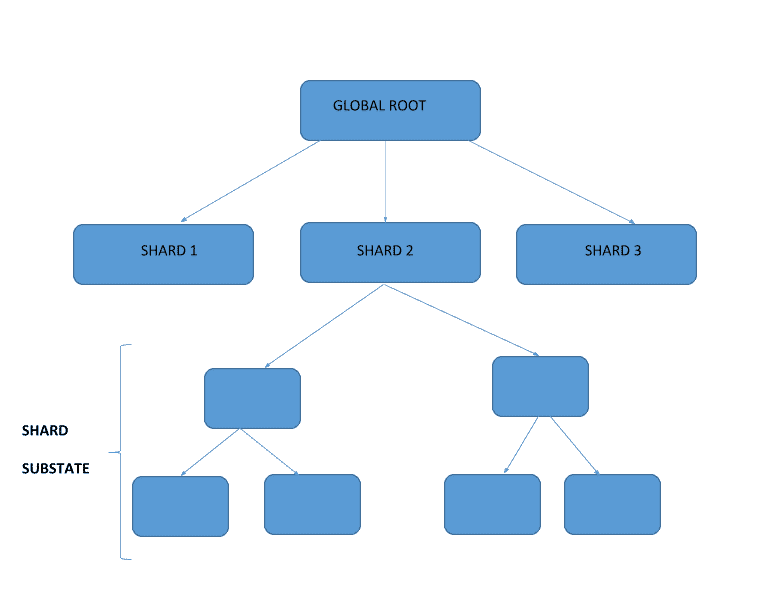

Sharding illustrated

## **等离子**

为了更好地理解**，想象一个雷电网络，它不是促进支付，而是促进智能合同。以太坊和其他一些平台一样，正在探索减少主链上直接记录和授权的流量的方法。Plasma 有两个目的:第一，将所有网络计算重新组织成更简单的格式。第二，由于 PoW 激励模型可能会潜在地鼓励阻止预扣，所以允许一种在现有区块链之上利用 PoS 令牌绑定的方法。区块扣留是指矿工解决了一个区块，但没有“公布”结果，从而将其从网络中扣留。Plasma 通过使用欺诈证明在主区块链上配对智能合同，这种技术赋予完整节点去验证错误链的能力。这保护了主链的完整性。这些欺诈证据强制母区块链进行状态转换。 **Plasma 基本上是在主链上创建“子链”，每个子链都能够向主链传递信息。**很像雷电网络，等离子体是建立在以太坊核心之上的第二层。Vitalik 坚信，这一点，以及其他许多即将到来的变化，应该会振兴以太坊网络并延长其寿命。**

**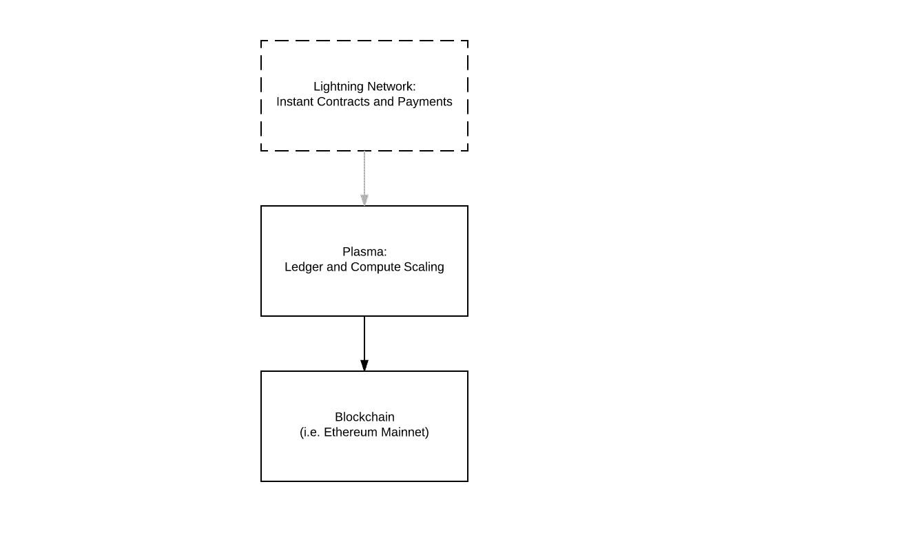**

**Tentative layering of the Ethereum Network**

## ****结论****

**以太坊能够有效地扩展吗？另一个紧迫的问题是:在第三代平台成为去中心化的区块链基础设施的新标准之前，它能坚持住吗？随着第二层的增加，如雷电网络和等离子体，以及对基础层架构(分片)的改变，以太坊似乎有了一个计划——一个潜在的解决方案。**

**然而，仅仅有一个提议并不能解决以太坊的问题。我最大的担忧是以太坊很难通过一个去中心化的治理系统来实现这个解决方案，因此，这是一个本质上低效的模型。如果没有集中决策，变化就会缓慢发生。苹果高管决定何时推出下一代 iPhone。以太坊没有那种奢侈。变更需要被验证，被网络接受，然后才能实施。我们还没有看到这些扩展解决方案兑现其创造者的承诺。以太坊的基础无疑更弱；**想想以太坊的可扩展性解决方案，就像急需翻新的老房子。以太坊在改造一栋地基薄弱的房子，而 3 代平台则仔细研究蓝图(以太坊的)，选择新的地块，重新设计自己不喜欢的部分。****

# ****2。什么是第三代平台？他们有什么以太坊目前没有的？****

**因此，我们已经多次提到第三代平台；让我们潜水吧。自从第一个智能合约诞生以来，大量相关的淘金热不是迁移到 DApps，而是迁移到可以让我们更接近现实世界实现和采用的协议。这些项目旨在成为现实世界使用的更好、更快、更强的基线，并且都试图塑造将我们带入一个新奇的未来世界的神奇陷阱门。这些项目与以太坊有何不同，炒作的目的是什么？**

**新的区块链项目如 [EOS](http://www.eos.io) 或 Cardano 正忙于开发以太坊当前问题的答案和解决方案。虽然许多这些项目从不同的角度处理这些问题，但通常会处理一些关键的组件。所有区块链系统和协议都在努力建立一个基础，使现实世界使用和*采用*。对于区块链来说，收养意味着成功。我喜欢把区块链的*适应性*分解成三个关键部分:**可伸缩性、互操作性、**和**整体可用性**。**

**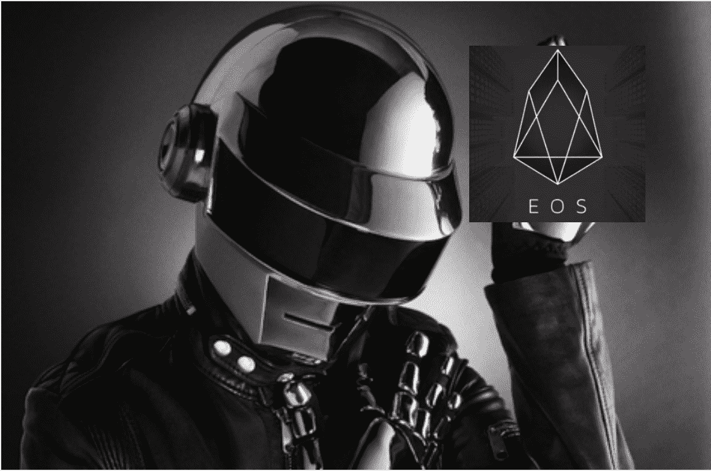**

**[Better, Faster, Stronger](https://www.youtube.com/watch?v=GDpmVUEjagg#t=01m00s)?**

## ****可扩展性****

**可伸缩性一直是区块链争论的核心——甚至在它变得很酷之前。这可能是你在这里听到或读到最多的一个名词，我就不深究了。但我会补充我的观点——特别是关于新兴的区块链。**

**自从第一台区块链问世以来，我们一直忙于制定解决方案来提高可伸缩性。如果你是区块链的初学者:**可伸缩性是区块链在保持低交易费用和快速达成共识的同时容纳尽可能多的用户的能力。以太坊和比特币的可扩展性问题源于它们现在效率低下的共识协议。这种低效率渗透到几个主要的缺点。其中之一是更长的*阻塞时间。* **阻塞时间是在区块链上生成一组交易量所需的时间。**因为交易需要在区块链上才被认为是有效的，所以阻塞时间决定了在设定的时间内可以处理的交易的速度和数量。****

****Noam:** 比特币有 1MB 的块大小和 10 分钟的确认时间。1MB 的块大小意味着每个块中可以包含大约 2，000 个事务。矿工必须解出一个数学公式来放置石块。10 分钟确认时间意味着数学公式被定制为花费 10 分钟。每 10 分钟 1MB (2000 个事务)非常慢。这是超级碗周日慢赛前一天好市多的排队。它的下载速度跟奶奶的一样慢。1MB/10min 相当于. 00167 Mbps(MB/秒)。试着以那个速度看网飞。新加坡是世界上网速最快的国家，平均网速为 154mbps，比比特币的网速快 92000 倍。Visa 处理交易的速度比比特币快 7200 倍。哎哟。那是《疯狂动物城》里的树懒…好了，我说完了。**

****回到 Lior:** 吞吐量和 TPS 率极低的区块链严重限制了其整体容量和*适应性* **。**如今，新型结构的设计核心就是可扩展性。许多项目开始采用创新的共识协议，有时为了支持可伸缩性而牺牲去中心化。我的看法是，这是正确的方向。正如我将继续提到的，我相信企业和机构将是第一批大规模采用这项技术的，所有这些都需要不同程度的集中化，每个都有特定的用例。在采用的早期阶段，我们将需要足够强大的技术来使我们的秘密梦想成为现实，在我们实现理想的、完全的去中心化之前，我们将需要效率。**我的结论是，区块链最重要的任务是达到一定的可扩展性水平，以实现区块链理工大学的首次大规模真实应用。****

## ****互操作性****

**随着不同协议数量的不断增加，并且没有减缓的迹象，互操作性变得至关重要。**

**互操作性是一个协议与不同的区块链交互和合作的能力，以及促进一个协议和另一个协议之间的智能合约的能力。互操作性被许多人视为区块链理工大学的“圣杯”,因为它将是帮助区块链理工大学走向现实世界的主要因素。**互操作性的本质是消除对集中式中介的需求，提高性能和可伸缩性，并连接私有和公共链**。一旦企业和其他机构开始采用区块链，可以肯定的是，它们中的大多数不会采用相同的协议和系统，因为这些平台和系统将各自处理不同的用例，具有不同的去中心化和集成水平。因此，通过 ERP 和 CRM 软件整合区块链技术很可能会通过许多不同的区块链，而不仅仅是一个。**为了在这个新兴的生态系统中扮演积极的角色，所有这些基础协议都需要相互合作。如果你对区块链的互操作性的含义还不清楚，可以和脸书做一个有趣的比较:今天，几乎互联网上的所有东西都可以通过你的脸书账户访问。还记得你以前每样东西都有单独的账户吗？脸书绝对控制着你的生活，但它也让你的生活变得更加轻松。无缝集成从第一天起就是脸书的目标，是其 20 亿用户群的关键组成部分。****

## ****这一切意味着什么？****

**许多项目正从简单的智能合同互操作性过渡到整个区块链的无缝信息共享。这些不可知的协议能够自由地、无缝地工作，而不是在不同的网络之间设置额外的通信层。想象一下精通每一种语言，而不是整天坐在谷歌翻译上。[**【AION】**](https://aion.network/)、 [**ICON**](https://icon.foundation/en/) 和 [**WanChain**](https://wanchain.org/) 值得注意的是最近成立了“区块链互操作性联盟”的项目，致力于为新兴的区块链网络制定互操作性标准的研究和资源。我的结论是，以互操作性为核心的区块链项目将经受住时间和适应性的考验，最终使它们成为真正可采用的技术。**

****

**The Interoperability Alliance**

## ****可用性****

**除了可扩展性和互操作性，作为实体经济基础的平台还需要什么？**可用性**。可用性是一些关键属性的结晶，但是为了让每个人都更容易使用，这个定义是第一位的:基础需要容易被**最终用户**和**开发者使用。** *对开发者来说，我指的是装修一栋空房子的人(制作 DApps ),对最终用户来说，我指的是你，那个因为房子漂亮舒适而决定坐在里面的人。*如果你认为自己很懒，那些你称之为开发人员的技术人员会粉碎你为自己制造的耻辱。他们都不喜欢在一个不能为他们提供所有需要的平台上工作，以构建你想要的一切。新平台通过功能性编程语言、智能合同审计和易于部署、可定制的区块链让开发人员的生活更轻松。但这只是可用性的一个考虑因素。*易用性*非常重要。为什么苹果手机统治世界？不是因为它有更好的处理器，更强大的摄像头，或者无线充电——其他手机在所有这些领域都消灭了苹果手机。苹果手机是王，因为它们容易使用；它们时尚、设计精良、直观，与您的所有设备兼容。所以区块链需要制造同等的苹果手机。**在我看来，最终目标是让最终用户甚至不知道他们在使用区块链**。如今，第三代平台以各种方式实现这一目标。他们将那些长的以太网地址转换成基于姓名的地址(因此您最终可以使用 *69BoomHeadShot420* 职责召唤呼号作为地址)。此外，就像你不支付与网站互动的费用一样(主持人支付)，对于像 **EOS** 这样的项目，用户不支付费用，智能合同的主持人支付费用。像**弹力丝**这样的项目使得区块链可以通过智能手机和任何操作系统访问。**综上所述，对开发者来说简单的区块链*和*用户友好型将会被采用。****

# ****MVPs****

**这里有一些我一直在密切关注的项目，它们都从不同的角度解决了区块链面临的挑战。还有很多，但我将集中讨论其中几个。**

****诺姆，那是你的队列:****

**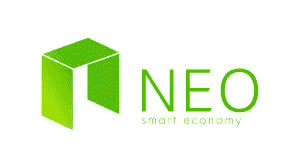**

**[**NEO**](https://neo.org/) — NEO 体现了互操作性、可扩展性和可用性，但代价是真正的去中心化。NEO 与生态系统内的一系列区块链建立了联系，如 Ontology 和 Elastos，将私营企业区块链与公共区块链解决方案联系起来。他们的可伸缩性是巨大的，具有显著的交易速度和开发链外解决方案。NEO 和 NEO 社区专注于开发能够为企业和用户提供简单开发的项目。**

**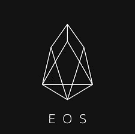**

**[**EOS**](https://eos.io/) — EOS 为用户和开发者都提供了可用性的范例。如前所述，因为智能合约主机支付网络费用，所以用户免费与 EOS 进行交互。借助横向扩展和高效的 dPoS 共识机制，EOS 可以支持每秒数十万次的事务处理和高度密集型应用。基于名称的地址带来了易用性，其基础 Graphine 技术已经在 Steemit 和 BitShares 上处理大量吞吐量。**

**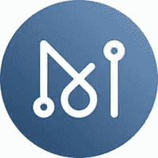**

**[**matrix chain**](https://www.matrixchain.io/)—matrix chain 将 AI 与区块链融为一体。MatrixChain 以一些独特的方式使用人工智能，最终简化了用户体验。人工智能可以审计智能合同和代码，以确保没有漏洞和错误。用户可以用简单的脚本语言输入智能合同的规范；然后，人工智能将规格转换为智能合同。但这不是一项简单的任务；AI 需要从规范中推断智能合约的目的是什么，然后启用它。AI 还将根据环境和使用输入优化区块链协议。本质上，区块链将不断优化，以解决实际使用，没有硬分叉。**

**MatrixChain 使用混合 PoW 和委托 PoS 协议。区块链被分成不同的部分，挖掘和共识分别发生，以提高可伸缩性(想想分片)。但与其他 PoW 模型不同，计算节点不仅仅是解决无意义的算法。矿工们进行马尔可夫链蒙特卡罗(MCMC)计算——如果你的大脑在读这个的时候死了，等一下。MCMC 计算对于解决某些算法非常重要。即使是简单的解释也超出了本文的范围，但是要认识到 MCMC 对于真实世界的大数据应用是至关重要的。因此，矩阵挖掘实际上对解决现实世界的问题很有用。**

****回到 Lior:****

**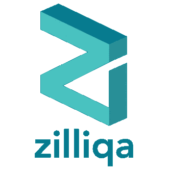**

**Zilliqa is all about RESULTS**

**[**Zilliqa**](https://www.zilliqa.com/)**——**Zilliqa 是一个区块链平台，旨在安全地在一个开放的、无权限的分布式网络中扩展。使 Zilliqa 可扩展的核心特性是分片——将网络分成几个能够并行处理事务的更小的组件网络。在以太坊目前 30，000 名矿工的网络规模下，Zilliqa 预计将处理约 1000 倍于以太坊的交易速率。Zilliqa 利用了 power 和 PoS。它不使用权力来达成共识。然而，该平台仅使用 PoW 来防止 Sybil 攻击和生成节点标识。这与许多现有的区块链平台(特别是比特币和以太坊)形成对比，在这些平台上，PoW 用于达成分布式共识。Zilliqa 使用 Ethash，以太坊 1.0 中使用的 PoW 算法。共识协议由目录委员会的总体层和每个分片中 PBFT 协议的细化组成。Zilliqa 采用了基于椭圆曲线的 Schnorr 签名算法(在本文中肯定不会涉及它),它具有多重签名或签名聚合功能。这意味着即使很多矿工在一个区块上签名，签名的大小仍然很小。此外，通过利用高效的网络拓扑，Zilliqa 的共识方案降低了与网络规模成线性关系的通信复杂性。Zilliqa 提出了一种创新的专用智能契约语言和执行环境，它利用底层架构来提供大规模和高效的计算平台。**

**一些更有趣的项目: **Qtum、ICON、Nebulas、Elastos、Ontology 等等。****

# ****3。一个特定的区块链能实现全球一体化吗？****

**想象一下，整个经济建立在一个去中心化的区块链之上。所有数据都得到维护和保护。供应链整合允许快速和改进的商务；甚至投票都是通过你的私人钥匙和区块链完成的。都是以太坊或者 EOS 盖章的。这是自由主义者的梦遗，也是今天所有人都在谈论的话题。但我们认为，在走向全球采用的道路上，区块链需要克服一些严重的障碍(更不用说一个障碍了)。每个人都在谈论区块链将如何改变我们的整个世界，今天(类似于互联网的兴起)，我们正在用它来拓展我们的极限，看看它能让我们走多远。**

**我相信，由于种种原因，我们离“一个区块链来统治他们所有人”(咕鲁正在观望)还很远。除了我们在整篇文章中提出的明确问题(*可伸缩性*、*可用性*等等)之外，我还会试图重申，我预见到要让一个单一的、*去中心化的*系统得到所有政府和权威机构的批准和支持会有很大的困难。我是否认为中国和瑞士对区块链会有同样的标准，并且都支持和认可？不太可能。贸易法、边境、语言障碍和税收都是多民族区块链的障碍。回到区块链最初的采用者；我看不出有足够好的理由让所有的企业、机构，甚至政府和当局使用相同的基础结构来满足他们在集中化和用例方面的巨大差异。**

**总之，我绝对不相信一个区块链能在短时间内实现全球一体化。更重要的是，当我看到区块链的未来及其对我们世界的影响时，我真的不认为只有一个世界的真正原因。随着链变得越来越具有互操作性和可用性，我们将会看到大量的划分和链，它们将会专注于各种用例。**这个生态系统将继续增长和专业化，我认为这一进程不会很快放缓。****

# ****结论****

**我们的世界是复杂的，我们的经济规模巨大，我们的需求多种多样。这个网络不能由一个平台提供服务，而是由一个可用的、可互操作的、可扩展的区块链互联网络提供支持。这些区块链将是我们去中心化世界的 iPhones 简单易用，便宜，安全。我们才刚刚开始。每个月都会带来更高级的特性、更强大的开发、更简化的服务。**就目前而言，无论世界是否为区块链做好了准备，我们的平台显然还没有准备好**。但随着第三代区块链的发展，以及不可避免的第四、第五、第六代的出现，这种情况不会持续太久。**

**在推特上关注我:@Lior_Messika**

**大喊到[丹尼尔·罗贝尔](https://medium.com/u/2d9bdcffa15d?source=post_page-----f3f7dda84bae--------------------------------)进行有价值的分析。**

*****免责声明:我投资于 EOS、NEO、ETH 和其他一些提到的项目。这不是投资建议，仅仅是我对平台和区块链未来的看法。自己做研究。*****

**不过，如果你确实想购买，币安是我的最爱:[链接](https://www.binance.com/?ref=10928176)**

***如果你喜欢内容，请按住鼓掌按钮！它帮助我获得曝光率。***

*****鼓掌 50 次！*****

***我喜欢收到问题或建议，所以请留言吧！***