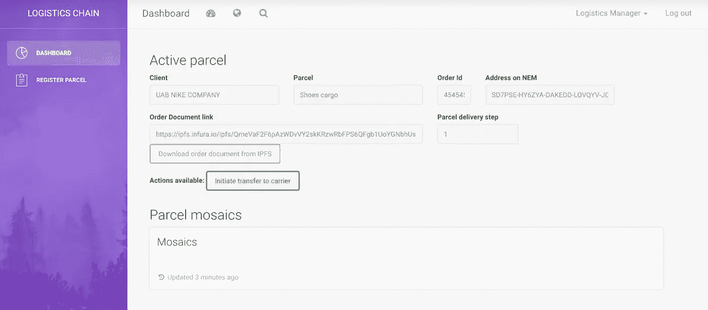

# 基于 NEM 区块链的供应链区块链概念验证。

> 原文：<https://medium.com/hackernoon/blockchain-poc-for-supply-chain-built-on-the-nem-blockchain-46f014e3754e>

在 Cryptodus，我们真正相信区块链的价值。我们最初是一家 ICO 咨询和软件工程公司，在看到传统企业摆脱了对这种技术的恐惧后，我们逐渐将我们的思维模式转移到企业的 T2 区块链。我们已经看到，我们的前进方向是让我们的客户转变业务的真实使用案例。

我们最近成为了 NEM 区块链认证服务合作伙伴。NEM 提供易于使用的 SDK(软件开发工具包)和强大的区块链基础设施。这些原因，以及其他一些原因，足以说服我们在 NEM 上建造这个产品。

## 商业案例

将货物从 A 点运送到 B 点非常复杂。让我们来看看鞋作为货物从中国到立陶宛的移动。尽管这听起来很简单，但整个过程非常复杂，需要大量的文书工作(是的，仍然是纸张):

*   中国:货运代理创建货运单。
*   中国:卖方将货物装入集装箱，并将所有权交给承运人。
*   中国:承运人将集装箱运到港口，并将所有权交给集装箱运输公司(如 Maersk)。
*   中国:海关批准运输。
*   中国到立陶宛。运输…
*   立陶宛:海关批准货物进口。
*   立陶宛:集装箱运输公司将货物交给承运人。
*   立陶宛:承运人将货物交给买方。

搞定了。这只是一个高层次的流程描述。还涉及更多的相关方(如保险、监管机构等。).

关键问题是，目前所有的东西都被每个公司的内部系统存储在封闭的数据库中。每次移交都需要双方的人工输入，包括:海关和物流经理、承运人和货运代理、船运公司和货运代理等。每一步都会产生和传输大量的文书工作。因此，如果出现不可预见的情况，例如:货物丢失、延迟交付或任何其他纠纷，很难有一个单一的事实来源来实现完全自动化的问题解决流程。

## 解决方案

我们可以利用技术，以分散的方式为整个过程创造一个单一的真相来源。在这样做的过程中，没有单一实体控制所有数据，也没有单一故障点，这就是区块链介入的地方。区块链直接在共享账本上提供完整的防篡改操作日志、时间戳和确认跟踪。关键是让包裹移交过程和递送证明(POD)在区块链上对所有相关方都是可验证的。

# 概念证明

**业务逻辑**

对于概念验证，我们决定缩小整体范围，并采用以下流程实施解决方案:

*   物流经理创建发货订单。
*   经海关批准，所有权转移给承运人。
*   交付后，承运商启动交付流程，要求买方和物联网位置传感器进行确认。
*   交货证明(POD)验证被触发，物流经理和他们的计费部门一起验证整个跟踪并启动支付流程。

**技术方案**

关键要素:

*   NEM 区块链——用于分散数据存储。
*   IPFS —用于分散式文档存储。
*   节点。后端和 API 的 JS。

高级方案:

为每个包裹生成一个 NEM 帐户，并用作区块链上货物的表示。交易有效负载消息用于存储关键数据，包括:订单 id、交货地点、存储在 IPFS 上的文档链接。该解决方案利用 NEM 多重签名账户，该账户需要 M 个确认中的 N 个(例如 3 个中的 1 个)来启动某些交易(例如海关经纪人和物流经理将包裹移交给集装箱运输公司的确认)。NEM [马赛克](https://blog.nem.io/how-to-create-a-mosaic-with-the-nem-blockchain/)被用作确认令牌(例如，当当前坐标和交付坐标的位置匹配时，物联网传感器传输“位置 _ 确认”马赛克)。聚合保税交易支持保税交易，该交易需要交易发生的所有各方的签名(例如，为了完成交付，承运商发起交易，该交易需要物联网传感器传输“位置 _ 确认”镶嵌图，而接收方传输“包裹 _ 接收”镶嵌图)。

**几个前端屏幕**

包裹创建。

包裹视图。

验证的最后一步。

## 价值

通过利用这种解决方案，公司可以通过 API 集成来轻松测试区块链。然后，他们可以通过现有的系统直接与区块链互动。实施成本低得惊人，因为它不需要与每一方进行定制集成。因此，维护了一个共享的防篡改分类账，以记录和跟踪整个运输过程。

## 下一步是什么？

像这样的解决方案可以与现有系统并行引入，并作为项目试验期间的复制日志。一旦明确了价值，并且各方都对解决方案感到满意，就可以完成进一步的实施阶段。

**想了解更多关于区块链的知识？**我们在 Linkedin 上连线:[https://www.linkedin.com/in/lkairys/](https://www.linkedin.com/in/lkairys/)

**对解决方案感兴趣？**请随时联系我的同事 Ieva ( **ieva@cryptodus.com)。**

