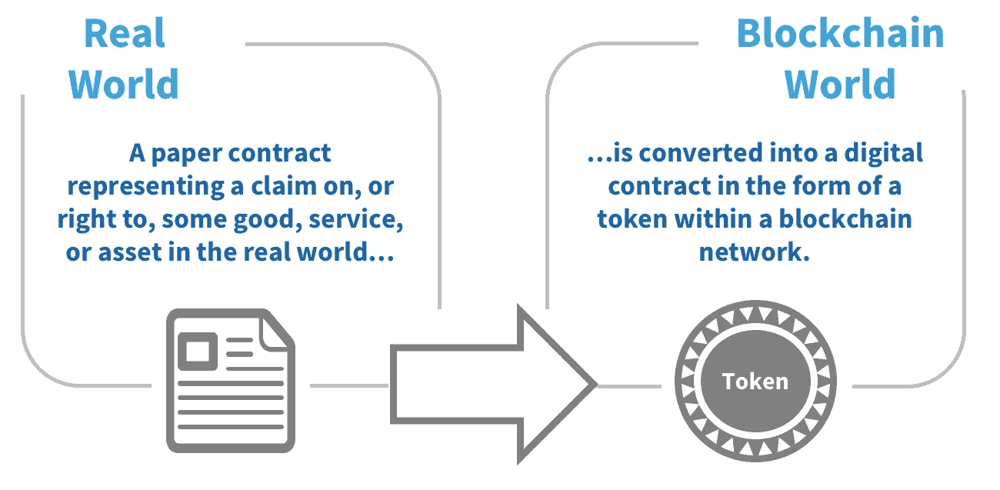
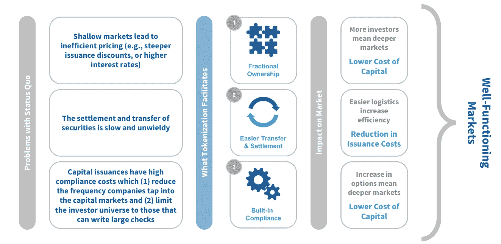
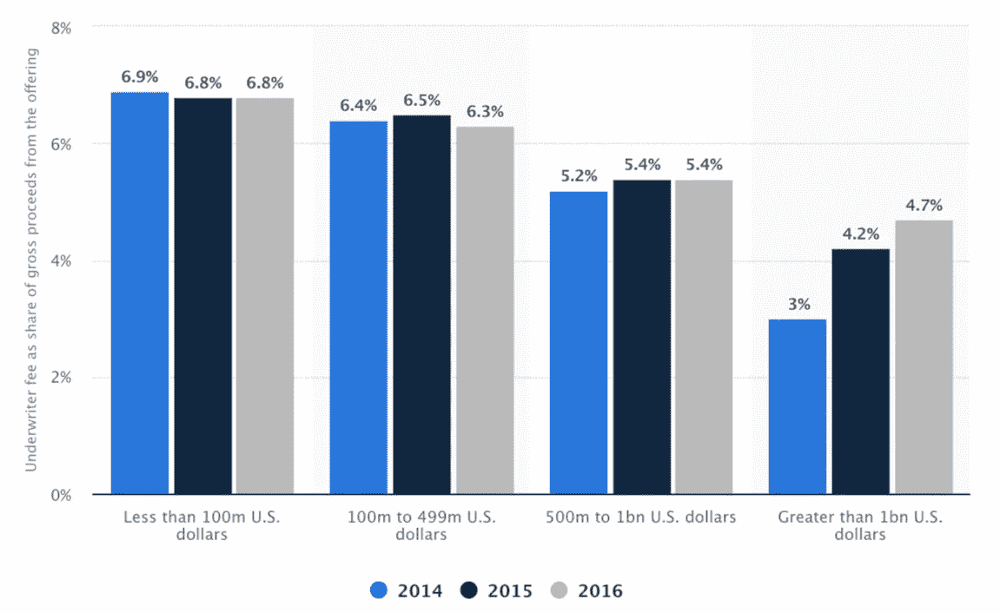

# 区块链驱动的资产令牌化协议威胁高盛的投资银行业务

> 原文：<https://medium.com/hackernoon/blockchain-powered-asset-tokenization-protocols-threaten-goldman-sachs-investment-banking-business-3940b0484816>

开放式创新在科技行业有很强的立足点。大型科技公司创建应用程序编程接口(API)，以利用外部软件开发人员的知识库。通过这样做，集中化的公司能够访问外部知识库，从而提高其专有应用程序的价值。一个突出的例子是脸书的“喜欢”按钮 API。脸书让整合“赞”变得免费而简单，因为这让他们可以接触到应用程序的用户，让他们获得以前无法获得的海量数据。

这种开放式创新并不是脸书独有的——几乎所有的科技公司都这么做。然而，并非所有行业都是如此。科技位于开放创新光谱的一端，而金融部门位于另一端。对于像高盛这样的大型投资银行提供的承销服务来说尤其如此。与人共同创立了解密资本(Decipher Capital)公司(一家投资于区块链项目的风险投资基金)，再加上在高盛担任投资银行家，这让我对**和*区块链支持的技术，特别是资产令牌化协议，将如何颠覆投资银行业务有了独特的视角。*

*这种不可避免的破坏最好通过观察现状来理解。如今，高盛倾向于承销超过 1 亿美元的交易。交易规模和有限的能力迫使它对接受的客户进行选择。与承销交易相关的行政、管理、劳动力和其他成本不会随着交易规模的变化而变化，它们更多的是固定的，而不是可变的。因此，高盛有动机追逐更大的交易，以实现单位经济效益最大化。这种商业模式一直到现在都行之有效，因为筹集资本既昂贵又耗时，这促使公司在最大限度提高资本筹集规模的同时，尽量减少融资频率。*

*也就是说，这种情况不会持续太久。去中心化的开源智能合约协议正在实现现实世界资产的令牌化，包括股权和债务。*

**

***Figure 1: Explanation of Tokenization [**[***1***](http://www.decipher.capital/primer-on-security-tokens/)**]***

*股权和债务的象征化意味着融资将更快、更有效。这是因为区块链限制政党间获取相关信息的依赖性。例如，法规遵从性要求现在可以通过智能合同编程到令牌中，从而减少持续法规遵从性工作所花费的时间和金钱。鉴于这种速度和效率，令牌化资产可以进一步细分，从而允许更广泛的所有权和深化市场。*

**

***Figure 2: Benefits of Tokenization in Investment Banking [**[**2**](http://www.decipher.capital/primer-on-security-tokens/)**]***

*上述好处意味着公司的全包发行成本更低。它们减少了管理层筹集资金所花的时间，降低了支付给中介机构的费用，并最大限度地减少了由于市场效率低下(如大幅折扣和高利率)而造成的损失。只要看看 IPO 的总息差，就能让我们了解企业融资的成本有多高。鉴于 2016 年的数据，一家通过 IPO 融资 10 亿美元的公司的平均总息差应该是 5.4%，仅承销费一项就相当于 5400 万美元。一旦有了可行的选择，公司就会想方设法降低这些成本。*

**

***Figure 3: Average underwriter fee in IPO in the United States from 2014 to 2016, by deal size [**[***3***](https://www.statista.com/statistics/533357/underwriter-fees-in-usa-ipo-by-deal-size/)**]***

*因此，如果高盛想在新的区块链环境中保持竞争力，它需要利用区块链来增强其承销能力。高盛将需要简化银团银行和客户之间的信息流，降低与持续证券合规性相关的成本，并增加其。如果高盛不创新，其承销业务将受到交易流量减少和利润压缩的影响，因为公司会寻找最便宜、可行的选择。*

*高盛并没有袖手旁观。他们的反应是积极参与区块链空间。尽管媒体一直关注高盛开设比特币交易平台的短命计划，但其真正的战略在于对区块链公司的投资。高盛最近投资了 Veem [ [5](https://www.veem.com/veem-secures-us-25-million-to-expand-global-payments-for-small-businesses/) ]和 Tradeshift [ [6](https://cointelegraph.com/news/goldman-sachs-backed-tradeshift-eyes-blockchain-after-successful-250-mln-funding-round) ]。这两项投资都是通过其主要战略投资集团(PSI)进行的。PSI 倾向于投资于这样的公司，即他们预计银行的至少一个其他部门将从与投资组合公司的合作中受益。这些投资增加了高盛在区块链的风险敞口，但承销业务不太可能成为这种合作关系的直接受益者。高盛需要花更多时间将区块链融入其承销业务的日常运营中，而不是依赖 PSI 的战略投资来保持这项业务的竞争力。*

***最后的想法和问题***

*毫无疑问，令牌化具有降低资本发行成本的能力。至少，高盛可能希望实施区块链，以降低承销融资的后端成本。问题不在于是否，而在于何时。通过令牌化资产筹集的资本与通过传统资本市场筹集的资本相匹配还需要多久？2 年？三年？最多 5 年？*

***免责声明。**本文仅供参考。本帖表达的观点不是，也不应被理解为投资建议。本文件不是购买或出售此处提及的任何资产的要约，也不是要约邀请。这篇文章中的所有观点都是我个人的，不以任何方式代表 [CMX 资本](http://www.cmx-capital.com)或关联公司的观点。*