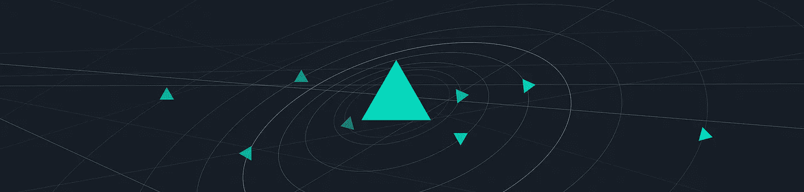

# 区块链隐私增强技术系列—隐形地址(一)

> 原文：<https://medium.com/hackernoon/blockchain-privacy-enhancing-technology-series-stealth-address-i-c8a3eb4e4e43>

今天的许多区块链，包括比特币和以太坊，都是开放的公共账本，因为参与没有限制，所有交易细节都可以在区块链上看到。在公共分类账中，交易实体只能通过它们的区块链地址来识别，这些地址是从相应的公钥中导出的。公共分类账一般被认为是“伪匿名的”，这意味着一个地址与一个人相关联，但该人不为公众所知。然而，通过分析交易图并结合其他信息，可以揭示区块链地址背后的真实身份，正如最近的研究所示。出于各种原因，包括但不限于管理执法相关问题和隐藏敏感的公司特定信息，个人和公司更喜欢将隐私增强功能添加到区块链交易中。

**隐形地址密钥管理机制**

秘密地址是一种隐私增强技术，用于保护加密货币接收者的隐私。秘密地址要求发送方为代表接收方的每笔交易创建随机的一次性地址，以便对同一收款方的不同付款不可链接。

## **基本隐形地址协议(BSAP)**

最基本的隐形地址方案最早是由一个名为“字节币”的比特币论坛成员在 2011 年开发的，它依赖于椭圆曲线 Diffie-Hellman (ECDH)协议，工作原理如下:

*   发送方和接收方分别有私钥/公钥对( **a** 、 **A** 、 **b** 、 **B** )，其中 **A = a G** 和 **B = b G** 和 **G** 是一个椭圆曲线群的基点。
*   发送方和接收方都可以使用 ECDH 来计算共享秘密**c**:**c = H(A B G)= H(A B)= H(B A)**，其中 **H( )** 是一个加密哈希函数。
*   发送者简单地使用 **c G** 作为发送付款的短暂目的地地址。
*   接收者主动监控区块链，并检查是否有交易被发送到声称的目的地址 **c G** 。如果有，可以使用相应的私钥 **c** 进行支付。

BSAP 的设计有两个主要问题:I)短暂的目的地址在两个通信实体之间是固定的。因此，这些实体之间的交易可以很容易地联系起来；ii)发送方和接收方都可以计算私钥 **c** 。因此，如果收款人没有及时消费付款，汇款人可以改变主意，把钱拿回来。

## **改进的隐形地址协议(ISAP)**

为了解决 BSAP 的设计缺陷，尼古拉斯·范·萨伯哈根(Nicolas van Saberhagen)在 2013 年的 CryptoNote 白皮书中详细介绍了一个名为 ISAP 的改进方案，后来彼得·托德(Peter Todd)在 2014 年的比特币协议中对该方案进行了修改。ISAP 是 BSAP 的扩展，它应用如下所述的附加密钥派生技术:

*   接收方有一个私钥/公钥对( **b** ， **B** )，其中 **B = b G** ， **G** 是一个椭圆曲线组的基点。
*   发送方生成一个临时密钥对( **r** ， **R** )，其中 **R = r G** 并与事务一起传输。
*   发送方和接收方都可以使用 ECDH 来计算共享秘密**c**:**c = H(R B G)= H(R B)= H(B R)**，其中 **H( )** 是一个加密哈希函数。
*   发送者使用 **c G + B** 作为发送付款的临时目的地地址。
*   接收方主动监控区块链，并检查是否有交易被发送到声称的目的地址 **c G + B** 。如果是，则可以使用相应的私钥 **c + b** 进行支付。注意，短暂私钥 **c + b** 只能由接收者计算。

虽然 ISAP 修复了 BSAP 的上述设计缺陷，但是区块链节点仍然需要使用其私有支出密钥 **b** 来主动扫描区块链以寻找声称的目的地地址 **c G + B** ，这与安全存储私有密钥的常见做法相反。私人支出密钥的持续使用大大增加了它被泄露的风险。

## **双密钥隐形地址协议(DKSAP)**

为了消除 ISAP 的私人支出密钥过度使用限制，一个名为 rynomster/sdcoin 的开发人员在 2014 年为 **ShadowSend** 创建了一个双密钥增强功能 DKSAP，这是一个高效、分散的匿名钱包解决方案。从那时起，DKSAP 已经在许多加密货币系统中实现，包括 **Monero** 、 **Samourai Wallet** 和 **TokenPay** ，仅举几例。该协议利用两对加密密钥，即“扫描密钥”对和“花费密钥”对，并计算每笔交易的一次性支付地址，如下所述:

*   接收方有两个私钥/公钥对( **s，S** 和( **b** ， **B** )，其中 **S = s G** 和 **B = b G** 分别是“扫描公钥”和“花费公钥”。这里 **G** 是椭圆曲线群的基点。
*   发送方生成一个临时密钥对( **r** ， **R** )，其中 **R = r G** 并与事务一起传输。
*   发送方和接收方都可以使用 ECDH 来计算共享秘密**c**:**c = H(R S G)= H(R S)= H(S R)**，其中 **H( )** 是一个加密哈希函数。
*   发送方使用 **c G + B** 作为发送付款的临时目的地地址。
*   接收方主动监控区块链，并检查是否有交易被发送到声称的目的地址 **c G + B** 。根据钱包是否加密，接收方可以通过两种不同的方式计算出同一个目的地址，即 **c G + B = (c + b) G.** 如果匹配，就可以使用对应的私钥 **c + b** 进行支付。注意，短暂私钥 **c + b** 只能由接收者计算。

在 DKSAP 中，如果系统中存在审计者或代理服务器，接收者可以与审计者/代理服务器共享“扫描私钥” **s** 和“花费公钥” **B** ，以便那些实体可以代表接收者扫描区块链交易。然而，他们不能计算出短暂的私有密钥 c + b 并支付费用。

# **基于区块链的物联网系统面临的挑战**

DKSAP 为交易接收者提供了强大的匿名性，并使他们能够在实践中接收不可链接的支付。然而，这种方法确实需要区块链节点不断地计算声称的目的地地址，并在区块链中找到相应的匹配。虽然这一过程适用于成熟的计算机，但它给资源受限的物联网设备带来了新的挑战。所以问题是“ ***我们是否可以通过做出某些权衡来使 DKSAP 适应基于区块链的物联网系统？*** “此外，由于存在短暂密钥，使用秘密地址的交易很容易被识别，这导致隐私的一些损失。因此，另一个问题是“ ***”当使用秘密地址时，我们能减轻由于短暂密钥的存在而造成的隐私损失吗？*** “要了解 IoTeX 如何应对这些挑战，请关注我们下一篇关于隐形地址和基于物联网的系统的博文！

# 关于 IoTeX

IoTeX 是物联网(IoT)的自动扩展和以隐私为中心的区块链基础设施。IoTeX 的全球团队由密码学、分布式系统和机器学习领域的博士、顶级工程师和经验丰富的生态系统构建者组成。IoTeX 正在开发几项内部创新，以推动区块链 3.0 的前沿，包括用于异构计算的区块链-区块链架构、闪电般快速的 Roll-DPoS 共识机制和轻量级隐私保护技术，以将自主设备协调带给大众。

网址:[https://iotex.io/](https://iotex.io/)
推特:[https://twitter.com/iotex_io](https://twitter.com/iotex_io)
电报公告频道:[https://t.me/iotexchannel](https://t.me/iotexchannel)
电报组:[https://t.me/IoTeXGroup](https://t.me/IoTeXGroup)
中:[https://medium.com/@iotex](/@iotex)
Reddit:[https://www.reddit.com/r/IoTeX/](https://www.reddit.com/r/IoTeX/)