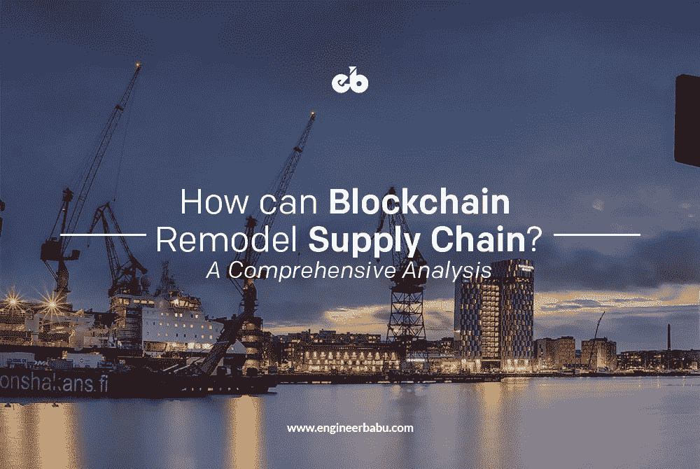
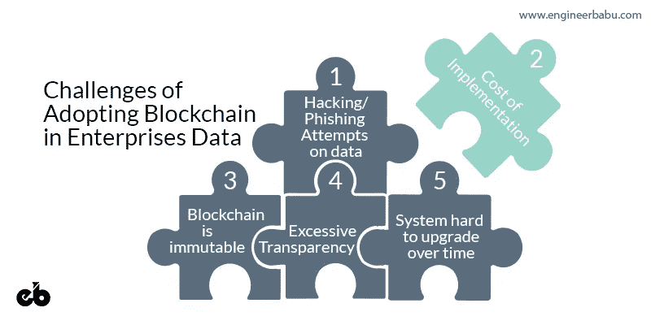
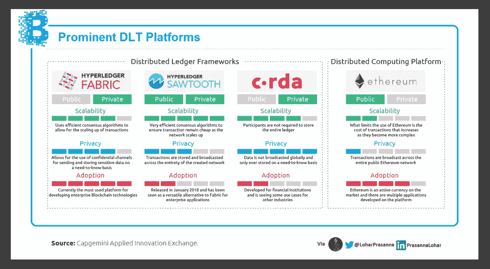
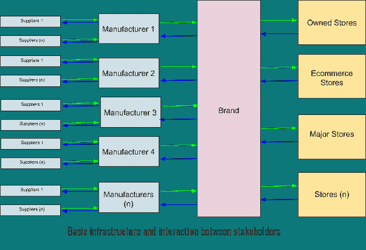
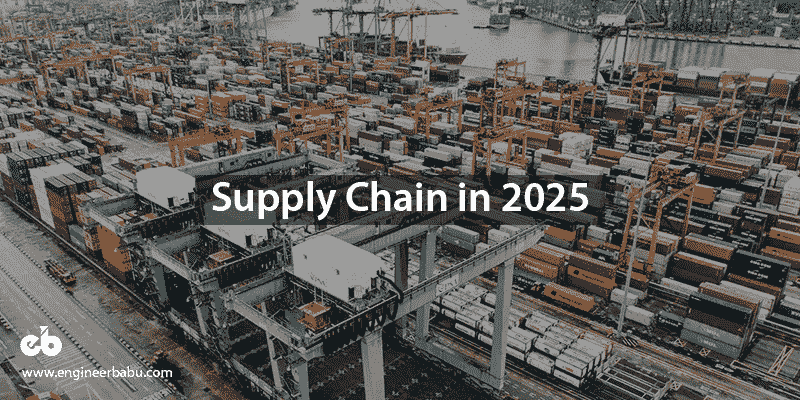
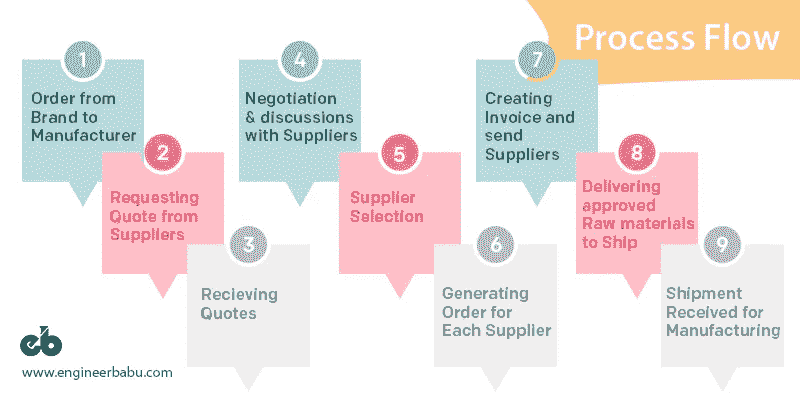
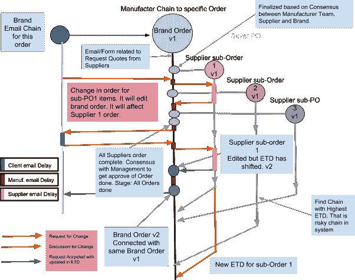
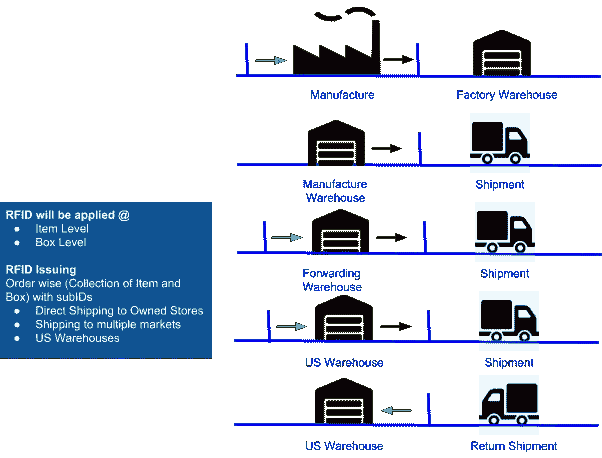

# 区块链重塑供应链

> 原文：<https://medium.com/hackernoon/blockchain-remodeling-supply-chain-58d9ee6093a8>

## 对这一过程的深刻技术见解

在全球经济中，一切都是在筒仓中谈判、交易和记录的。每个企业都有自己的软件、数据库和系统来验证、记录和检索信息。他们使用原始技术与外界通信，如电子邮件、excel 表格、发票和 POs。这些第三方也使用人工团队在自己的系统中再次数字化这些信息。

# 该模型的潜在问题:

*   相当多的是无组织的和不可行动的交流
*   迷失在翻译中
*   跳过交互的机会
*   所有各方在收到副本后进行手动数字化
*   拜占庭一般问题(不信任信息)
*   电子邮件/互动不会成为普遍适用的法律。
*   由于清晰的沟通，预期的交付时间和承诺的质量受到影响。
*   每个第三方的公司对企业来说都是一个黑匣子。这只是基于昂贵的协议，诚信经营。
*   所有由第三方提供的数据和承诺都涉及财务激励。所以过度承诺和表现不佳的概率非常高。
*   内部团队、企业级或第三方级没有单一版本的真相。

# 在企业数据中采用区块链的挑战

Challenges of Adopting Blockchain in Enterprises Data

*   ***黑客攻击/网络钓鱼企图*** 攻击系统和数据
*   加密的数据可能会在几年后得到 ***解密*** 。由于增加了求解键的计算能力。量子计算机具有这种威胁。
*   供应链利益相关者的业务数据、员工数据和系统都*。由于来自竞争对手/黑客的成本/收益，它将有更多被攻击的概率和机会。*
*   *供应链利益相关者和前员工可能会对区块链系统产生威胁。由于过渡期间的共识和网络访问。 ***区块链内部的区块是不可变的。****
*   *系统的 ***一致性*** 是基于许可和共识。它是一个动态模型，可以在供应链网络中变化和演化。*
*   *门店和品牌会有更多的透明度和连锁信息。他们可能会利用这些信息为 ***降低其他利益相关者的利润率*** 。*
*   *每个阶段的规划都应该是强有力的，并为未来做好准备。否则， ***升级会变得过时、笨重、费钱、费时。****
*   *在区块链，升级是艰难的。 由于不变性，每个新版本都会有不同的数据块格式。随着时间的推移，这将使系统难以升级。*
*   ****欺诈/风险/推动/缺口*** 被利益相关者利用*

# *几种解决方案:*

*   *选择 ***强基础架构的私有区块链。****
*   *我们将选择具有 ***弹性*的私有区块链解决方案，数据对时间至关重要，不会对业务和商业秘密造成损失。***
*   *选择民营区块链的方案应该是 ***集中于三大公司。*** IBM、微软、亚马逊。我们需要升级和安全更新。*
*   *小公司可能会关闭或在保护区块链数据库方面遇到问题。 ***平台对升级的过程要求很高*** 。*

**

*   *黑客攻击、解密和安全漏洞不应影响商业秘密。*
*   ****对于所有利益相关方，应使用带有加密和基于权限的访问的订单 id、项目名称和详细信息的伪命名约定*** 。*
*   ****共识模型*** 应用于添加、编辑和阶段穿越区块。应根据各方的层级和该块的决策权限来决定共识方。*
*   *每个共识块将始终由利益相关方 ***控制，每个阶段有 2-5 名员工。未经制造商许可，我们不会授权供应商编辑预期交货时间(ETD ),也不会授权制造商编辑预期交货时间(ETD)。****
*   *根据知情需要和参与程度来控制访问、阅读、写作和编辑权限是至关重要的。*
*   *在升级的情况下，代码应该在每个块中有一个版本号，以便理解算法和研究那些块。在不一致的层面上，我们需要标志和系统。*
*   *升级将始终部署在 ***网络开始创世纪连锁开始级别*** ，这是从商店或品牌订购的。如果有旧的订单，这些订单还没有达成他们的结论(交货)。那么这些链将遵循数据块处理流程中的旧功能。*(是一个复杂的过程，需要有创意的想法。)**

**

*Basic Process of Supply Chain*

# *2025 年的供应链:*

**

*Supply Chain in 2025*

*   *利益相关者必须开放数据才能相互合作。供应商、制造商、运输公司、品牌和商店等利益相关方。这将创造一个信任和信心的链条来一起做生意。*
*   ***供应商**必须在采购订单前向制造商开放当前的原材料和成品库存。它将基于制造商需要知道的基础。供应商将需要制造商的银行余额保证，包括所有未来的承诺。*
*   ***制造商**必须公开生产线数据、人力资源数据、人力资源状况、废物管理和实际交货时间的实时更新。制造商将需要包括所有未来承诺的品牌银行余额保证。*
*   ***船运公司**必须公开运力和容量数据，以便更好地预订。他们必须向供应链提供船舶/飞机位置的实时数据。船运公司将需要各方的银行余额保证。*
*   ***品牌**必须开放他们的购买力，让制造商放心付款和更快交货。他们对商店也有同样的期望。*
*   ***商店**必须与品牌在更深层次上开放用户行为的数据，如风格试验室访问，这种风格有更多的手动接触和销售图表以及用户概况。品牌将提供更多关于广告活动绩效、数字电子商务绩效和规划流程的信息。*
*   *一旦这个数据将开放，一个新的共识模型将在每个阶段进化。然后**智能合同**将开始在供应链行业成形。例如，*如果您在此日期自动交货，付款将在此日期进行，如果您未经批准延迟一天，将从发票金额中扣除 0.1%的罚款。**
*   *我们将不再使用纸质合同，而**可配置合同**将在行业中以标准代码发展。双方将验证智能合同代码并接受。一旦被接受，它将在该阶段或在采购订单中实施。*
*   *它必须通过*机器对机器、机器对软件和软件对软件的交互*来记录一系列事件。人类将与自然语言进行交互，它必须被转换为可操作的项目、事件记录、阶段转换和同意/不同意模型。*
*   *[**共识模型**](/@UnibrightIO/beyond-proof-of-work-blockchain-consensus-models-e332a4c77054) 将基于 [**拜占庭一般问题**](/all-things-ledger/the-byzantine-generals-problem-168553f31480) 。我们需要得到相关各方的同意才能改变阶段。这也是基于权利，他们将有投票权的阶段转移或没有。例如，供应商无法更改预期交货时间的日期。制造商只有在内部团队同意的情况下才能这样做。*

****想象一下，*** 所有这些数据都在公司和第三方之间共享，包括机器、ERP 软件、物联网设备、电子邮件、电子表格、闭路电视和图像，并保留必要的商业秘密。
目前，只有区块链能够解决整合所有这些数据的问题，并在各方之间达成共识，且具有防欺诈的不变性。*

# *设计的基本准则*

*这份解决方案清单是产品开发的基础。我们必须在项目的各个阶段实现所有提到的要点。*

***真相是释放组织潜力的关键***

***真相的一个版本***

*   *真理是由认识现实的最大能力来定义的。剩下的就是主观真实，故事和第二版的真实。*
*   *接受预期交货日期(ETD)的供应商应该有双重确认系统。所以我们有来自供应商的非常确定的承诺。*
*   *我们不应该对品牌进行双重确认。它们是制造公司的主要事实来源。编辑 ETD 的权利应该总是允许品牌。*

*真理的一个版本只能通过知道事件链和该事件的一致性来导出，该事件具有以不变性存储的时间戳。*

*   *与利益相关者、内部团队、最高管理层的每一次互动都是一件大事。它应该被跟踪并插入链中。*
*   *很少有事件在进入链之前需要双重确认。因为事件是不变的。当舞台从一个场景过渡到另一个场景时，我们需要对它们进行双重确认。例如，供应商从中国运送材料。*
*   *在与商店/品牌/制造商/供应商/内部团队发生任何冲突的情况下，提取一个真实/连锁版本*

***基于必要性的信息分离**。*

*   *成本是敏感数据，但时间是关键绩效数据，需要从商店/品牌/制造商/供应商/内部团队自由流动。*
*   *当我们在区块链中插入供应商、制造商、品牌、运输和商店数据时，需要两个级别的数据封装和安全性。*

***区块链中的非敏感信息**。*

*   *我们绝不会在区块链中插入加密或未加密的关于价格/成本的敏感信息。*(密码学可以用量子计算机或者未来技术或者黑客或者区块链的平台 Bug 来破解。我们将来绝不能被黑客攻击。20 年后技术准备好了就能破解。会成为利益相关者的尴尬局面。防范用区块链更好)**
*   *时间 ETD 是非敏感信息，但在利益相关者的生态系统中。**实时信息发布***
*   *我们在供应链网络中只有信息资产。我们需要这种自由流动以获得最佳效果。时间、原材料、订单 ETD 等信息以及网络内的时间敏感信息。ETD 和埃塔应该是严格的，跨团队执行，需要知道的基础。*
*   *最高管理者应该向所有利益相关者提供有针对性的信息。*

***警报系统，以便更好地了解**和监控*(侧重于电子邮件)**

*   *打开/回复/转发来自利益相关方的电子邮件作为分析和知识。*

***敏捷且可行的信息**及时发现差距。*

*   *在具有更严格警报系统的系统中，时间要求严格的项目应该有特殊的考虑。*
*   *有业绩记录的利益相关者很重要。我们可以在系统中计划对不响应和延迟的惩罚。*
*   *应该跟踪和奖励部门/负责人/员工的敏捷性。*
*   *最高管理层应该掌握主动权，而不是接受来自层级的信息。*
*   *预测逻辑:这种逻辑的基础将写在利益相关者过去的订单记录上。假设我们在特定品牌中有低排名供应商(低排名意味着延迟库存供应商)。那么我们应该关注他们以及订单。*
*   *每个订单系统都有供应商/制造商过去的记录，可以给你准时完成订单的可能性。这是概率定理，但对触发危险指令有效。它需要对过去的数据和对话进行机器学习。*

***利益相关者的沟通方式***

*商店、品牌、制造商、供应商和运输公司。*

1.  *电子邮件(大量使用的系统，效率极低)*
2.  *图像证明/闭路电视录像*(适用于所有利益相关方。)**
3.  *Excel 表格(非标准格式，在不同的电子邮件和生态系统中差异很大。)*
4.  *RFID(每个利益相关者的复杂和不同的实现。它需要数据规划。)*
5.  *结构化数据和系统。在区块链分享它们将是关键。)*
6.  *IOT 和定制设备(监控、分析、测量、访问控制数据)也可以插入区块链，以导出事件链。)*
7.  *为航运公司和其他利益相关者开放 API(它完全依赖于利益相关者的实现。联邦快递跟踪 API 很简单。但是船运公司很艰难。)*

## *工艺流程*

1.  *从品牌到制造商的订单*
2.  *向供应商询价*
3.  *接收报价*
4.  *与供应商谈判和讨论最佳 ETD 和价格*
5.  *供应商选择*
6.  *为每个供应商生成订单。*
7.  *客户团队将创建发票并发送给供应商。*
8.  *供应商向运输公司交付数量和质量合格的原材料。*
9.  *收到用于制造的运输。*

**

*Process Flow of Supply Chain*

# *发展规划过程*

*   *利益相关者和部门之间互动的方法。*
*   *商业秘密概述，供应链中需要保护的内容。它可以在供应商、制造商、品牌所有者或商店所有者的数据库列表中。还包括员工数据、电子邮件流、流程流等。*
*   *在执行谁、做什么、向谁报告、在哪里、何时以及如何执行之前，需要规划所涉及的利益相关者、团队、角色、层级结构、用户角色、日常交互以及信息和数据的流动的详细结构。然后，团队可以创建适当的角色和他们在系统中生成的数据包。*
*   *链中块的数据包设计*
*   *数据块插入权限、编辑权限和更新权限。*
*   *数据块规划、阶段隔离系统、从一种状态到另一种状态的标志、突出显示块和阶段交叉的确认。*
*   *用于团队阶段跨越的区块链节点和带有满意度的着色系统。*
*   *将计划跨阶段、创建订单、ETD 和可操作按钮的团队共识。*
*   *链内的冲突数据块。需要在 UI 中突出显示这些问题，并采取行动与相关方协商解决。*
*   *屏幕规划，树形系统规划，利益相关者明智地获取区块。*
*   *基于订单、供应商、制造商、品牌、商店和运输公司的警报系统配置。*
*   *数据和整个系统的安全性。我们需要写下所有可能的黑客攻击、安全威胁、访问控制威胁、团队内部的数据窃取、共识破坏和利益相关者的泄漏。*
*   *计划进行双重确认和封锁，这需要他们。一般会用于舞台穿越。*
*   *整个链条的升级。在升级的情况下，我们需要用数据块、网络和流程来规划未来。*

# *数据块和阶段的示例。*

*我们覆盖了链条的一小部分。所以我们有一个更好的想法链形状和方法。我们采取了从品牌订购到制造商和制造订单到供应商的流程。*

**

*Manufacturer Chain to specific order*

# *同一区块链中的 RFID 数据*

*我们从品牌的角度给你举个例子。如果品牌向制造商发出订单，应在区块链中添加以下数据，以便团队更好地跟踪和跟进。*

**

*Using RFIDs in Supply Chain*

*解释 RFID 实施和数据生成的小流程:*

*   *生产中的原材料输入*
*   *开始生产*
*   *工厂成品*
*   *工厂发货至转运仓库*
*   *装运*
*   *直接装运到目的地*
*   *装运至美国仓库*
*   *在美国仓库收到*
*   *运送至客户商店*
*   *退货*

*该链将具有来自 RFID 设备的所有数据块，并被缝合到该链上。该信息将带有时间戳。*

# *结论*

*在规划和实施过程中，我们必须从哲学的高度来理解区块链。它是关于公司向其他利益相关者开放他们的数据以实现互惠互利和流程自动化。如果我们与其他利益相关方分享这些信息，由于审批和混乱，许多流程和订单在漫长的供应链中处于待定和等待状态。然后，我们可以建立问责制，简化流程。在对订单进行任何编辑的情况下，利益相关方之间应就质量、数量和时间达成明确的共识/协议。应该是双方认可的。可以减轻供应链的压力。*

## *“从各种来源收集的信息应该一致，以便了解生态系统中的真相和透明度，而不干扰每个利益相关者的商业秘密。”*

## *最初由 Virat Khutal 发布在 [EngineerBabu 博客](https://www.engineerbabu.com/blog/how-can-blockchain-remodel-supply-chain/)上。*

*— — — — — — — — — — — — — — — — — — — — — — — — — —*

## *看我的其他相关文章*

***1。** [**区块链是如何颠覆供应链行业的？**](https://www.engineerbabu.com/blog/how-is-blockchain-disrupting-the-supply-chain-industry/) **亦作** [**亦作**](https://hackernoon.com/how-is-blockchain-disrupting-the-supply-chain-industry-f3a1c599daef)
**2。** [**十大知名区块链开发公司**](https://www.engineerbabu.com/blog/top-10-reputable-blockchain-development-companies/) **，还上了**[**hacker noon**](https://hackernoon.com/top-10-reputable-blockchain-development-companies-7c6eba562b90) **3。****[**区块链技术讲解:简介、意义、应用**](https://www.engineerbabu.com/blog/what-is-blockchain/) **，也上**[**hacker noon**](https://hackernoon.com/blockchain-technology-explained-introduction-meaning-and-applications-edbd6759a2b2) **4 .** [**关于智能合约你需要知道的一切:初学者指南**](https://www.engineerbabu.com/blog/smart-contracts/) **，也上**[**hacker noon**](https://hackernoon.com/everything-you-need-to-know-about-smart-contracts-a-beginners-guide-c13cc138378a) **5。**[**2019 年的 AI——有哪些科技公司在下大赌注？**](https://www.engineerbabu.com/blog/artificial-intelligence-in-2019/) **6。** [**区块链是如何革命化银行和金融市场的，**](https://www.engineerbabu.com/blog/blockchain-revolutionizing-banking-financial-markets/) [**也上 Hackernoon**](https://hackernoon.com/how-is-blockchain-revolutionizing-banking-and-financial-markets-9241df07c18b) **。*****

> ****我是 Mayank，*[*engineer Babu*](https://www.engineerbabu.com/)*的联合创始人。随时联系我*[*LinkedIn*](https://www.linkedin.com/in/mayankpratap/)*| mayank@engineerbabu.com(关于 EngineerBabu —* [*中*](https://hackernoon.com/how-mayank-pratap-built-engineerbabu-a-profitable-it-service-company-generating-more-than-50-000-per-month-bcd3006bdbb5) *)。****

***此外, [EngineerBabu](https://www.engineerbabu.com/) 通过构建高级 IT 解决方案，帮助初创公司、企业和所有者发展业务。他们开发的项目 95%都按时完成了。 [30+由风投](https://www.engineerbabu.com/casestudies)资助，获得最具创新总理设计奖，入选 Y-Combinator 2016 & 2017。***