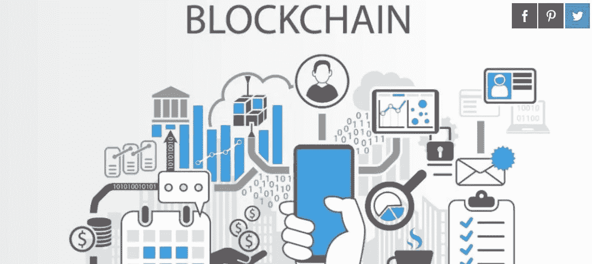

# 区块链:革命和技术工作机会

> 原文：<https://medium.com/hackernoon/blockchain-revolution-and-technical-job-opportunities-b02a452dcde2>

自 2015 年以太坊协议诞生以来，其虚拟货币以太开始与比特币竞争，其背后的技术区块链正吸引着越来越多的兴趣。作为发展领域的一场真正的革命，它仍处于起步阶段。虽然似乎很难估计它的潜力，但它似乎注定会在未来发挥重要作用。

由程序员**维塔利克·布特林**开发的[以太坊区块链](https://hackernoon.com/the-ethereum-blockchain-size-has-exceeded-1tb-and-yes-its-an-issue-2b650b5f4f62)能够在多个极其多样化的领域创建去中心化的应用程序。这种技术主要是因为它被用作世界上第二大的加密货币而闻名。然而，已经设想了许多其他应用。

对于开发人员来说，区块链是一种复杂且功能丰富的数据库技术。非常年轻，它要求更好地控制和成熟，以充分发挥她的潜力。由于其优势(区块链是安全的，不可能伪造和破坏，并且可以免费获得)，它现在是开发人员的一个 Eldorado。

我们将看到这项技术在全球范围内处于什么位置，对于开发人员来说，这是一个很好的技术工作机会，但是它的主要好处是什么，以及如何利用它们。最后，我们将关注区块链的未来，考虑这项创新技术在未来几年的发展。

这意味着区块链的职业在未来几年将会快速发展。未来几年，对拥有加密货币专业知识的自由职业者群体的需求将会增加。与加密货币相关的工作岗位在经济中将是多方面的，它将帮助个人赚很多钱。在加密货币工作的帮助下，许多人已经在使用不止一种方式来获得可观的收入。

# **区块链的现状**

如果有人认为区块链的诞生可以追溯到 2008 年比特币的诞生，那么比特币只是在以太坊出现后才开始大规模使用。其资本总额在几年内大幅增加，超过了目前的 150 亿欧元。目前，区块链已经超出了数字货币的范围，其他应用正在研究中。

各公司都试图了解区块链的真正潜力。这项技术确实可以构成未来应用的基本架构:因此，它是许多活动领域的主要利益所在。它的主要缺陷是它的复杂性，这使得它只能被少数开发人员使用。

以太逐渐超越了提升者的骨干，也为大众所知。近年来，加密货币的交易越来越多，并产生了许多出版物。它在某些机构以及各种艺术活动中被用作支付手段。

基于 P2P 和区块链，现在有 796 种虚拟货币在流通，尽管其中大多数都没有什么用处。像 **Showroomprive 和 Expedia 这样的网站接受比特币**，这些网站是承认比特币和以太网的企业的所在地。

以太坊区块链通过“智能合约”的概念从比特币中脱颖而出，这允许触发最多样的应用，特别是在连接的物体之间。对于那些将设法掌握这项新兴技术的微妙之处的开发人员来说，可能性似乎是无穷无尽的。从营销到能源，所有行业都关注这些机会。

**街区链**的问题之一是公众还不太了解。以太和所有加密货币一样，也非常不稳定。如今可用的分散式应用程序可能会很慢，并且包含难以修复的错误。尽管存在这些缺点，这项技术仍被认为是当前的重大创新，并可能在未来得到广泛应用。

# **区块链的新工作机会**

鉴于区块链的**技术在未来几年的重要性，该领域的专业开发人员将变得非常抢手。2016 年，搜索引擎上区块链的工作机会增加了十倍。2017 年，优惠应该会多得多。**

代表性最强的部门是电信、银行和保险，其次是咨询和工业。157 份工作邀请与 2015 年的 15 份相比，我们可以看到在一年的时间里这一连串的阻碍走了多远。进化曲线在 2016 年一直在不断上升，并且应该会继续上升。

作为一种稀缺商品，区块链开发商已经在就业市场上受到追捧。这一趋势在未来几个月和几年可能会加剧。希望通过区块链创建分散式应用程序的初创企业是该领域第一批就业机会的创造者。该行业已经抓住了许多机会。

各公司也在寻找专家，将自己定位为第一批受益于这项技术的人。电信公司最感兴趣。像 Atos、Orange 或 Safran 这样的公司正在寻找新的区块链开发商。银行和保险公司也没有被排除在外，这一连串的街区在安全方面提供了真正的保障。

所列的工作机会表明，所寻求的是那些精通英语和几种计算机语言(C ++，Java，Python)的工程师。它们主要涉及 R & D 任务以及市场和可行性研究。对于开发商来说，这是一个正在快速扩张的全新领域，在最近几个月提供了显著增加的机会。

# **区块链开发商的未来**

在多种应用中，积木链是未来几年的基本技术。对于开发人员来说，这似乎是一个特别有前途的工作领域，这一领域发布的工作机会的增加就是证明。从技术角度来看，这辆**区块链的未来**仍然不确定。

现在不可能知道这项技术和基于它的虚拟货币会如何发展。这是一项复杂的技术，需要高水平的技能，即使对于经验丰富的开发人员也是如此。分散式应用程序仍然很慢，开发成本可能很高。

人们可以这样认为,**区块链**目前还不是一项成熟的技术。对于企业来说，这是一个有吸引力的赌注，但不是一个保证。许多公司肯定会为他们的研发部门招聘该领域的专家。基于区块链的初创企业可能会有更大的突破难度。

**区块链**尤其在许多可以使用的领域大放异彩。已经出现了各种各样的分散应用程序:UjoMusic 用于版权分配，Transactive Grid 用于购买和出售能源信用，Filecoin 用于租赁存储空间，Initial Coin 用于筹资，等等。

智能合约是这项技术的核心，是开发人员必须掌握的。这些自我运行，自我运行的程序在私人和公共部门都充满了潜在的应用。银行可以利用它们来避免欺诈风险，例如，政府可以利用它们来组织税收。

以太坊协议当然需要改进以获得更广泛的受众。这项技术对用户来说仍然过于直观，并引发了安全问题。尽管如此，这一部门专门工作机会的显著增加表明，它受到私营部门作为公共部门的密切监督。

区块链对工程师和开发人员来说是一个特别有趣的机会。创建一种新的分散式应用程序的前景是今天许多初创公司的先锋。最后，考虑到这项技术的革命性，可以肯定的是，使用**区块链的仍未被怀疑的项目将在未来几年出现**，提供新的就业机会。