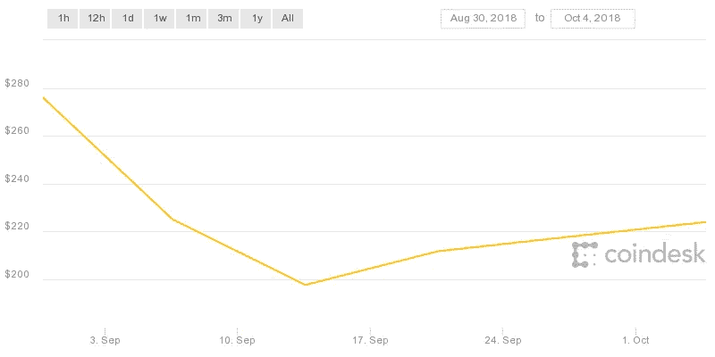
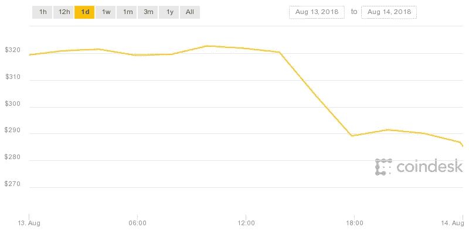
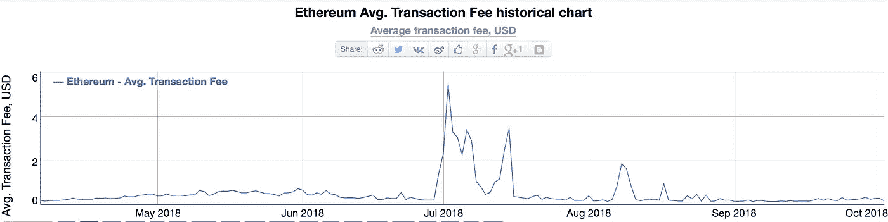
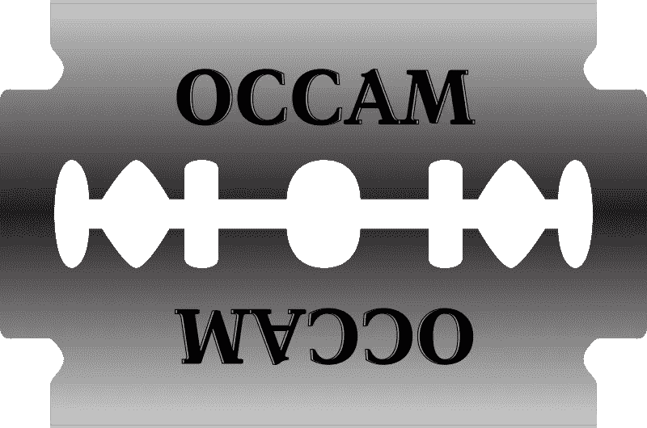

# 区块链智能合约:避免陷阱

> 原文：<https://medium.com/hackernoon/blockchain-smart-contracts-avoid-the-pitfalls-6acc4104d739>

## 设计智能合同时需要考虑的 9 个因素

Courtesy [https://commons.wikimedia.org](https://commons.wikimedia.org)

智能合约是基于区块链技术的分布式应用的主要焦点，也是预计会带来颠覆的关键领域。尽管潜力巨大，但仍有挑战需要克服。

许多业务影响是加密货币智能合同的性质所特有的，加密货币智能合同本质上是托管合同，其中智能合同本身充当持有支付的可信第三方。如果符合合同条款，则付款。如果不符合合同条款，付款将退还给买方。

对于任何给定的智能合约解决方案，都必须评估具有业务含义的九个业务特征。

1.  汇率波动导致的赫斯特风险
2.  金钱的时间价值
3.  交易速度
4.  交易成本
5.  应收账款和违约成本
6.  惩罚条款
7.  多方
8.  可信的合同作者
9.  糟糕的合同

# 1.汇率波动导致的赫斯特风险

[**赫斯特风险**](https://en.wikipedia.org/wiki/Settlement_risk) 或结算风险是在一份合约被锁定在某一特定货币的特定金额后，外汇汇率将发生变化的风险。显然这是一种双向风险，就好像汇率上升，买方将支付更多；而如果汇率走低，卖家得到的会更少。货币波动越大，距离结算的时间越长，风险就越大。

这对于目前的加密货币来说至关重要，因为与发达国家的普通货币相比，加密货币的波动性非常大，在任何给定的年份，普通货币之间的汇率通常以个位数的百分比变化。此外，大多数加密货币几乎没有可供评估的历史数据，也不会像法定货币那样对相同的地缘政治事件做出反应。

Courtesy [https://www.coindesk.com/ethereum-price/](https://www.coindesk.com/ethereum-price/)

从赫斯特风险的角度来看，加密货币的波动性和历史数据的缺乏肯定会带来挑战。更稳定的货币可以更容易地对冲赫斯特风险，但加密货币现在在任何一天都随处可见。作为两个主要例子，比特币和以太网在过去几年里大幅攀升，并在 2018 年下跌，智能合约对卖方比对买方更有利。但是短期智能合约——迄今为止大多数都是如此——在两个方向上都存在风险。以太坊的周价格波动范围超过 80 美元，大约 40%。

24 小时的波动并没有激发更多的信心，最近的例子显示，波动幅度接近 40 美元或 15%左右。除了在最短的时间内，这些货币都有很高的赫斯特风险。

当然，伴随任何风险而来的是对冲以适应风险。最简单的方法是缩短时间，直到沉降达到可接受的水平。但正如非常短的合约的波动性所显示的那样，风险仍然非常高。这在某种程度上通过降低托管费用而被最小化，因此毫无疑问，在目前存在高托管费用的商业模式中，会有买方和卖方选择接受风险。

我认为第二个树篱更有价值。可以建立一个智能合约来参考外部汇率，例如稳定的美元对波动的乙醚。这可以通过让外部程序将完成时的汇率输入智能合约中的变量来实现，或者通过让汇率恒定输入所有合约都可以访问的区块链来实现。合同可以是在合同完成时基于商定的外部汇率提供者的某个美元值。付款额等于商定的美元价格。在这种情况下，托管账户必须通过持有最大数量的加密货币来参与对冲。

例如，你有一个网站，想添加一个电子商务支付系统。你和一个开发者签约来实现它。他告诉你需要一个月的时间，花费 2000 美元。您同意并使用以太坊签订智能合同。你们共同同意可能的最大波动是 50%的下跌和 100%的上涨。使用 400 美元乙醚的汇率，你将需要 5 乙醚来支付。考虑到挥发性，你可能会看到需要 2.5 到 10 个醚。你把 10 个乙醚转移到智能合同的托管账户。您同意第三方服务，该服务将在一个月内验证您网站中电子商务服务的存在，并且能够更新智能合同中的变量。

一个月后，会有一些结果。

*   电子商务系统不在网站上。智能合约返回 10 个乙醚给你。
*   电子商务系统在网站中:
    —汇率为 200 美元。智能合同将所有以太网转移给开发人员。
    —汇率为 800 美元。智能合约将 2.5 个乙醚转让给开发商，7.5 个乙醚转让给你。
    ——汇率是 400 美元。智能合同将 5 个乙醚转移给你和开发商。
    —汇率为 1000 美元，超出了商定的波动范围，但仍在上升。智能合同给开发者 2 以太，给你 8 以太。

这些都是无趣的情景，因为风险对冲起到了预期的作用。最后一个场景更有趣。汇率是 100 美元。现在只有 1000 美元等值代管。这导致了最后几个选项。

*   在您知情的情况下，开发人员可以将许可证密钥放入电子商务软件，许可证管理中的代码可以设置为启用或禁用许可证密钥，这取决于相当于 2000 美元的托管费用。如果不是，那么智能合同可以设置为允许你提交更多的乙醚来匹配 2000 美元，否则电子商务软件将无法工作。你必须做出一个严肃的选择，因为你已经花了 4000 美元买了一个对你来说值 2000 美元的东西，现在你必须决定它是否还值 1000 美元。
*   为了方便起见，开发商也可以接受赫斯特风险。在这种情况下，合同支付。再一次，你损失了 4000 美元，假设你为了签约的目的把资金转移到以太网，但是开发者只得到 1000 美元。

显然，波动范围是你对冲的一个重要因素，很难预测。你希望区间更低，以限制最后一种情况的风险，即你实际上损失了一大笔钱。卖方希望它更高，以限制工作得不到报酬的机会。毕竟，只有在上述一种情况下，开发商才有拿不到钱的风险，但有两种情况下，你会损失 4000 美元或更多。

将结算外包给非加密货币是另一个可靠的商业策略。Hyperledger 根本不支持直接加密货币，尽管它已经内置了一种加密货币，并且实现了忠诚度令牌。Hyperledger 中的所有货币结算都应通过外部第三方支付系统进行，该系统可以是基于法定货币或加密货币。正在开发的 Eos [技术](https://hackernoon.com/tagged/technology)正在设计允许这两种选择。当然，虽然以太坊智能合约假设以以太或其他基于以太的货币进行托管结算，但在这种情况下也有可能将支付外部化。

最后，波动性的整个挑战催生了稳定货币，这种货币使用各种对冲和治理策略，与法定货币(通常是美元)保持平价或接近平价。

# 2.金钱的时间价值

Courtesy Wikipedia.

金钱的时间价值是智能合约的另一个关注点。第三方托管很好，但与 net 30 条款相比，它并没有在很多合同上使用。部分原因是费用高，智能合同大幅降低了费用。但是金钱的时间价值是另一个重要原因。每个大企业都有一个首席财务官，他的工作包括最大化手头现金的短期回报。他们经常每天将资金进出外汇和货币市场基金，以从中获利。

净 30 条款意味着在一个月的合同中，您只需在签订合同后 60 天内付款，30 天内交付服务，30 天内付款。许多 net 30 条款还包括以折扣形式鼓励更快付款，例如，如果在 10 天内收到付款，则购买价格可享受 2%的折扣。在几乎每一份为期几个月的长期合同中，卖家都会协商制定条款，规定他们可以每月开具发票，以增加资金的时间价值，而买家则试图协商更长的发票间隔时间，以最大限度地提高资金的时间价值。

但在智能合同中，你必须在签署合同时，提前 60 天把钱存入托管账户。正如 Herstatt 风险对冲评估所表明的，你可能不得不将比实际价值更多的价值放入托管中，在这个例子中是钱的两倍。

在上述假设的情况下，这意味着你在两个月内没有潜力让你的钱增值。这有利于卖方，而不是买方。这也是假设你手头有足够的现金，没有这笔钱在代管不会有任何其他风险。

对于短期交易，托管方法是可以接受的，但是对于长期服务交付，通过第三方机制将支付外部化为法定货币或稳定货币变得非常重要。

# 3.交易速度

交易速度慢意味着智能合约目前不适合许多电子商务应用。当你在 iTunes 上付款时，你会立即获得访问权限。比特币交易需要 10 分钟来处理，以太坊最多只能解决 15 秒的交易。两者都不能保证交易会发生在下一个区块，所以如果交易负载很高，比特币可能需要几个小时才能完成交易；直到最近，由于数量减少，积压才得到清理。智能合约通常会包含各种类型的多项交易。

消费者对长时间等待满足感不感兴趣。这种用例只是从一个钱包到另一个钱包的直接支付，由于交易速度的原因，这在许多情况下仍然是有问题的。目前的加密货币不支持当今大规模电子商务解决方案所需的交易量，而且可能永远不会支持。

基于加密货币的结算减少了一些问题，因为双方都相信支票已经寄出。现在出现了速度更快的结算系统，它们使用各种策略来加速大宗交易。将支付系统外包给更高速的信用卡交易也缓解了这种担忧。

# 4.交易成本

Courtesy [https://bitinfocharts.com/comparison/ethereum-transactionfees.html](https://bitinfocharts.com/comparison/ethereum-transactionfees.html)

加密货币的交易成本使其在小额交易中用处不大。花 3.00 美元买一杯咖啡，花 1.00 美元进行交易，这对于买方或卖方来说都是不可接受的，而且双方都没有兴趣付钱。商家从他们今天微薄的利润中支付 1.5%至 3%的信用卡交易费用，但这只是一杯咖啡的 4.5 美分至 9 美分。33%不会飞。

不考虑其他因素，加密货币目前不适合较小的零售交易。今天，使用亚马逊平台销售产品的卖家为 10 美元的交易支付约 60 美分，因此 1 美元是一个很大的增长。

对于智能合约，它们必须是相当可观的金额，而且必须清楚谁在支付它们。考虑到金钱的时间价值损失和赫斯特风险，如果我作为买方签订一份智能合同，我会与卖方协商支付所有交易成本，甚至条款。但很多模板化的智能合约不太可能给买家这种选择，因为它们将由卖家设定。再说一次，这样做的好处是给卖方的，而不是给买方的。

当然，并不是所有的加密货币交易都需要交易费。但是，可选的事务费使得事务更有可能被包含在下一个创建的块中。它们是商业模式的一部分，也是组织选择托管加密货币的块创建组件的部分原因。

# 5.多方

Courtesy [https://upload.wikimedia.org](https://upload.wikimedia.org)

智能合约的一个据称的优势是，在合约中包括第三方，如交付组织，实际上是增加了复杂性。任何涉及合同多方的事情都会增加其复杂性，任何问题的解决方案都是如此。奥卡姆剃刀的英文原文之一是*没有必要的实体不要相乘*。今天的三方安排通常涉及两个当事方之间的一份合同和另外两个当事方之间的另一份合同，而不是三方之间的一份合同。一个组织承担一方的成本和风险，如交付组织，并以明示或暗示的方式将其包括在价格中。

我谈判的每个服务合同都只包括一个服务组织和一个客户，这些合同通常价值数百万美元。这是最常见的模式，在大多数情况下，添加额外实体的价值主张并不明确。

[三方协议](https://www.investopedia.com/terms/t/tri-party-agreement.asp)在建筑行业相对常见，但在其他地方不太常见，这些三方协议是为了融资，而不是虚拟货币的托管协议。

构建超越最简单交易的业务关系需要与价值链中的多方达成协议。创建一个区块链解决方案，其中一方创建价值链，然后与其他人建立单独的合同，以适当地传播获得的价值，以激励参与是一种可能的方法。银行之间已经有相互拥有的实体来提供借记结算，因此扩展这些业务关系是有潜力的。

# 6.应收账款和违约成本

应收账款和违约成本是智能合同对卖方的一大优势，对买方没有直接优势。

Net 30 合同包括由卖方生成并发送给买方的发票。如果买方不付款，卖方就得向他们催债。如果他们继续不付款，卖方不得不将买方告上小额索赔或民事法庭，试图要求付款。

根据定义，托管合同保护的是卖方，而不是买方。所有买方的钱都是托管的，不是卖方的。卖方保证付款，买方没有能力违约，除非卖方不符合智能合同的条件。卖方没有必要通过任何结构合理的智能合同对买方提起任何民事诉讼。

将支付外包给具有更传统条款的第三方支付系统，无论是基于稳定货币还是法定货币，都无法获得这一优势，成本继续由销售组织承担。

# 7.惩罚条款

License: [CC0 Public Domain](http://creativecommons.org/publicdomain/zero/1.0/)

惩罚条款是买家开始看到优势的地方。如果买家在特定时间、特定地点需要某种商品或服务，或者其价值开始下跌，智能合同对他们来说非常有用。显而易见的类比是比萨饼店承诺的 30 分钟或免费的 T1。当然，如果迟到的话，比萨饼可以免费，但很可能太便宜而不值得承包费用。但是想象一下，一个供应链智能合同要求及时将产品交付到建筑或制造场所。

准时制商品的购买者对过迟和过早交货有明显的不利之处。他们不得不将早期交付的货物放入库存，然后再取出，这就产生了影响利润的成本。如果他们需要的货物晚了，他们不得不放慢或停止他们的建设或制造，这反过来影响他们的交货和现金流。

包含自动惩罚提前或延迟交货条款的精明合同将是有利的。不需要担心调整或谈判的处罚或陷入诉讼。罚金将在交货时自动产生。在某些商业模式中，仅这一因素就足以让买家花时间购买。既然这么多的好处都符合卖方的利益，他们也会顺从。

# 8.可信的合同作者

智能合同是大多数买家和实际卖家都无法理解的应用程序。你不是信任 Visa 和亚马逊，而是完全信任其他人，即合同的开发者。

不道德的人很容易利用智能合约，他们专门设置智能合约来利用其他不太老练的人。想象一个模板化的契约，它看起来有返回未交付的付款的配置，但实际上不管发生什么都支付给一方。除非你看了代码并能理解它，否则你永远看不到它。

并且通常是卖方建立模板化的智能合同。毕竟，他们正试图出售商品，为买家铺平道路。

对于较大的合同，目前双方都有经验丰富的谈判者和律师，以确保条款和条件尽可能有利。例如，与一家大型咨询公司签订的合同，在净 90 天期限内，不会得到咨询公司管理层或律师的批准。

除了律师，智能合同最初还需要程序员的参与。最终，可信的、复杂的、可配置的智能合约系统将会出现，它允许选择条款和条件、承认第三方等，但这还为时尚早。目前，任何人这样做的额外成本包括支付给开发人员，即使解决方案只是一个分布式应用程序，为传统合同的执行提供管理救济。

# 9.糟糕的合同

当商业合同被证明是坏的，有补救措施。有小额索赔法庭，有买卖双方的诚信，有实物价值协议等等。有很多方法可以让聚会变得足够完整，而且通常钱不会凭空消失。如果在交付价值之前，一方在资金托管期间死亡，有案例法和通常的样板条款和条件涵盖这种情况。

但有了智能合约，这笔钱有可能进入托管，永远不会出来。智能合同的要点是在签订协议的双方之间保持资金安全。但是，如果由于编程错误或者只是参与协议的人不够老练，合同的条件没有得到满足，该怎么办呢？在这种情况下，这笔钱可以进入代管，并永远留在那里。想象一下，一个智能合约正在为触发条件寻找错误的变量，因此它永远不会出现。想象一下，一个外部程序无法将任何东西完全投入到一个可交付成果中。除了开发人员测试程序之外，智能合约中没有任何固有的东西可以阻止这些情况，我们都知道软件的历史充满了缺陷。

无论解决方案是许可的私有区块链还是无许可的公共解决方案，在建立智能契约时，自动化测试工具都变得至关重要。我预见到使用蒙特卡罗方法来探索可能导致锁的边缘条件，从而导致托管锁和其他条件。此外，讨论的一个主要主题是，在多种新兴模型的区块链解决方案中，人类治理代理在多大程度上是必需的，以便在不利条件下允许覆盖或回退。

用区块链设计业务解决方案要求对业务架构的关注不亚于甚至超过对技术架构的关注。这九个因素将帮助您确定基于区块链的智能合约将适合您的业务需求，以及如何管理您的选择。在许多情况下，直接加密货币智能合约的优势非常明显，但对于大多数这些问题，存在现有和新兴的解决方案。