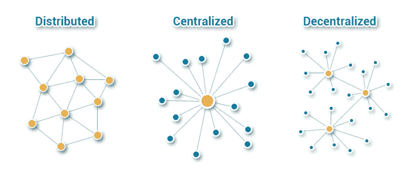
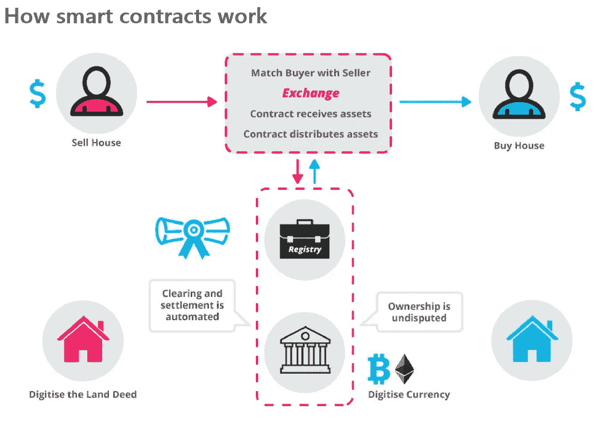

# 区块链解决方案:转变业务流程的方式

> 原文：<https://medium.com/hackernoon/blockchain-solutions-the-way-to-transform-your-business-processes-10fa12f9edb5>

当你听到区块链这个词时，你会想到什么？比特币？以太坊？自动将区块链技术与加密货币相关联是有效的，但是，这种惊人的分散技术的应用没有边界。

许多年前，互联网席卷了所有人。起初，媒体和其他企业对上网的概念不屑一顾，称之为无关紧要，然而，故事已经发生了变化。互联网促进了数以百万计的企业，还有更多的未来。

同样，区块链技术将引发一场重大的范式转变。据预测，这种操作系统是仅次于互联网的最好的东西，许多大亨都把他们的价值押在这项技术的成功上。我们来看看为什么。

# 什么是区块链技术？

这是一个高度讨论的主题，但对许多人来说，它仍然是一个不可言喻的概念。区块链是一个具有复制数据库网络的分类账，这些数据库相应地在线更新，并且对网络中的用户可见。为此，区块链网络可以是私有的，也可以是公共的。

私有区块链网络的工作方式类似于成员受限的内部网，而公共网络则是所有人都可以访问的。无论您使用何种网络，安全性都是有保证的。这是因为消除了易受攻击的中介。

由于信息不是集中存储的，从一个来源破坏或窃取重要数据是不可能的。在黑客能够对一个街区进行任何形式的攻击之前，这样的罪犯需要同时攻击网络中的每一个账本(数百万条信息),而这是根本不可能的。

# 区块链技术的核心特征

## 分散制

通俗地说，这意味着区块链不只是坐在一台电脑上。存在分布式节点，其特征是分散的特征。这些分布式节点会随着交易的完成而不断更新，为您提供安全性和匿名性。

## 数据认证

数据可以以多种格式存储在区块链中，其优势在于全面采用了相同的安全措施。在访问数据之前，该技术确保对每个用户进行彻底审查，以防止欺诈。实现这一点的方法之一是创建公钥-私钥对来验证所提供的签名。

# 区块链如何帮助您的业务

## 众筹

对于新兴的企业来说，筹集资金的问题是普遍存在的。许多企业经理不得不解决从适当渠道筹集资金的问题。及时完成这项工作也是一项艰巨的任务，然而，区块链技术的出现是应对这些挑战的灵丹妙药。

通过采用分散的融资系统，消除了与风险投资家的长时间会议、反复讨论金融机构的复杂性以及其他导致延迟的因素。

有了这项技术，您的业务将加速增长，您也可以获得所需的资金，从而加快解决方案的执行速度。隐私和确保安全交易的严格遵守有助于使该过程尽可能无缝。

## 智能合同

自动执行合同已经存在了一段时间，区块链技术的出现扩展了它的应用。这些自动执行程序确保避免了传统商业交易的固有问题。

采用区块链技术可确保系统不会停机，这也是一种检查欺诈和任何其他数据损坏方式的措施。您的合同被安全地存储，并根据未来发生的情况交付给接收方。

另一个优势是，使用区块链技术，您可以确保降低交易成本，因为您成功地绕过了传统金融交易固有的深奥和冗长的程序。

## 供应链管理

消费的每一种商品都是几种力量的产物，有生命的和无生命的，这个过程涉及到多方采购和提供所需的服务。这方面的问题是，通常的人为参与往往会使过程变得缓慢，甚至难以处理。

区块链技术可以帮助您的企业采取主动的方法，而不是被动的方法。你可以很容易地提供不可改变且不易伪造的数字记录。减少人为干扰意味着发生错误或贿赂的可能性也会降低。

## 分散式云存储

企业和个人每年在存储上花费数十亿美元。这种系统的一个主要缺点是你的数据存储在一个集中的中心，服务器很容易受到攻击。如果发生这种情况，您可能会将有价值的信息丢失给黑客，他们会利用这些数据来欺骗您或您的客户。

此外，集中存储的高成本也令人沮丧。当您利用区块链技术时，通过利用其他用户的额外空间，您可以存储超过您所能管理的 30000%的容量。

由于存储的数据是加密的，所以只有拥有密钥的人才能访问。区块链解决方案不仅更便宜，而且更安全。

这里是一张对比几个基于区块链的对等云存储和内容交付平台的信息图:

## 安全的即时支付

你的企业是全球知名的吗？你每天进行国际交易吗？然后你就熟悉了收发资金的压力。有时，交易需要几天才能生效，这对许多企业来说是一个障碍。

区块链技术的一个突出应用是加密货币，这意味着有各种平台可以立即进行安全支付。客户和员工现在可以实时收到他们的付款，这增强了你的品牌信誉。

## 智能设备连接

某些公司已经开始合作实现连接设备、小工具等的想法。通过区块链，安全共享数据和信息。在这里，区块链技术支撑着系统，充当着许多设备的公共账本。

有了这种区块链技术，就可以创建一个自主网络来处理设备到设备的通信、设备管理、更新、自主决策等。这些设备还可以安排日常维护，而不会导致用户停机。

从设备转移，这项技术也有节约成本的好处。由于互连，整个办公室得到了良好的微观管理，节省了可观的时间和成本。

应用程序是无止境的。就像互联网扰乱了所有可用领域一样，区块链科技也准备做同样的事情。许多公司正在利用这一点，并记录惊人的收益，为什么不考虑一下呢？

[*纳塔利娅·库库什金娜*撰写](https://www.linkedin.com/in/natalia-kukushkina-b62397132/)