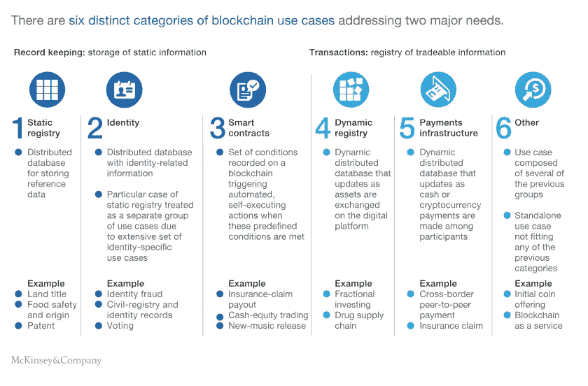
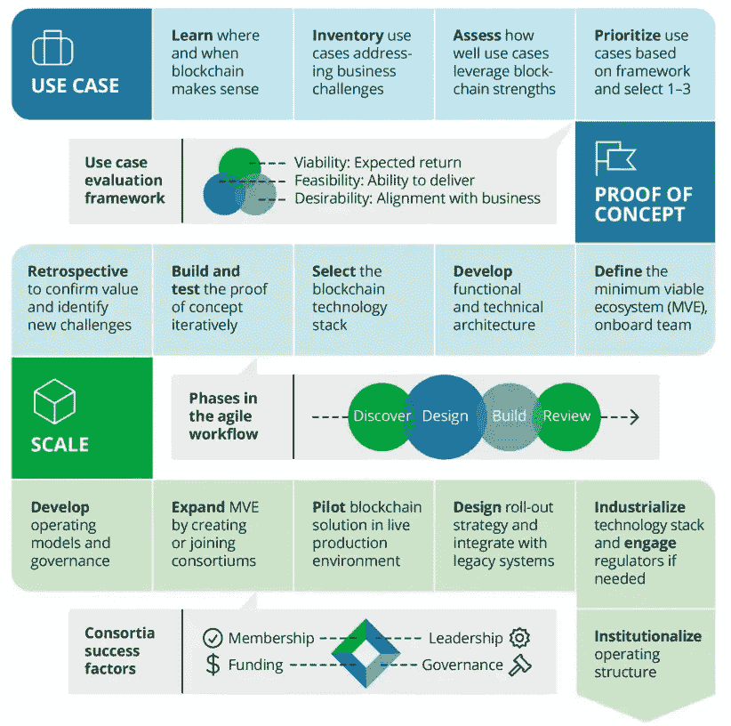

# 商业区块链战略:企业成长路线图

> 原文：<https://medium.com/hackernoon/blockchain-strategy-for-business-roadmap-for-enterprise-growth-1348fb4c0f7a>

要了解创建区块链解决方案所涉及的价值、策略、可行性、回报和影响，需要对如何使用该技术及其对内部和公众的潜在影响有惊人的洞察力和专业知识。

区块链技术本身仍然相对较新，市场仍处于起步阶段。现在还没有一个明确的成功秘诀，但与其他创新技术不同，区块链是一个早期介入有意义的领域。如果不了解什么样的策略能让你的区块链产品变得可行，它就不太可能成功。

这篇文章将非常深入地探讨区块链的战略，这里有一个简要的布局，你可以在这里找到。提前感谢[区块链驱动](https://www.blockchaindriven.com/consulting)和[麦肯锡](https://www.mckinsey.com/business-functions/digital-mckinsey/our-insights/blockchain-beyond-the-hype-what-is-the-strategic-business-value)的研究人员在此提供的大量内幕信息。

*   区块链技术的价值
*   短期投资回报以规模增长为目标
*   为长期可扩展性定制您的计划

**区块链技术有什么价值？**

很多人把区块链称为第二代互联网是有道理的。互联网一直是一个信息的地方，一个伟大的地方来发布，连接人和想法，但与区块链你得到互联网的价值。

谈到资产，经济中真正重要的东西——金钱、股票、债券、知识产权、选票、艺术、音乐、忠诚度积分、身份等等——发送副本是一个糟糕的主意。如果我给你寄 100 美元，很重要的是我还没有钱。长期以来，这被密码学家称为双重花费问题。

这由大机构管理:银行、政府、信用卡公司和社交媒体公司。它们执行每种商业的所有业务和交易逻辑。他们清算和结算交易。他们识别政党，并保留记录。

但总的来说，这些中介机构的问题越来越多；2008 年就是明证。区块链是一个全球分布式账本或数据库，从金钱到音乐到投票，任何有价值的东西都可以在没有中介的情况下以私人和安全的方式进行管理、交易和交换。

通过使用适当的区块链架构，现有机构和多方交易可以从降低交易复杂性和成本以及提高透明度和欺诈控制中获益。捕捉价值机会的经济激励正驱使现任者驾驭区块链，而不是被它超越。

**区块链的短期价值**

显然，在进入区块链时，你需要创建一个可扩展的项目，但如果没有短期投资回报，该项目可能不会成功足够长的时间来实现预期的增长。那么，你如何规划短期回报，同时仍然成长为一个能够颠覆整个行业的项目呢？

> “对区块链解决方案进行无组织的实验，而没有对所涉价值或获取价值的可行性进行战略评估，这意味着许多公司看不到投资回报。”—麦肯锡

“在采用区块链的早期阶段，这是我们经常看到的错误。公司和创业公司设计了一个创造性的用例，但没有关于结果的战略或技术知识，因此他们看不到回报。从短期来看，区块链带来的大部分好处是降低成本，这样就更容易扩大项目规模。”— [区块链驱动](https://www.blockchaindriven.com/news/blockchaindriven-experts-on-feasibility-of-blockchain-use-cases)

例如，在供应链中，成本的降低非常明显，因为区块链可以消除差异、产品损失，并加快运输时间。区块链为产品在供应链中的旅程提供了防篡改记录，但在当前的系统中，产品在供应链中走得越远，数据就越不可靠。这方面的用例显然具有短期盈利能力，并且可以扩大规模，在未来变得更具变革性。

该技术可以通过多种方式进行配置，以满足特定用例的目标和商业需求，而不是只有一种形式的区块链。

拥有一个熟练的区块链解决方案架构师，他深入了解区块链技术，以最符合您的用例的方式集成技术，这是增加可行性的关键。

对于公司来说，降低成本是实现早期投资回报的最成功的短期目标之一。这在金融、政府和医疗保健行业不太容易实现，但对于制造、供应链、物流、航运、农业、零售、房地产等行业，直接的好处是巨大的，高管应该尽早与不仅了解区块链架构，而且了解技术可扩展性的有能力的顾问制定战略。

> “你需要开始培养一些精英人才。它不一定需要在您的组织内部。可以和别人合伙。”— [麦肯锡](https://www.mckinsey.com/industries/high-tech/our-insights/what-next-for-blockchain)

**扩展区块链解决方案，颠覆行业**

长期和短期解决方案和应用程序都需要纳入初始战略。区块链的开发极其困难且昂贵，知道如何实现短期和长期盈利将决定你公司项目的成败。

这方面的一个例子是一家制药公司使用区块链进行物流存储和分发，比如医疗用品、药物、血液或器官。在短期内，该公司将利用减少产品损失，运输时间，提高成功率，并通过代理赚钱。为了在未来扩大规模，患者可能会将数据商业化，用于药物研究，扩大有限的临床试验样本规模，并极大地改善产品和时间。

在这个例子中，如果这家公司这么早就开始，短期解决方案不会改变行业，而长期的规模战略将允许他们在未来建立行业主导地位。从小规模开始的理由很简单，扩大到这种潜力需要时间，区块链开发是昂贵的，如前所述。结合这样的策略可以最大化你的项目存活下来的机会，以达到巨大的最终结果。

> “随着时间的推移，区块链的价值将从推动成本降低转向实现全新的商业模式和收入流。”— [区块链驱动](https://www.blockchaindriven.com/innovations)

一家公司对区块链的最佳战略方法将从根本上由以下两个市场因素决定，这两个因素是他们最不能影响的:

*   市场支配地位——参与者影响用例关键方的能力
*   标准化和法规障碍——法规批准或标准协调的要求

区块链的价值来源于其网络效应和互操作性，各方需要达成一个共同的标准来实现这一价值。随着技术的发展，市场标准将会出现，对非主导标准的投资将会浪费。

最终，公司将希望确定区块链可以从用例中消除的摩擦点。这个构思阶段是一个关键点，公司希望获得尽可能多的洞察力。

一旦你建立了你的区块链关系网，以后要做出改变将是难以置信的困难和难以置信的。公司还应该评估他们的用例是否会产生回报。如果没有，就不需要构建这个特定的用例。

与区块链工程师携手工作的顾问，或者更好的，那些既有战略能力又有发展能力的顾问，是最能产生这种洞察力的人。