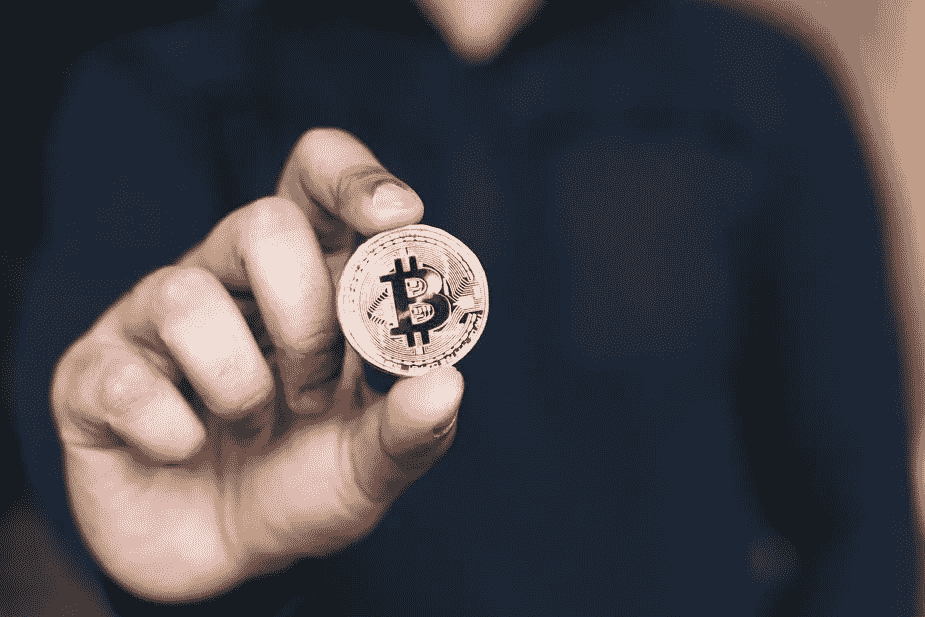

# 如何投资区块链风险最小

> 原文：<https://medium.com/hackernoon/blockchain-technology-2-ways-to-get-involved-with-minimal-risk-4c1c4c355793>

根据对来自世界各地的 4800 名专业人士的研究，66%的人认为创新将是未来 30 年影响经济增长的最大因素。

为了在这个不断发展的经济中茁壮成长(或者说生存),年轻专业人士需要理解科技发展背后的驱动力，预测它们将催生的新行业，并预测它们将在多大程度上改变我们今天习以为常的工作。

最有希望的发展之一是区块链技术的出现，以及为其服务而创建的市场。

## **什么是区块链？**

区块链技术利用分布式分类账来永久记录交易，并允许所述交易发生，并且是不可逆的。随着智能合约的出现，区块链技术获得了一系列全新的应用和用例，超越了简单的验证交易。

虽然大多数主流媒体都将比特币和加密货币作为投资市场，但这只是区块链的冰山一角。那些长期关注这项技术发展的人现在将目光投向了令人兴奋的新发展，而不仅仅是买卖加密货币。

**已经完全不为大众所知的用例。**

目前市场上有超过 1500 种加密货币，尽管比特币为王，但每天都有新的加密货币出现。Dealbox 的创始人托马斯·卡特迄今已通过 ICOs 筹集了超过 35 亿美元。Dealbox 是一个区块链加速器和众筹平台，存在于一个独特的令牌化生态系统中。

这是一个几年前还不存在的市场——现在我们有了单个公司，它们带来的收入超过了一些国家的 GDP。

考虑到这一点，我们可以开始假设，通过建设这些区块链项目有效运作所需的基础设施，将会产生机会。

> 现在，许多引起媒体关注的项目并不一定是开创性的，它们是先行者。

随着时间的推移，我们将开始看到越来越多的大公司进入这个领域，开始提供新的需求。随着更大的参与者进入市场，让没有合法干扰的区块链应用程序获得关注将变得越来越困难——或者至少解决一个影响比目前服务的更大的人口统计数据的问题。

接下来的问题是，这些大公司会通过创建自己的区块链项目直接参与进来吗？或者他们会创造辅助服务，让他们从我们看到的加密货币热潮中获利，而不会让他们面临发行新硬币带来的风险。

我们已经看到了这一点，像[三星这样的玩家参与进来，并表示他们将制造自己的 ASIC 加密货币矿工](https://techcrunch.com/2018/01/31/samsung-confirms-asic-chips/)。三星押注于区块链技术，但他们这样做是为了满足该领域内的 B2B 需求。

随着加密货币市场的增长，聪明的资金和经验丰富的投资者应该开始关注市场本身，而不是由于其增长而出现的次要市场。

# **1。区块链服务**

如果你不想承担与典型投资者相同的风险，但知道你想赶上区块链潮流(以下简称“区块链”)，考虑创办一家公司:

a)为区块链项目提供服务。

**或**

b)提供服务，使新投资者更容易参与。

## **B2C**

当萨姆·卡拉吉奥吉斯创立 [Auscoin](https://www.auscoin.io/) 时，它在 24 小时内筹集了 150 万美元。

Auscoin 不是一个颠覆性的新技术应用，而是一个解决特定需求的项目。如果不是区块链在过去几个月里人气飙升，这种需求是不存在的。Sam 发现了一个机会，可以通过为澳大利亚人创建一种简单无缝的方式来获取加密货币，从而让自己走在希望利用这个市场的新投资者浪潮的前面。

他主动寻找市场的缺口并填补了它。

[预计到 2020 年，纹身行业的价值将达到 11 亿美元。](https://www.marketplace.org/2016/03/31/business/tattoo-flash-days-show-industrys-growing-popularity)与此同时，纹身去除行业预计到 2018 年将达到[8220 万美元](https://www.marketwatch.com/story/tattoo-removal-surges-440-over-the-last-decade-2014-07-15)，以满足纹身行业繁荣所创造的日益增长的需求。

聪明的钱不是押注于加密货币，而是押注于区块链技术。

做一个聪明的投资者不是对你听到的新闻做出反应。这是关于根据公众今天对**的热议为明天**主动创造机会。

## **B2B**

我发现特别有前景的区块链服务是 ICO 加速器和孵化器。尽管，老实说，我对这个聚会来说有点晚了——一些企业家已经为 ICO 和代币销售提供服务将近一年了。

比如 Brad Yasar， [KrowdMentor](https://www.linkedin.com/company/17877195/) 的创始人兼管理合伙人。Brad 创办 KrowdMentor 是为了“帮助创始人设计、启动和扩大他们在区块链的初创企业，并帮助投资者为他们的投资组合找到合适的 ICO/ITO 投资”。

在市场的另一边，我们有像沙迪·帕特森这样的人。作为 8760 的增长主管，他帮助 ico 通过增长黑客和数字营销获得曝光率。

区块链解决方案不必只服务于区块链的其他项目，用例可以扩展到加密货币生态系统之外。

B2B 区块链解决方案的另一个例子是 aXpire。他们建立了第一个基于区块链的支出管理系统。这使得对冲基金等机构能够比以往更有效地管理资金的进出。

无论你是否认为比特币和其他加密货币是一个“泡沫”，对 B2B 和 B2C 区块链服务的需求都在飙升——而且似乎不会很快放缓。

# **2。主节点**

主节点是网络中的特殊节点，为区块链项目执行特殊操作，作为对网络强度做出贡献的交换，产生剩余收入。

要理解什么是 masternode，你必须首先理解加密货币是如何增加其流通供应量的。

> **工作证明(PoW)** 允许通过让用户借出他们的计算能力来验证交易，从而“挖掘”货币来增加硬币的供应量。在印度，开采货币的人实质上扮演着区块链会计师的角色，并从他们的工作中获得报酬。他们得到的硬币是新铸造的硬币，增加了流通供应量。
> 
> **赌注证明(PoS)** 通过让用户赚取他们“下注”的硬币的利息，可以增加硬币的供应量。赌注过程可能因项目而异，但对于大多数 PoS 硬币，用户只需购买硬币并将其放入官方钱包中即可开始赌注。然后，PoS 以你放在钱包里的资本的利息的形式产生新的硬币(增加供给)。许多因素会影响你获得多少利息，比如网络的整体权重和你钱包的个人权重(价值)。

许多人认为 PoS 是区块链技术的下一个合理发展。像 Augustas Staras 这样的创始人， [Aigang](https://aigang.network/) 的联合创始人，已经在他们的项目中实施了 PoS，以保持领先地位。

[Dash](https://coinmarketcap.com/currencies/dash/) 是普及 masternodes 的第一枚硬币，但自其诞生以来，这一概念很快流行起来。

在任何给定的 PoS 框架中，至少有两种类型的节点:常规节点和主节点。

常规节点通常是“挖掘”新硬币的官方钱包，通过允许用户产生兴趣来增加供应量。

**master node**本质上是超级钱包，用于处理区块链的特殊交易，增加某些交易的隐私，甚至参与投票和治理。一个主节点可以为其母公司区块链执行多种不同的功能，如果想拥有自己的主节点，进入门槛相对较低。

把区块链项目想象成一个国家，它的主节点是州。如果我认为一个国家会比其他国家发展得更好，我可能会想在那个国家投资，甚至可能会买下一个州。买下这个州让我从这个国家的整体经济中受益，同时也参与组建了管理这个国家的立法机构。

要拥有一个 masternode，你必须投入一定数量的硬币作为抵押品，通常情况下，抵押品会被“锁定”一段时间。由于您已经承诺了抵押品并同意在一段时间内不出售抵押品，您的主节点将比传统节点产生更多的收入。

随着 PoS 越来越成为一种规范，精明的投资者对 masternodes 越来越感兴趣。

真正的诀窍是确定购买 masternodes 的最有利可图的硬币。