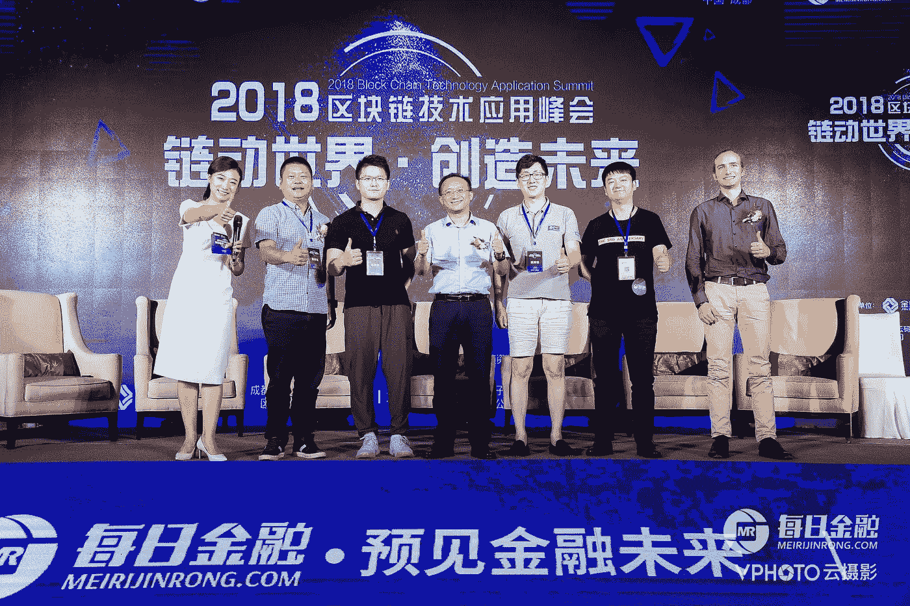
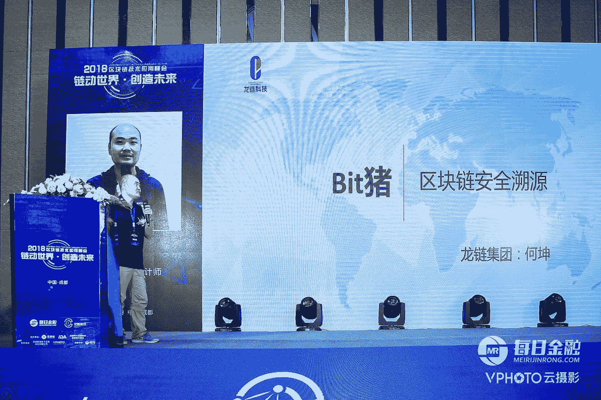
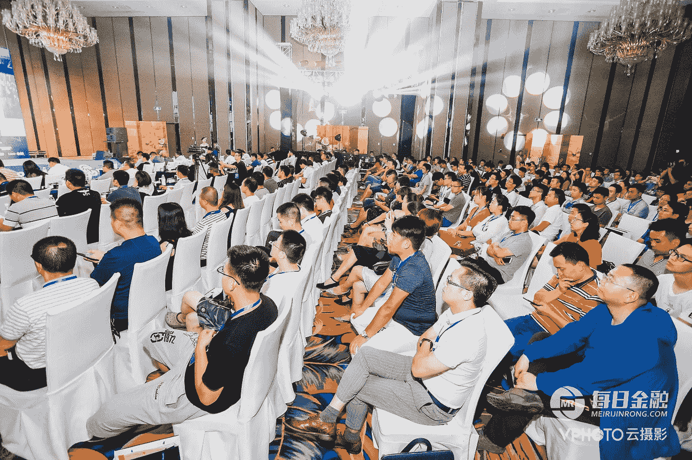
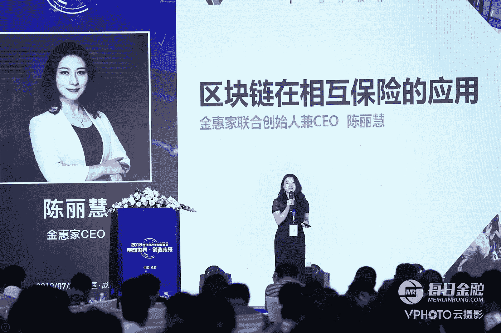
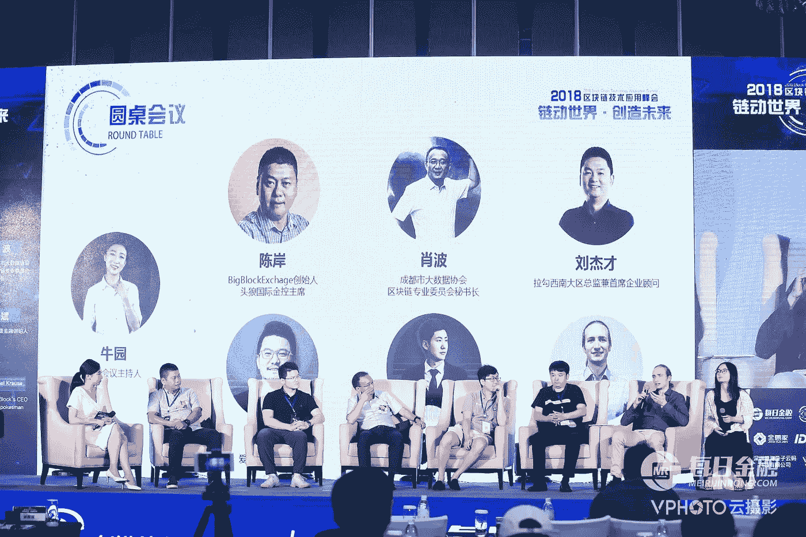
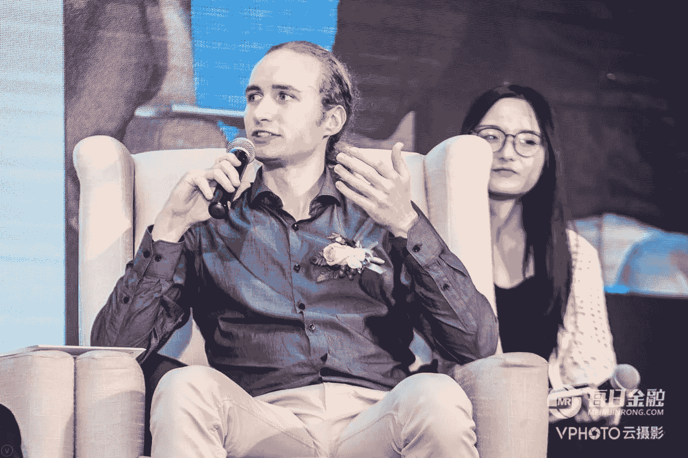

# 区块链技术应用峰会 2018——改变世界创造未来

> 原文：<https://medium.com/hackernoon/blockchain-technology-application-summit-2018-changing-the-world-to-create-the-future-52da9935f0ae>

## **中国硅谷最近举行了其主要的年度技术会议，今年的焦点是区块链。**

Some of the key speakers including LoveBlock CEO Raffael Krause

这是一场盛大的活动，赞助商包括新浪(中国的 Twitter)和财经网站每日金融(Meirijinrong)，后者与华为和百度等公司有合作关系。

因此，来自中国各地和其他地方的项目飞到成都，参加一个充满讨论和交流的周末，讨论和交流涉及[区块链](https://hackernoon.com/tagged/blockchain)的所有事情。

展出的项目种类繁多，从革命性的前卫思想家到彻头彻尾的古怪和怪异。

**bit pig——基于……猪的区块链项目？**

Bit 猪 (zhū) or known as BitPig in English was the standout candidate for strangest Blockchain offering. Claiming to revolutionize the Pig farming industry and generate 6 Billion RMB profit in just 2 years’ time, without any product live as of today. This is a hugely ambitious number even for any of today’s tech giants - if you convert this to USD the equivalent figure is well over $850 million, so to achieve that feat in only 2 years would be unheard of!

Talk by the BitPig CEO

比特猪是基于追踪猪肉从餐桌回到它的确切来源。这将包括能够找出一块肉来自哪头猪，那头猪被喂了什么，它来自哪个农场等等。

这一切听起来很有希望，但是谁会真正为此买单呢？！因为我知道大多数消费者不会按每块肉付费来看猪饲料的质量是否达到他们喜欢的标准——而且肯定没有足够多的潮人在两年内仅仅在猪的标识符上投资超过 8.5 亿美元…

然后是为什么使用区块链的问题？当然，一旦上传到比特猪区块链，这些信息会更加安全，但是这些信息仍然取决于上传它的人。农民或经销商仍然可以很容易地上传这些信息，如果他们愿意，可以说猪没有被喂抗生素。总的来说，该项目没有有效利用区块链，尤其是在他们引用的非常高的盈利数字的情况下，这似乎是不寻常的。

**从古怪走向精彩——展出了一些伟大的项目，以及一些关于区块链未来可能性的真正前瞻性的讨论，这些讨论实际上是有意义的！**

The engaged crowd at the Global Center — The world’s largest building by floor area

来自中国政府科技 863 项目的李泰福教授出席了此次活动，该项目旨在研究如何利用创新技术在中国创造财富。也有来自欧洲大陆的受人尊敬的大学教授参加。

李泰福发表了一场演讲，阐述了区块链是如何成为下一个真正的数字产业的。李泰福教授坚信，区块链系统将提高效率，改变现有的社会关系，并形成新的商业方式。

**金汇佳——互保区块链项目**

金汇佳首席执行官陈在活动中发言，并详细介绍了该公司正在开展的相互保险项目。他们的目标是改变相互保险的格局，在这种格局下，投保人已经是公司的所有者。

通过使用区块链技术，金汇佳将能够省去中间环节，提高保险文件的安全性。希望通过将区块链系统与保险相结合，在发生索赔时，可以准确而轻松地分配资金。通过无限期地获得区块链上的投保人信息，还可以更容易地核实例如某人已经多久没有索赔，以及他们的适当折扣应该是多少。

Talk by Jin Huija CEO Lihui Chen

这些都将与他们现有的社区平台相结合，为他们的用户服务，并利用他们已经可以访问的大量数据。据陈称，这将允许他们根据保险类型(即房屋保险或车辆保险)将相互保险项目分成多个部分。

从而允许他们针对消费者的需求向消费者提供个性化服务。

金汇佳公司已经有了一个坚实的后盾，拥有 100 万保险用户和 1000 万社区用户，因此他们已经对他们正在进入的市场有了很好的了解。

陈表示，平台本身将是开放和分散的，多家保险公司将在其运营。这是非常有希望的，显示了区块链未来的一些真正潜力。

**love block——去中心化交友的区块链项目**

Discussion panel led by LoveBlock CEO Raffael Krause

LoveBlock 首席执行官 Raffael Krause 也参加了会议，他从新加坡赶来讨论区块链的未来潜力和他公司令人兴奋的产品。克劳斯详细介绍了 LoveBlock 的提案，他们正在创建一个分散的约会数据库，这将根除许多与当今在线约会相关的问题。

他陈述了 LoveBlock 将如何通过由多个约会 DApps 组成的跨平台区块链网络来根除欺诈行为等问题。在这里，个人用户行为可以安全地链接回同一个人，以便消除负面行为。例如，如果检测到一个“爱情骗子”，克劳斯表示，这个人可以在 LoveBlock 上的所有约会平台上被淘汰，以防止他们造成更多伤害。他提到了如何通过使用他们新成立的[加密货币](https://hackernoon.com/tagged/cryptocurrency) DDD 来激励应用程序这样做，从而改善整个行业的用户体验。

LoveBlock 首席执行官还指出，用户本身将因积极的行为而受到激励，例如帮助其他人找到合适的匹配或标记潜在的欺诈者，以获得 LoveBlock 令牌。他希望这将创造一个更持久、更有意义的平台，让用户可以用来寻找真正的匹配，而不是像今天这样主要对短期关系感兴趣的应用程序。

LoveBlock CEO Raffael Krause speaking to the panel

克劳斯还提到，由于所有这些都将在区块链上进行，用户数据将更加安全。这将带来一个更加安全的环境，用户可以确信困扰阿什利麦迪逊(Ashley Madison)等交友平台的黑客攻击将成为过去。

为什么 LoveBlock 可能比其竞争对手有更好的区块链前景，另一个有趣的点是他们与奢侈品约会平台 Luxy 的关系。克劳斯指出，Luxy 拥有超过 200 万的用户群，并且已经是第一个使用 LoveBlock 令牌的约会平台。

这对他们的未来是一个好兆头，显示了 LoveBlock 正在构建的平台的一些真正的未来潜力。