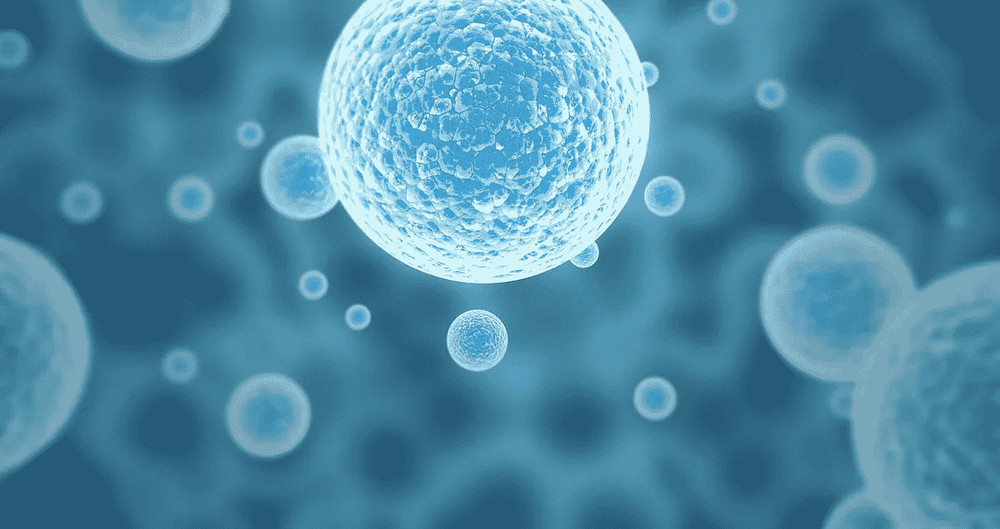

# 区块链技术如何加速干细胞研究

> 原文：<https://medium.com/hackernoon/blockchain-technology-can-accelerate-stem-cell-research-5bb738f6f6eb>

干细胞是体内发现的一种独特类型的多细胞。它们是未分化的，能够发育成不同类型的细胞。这意味着它们具有再生、修复和补充体内其他细胞的潜力。干细胞研究的重点是利用干细胞治疗疾病和损伤。虽然干细胞技术仍处于起步阶段，但它在改善许多人的生活质量方面有着巨大的潜力。

干细胞研究的突破已经跨越了所有领域。最成功和最成熟的干细胞疗法是在 40 多年前首次进行的骨髓移植。自那时以来，取得了进一步的发展。现在世界各地有许多可用或正在开发的干细胞疗法，如免疫系统疗法、CHO 细胞和杂交瘤、神经干细胞疗法、乳腺上皮细胞疗法、前列腺上皮细胞疗法、肺干细胞研究、肠干细胞研究等。

## 早期癌症研究面临着同样的挑战

尽管我们对干细胞及其在人类福祉中的应用的认识已经取得了长足的进步，但仍存在两个问题:1)迫切需要在影响全球数百万人的各种医学状况中进行进一步的研究和开发。2)将需要干细胞治疗的患者与最了解他们需求的医生联系起来也是一个问题。

干细胞研究的困难类似于几十年前困扰癌症研究的困难。没有足够的基础设施来分享关于研究的信息，以确保患者总能获得针对其情况的最佳治疗。全球干细胞研究同样缺乏最大化集体知识的基础设施。

## 区块链解决方案

区块链技术最重要的应用之一是让集体知识变得容易获取。这一特性使其非常适合用于医疗和健康研究领域。干细胞创新(SCI)正在努力创建一个独特的平台，将干细胞知识和区块链技术结合在一起。SCI 自 2013 年以来一直是一个由研究人员、专家医疗专业人员、投资者和工程师组成的网络，希望在全球范围内扩大干细胞研究和治疗知识的获取途径。现在，它正利用区块链的技术来推进这一目标。

SCI 的计划有三个重要方面。首先，它将利用区块链为干细胞行业的参与者创建一个合作网络，以促进研究和开发在世界各地的传播。该系统将能够根据临床结果和最新研究，不断维护和完善这些集体知识。从这个意义上说，SCI 希望通过干细胞治疗实现癌症研究中已经取得的成就。

然而，SCI 也计划超越这一点。其区块链网络的第二个重要方面是，它还将起到患者健康信息存储分类账的作用。数据将存储在 SCI 区块链上，用户可以控制医生和医疗机构可以访问哪些信息。这意味着患者可以连接到世界各地的医生，并与他们分享他们健康信息的相关方面。这项服务将使世界上的每个人都从最新的干细胞研究中受益。

SCI 项目的第三个重要方面是脐带血银行。最好的干细胞存在于“脐带血”中。这是出生后立即在脐带中发现的血液。脐带血库(也称为干细胞库)是收集脐带血并低温冷冻其干细胞的过程。能够收集和储存血液以备将来使用是医学发展的趋势。

干细胞库允许父母通过确保他们在需要时可以获得他们的纯干细胞来保护他们的孩子免受未来可能的医疗问题。然而，目前干细胞库选择的复杂性和成本给几乎所有想要利用这种医疗技术的父母带来了许多障碍。SCI 计划通过应用生态系统提供干细胞库。使用其应用程序，父母将能够通过一个安全的平台注册干细胞存储，订购收集工具包，并安排快递取件。

SCI 计划在双区块链平台上运行。第一个将建立在 ERC20 平台支持的以太坊基础上。第二个区块链将由 SCI 工程师定制，专门用于存储和处理患者干细胞记录。这个定制的区块链将被称为 SCIChain，并将使用 Hyperledger 结构网络。它将被设计成使用智能合同来保护用户数据，并确保只有获得授权的个人才能访问这些数据。

## 结论

干细胞治疗的潜力是巨大的，但就像癌症研究人员的早期一样，科学正因缺乏足够的知识共享而受到阻碍。SCI 计划提供技术基础设施来改变这种状况。然而，更重要的是，它将利用区块链数据存储的安全性和透明度，允许患者与医生联系并共享与其病情相关的知识，但他们也可以控制何时共享以及共享多少个人健康信息。在我看来，脐带血银行服务只是这些更基本服务的一个补充。

*订阅我的* [*中*](/@minadown) *和* [*推特*](https://twitter.com/minad21) *频道如果你想了解区块链和加密货币项目。

如果您对本文有任何疑问，请在下面的版块发表评论。谢谢大家！*