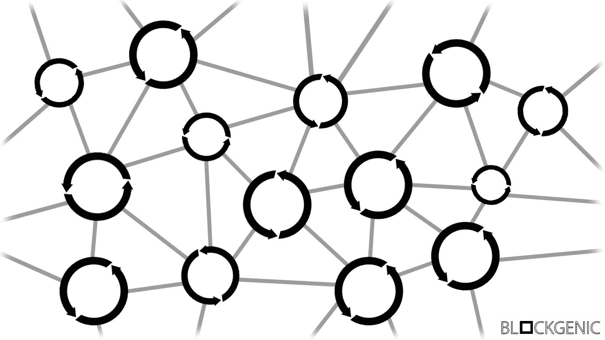
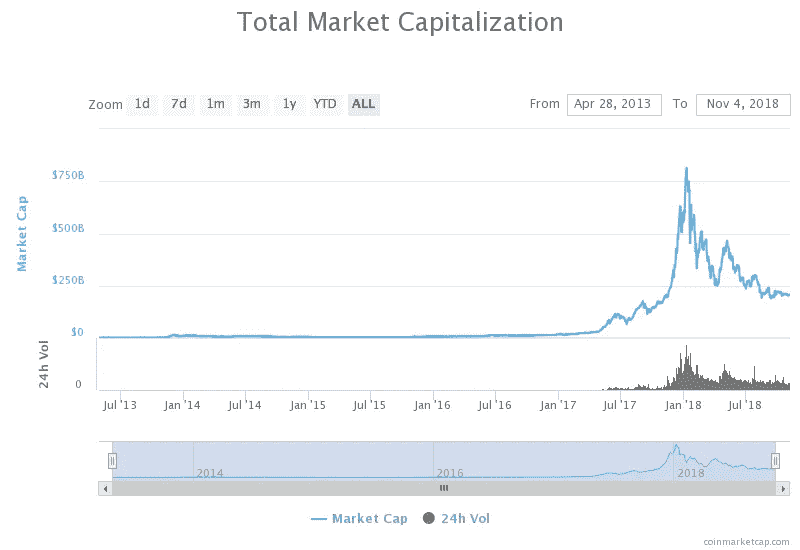
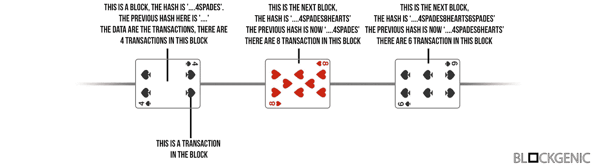
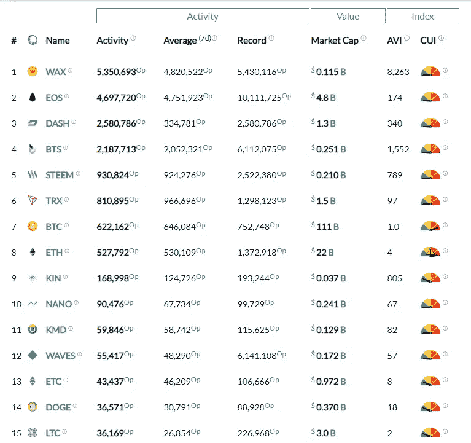

# 区块链:未来的技术？

> 原文：<https://medium.com/hackernoon/blockchain-technology-of-the-future-556d6fd4cda6>

> “区块链是一个不朽的经济交易数字账本，可以通过编程不仅记录金融交易，还记录几乎所有有价值的东西。”唐&亚历克斯·泰普斯科特

通常，每当有人问“什么是区块链技术？”，他们将会得到一个类似上面引用的答案。但这实际上意味着什么呢？区块链是如何工作的？区块链科技还有什么其他承诺？

# 过去

自 2009 年比特币发布以来，区块链技术一直受到各类人士和公司的广泛关注。许多人对这种新的、突破性的技术的所有可能的使用案例都感兴趣，公司一直在研究这种新技术提供的所有可能性。

Total Market Capitalization Cryptocurrencies, coinmarketcap.com

比特币发布几年后，人们开始意识到区块链技术不仅仅可以用于简单的货币，对区块链技术的整体兴趣飙升。这也可以从加密货币的总市值图中看出，加密货币在此期间也有巨大增长。

# 区块链如何运作

但是区块链是如何工作的，为什么这项技术如此具有突破性？让我们从基础开始。

传统上，数据存储在中央位置，用户可以访问中央数据库。根据设计，用户可以在这个中央数据库中添加和/或编辑数据。然而，这可能会导致问题，因为如果数据库遭到破坏，数据可能会丢失。数据也可能遭到黑客攻击或被秘密更改。

区块链存储数据的方法不同，数据是以分散的方式存储的。它们本质上是广泛分布的分类账，每个人都可以访问，这使得数据很难丢失或泄露。它们的目的是跟踪一切有价值的东西，从加密货币到其他数据。

> “区块链之于比特币，就像互联网之于电子邮件。一个大的电子系统，你可以在其上构建应用程序。货币只是其中之一。”莎莉·戴维斯

让我们从区块链技术的基础开始。区块链由包含 3 样东西的块组成:**(新)散列**，**前一个块的散列**，最后，**数据**。哈希是一个字符串，对于每个块都是唯一的。如果块的内容发生变化，哈希也会完全改变。
**(新)散列**是基于该块的内容生成的，并且也是基于先前块的散列。它用于验证块的内容和完整性。
**前一个块的 hash**用于连接所有块。正如您已经知道的，如果块中的一个小东西发生了变化，块的哈希就会完全改变，因此，如果两个块的哈希相同，您可以放心地说这些块之前的所有块都完全相同。
**数据**也包含在每个块中。这些数据取决于区块链的类型。例如，一块来自比特币区块链，由发送者、接收者、发送的 BTC 金额和一个数字签名组成。

区块链的每个用户都可以向网络广播交易。然后，这些事务由节点(使用执行验证和中继事务任务的客户端连接到区块链网络的设备)收集，并添加到块中。节点可以使用哈希和前一个块的哈希来检查广播到网络的事务是否合法。这些块然后被广播到网络，在网络中，节点就哪个块被添加到区块链达成共识。如果大多数(> 50%)节点认为某个数据块是合法的，则该数据块将被添加到区块链，并且不能再被删除。这些节点因其工作而获得奖励。他们的工作如何得到回报取决于区块链。

我们知道这可能很难理解，所以我们创建了一个插图，让您了解这在实践中是怎样的。在此图中，扑克牌代表方块，纸牌上的符号代表单个交易。如您所见，如果(以前的)块中的单个事务发生变化，所有新块的哈希都会发生变化。

Blockchains explained using playing cards, Blockgenic

但是，一个人如何加入网络并(可验证地)向网络发送事务呢？一般来说(有些区块链有会计系统，例如 EOS)，用户可以在区块链上生成一个公钥-私钥对。公钥是公开可用的地址，每个人都可以看到这个地址，并可以向这个地址发送交易。私钥定义了地址的所有权，并用于对来自该地址的所有交易进行签名。如果用户想要发送交易，他们需要生成一个交易，说明谁发送交易，哪个地址接收交易以及金额。之后，他们用他们的私钥签署交易，并且交易被广播到网络。然后，节点可以用(公开可用的)公钥来验证交易。

# 今后

尽管这项技术可能很伟大，但如果它没有任何用途，就不会被采用。幸运的是，区块链适合多种用途，这就是为什么有这么多人致力于许多不同的区块链相关项目。在撰写本文时， [Coinmarketcap](https://coinmarketcap.com/) 列出了~2100 种不同的加密货币，还有更多项目没有列出。

区块链促成的事情之一是智能合约。智能契约是无信任的契约，当满足某个条件时，它会自动执行某个操作。例如，如果 A 希望在某个日期向 B 发送 10 份 EOS，A 可以编写一个智能合同，说明 B 在某个日期从 A 处收到 X 份 EOS。这是一个非常简单的示例，但智能合同可以做得更多。这些智能合同对 Dapps 来说也是必不可少的。Dapps 是不可信的、分散的应用程序，由许多公开可用的智能契约组成。

智能合约可以(摘自 Coindesk，“[以太坊智能合约如何工作](https://www.coindesk.com/information/ethereum-smart-contracts-work/)”):

*   起着“多重签名”账户的作用，这样，只有当一定比例的人同意时，资金才会被使用
*   管理用户之间的协议，比如说，如果一方从另一方购买保险
*   为其他合同提供工具(类似于软件库的工作方式)
*   存储有关应用程序的信息，如域注册信息或成员记录。

区块链也在快速发展。前一段时间，最大的区块链还在努力扩展，而许多其他公司已经提出了解决这一扩展问题的创造性解决方案，实现了速度惊人的区块链，每天能够支持数百万次交易。

Blockchain activity matrix, [https://blocktivity.info/](https://blocktivity.info/)

这在区块链活动矩阵中也可以通过[阻塞活动](https://blocktivity.info/)看到。比特币区块链的操作数量曾经是最大、最活跃的区块链，现在却被更新、更快、利用率更高的区块链的操作数量所掩盖。

总的来说，区块链技术发展迅速，很可能改变未来数据存储和使用的方式。

## 关于我们

我们是 Blockgenic，一个世界级技术企业家和投资者的网络，希望对区块链技术产生积极影响。你可以在这里找到我们:
EOS Block 制作人姓名:' blockgenicbp'
[网站](https://blockgenic.website/)
[推特](https://twitter.com/blockgenic)
[Youtube](https://www.youtube.com/channel/UCXTaehuAs3UWKnMVnT71MMQ)
[Reddit](https://www.reddit.com/user/blockgenic)

*作者为* [*亚尼克·斯兰特*](https://www.linkedin.com/in/yannick-slenter/) *作者为* [*作者为*](https://blockgenic.website/)