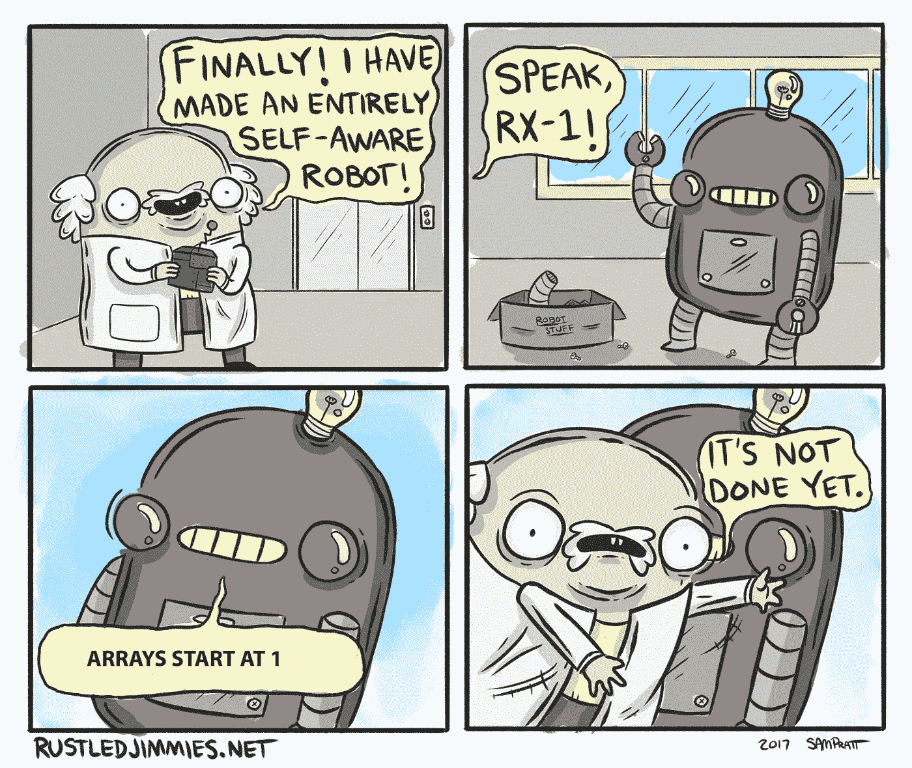
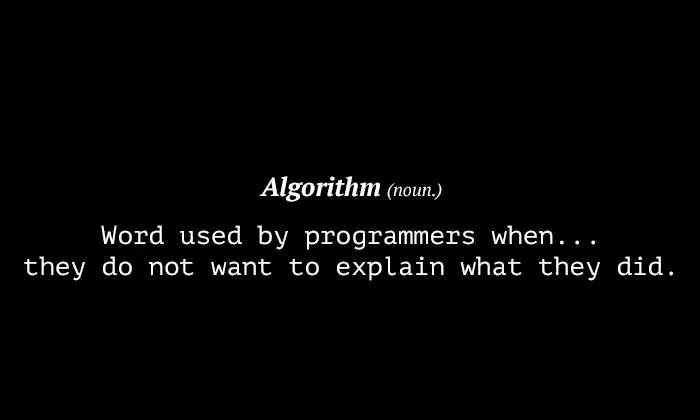

# 区块链——火车类比

> 原文：<https://medium.com/hackernoon/blockchain-the-train-analogy-b53c1cdc37b0>

The smoke is [Proof of Work](https://en.bitcoin.it/wiki/Proof_of_work)

一段时间以来，我一直在修补技术概念的定义，以便亲自理解它们，探索扩展它们的用例及应用的方法。我认为掌握一个技术概念的关键是要有一个本地化的版本，一个接近家庭的定义。因此，在分解技术概念时，故事经常会派上用场。

什么是[区块链](https://hackernoon.com/tagged/bitcoin)？这是维基百科的定义。

> 一个**区块链**，最初是**区块链**，是一个不断增长的[记录](https://en.wikipedia.org/wiki/Record_(computer_science))，称为*块*，它们使用[密码术](https://en.wikipedia.org/wiki/Cryptography)链接。[【6】](https://en.wikipedia.org/wiki/Blockchain#cite_note-cryptocurrencytech-6)每个块包含一个前一个块的[密码哈希](https://en.wikipedia.org/wiki/Cryptographic_hash_function)、[【6】](https://en.wikipedia.org/wiki/Blockchain#cite_note-cryptocurrencytech-6)、一个[时间戳](https://en.wikipedia.org/wiki/Trusted_timestamping)和事务数据(一般表示为一个 [merkle 树](https://en.wikipedia.org/wiki/Merkle_tree)根哈希)。

那么，火车和区块链有什么相似之处呢？

火车是沿着一组轨道运行的一系列相连的车厢(转向架)。第一节车厢上连接有一节车厢，它驱动其余连接的连续车厢。火车的任何车厢都有两个连接机构(连接器)，一个连接到前面的车厢(一个在它前面)，它自己的连接器连接到后面的车厢。除了只有一个连接器将第二个教练连接到它的第一个教练之外，所有教练都是这种情况。不是随便一节车厢都能加到火车上的，比如说，随便给一节客车加一节货车车厢。

从上面的描述来看，关键要素是:

*   记录条目(事务)-类似于电子表格中的行。
*   块(从块 0 到块 n)
*   加密哈希-块地址
*   时间戳
*   事务数据

通常，几个事务组成一个块，其中第一个块称为起源块(块 0)。当该块被互连网络上的对等体确认并且同意为有效时，它被加入到其他块上，形成链。一条滑轮链。

因此，区块链可以被视为一个不断增长的教练列表，称为块，使用连接器链接(由[密码术](https://hackernoon.com/tagged/cryptography)定义)。每个块包含其自己的 ID 号、前一个块的地址、其自己的地址(散列)、时间戳和对该块中包含的交易数据的引用。区块链可供运行和维护它的参与节点使用。

区块链网络中的节点(参与者)通过称为共识算法的商定机制，就系统上数据的正确状态达成一致。一致性算法确保网络中所有节点的数据都是相同的，从而防止恶意行为者操纵数据。

就像火车一样，区块链随着时间的推移不断更新，通过增加吞吐量和可扩展性来提高效率。

Algo Rhythm :)

## **尾注**

这是一次试图触及表面的尝试。我希望这些解释足以理解这项技术。在以后的文章中，我将探索区块链、DApps、分布式账本技术的类型以及它们的用例(实际的和理想化的)。

## 我的其他帖子

[社会中的区块链和分布式账本技术](/p/f15b463c2abf?source=your_stories_page---------------------------)

[在 Windows 10 上开始使用 Hyperledger Composer](/p/88d973094b5c?source=your_stories_page---------------------------)