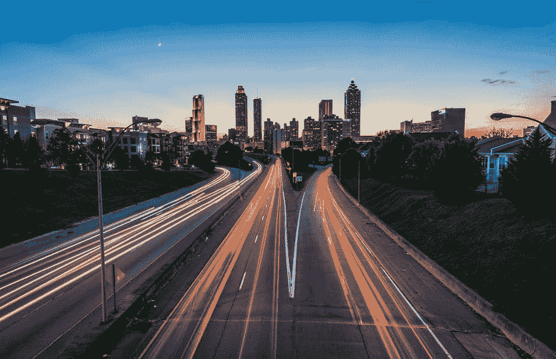
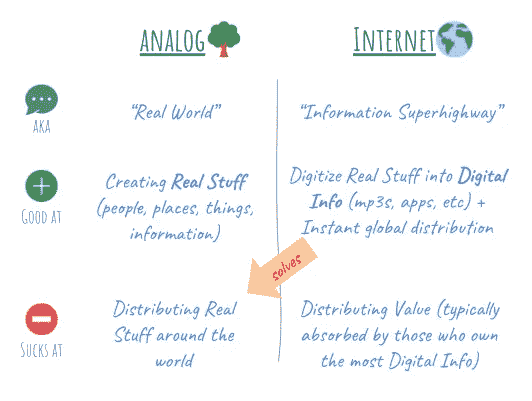
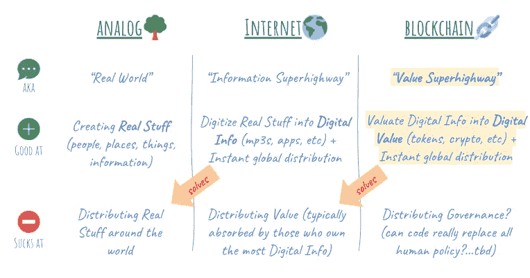
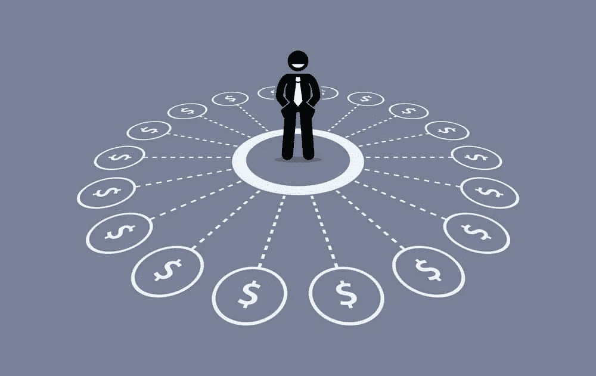
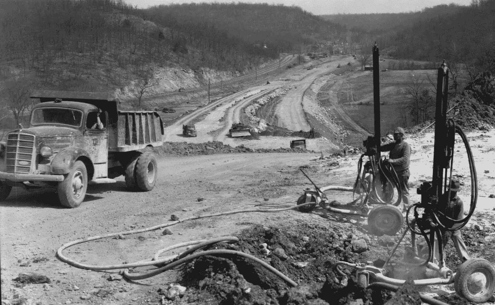

# 区块链:进入你钱包的“价值高速公路”

> 原文：<https://medium.com/hackernoon/blockchain-the-value-superhighway-into-your-wallet-9330cec5bf8f>

> 让我们跳过技术术语，谈谈区块链将如何影响你、我甚至你妈妈的钱包。

[***Blockchain is the “Value Superhighway” into your wallet***](https://www.pexels.com/photo/time-lapse-photography-of-road-near-town-185662/)

# 区块链，真的假的？

我们已经被*去中心化*这个、*不信任*那个轰炸了，但是真的…为什么普通人要给#$%?？

让我们从区块链实际上做了什么开始:

> 区块链**验证**个人贡献，在某些情况下**向这些贡献者分配价值**。

跟踪[东西](https://hackernoon.com/guide-to-crypto-token-types-6ce04edaba72)的美化账本。酷毙了。但是让我们诚实地面对自己，这对大多数人来说听起来像是胡言乱语，尤其是我们的父母。

这个*对于普通人来说实际上意味着什么*？

> 区块链将为所有类型的贡献提供一种人(和物)获得补偿的方式:无论大小，工作还是休闲。你以前宝贵的技能、知识、创造力和时间…现在有了价值。

奇特的魅力。

为了理解我们是如何到达那里的，让我们重温一下历史。

# 互联网=“信息高速公路”

当柯特·科本、图帕克和比格还活着的时候，普通人把互联网描述为“信息高速公路”如果你问我，这是一个俗气的说法，但仍然比超文本传输协议要好。

像区块链一样，互联网对不同的人意味着不同的东西。

然而，从本质上讲，它解决了现实世界中的一个主要问题。在模拟世界中共享信息既麻烦又昂贵，尤其是在全球范围内。“*信息高速公路”*通过提供数字信息的即时全球分发解决了这一问题。这些新能力开创了一个前所未有的新价值创造时期。

但是，所有的价值(也就是钱)去了哪里？！？

The Internet, aka “*Information Superhighway,”* provides instant global distribution of digital info

# 当今的“价值”挑战

如何确定一个项目或活动的“价值”？

这是一项困难且相当深奥的工作，因此倾向于根据初始投入(例如花费的时间)或最终产出(例如产品、现金流)进行评估，忽略中间的大部分内容。

## **过时的薪酬模式**

今天的组织非常依赖员工的合作和贡献。因此，令人震惊的是，公司仍然使用 100 多年来从未改变的工业时代的模式来补偿员工:时薪、基于出勤的工资以及基于工作时间的统一费率。

在当今的现代经济中，基于时间的薪酬对于补偿生产性工作来说是非常低效的。更糟糕的是，它低估了领导力、指导和合作等重要贡献。

## 被忽略的贡献者

在估价挑战的另一端，你有许多利益相关者和贡献者被“冷落”例如，考虑脸书的绝大多数内容是由消费者和小企业合作伙伴提供的。然而，这些贡献者往往报酬不足或根本没有报酬。他们贡献的集体价值由拥有最终产品及其相关数字信息的脸书公司持有。

## ***集中控制***

无论是基于初始投入还是最终产出来评估贡献，这两种方法都依赖于一个集中的参与者来确定和分配报酬。

一个中央集权的实体，决定你的 *时间*值多少*。*

一个集中的实体，拥有最终产品、所有相关信息和大部分累积价值……并拥有*独家选择权*以其认为合适的方式向您分配(或不分配)价值。

更直白地说，想象一下，你有一个像迈克尔·斯科特一样的老板来决定你所有工作贡献的价值…

Valuating your work like it’s 1918

## 分销并不容易

那些*想要**[补偿其贡献者](https://www.businessinsider.com/uber-met-sec-about-drivers-equity-in-company-2017-6)的集中实体呢？*

*300 多亿美元的 Airbnb 和 600 多亿美元的优步已经[公开承认](https://techcrunch.com/2018/09/23/airbnb-wants-to-give-its-hosts-equity-in-its-business/)他们的共享经济贡献者的重要角色:*

> *“我们认为，让私营企业能够在更早的阶段授予(共享经济参与者)公司股权，将进一步协调此类企业与其共享经济参与者之间的激励机制，对双方都有利。”*

*但是，正如朱诺案例所表明的，良好的意愿可能不足以克服向贡献者分配“价值”的重大障碍。如今的监管框架和流动性选择根本不是为“价值”的自由流动分配而设计的。*

# *区块链=更精确、更少偏差的估值*

*简而言之，比特币恰如其名的*工作证明*共识模型，是一种验证个人工作贡献的透明方式。*

## ****艺术和科学……但更科学****

*通过使用数学直接验证工作贡献，比特币和其他区块链能够从更大的干草堆中精确定位个人贡献的“价值”。*

*把它想象成评估的核磁共振扫描。*

*直接和精确的验证为新的估值模型奠定了基础，这些模型将比以前依赖间接和不精确的输入和输出的模型好得多。*

*随着共识和估值模型的改善，我预计将会有更多的活动和贡献得到有效补偿。*

## ****不要求守门的****

*透明的验证过程意味着世界上的任何人[都可以看到价值来自哪里](https://www.cnbc.com/2018/10/29/4-gig-economy-trends-that-are-radically-transforming-the-us-job-market.html)。这使得行为不端的看门人(如迈克尔·斯科特)更难压制、忽视或操纵你贡献的“价值”。*

*透明度加上精心设计的激励机制(也就是价值分配)意味着我们可以完全避免[中央集权](https://hackernoon.com/we-already-know-blockchains-killer-apps-f2d443eba35)。*

# *区块链=更广泛、更一致的分布*

*除了给我们温暖的模糊感，我们为什么要关心给贡献者分配“价值”呢？*

*因为激励驱使我们。当“价值”作为一种激励提供时，人类将真正移山。*

*典型的例子是:硅谷。*

## *Mo 分布，Mo 值*

*当被问及硅谷最伟大的创新时，人们通常会想到标志性的产品:个人电脑、智能手机、社交网络等。*

*但也许硅谷最伟大的创新不是技术上的，而是行为上的，以员工股票期权的形式。让我解释一下。*

*硅谷科技公司[开创了](/conversations-with-tyler/tyler-cowen-balaji-srinivasan-tech-bitcoin-crytocurrency-silicon-valley-management-b8db383c9cef)向员工分配公司股权的做法，实质上是将这些员工转变为小业主。然后，这些员工受到激励，通过将他们的工作活动与大公司的利益相结合来增加他们的个人财富。如今，科技公司在股市和我们日常生活中的主导地位凸显了利用价值分布来对齐人群的有效性。*

*来自硅谷的*洞见*是“价值”不是[零和游戏](https://a16z.com/2018/07/06/ben-marc-stevenjohnson-summit-2017/)。 ***整体大于其部分之和。****

*区块链的*教训*是价值分配激励了创造更多“价值”的群体联合价值分布越广，群体一致性越强，产生的净“价值”就越多。*

> *员工股票期权将公司“价值”的所有权从几个创始人民主化到数千名员工。区块链将这种民主化带到了一个全新的水平，以包括数百万甚至数十亿消费者、合作伙伴和其他贡献者。*

# *区块链=“价值高速公路”*

*将更好的估值模型与更广泛的分布结合起来，让我们有条件让区块链成为*价值、*的高速公路，就像互联网是*信息*的高速公路一样。*

**

*Blockchain, aka “*Value Superhighway,”* provides instant global distribution of digital value*

*互联网解决了模拟世界的一个主要问题，它将东西数字化，并将其分发到各处。然而，互联网在分配价值方面仍然很糟糕。*

*区块链通过对东西进行估值并将其分发到各处来解决这个问题。*

*正如互联网建立在模拟世界的经验和基础设施之上，区块链也将建立在互联网的经验和基础设施之上。*

## *这对我的钱包有什么影响？*

**

*[Multiple income streams FTW](https://boomerandecho.com/why-multiple-income-streams-is-a-better-emergency-fund-for-millennials/)*

*想想你今天为工作所做的许多不同的工作活动。*

*现在想想你喜欢的许多不同的休闲活动。*

****如果你的每一项工作和休闲活动都能得到补偿，你会怎样？****

*事实上，已经有几个区块链的解决方案可以补偿你的活动，例如[回答调查](https://earn.com/)、[浏览](https://basicattentiontoken.org/)网络、[网上购物](https://www.lolli.com/)，甚至[看电视](https://www.blockstreethq.com/blockchain-the-entertainment-industry/)。*

*现在，并不是每一项活动都可以或者应该通过区块链得到补偿。但正如互联网开创了全新的赚钱方式(有人预测过社交媒体经理吗？)，区块链也会这么做。*

*所以更大的问题是，这样的未来会对你、你的家人、朋友和同事产生怎样的影响？*

*拥有多种收入来源会改变你对朝九晚五工作的态度吗？*

*你会如何分配你的空闲时间？*

*如果你的工作和娱乐都得到了补偿，你会如何区分这两者？*

# *前面的路很长*

**

*[Construction on Route 66](https://i.pinimg.com/originals/65/7d/a7/657da7f0d40a8186ad4e0ebbd2c00d1f.jpg)*

*互联网，又名“信息高速公路”，需要几十年的产品、生态系统和商业模式的迭代，才能形成一个高效的全球信息网络。*

*同样，对于区块链，又名“价值高速公路”，许多工作仍然在今天，只是一个土路。*

*这是一个数十年的旅程，需要耐心等待行业的发展[一次一口](https://a16z.com/2016/08/20/why-software-is-eating-the-world/)。但是潜在的成分非常有前途:*

> *由于“价值高速公路”上更好的估值和更好的分配，区块链将对我们如何组织、工作和娱乐产生重大影响。*

*在以后的文章中，我将更详细地探索区块链将如何影响我们的日常生活，以及深入“价值高速公路”的构建模块*

*进步从来不是直线前进的——一路上肯定会有很多弯路、死胡同和事故。我要向所有的企业家、投资者、监管者、学者，尤其是为他人铺平道路的贡献者致敬。我只是很高兴能搭顺风车。*

## *喜欢你读的吗？如果是这样，请按住拍手按钮拍开！*

**

## *关注以获得未来帖子的通知。*

**感谢* [*卢克*](https://twitter.com/lukex)*[*马蒂厄*](https://twitter.com/mattcourtin)*[*艾德·吴*](https://www.edwu.co/blog)*[*吉姆·布里斯*](https://twitter.com/jimkeepsitreal) *和拉吉夫·帕迪瓦拉对他们的宝贵反馈。*****