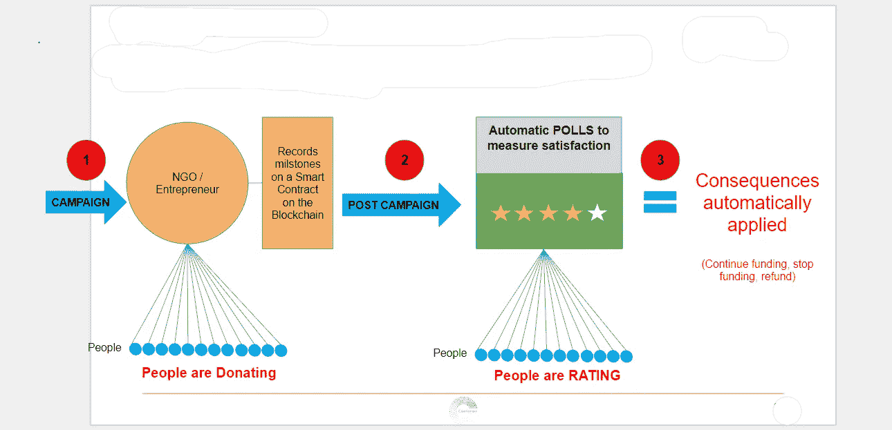

# 区块链确保钱用得其所

> 原文：<https://medium.com/hackernoon/blockchain-to-ensure-that-money-is-well-spent-ebd173132fb9>

**Blockchain Technology**

# 区块链确保钱用得其所

在我们的上一篇文章中，我们提出了在公共领域实施流动民主所需工具的话题，并增加了让代表对其行为负责的可能性。

实施问责制的关键因素是在民用领域也能很容易地找到多种应用。事实上，在平民世界中开始应用自动执行的问责制可能是看到它被民选代表很好地采纳的关键。

**谁会从强制问责中受益？**

从投资者到捐赠者，每个人都将受益于能够密切关注他们投资或捐赠的资金。尤其是如果在接收者被证明是不可靠的情况下，自动问责系统能够收回全部或部分资金。

那么，谁会从提供这样一个系统以换取资金中受益呢？任何筹集资金的人都可以使用它。从寻找投资的企业家到任何从会员或非会员那里筹集资金的组织，而是从那些希望确保他们投资或捐赠的钱被建设性地使用的人那里。

提出分阶段接收资金，其中每次资金发放以成功完成 smart-contract 中定义的一组任务为条件，smart-contract 是系统的基石，表明接收方相信项目的可行性并打算以最佳方式执行。

让我们想象一下，例如，一个慈善实体寻求资助一个项目。在今天的世界里，捐赠者给出的金额被认为是合适的。之后，他们基本上希望该机构将这笔钱用于他们声明的目的，并且他们的大部分捐款确实将用于该机构声明的目标。

然而，事实上，除了信任第三方*来检查他们的捐款中有多少百分比用于该目标，有多少百分比用于资助机构的日常开支，如办公室、工资、差旅费等，今天的捐赠者没有办法检查他们的血汗钱是否会通过机构的有效管理找到那些需要的人。*

*即使在监督机构的帮助下，提供一些关于捐赠用于管理费用的百分比的信息，捐赠者也没有追索权，以防机构只是浪费筹集的资金。*

*要是有一个记录钱的使用方式的系统就好了…*

*有了区块链技术和智能合同，这实际上是可能的。不仅可能，而且可行，而且这样做的工具即将问世…*

*Coalichain 正在开发一个智能合同，它可以自动跟踪和自动执行结果，并且还提供了一个平台(App/web ),最大限度地方便所有人使用。

**这在实际层面上如何行得通呢？***

*其实挺容易的。让我们想象一个致力于为流离失所者提供避难所的非政府组织。他们正在筹集资金购买和分发 50 000 顶太阳能帐篷，为叙利亚和邻近地区的叙利亚流离失所者提供住所。*

*据推测，他们有分项预算，目标领域和时间表。这些可以在预先确定的日期转化为里程碑，或者在达到捐赠阈值后的时间间隔内转化为里程碑。一旦建立了里程碑，就可以创建一个智能合同来整合这些里程碑，并根据里程碑目标的成功完成来定义如何奖励或制裁非政府组织。*

*它的工作方式如下:*

**

*在这个虚构的案例中，非政府组织成功地达到了生产 50 000 顶帐篷的第一个里程碑，因此分发所需的资金已经自动释放，因为他们可以成功地证明他们满足了预先确定的条件。*

*预定的里程碑规定，在收到资金后，该非政府组织将运送 20，0 00 顶帐篷到特定地点。因此，在收到资金后，他们努力开始预订卡车和船只，以确保高效运输这些帐篷。*

*不幸的是，战争是不可预测的，他们应该运送帐篷的地区现在已经成为一个活跃的战区，流离失所者正在逃离那里。他们不可能在预定的时间内运送帐篷。*

*当他们未能达到里程碑时，会触发自动投票，要求捐赠者投票并决定该非政府组织是否应该受到制裁。*

*对非政府组织来说，幸运的是， **Coalichain 的**应用程序为他们提供了一个平台，他们可以在这个平台上解释未能达到里程碑的原因，以及他们打算采取什么措施来纠正这种情况。*

*由于捐赠者是明智的人，他们投票同意延长时间和重新定义的交付地区。*

*尽管从人的角度来看这很戏剧化，但就监管资金分配而言，这是一个令人高兴的故事。*

*然而，为了充分理解这个系统，让我们想象另一个故事。这一次，一位企业家正在寻求资金来开发一款应用程序。比方说，他的应用程序将使用户能够测量他们的减肥曲线，并以适当的饮食和锻炼建议做出回应。我们的企业家设法众包了 100 万美元。*

**

*在今天的系统中，比如 Kickstarter，一旦他达到了融资目标，他会立即收取全部金额(减去费用)，但不能保证他会以明智和建设性的方式花费这笔钱。*

*然而，使用 **Coalichain** 系统，他将需要定义里程碑，并且在每个里程碑成功完成后，资金将逐渐发放。*

*在这种情况下，我们的企业家里程碑大致定义如下，开始日期是众筹活动的成功结束。*

***1。****40 天内***

*a.创建网站*

*b.雇用其他开发人员*

*c.完成至少 30%的代码*

*所需金额——50000 美元*

***2。** **在接下来的 120 天里***

*a.完成代码的剩余部分*

*b.雇佣一个用户界面/UX 设计师*

*c.实施设计*

*d.调试*

*所需金额——20 万美元*

***3。** **在接下来的 180 天里***

*a.在苹果和谷歌商店部署应用程序*

*b.发起营销活动*

*c.根据用户的反馈修复剩余的错误并添加功能*

*d.获得 10 万用户*

*总共需要 75 万美元*

*第一个里程碑固定在众筹活动的 40 天。当到达时，我们的企业家正在介绍新的开发人员，展示他创建的网站，并提供作家代码的样本页面，作为用他收到的最初 5 万美元完成工作的证明。*

*由于大多数捐赠者没有任何编码知识，也不知道创建一个网站所需的工作量，也不知道开发人员的经验和他们应该得到的工资之间的联系，他们往往会对华而不实的网站、晦涩难懂的代码行和新开发人员的书呆子气印象深刻。因此，他们可能合理地认为里程碑已经完成，并投票释放为第二个里程碑标记的资金。*

*然而，对编码一无所知并不意味着完全一无所知。由于聪明人意识到他们对编码的复杂性缺乏理解，捐赠者将他们的投票委托给他们当中那些理解并信任他们的人来评估企业家的成就。*

*投票授权制度在“什么是流动民主？”部分我们的 [***上一篇***](https://hackernoon.com/the-tools-we-need-to-implement-liquid-democracy-10cc5206891c) 。我们将很快就这个主题写一整篇文章。现在，让我们简单地认为委派投票是一种选择，并看看它意味着什么。*

**

*所以，回到我们创业者的里程碑式评价。*

*代表们正在审阅企业家提交的材料。由于这是他们非常熟悉的领域，他们立即注意到该网站是一个几乎没有修改的现成模板。就其本身而言，这并不一定是坏事，这可能是节省编码和劳动力资源的一个好方法，因此无论如何都不会给他们留下深刻印象。*

*然而，当检查雇佣的开发人员的资格时，他们立即意识到，他有经验的编程语言可能对老式网站很好，但在应用程序开发方面却毫无用处。粗略地看一下示例代码就更糟了。使用的语言不仅与应用程序开发无关，而且错误百出。*

*因此，他们投票认为里程碑没有成功完成。*

*在这种情况下，剩余的 950，0 00 美元将按捐助者最初投资的比例返还给他们。他们只损失了初始投资的一小部分。正如你所看到的，这个系统大大降低了投资的内在风险。*

*这些只是 [**Coalichain**](https://www.coalichain.io/) 如何帮助确保筹集的资金确实以有效的方式影响到最终目标的几个例子。*

***Coalichain 的**可定制智能合同旨在适应和灵活。通过这种方式，任何不熟悉区块链的人都可以轻松地创建一个智能合同，在验证前面的里程碑已经达到时逐步释放资金。*