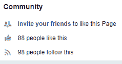
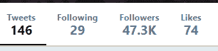
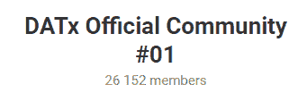
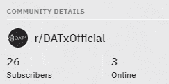
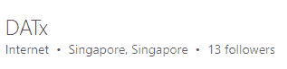

# 区块链将最终重燃久违的用户广告爱情故事

> 原文：<https://medium.com/hackernoon/blockchain-to-finally-rekindle-the-long-lost-user-advert-love-story-f991db09cfe2>

修补分手:通过区块链驱动的广告新时代让用户再次坠入爱河。

众所周知，我们每一个人都喜欢点击横幅——心理！当然不是！没人再点击横幅了。根据最近的研究，比起点击横幅，你更有可能在飞机失事中幸存。如果你仍然认为这个数字还不够低，进一步的研究表明 50%的广告横幅点击是偶然的。想象一下天文概率，更进一步，想象一下把它减半:就那么小。也许这可以归因于用户和数字广告之间的敌意，这种敌意自数字广告出现以来就一直存在。

**数字广告:“不是你，是我。”**

广告应该吸引他们的观众，抓住他们的兴趣，这不是目前传统方法的情况。

沙发土豆正在迁移。在过去 3 年中，电视观众人数一直在稳步下降，花在电视上的集体时间现在被花在移动应用程序上的集体时间所主导。视频流媒体网站和社交媒体平台等在线平台的出现导致了电视人口的分散。因此，随着企业开始加大对数字广告的投资，当时利润丰厚的电视广告业务也在下滑。

然而，这种向数字广告的范式转变并不像打断你最喜欢的电视节目以吸引你注意力的商业广告那样简单直接。在数字世界中，用户可以完全控制他们想要什么和不想要什么，因此很难引起他们的注意，因为在这个领域中，*他们实际上有一个选择*。

这就是数字营销策略的用武之地，因此开始了用户广告分离的上升趋势。横幅广告的诞生催生了无数的点击诱饵，误导和浪费用户的时间在无用的信息上。弹出式广告扰乱了用户体验，让他们感到烦恼，而不是抓住他们的兴趣。垃圾邮件只会破坏用户体验。从那时起，这些不便之处就玷污了广告的声誉，并使观众对广告产生了反感。

**用户:“我以为我可以信任你…”**

在用户不知情的情况下处理、分析和利用用户数据是违法和不公正的。

广告平台试图通过开发程序化媒体购买、大数据技术和行为数据分析来解决这一问题。通过这些，算法能够跟踪用户数据和行为，分析它们，并定制适合你个人兴趣、偏好和需求的广告体验。这可能会解决浪费的大规模广告和无目的的弹出窗口的问题，但这给拥有这些平台利用和利用的数据的用户带来了安全和所有权问题。

这意味着我们的数据在我们不知情和未同意的情况下被分析，并在未经我们允许的情况下被出售给市场。我们没有选择分享或不分享，因为这些平台可以访问一切。换句话说，我们的隐私被侵犯，我们被窃取，以换取“免费”的社交媒体、流媒体和许多其他服务。在伤口上再撒盐的是，这些平台有可能在互联网上完全泄露你的敏感个人信息。

**AD-BLOCK:“用户现在和我在一起。”**

用户找到了一种通过广告拦截应用来远离广告的方法。

随着广告屏蔽行业最近的繁荣，用户和数字广告之间的敌意变得更加明显。随着安全威胁分散到网上，不仅是可疑网站，还有公众已经学会信任的平台，广告拦截现在被视为一种必要的工具。虽然对消费者有利，但投资数字广告的企业会看到投资回报(ROI)下降，从而颠覆广告生态系统的规模，并最终削弱保持平台、营销人员和企业网络运行的价值流通。

**达克斯:“靠边站。数字广告仍然有话要说。”**

**披露:**我会特别报道这个项目，因为我已经为这篇[研究文章](https://hackernoon.com/datx-a-blockchain-powered-decentralized-advertising-ecosystem-71fb944b02ea)做了大量的研究。这个行业中有很多其他项目来实现类似的事情，但是这个项目我绝对可以分享一些实际的知识。请跟着读…

区块链技术欢迎用户进入广告生态系统，解决问题，并确保价值从营销人员流通到最终用户，创造一种有益的多赢关系。

数字营销如何赢回用户？DATx 提出了一个解决方案——在区块链技术下运行的下一代数字广告生态系统。

区块链技术是唯一成功实现完全去中心化的协议。多亏了加密技术，它是唯一一个不受监管的系统。这是因为它在“数学就是法律”的严格绝对原则下工作。区块链被编程为不可变的，因此将保持不变，不变和回调证明，直到时间的尽头。此外，由于区块链的数据处理是基于共识算法，区块链没有一个监管一切的中央管理实体，使系统免于因一个实体可能犯的一个错误而瘫痪。最后，该系统将始终保持其完整性，因为它依赖于共识，确保不会进行欺诈性攻击。

区块链首先被用于加密货币，由中本聪专门为比特币的使用而制造。然而，区块链已经证明自己在记录保存和集体数据处理的许多其他领域是有用的，这就是为什么它也发现自己正在融入数字物流、智能合同、数据存储和分发、游戏逻辑以及无数其他领域。

DATx 将区块链技术视为解决广告与用户分离问题的缺失环节，它集成了一个自动化、公正、分散和绝对的系统，确保生态系统中的每个参与者都能公正地收回(多一点)他们愿意放弃的东西，同时保持系统的透明、安全和隐私。

**数字广告:“证明无罪。我自私我错了……”**

承认传统数字广告的缺点，并用区块链技术解决它们。

**●您的数据，您的财产**

**DATx** 承认用户数据所有权。当然，这毕竟是你的数据，因此你有权对它做任何你想做的事情。没有你的允许，任何人都不应该得到你的数据。有了区块链， **DATx** 确保你的数据将在你的唯一控制之下，没有人可以看到或操纵它，甚至是 **DATx** 本身。这是因为区块链的每个用户都是一个拥有数字身份的自动钱包持有者。区块链中包含的所有数据都是加密的，只有其所有者和任何有权访问它的人才能解密。

**●大数据处理不再偷你的东西**

在将区块链数据所有权应用于程序化营销的过程中，你可以选择你想要分享的数据，并由广告商进行分析。这意味着你可以省去任何你想保密的私人或敏感信息。然后，用户会因为他们对系统的反馈而受到激励。然后，广告商从广告平台购买这些数据，使他们能够根据他们提供的数据有针对性地锁定对他们感兴趣的受众。因此，用户不会被无趣的广告所困扰，而是会遇到他们喜欢和偏好的东西，并且企业能够最大化他们的投资回报，因为他们可以节省他们的资源，以免被用在错误的人的广告中。

**●通过直接的观众反馈，你可以选择你想看的，广告商可以提供你想要的**

与传统的行为分析算法相反，直接的观众反馈提供了更准确的数据，因为广告商追求的是观众的偏好，而这并没有准确地体现在他们的模式中。通过反馈，观众能够说出他们想看的东西，并通过激励手段鼓励他们这样做，这将在后面讨论。此外，用户给出的所有数据仍然归他们所有，维护他们的隐私权和所有权。

这种健康的用户-广告商关系最大化了广告体验，使价值在企业-营销商-平台-最终用户的循环中不断循环。

**●通过 DATx 加密货币的激励让用户在几分钟内从他们提供的数据中受益。**

区块链是一个分布式分类账。事实上，它是建立在你所给予的就是你所得到的原则之上的。这一绝对规则使得区块链的系统可信且无可争议。随着 **DATx** 认识到个人用户数据是一种有价值的财产，企业能够直接购买它们用于广告目的。DATx 币使企业能够根据目标受众的参数来分配预算，受众立即受到相应的激励。有了这个系统，观众被鼓励自愿提供他们的数据，广告客户得到更准确的数据。通过让生态系统中的每个参与者受益，车轮不断转动。

DATx:“再给数字广告一次机会。”

用户和广告的关系第一次没有成功，因为这是一种单方面的关系——广告以给用户带来不便为代价而受益。达克斯将区块链带入这种关系，以确保每个人都得到他们应得的。有了 DATx，也许是时候再给 ads 一次机会了。

**社交媒体信息:**

***脸书***

*网址:【https://www.facebook.com/DATxofficial/ *

*喜欢:83 个喜欢——98 个关注者*

*过去 7 天有多少帖子/更新:3 个帖子*

**

****推特****

*网址:[https://twitter.com/DATxOfficial](https://twitter.com/DATxOfficial)*

*关注者:47.3 万关注者*

*过去 7 天内有多少条推文/转发:2*

**

****电报****

*网址:[https://t.me/datxofficial01](https://t.me/datxofficial01)*

*用户:26152 名成员*

**

****电报管理员****

*用户名:@Rileysun*

*用户名:@DATxADMIN_Mario*

*用户名:@Spring_haru*

*用户名:@ DATxADMIN _ 林良乐*

****Reddit****

*网址:[https://www.reddit.com/r/DATxOfficial/](https://www.reddit.com/r/DATxOfficial/)*

*读者:26 名订户*

**

****领英****

*网址:[https://www.linkedin.com/company/datxofficial/](https://www.linkedin.com/company/datxofficial/)*

*追随者:13 名追随者*

**

****多余的****

*如果你发现更多的社交媒体平台或聊天或其他链接，请放在这里。*

***员工/团队信息:***

*姓名:拉尔夫·萨斯*

*职位:DotC 联合集团 Avazu Global 临时首席执行官*

*简历:拉尔夫毕业于荷兰博世大学。目前，他是 DotC 联合集团的代理首席执行官和移动广告平台子公司 Avazu Europe Europe/NA/Latam 的首席执行官。他是 Avazu 控股公司的董事会成员。此外，Ralph 曾在 ZinQ Media 和 R&D Media 工作，这两家公司都是荷兰移动互联网和在线数字营销的领先公司。*

*领英:[https://cn.linkedin.com/in/ralph-sas-635849b](https://cn.linkedin.com/in/ralph-sas-635849b)*

*姓名:古斯·埃斯比尔·威尔德曼*

*标题:首席运营官阿瓦祖欧洲/北美/拉美阿瓦祖*

*简介:Guus 毕业于荷兰 Hogeschool 大学，他是联盟营销、社交媒体、SEO、PPC、PPV、在线推广领域的专家。他在 DotC 联合集团工作了 3 年多，现在是 Avazu Europe /NA/Latam 的首席运营官，在此之前，他曾是 iQU 欧盟区的销售总监。Guus 致力于在游戏玩家、发行商和广告商之间建立完美的联系，并试图为在线游戏赢得更强大的市场。通过使用他以前的情报平台——互联网、社交媒体、移动设备等复杂的 GameriQU，在欧洲国家产生了巨大而深远的影响。*

*领英:[https://www.linkedin.com/in/guusesbirwildeman](https://www.linkedin.com/in/guusesbirwildeman)*

*姓名:罗伯特·科尔布斯*

*头衔:Avazu 欧洲/北美/拉丁美洲总经理*

*个人简介:Robert krbs 毕业于柏林应用科技大学(在西欧地区排名第一)，专业是商业计算机科学。到目前为止，他在数字营销、用户访问、广告业务方面拥有超过 8 年的工作经验，是运营初创企业生态系统的先锋团队领导。目前，Robert 担任 Avazu Europe/NA/Latam 的董事总经理。他曾任职于 Hitfox group 的子公司 ad2games，一家数字创新营销游戏公司，职位是广告客户关系主管。*

*领英:【https://www.linkedin.com/in/robertk3/ *

*姓名:亚历杭德罗·邦西格诺*

*职位:Avazu LATAM 业务发展总监*

*个人简历:Alejandro 是 UADE 大学(布宜诺斯艾利斯排名第一的大学之一)的法律和社会科学教授，拥有在数字广告行业的主要公司担任领导职务的经验，如改善媒体网络。他做了多年的顾问，对航空业有很深的了解。如今，亚历杭德罗是 Avazu LATAM 的业务发展总监*

*领英:【https://www.linkedin.com/in/abonsignore/ *

*姓名:本·小马·范·凯塞尔*

*职位:Avazu 控股公司 AVAZU 欧洲业务发展总监*

*个人简介:本·波妮·范·凯塞尔毕业于阿姆斯特丹应用科技大学，现任 Avazu 欧洲公司业务发展总监。Ben 年轻时在一家跨国领先一代公司工作，接触到了在线营销行业，在那里，他通过负责设计业务发展战略以及进入和解决新市场的问题，取得了巨大的成功。由于有销售经验，Ben 能够在网络营销和国际销售领域发展强大的技能。*

*领英:[https://nl.linkedin.com/in/ben-pony-van-kessel-10267b52/pt](https://nl.linkedin.com/in/ben-pony-van-kessel-10267b52/pt)*

*姓名:斯特凡·苏里帕蒂*

*标题:广告客户关系总监-Avazu bij DotC 联合集团*

*作者简介:Stefan Suripatty 是 Avazu Latam 现任欧洲和北美广告客户关系总监。Stefan 曾担任 R&D 媒体公司的高级开发人员多年，该公司是一家国际运营的媒体公司，经营 B2C 移动和互联网娱乐、电子商务和在线销售线索生成行业。Stefan 在在线和数字广告行业工作多年，曾在 R&D 媒体和 Bandbreed 等大公司工作，最初的职业是 web 开发人员。*

*领英:【https://www.linkedin.com/in/stefan-suripatty-83815678 *

*姓名:贾斯汀·特纳*

*职位:Avazu 欧洲/北美/拉丁美洲分公司管理副总裁*

*简历:贾斯汀·特纳(Justin Turner)毕业于埃斯达尔学院经济与社会专业。多年来，贾斯汀一直在 IQU 担任领导角色，这是一家专注于游戏的在线性能营销公司。目前，iQU 为超过 6000 家游戏专业发行商提供超过 150 款游戏。Justin 是 Avazu LATAM 的欧洲和北美副总裁兼附属经理。Justin 在广告和出版行业拥有超过 5 年的经验，对在线和移动性能营销有着丰富的知识，对游戏行业有着深刻的见解。*

*领英:【https://nl.linkedin.com/in/justindevonturner/de *

*姓名:Kiki Henrichs*

*职位:Avazu 全球销售总监 DSP 欧盟/北美/拉丁美洲*

*简历:Kiki Henrichs 目前是 Avazu Latam 的欧洲和北美全球销售总监。Kiki 在媒体购买和在线广告方面有多年的经验，例如管理 AEGIS group 旗下 Match My Brand 的主要客户。*

*领英:[https://nl.linkedin.com/in/kiki-henrichs-a336b028](https://nl.linkedin.com/in/kiki-henrichs-a336b028)*

*姓名:阿莫斯·方*

*职位:Avazu | DotC 联合集团 APAC 业务主管*

*Amos Fang 毕业于国立交通大学，曾担任 CyberLink 的助理经理，CyberLink 是领先的多媒体软件公司之一，其子公司 PerfectCorp 是台湾最大的移动互联网企业之一。他在国际业务发展方面拥有近十年的经验，在全球市场为阿里巴巴、雅虎和亚马逊等电子商务客户成功实现了线上和线下用户增长。目前，阿莫斯是 DotC 联合集团的 APAC 业务主管。*

*领英:[https://tw.linkedin.com/in/amos-fang-740698a7](https://tw.linkedin.com/in/amos-fang-740698a7)*

*姓名:Olle Falkenä*

*职位:企业软件代表*

*简历:Olle Falkenang 毕业于乌普萨拉大学，是 oBike Global 的前项目负责人。Olle 在电子艺界和 Gamestop 等公司的零售和游戏行业的在线和社交媒体营销方面拥有多年的经验，并在 IBM 的业务开发和销售管理方面拥有丰富的知识和见解。*

*领英:【https://se.linkedin.com/in/ollefalkenang *

***公司地址:**新加坡*