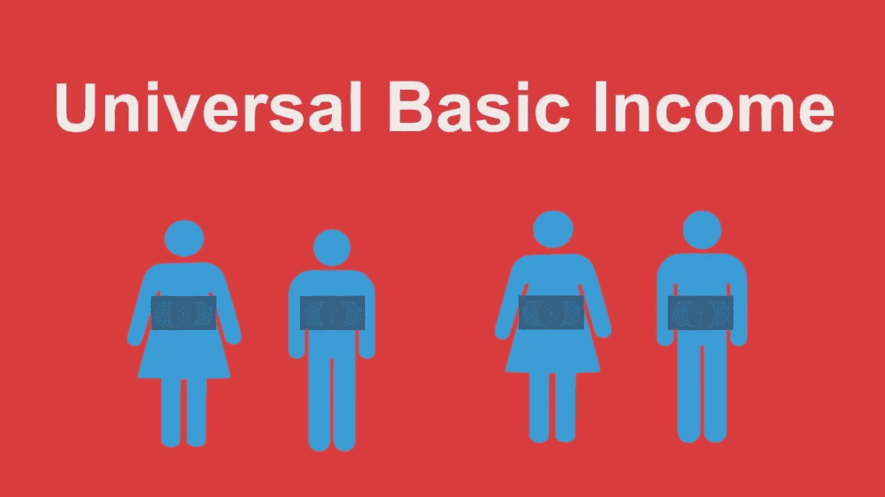

# 区块链:普遍基本收入

> 原文：<https://medium.com/hackernoon/blockchain-universal-basic-income-6ab6e15780b8>

加密货币将重新定义价值劳动，以涵盖满足人类条件的日常活动。用一个合适的厕所甚至睡足八小时来赚取数字货币——普遍基本收入将不是施舍，它将由广泛获得价值创造来定义。通常，基本普遍收入的概念会让人联想到大规模福利的概念；然而，透过分散系统的镜头，我们可以看到普遍可实现的价值的释放。

比特币的主要证据是，人类现在可以给任何东西赋予价值；在比特币的例子中，价值是由电脑劳动决定的。在这一数字价值名称的基础上，我想重点介绍几家公司，它们共同展示了每个人如何创造和获取价值。

**Datum.org**

Datum 正在通过将个人数据转化为可交易的商品来创建全球数据交换。这项技术允许任何人以安全、隐私和匿名的方式备份结构化数据，如社交网络数据、可穿戴设备、智能家居和其他物联网设备的数据。

播客 Arcane Bear 的 Tijo 恰当地描述了:“Datum 正在将数据的力量带回给那些创造了所有精彩卖点的用户，谷歌、脸书等公司利用了这些卖点，却没有为你提供任何赚钱的可能性。他们从你的数据中赚钱，而你没有任何回报。这实际上是一个倒退的系统，Datum 希望帮助将这种权力重新交到人民手中。”

围绕行为和生活模式数据的经济学是惊人的。根据上下文和环境的不同，个人通过控制公司交易的关于我们的数据，每年可以赚取数百甚至数千美元。

**能量币**

我必须声明我是 ReNu Coin 的创始人；一种绿色能源货币，设定为可再生能源发电的价值。ReNu Coin 的起源很好地说明了加密货币作为普遍收入的一部分所扮演的角色。

我在西非的团队建造了几个使用可再生能源的离网能源发电站。人们可以对电力给偏远和脆弱社区带来的总体好处立即得出许多结论。然而，除了显而易见的好处之外，将跨越式公用事业交给自给自足的农民还会产生直接的摩擦。区块链的 T4 提供了一个计算机辅助系统，在这个系统中，接收电网的社区可以可持续地管理和治理新的基础设施。

这是一种前所未有的金融工具，它以数字方式代表了为社区生物质发电机提供燃料的村庄废物的价值，现在村民们可以利用这种工具来创造和管理他们周围的巨大价值和财富。非洲偏远内陆的村民不仅可以在他们新的垃圾发电系统中获得垃圾的价值，而且这一价值还存在于一个全球可扩展的投资平台上。

今天，垃圾发电技术和区块链的结合降低了任何人获取价值的要求，并随后通过简单地使用厕所或适当地处理其他废物来投资全球市场。

**健康币**

遵循比特币证明的原则——人类现在可以给任何东西赋予数字价值，一些公司正在给健康的行为赋予价值。CliniCoin，CoinMD，Healthcoin 都用数字硬币来激励健康的行为。包括为睡觉挣硬币。许多研究表明，睡眠与生活质量、生产力、收入、压力和整体健康之间存在直接联系——从经济上激励睡眠将对我们的社会产生不可预见的第三和第四层影响。

**社交媒体、约会和游戏**

基本上，你今天在应用上做的一切都将在区块链上重现，拥有自己的数字价值或货币系统。这些价值系统中的每一个都可以与其他[加密货币](https://hackernoon.com/tagged/cryptocurrency)或实体法定货币进行交换。不久的将来，分散应用程序的技术架构将在应用程序的参数范围内奖励用户的参与和声誉。用户是这些系统的价值，这种价值现在可以被获取和共享。

**计算机托管和物联网设备**

我们周围的所有设备都拥有越来越多的计算能力；冰箱、烤面包机、电视等。互联网的下一个版本将收获设备网状网络的巨大计算能力。沿着如何通过空投或蓝牙在设备之间共享东西的路线，下一个互联网将是设备的互锁编织。简而言之，如果你观看一个视频，你的设备将依次为另外两个设备传输该视频。在这个系统中，价值将通过允许你的计算能力被共享来获得。

**不是施舍**

全民收入很快就要到来，它不需要财富的再分配。几乎每个人都可以获得价值，因为可以通过控制你的信息、使用厕所或产生可再生能源、进行健康活动(包括获得适当的睡眠)、参与社交媒体、玩游戏甚至只是在睡觉时保持手机开机来赚取硬币。

