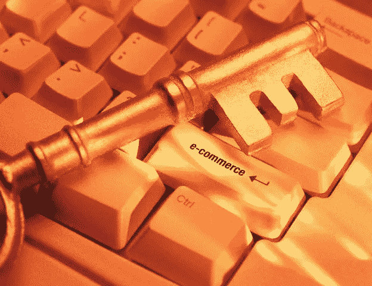

# 区块链将迎来去中心化电子商务的新时代

> 原文：<https://medium.com/hackernoon/blockchain-ushering-in-the-era-of-decentralized-e-commerce-8ef3c67a3913>

我们是进入数字时代的一代人，电子商务已经成为现代生活的一部分。网上购物出现了前所未有的增长，并从实体零售中明显转移出来。这种转变之所以成为可能，是因为技术的发展带来了新的、更具创造性的分销方式、运营规模化解决方案以及个人日常购物习惯的改变。

随着我们进入第二代数字时代，这一转变过程将继续下去。区块链技术有望重塑电子商务的格局，就像上一代基于互联网的创新一样。各种公司再次开发新的商业模式、新的分销方法、更有效的利用购买力的方法以及提高物流和后勤运作的效率，以迎接下一代电子商务的到来。

## 区块链和电子商务的兴起

1995 年，Amazon.com 打开了国门。它标榜自己是“地球上最大的书店”，为互联网用户提供在网上商店买书的能力。上市四年后，Amazon.com 的销售额达到了 10 亿美元。今天，它是一个电子商务巨头，在全球范围内拥有超过 1 亿名亚马逊 Prime 计划客户，年净收入接近 1780 亿美元[。](https://www.statista.com/statistics/266282/annual-net-revenue-of-amazoncom/)

随着越来越多的[消费者开始在网上购物，亚马逊的成功甚至对美国的购物习惯产生了更广泛的影响。Forrester Research 预计，到 2022 年，美国的电子商务销售额将占所有零售销售额的 17%，高于 2017 年的 13%。对全球电子商务销售额的预测要高得多。eMarketer 预测，到 2021 年，全球电子商务销售额将达到 4.5 万亿美元。](https://www.digitalcommerce360.com/article/us-ecommerce-sales/)

## 对电子商务增长的挑战

为了使电子商务充分发挥潜力，必须克服一些挑战。这些都与电子商务行业各部分之间的摩擦有关。当前的电子商务生态系统有几个部分，每个部分都有自己的主导者:

*   店面—Shopify.com
*   支付处理— Paypal、Stripe
*   运输和履行——联邦快递、UPS
*   后勤处理—Salesforce.com

这些部分如何相互作用有几个摩擦点:

**最后一英里配送**:[最后一英里](/datadriveninvestor/how-blockchain-tech-can-improve-life-in-cities-and-reduce-costs-of-parcel-delivery-90a82ec17066)指的是货物运输旅程的最后一段，包裹从配送中心运输到最终消费者的位置。由于供应链的不灵活和过时技术的使用，最后一英里的交付是昂贵和资源密集型的。这些不仅是小零售商的问题，也是大零售商的问题。

**购买力**:虽然越来越多的消费者在网上购买商品和服务，但没有有效的机制来巩固他们的购买力，以便他们可以利用批发价格。

**小型零售商的分散化**:小型零售商无法获得垂直整合的服务平台。因此，他们必须使用如上所示的一组分散的服务。对于任何对亚马逊等大型零售商构成严重威胁的新竞争对手来说，这是一个障碍。

## 创业提供解决方案

新创公司 Buying.com 希望利用电子商务供需双方的低效率。使用区块链技术，它可以克服碎片化带来的效率问题，这是前代平台所不具备的。

微配送:除了 Buying.com 经营的配送中心，任何人都可以成为 Buying.com 网络上的一个节点，利用车库或家中的备用存储空间，实质上成为一个微配送中心。这个想法类似于 Airbnb 让人们把空房间变成酒店，或者优步让人们把汽车变成出租车。

**批量定价**:平台有一个计划，使个人消费者能够通过批量订单直接从制造商处获得定价。

**实时物流**:区块链解决方案提供实时物流数据。制造商、企业和消费者将无缝访问实时运输数据，以优化直运成本。

**加密货币**:Buying.com 利用自己的加密货币作为系统上交易的代币。

**透明且可审计**:Buying.com 利用区块链技术自动验证交易，并留下透明、不可更改的审计记录。

## 区块链对电子商务的潜力

当前的电子商务生态系统是在 90 年代中期第一波互联网浪潮期间发展起来的，大多数主要零售商都建立了网络和移动电子商务。此外，一些新的参与者，如 Amazon.com，Walmart.com，和其他出现在大众市场零售领域。

Buying.com 的商业模式是利用这些拥有区块链技术的传统平台所面临的障碍。而许多电子商务公司能够部署类似于购买的工程模型。大多数现有的玩家被他们的安装基础所阻碍。例如，虽然 Amazon.com 和易贝都意识到他们的用户界面可以大大改善，以提高转化率，但他们复杂的系统架构阻止他们做出重大改变。

因此，虽然有机会出现直接竞争，但 Buying.com 过早接受区块链将使 Buying.com 的商业模式暂时难以复制。

*订阅我的* [*中*](/@minadown) *和*[*Twitter*](https://twitter.com/minad21)*频道如果你喜欢我的文章，想了解更多关于区块链和加密货币项目的信息，弗劳斯夫。

如果您对本文有任何疑问，请在下面的部分添加评论。谢谢大家！*