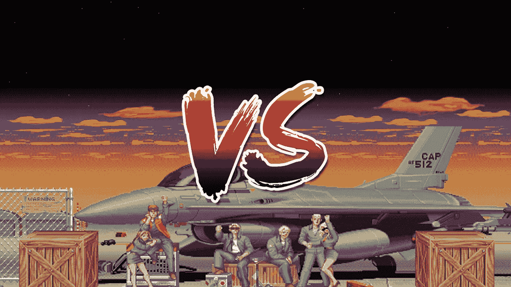

# 区块链与腐败……拯救民主的技术

> 原文：<https://medium.com/hackernoon/blockchain-vs-corruption-technology-to-the-rescue-of-democracy-d230d4b1af9a>

作为一个墨西哥人，我每天都有腐败的概念，腐败是可怕的，摧毁整个国家，把他们削弱到骨子里，然后毫无悔意地把他们吐出来，可悲的是，这是一个困扰我的国家的问题，就像拉丁美洲的许多其他国家一样。像墨西哥这样拥有巨大自然、商业、文化和能源财富的国家，主要由于腐败现象，生活在不确定、贫穷和暴力的环境中。

如果你关注一点国际新闻，你可能知道墨西哥今年 7 月份有选举。气氛紧张，人们害怕像过去那样的欺诈。就是这个时候[区块链](https://hackernoon.com/tagged/blockchain) [技术](https://hackernoon.com/tagged/technology)想到了。

如你所知，区块链技术有许多应用，正如我在以前的[故事](https://hackernoon.com/why-i-refuse-to-launch-an-ico-for-our-startup-and-why-you-should-also-refuse-a8dedede4e34)中告诉你的，它的潜力仍未被充分发掘。

这种技术可以使选举成为一种可靠的活动，在这种活动中，共识将超越任何控制和意志。(虽然这很浪漫)。这样会便宜得多，而且每个人都可以实时获得结果。一个乌托邦。

因此，通过实施技术，民主可以走上一条新的道路，最终，权力掌握在人民手中。

然而，要做到这一点，首先我们每个人都必须有实现真正民主的愿望……这很困难，但也是可能的，不会很快，但可能在未来实现。毕竟，希望是最后消逝的东西。

你怎么想呢?..你将如何运用区块链技术来改善你的社区？