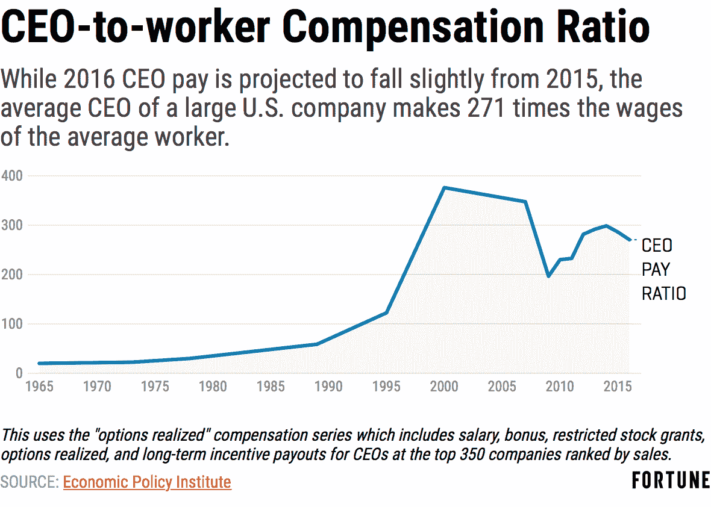

# 区块链将修复许多你从未意识到的问题

> 原文：<https://medium.com/hackernoon/blockchain-will-fix-many-problems-you-never-knew-you-had-1f1610f9fbaa>

如今，权力结构是一个热门话题。随着最近对男性，尤其是处于权力地位的白人男性的所有批评，人们很容易产生这样一种感觉，即出生时就可以识别的特定社会阶层对我们的福祉构成了不应有的威胁。但这真的是思考这个问题的最佳方式吗？阿克顿勋爵的格言“权力腐败；绝对的权力绝对的腐败”？我认为，我们观察到的当权者的大多数不良行为并不是因为谁在掌权，而是因为我们的社会制度是如何保护当权者的。

等级制度是真实的，并且有其生物学根源。像更原始的动物一样，人类的血清素水平受我们认为自己在社会等级中所处位置的调节。我们对其他人的[身体尺寸的感知已经进化到考虑他们的等级位置](https://gustavus.edu/psychology/files/Anderson.pdf)，这意味着我们对我们周围物理环境的感知被我们在等级中的位置扭曲了。那么这在现实世界中意味着什么呢？这意味着我们的大脑确实会对等级制度中高于我们的人表现出更大的尊重。2015 年，约 53%的美国职场人士[在 500 人以上的公司工作](https://www.census.gov/programs-surveys/susb/data/tables.html)，而 1988 年这一比例仅为 45%，这意味着我们中的更多人每天花更多的时间试图安抚更多的经理员工，同时我们作为客户在日益复杂的客户服务迷宫中工作。

好吧，公司越来越大，那又怎样？请记住，随着组织的成长，顶层和底层之间的层级差距也会扩大，并产生预期的结果，如首席执行官的薪酬与普通员工的薪酬之比增加:

这也意味着掌权者不仅对他们的下属有越来越大的影响力，而且如果我们能够推断出早期的发现，他们的下属可能会认为他们对他们的影响力比实际上更大。(有没有想过为什么[的首席执行官都这么高](https://www.economist.com/news/business/21620197-getting-top-much-do-how-you-look-what-you-achieve-look-leader)？理解这种动态的聪明的专制者会创造最大化他们这种半神感知的氛围。事实上，我从在大型咨询公司和投资银行工作的朋友那里听说，他们中的许多人会有意招聘缺乏安全感但有能力的初级员工，因为他们最容易控制，也最不可能质疑这种权力动态。随着美国公司变得越来越大，在某种程度上，他们的运营和招聘模式变得类似于街头帮派，他们也寻找有能力但不可靠的士兵来执行他们的命令。

尽管大公司的领导者仍然受到市场反馈的影响，[大规模减少反垄断法的执行](https://www.yalelawjournal.org/note/amazons-antitrust-paradox)已经使我们越来越倾向于赢家通吃的垄断经济学，导致权力日益巩固和绝对的领导者越来越少。记住阿克顿勋爵的公理，当更少的人拥有更大的权力时，我们怎么可能期望更少的腐败、更少的操纵和更少的自私行为？

因此，当优步利用其市场地位，惩罚抱怨费率下降的司机时，这有什么好奇怪的吗？毕竟，他们可以(或认为他们可以)并且市场力量可能鼓励他们创造一个操纵的激励计划，以基本上是诱惑性的费率吸引司机，知道他们最终会在辞去其他工作后将他们锁定在较低的费率，一旦他们的自动驾驶技术使他们的司机过时，他们最终会取代他们。康卡斯特已经有了像 T3 一样的 T2 声誉，这并不奇怪，因为当消费者购买一家公司提供的服务，而这家公司在 20 世纪 50 年代[可能是非法的](https://www.yalelawjournal.org/note/amazons-antitrust-paradox)，我们要么缺乏可行的替代方案，要么认为我们缺乏可行的替代方案。所以当他们说“等等”时，我们会说“多久？”

那么，区块链科技将如何解决这个问题呢？因为[区块链](https://hackernoon.com/tagged/blockchain)科技极大地扩展了能够筹集[启动](https://hackernoon.com/tagged/startup)资本的组织的数量，更多的组织事实上将通过发行代币来筹集资本。由于区块链激励经常通过分发这些代币来共享，因此为分散式组织的成功做出贡献的群体参与者将获得相应的奖励，因为区块链技术允许他们在他们建立的社区中根据其贡献的价值获得细分的股权。早期的优步司机理论上可以以类似的方式获得奖励，但代币可以分发的部分性质将使这种类型的激励计划更容易在零工经济中推广到兼职服务提供商。

这种去中心化的组织结构将为社区成员提供类似于民主为逃离法西斯主义的人们提供的利益和权衡。这意味着这实际上并不是所有都更好，因为围绕工作协调会有不同的挑战，但对于一些行业来说，与更多消费者选择和更少人被诱惑的好处相比，这是一个很小的成本，只会剥夺他们的生产价值，而不会与其贡献成比例地受益。

这些都是非常理论化的。为了实现这种改变，正在创建哪些切实可行的项目？为什么现在是激动人心的时候？垄断和卡特尔寻求不劳而获的明显例子可以在许多经纪行业中找到。在 P2P 技术出现之前，经纪公司会筹集大量资金，以吸引买家和卖家加入他们的平台，然后最终提高他们从一端或两端的参与者那里收取的费用。大量资金被投入到创建这些经纪公司中，因为它们受益于网络效应，并拥有垄断般的利润潜力。

由于对较小的经纪公司来说，进入这些领域非常具有挑战性，许多人甚至不去尝试，但这种情况可能很快就会改变。除了机构信任度[长期下降](http://content.gallup.com/origin/gallupinc/GallupSpaces/Production/Cms/POLL/bvejl9raikiaghqfwt6w3w.png)之外，过去几个月发生了一些有趣的变化，表明这种动态可能很快发生转变:

*   投资者对建立分散交易所的较小团队的兴趣大幅增长
*   预建的市场工具的出现，为较小的团队提供了他们所需要的功能，以避免重复发明轮子

长期趋势证明，人们想要一个替代现有机构统治的机构，而新兴趋势表明，这种情况很快就会出现。 [CanYa](https://canya.io/) 此外, [WeTrust](https://www.wetrust.io/#home) 、 [Origin Protocol](https://www.originprotocol.com/en) 和 [district0x](https://district0x.io/) 也筹集了大量资金，为他们的市场合作伙伴提供金融服务、开发工具和组织治理解决方案，节省了他们的时间和资源，使他们能够更有效地应对强大的集中化竞争。

我什么时候会注意到变化？强大的分散玩家出现的确切时间很难预测，但基于他们强大而臃肿的集中竞争的行动，我们肯定应该问什么时候，而不是如果。鉴于他们作为平台提供商的性质，在一个大获成功的市场出现之前， [WeTrust](https://www.wetrust.io/#home) 、 [Origin Protocol](https://www.originprotocol.com/en) 和 [district0x](https://district0x.io/) 很可能会与几十个面临分散市场的早期消费者合作。但最终消费者会做出选择，在几个月内，消费者和供应商将开始看到服务的扩散，而没有中间人的诅咒(或祝福)。