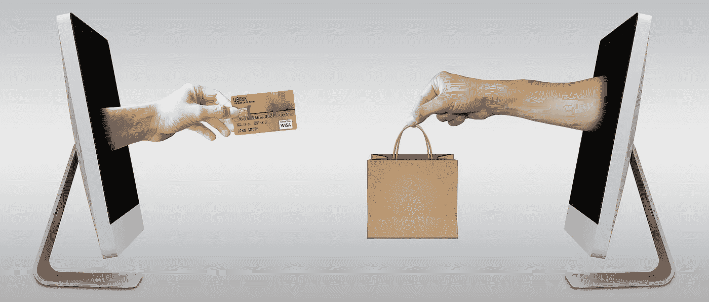
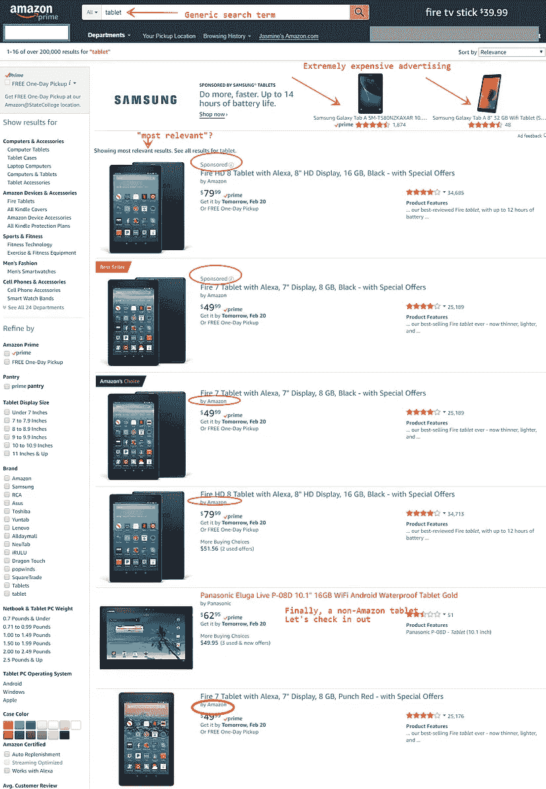
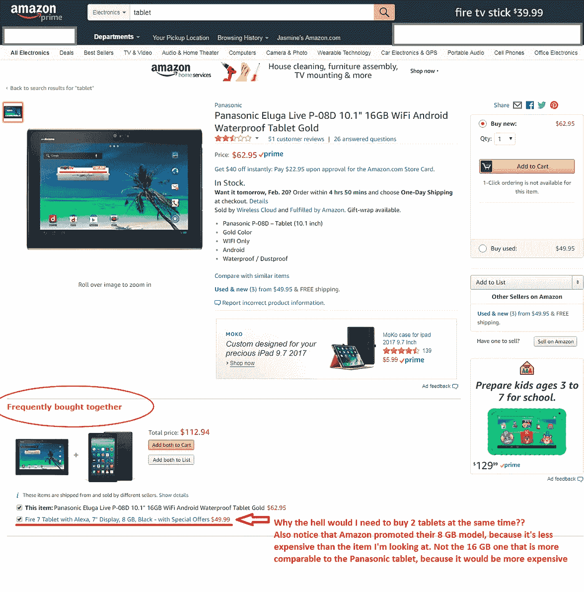
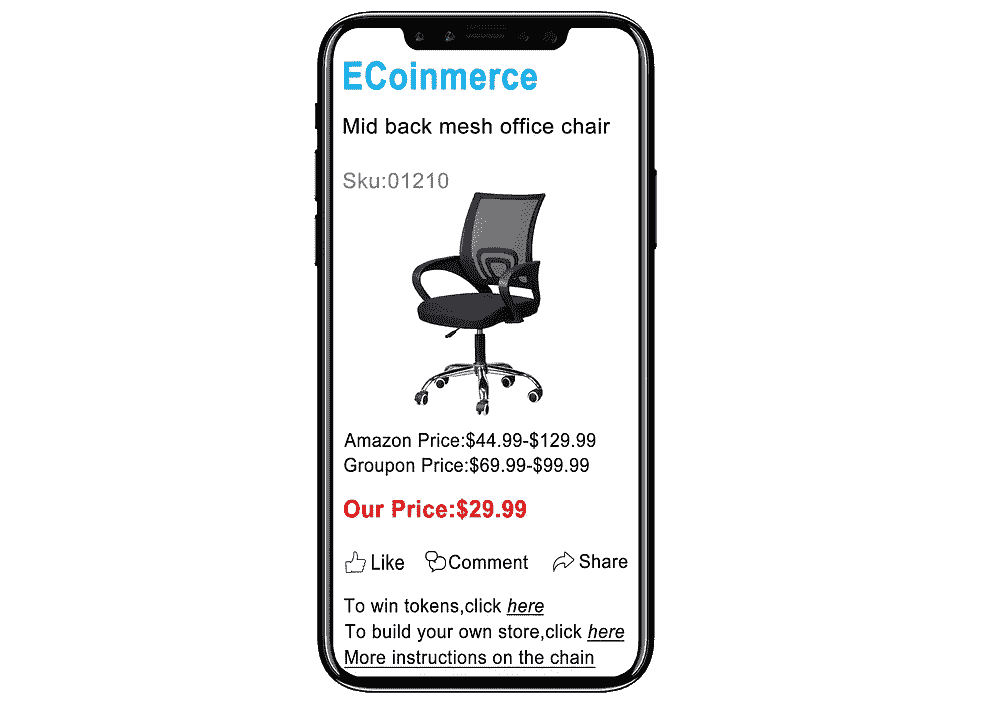
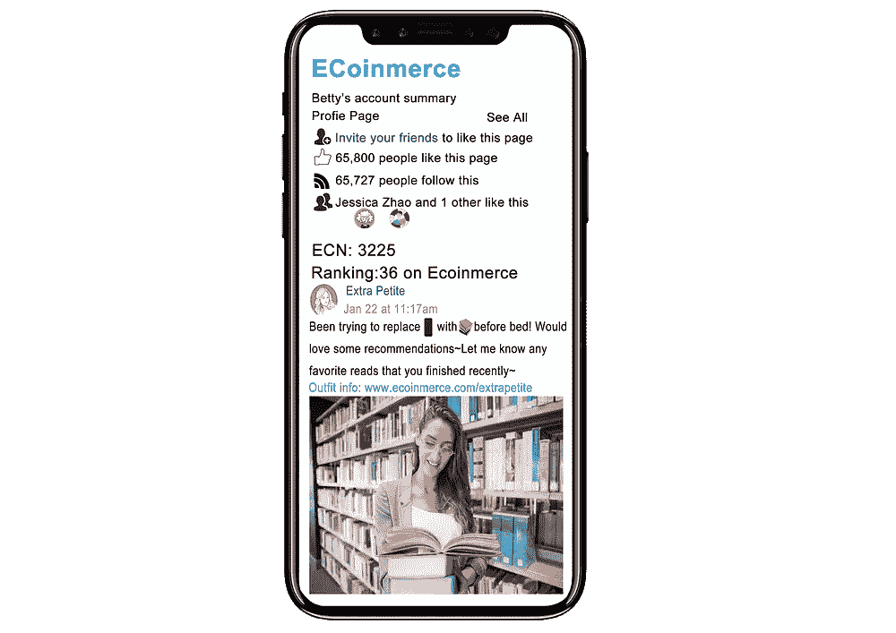
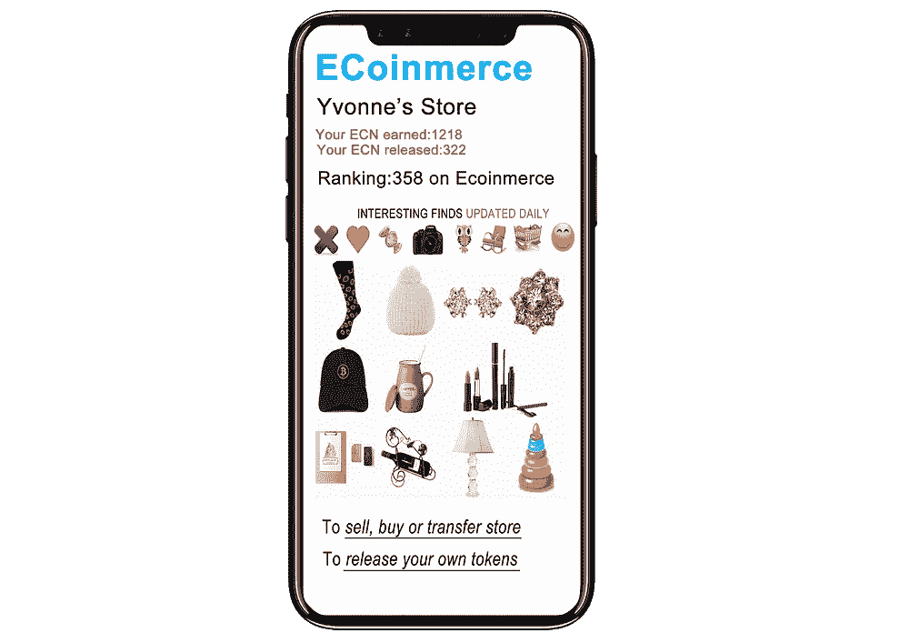
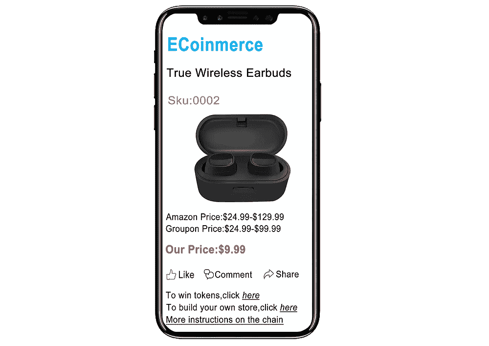

# 区块链将扼杀传统电子商务——原因如下

> 原文：<https://medium.com/hackernoon/blockchain-will-kill-traditional-e-commerce-heres-why-4cc07a2f4c06>

亚马逊、易趣和阿里巴巴等流行的电子商务平台已经改变了我们的生活和购物方式。电子商务平台给消费者带来的便利、低廉的价格和种类繁多的产品只是其中的几个主要好处。但是代价是什么呢？我们将何去何从？

[区块链](https://hackernoon.com/tagged/blockchain)是一项改变模式的技术，它将继续创新并改善各种行业。那么，电子商务如何融入其中，区块链将如何提供帮助呢？

据媒体预测，2020 年仅美国在线零售市场就将达到 1.2 万亿美元。虽然市场在增长，但它的主要问题也开始显现。让我们快速看一下其中的几个。

# **零售商**

*数字资产不归创造它们的人所有*

在任何给定的电子商务产品页面上，你都会发现大量高质量的照片、产品视频、评论和其他信息。通常情况下，店主会花很大的代价来创造这些东西，因为没有它们，就没有人会买他们的商品。然而，产品页面上所有东西的所有权都属于商家销售的电子商务平台。

此外，电子商务平台上存储的销售信息和用户行为模式也可以用于销售类似产品的不平等竞争。例如，亚马逊可以任意宣传自己的产品，并将其置于竞争之上。在购买亚马逊 Fire 或 Alexa 设备的竞争对手时，你会经常看到这种情况。

*高收费和禁止性规定*

为了保护利润和带来收入，传统的电子商务平台从零售商那里抽取总销售收入的%,并且通常还收取每笔销售费用。这些费用因平台而异，但范围通常是总销售价格的 10–50%。零售商将电子商务平台的降价计入最终价格，这导致消费者的价格更高，零售商的利润更低。除了电商平台，大家都是双输。

此外，许多这种集中式平台切断了消费者和卖家之间的直接联系。例如，亚马逊允许零售商发送一封后续电子邮件，要求审查和/或检查顾客的满意度。这大大减少了零售商可以提供的关系管理的数量。更糟糕的是，亚马逊雇佣了自己的客户服务团队，他们不熟悉产品或公司政策。这进一步增加了交易成本，并且很容易由商家直接完成。

如果你不遵守他们的规则，你就出局了。有许多案例表明，集中式电子商务平台关闭了商家对自己页面的访问，却没有说明原因。没有什么比你的生计被毫无理由地夺走更糟糕的了！

# **消费者**

*低价的假象和产品选择*

亚马逊和其他电子商务平台上的价格可能 ***显得*** 低。但这只是因为我们可以比较的另一个参考点是实体店，实体店的运营成本很高，因此需要对他们销售的产品收取更多的费用。但如上所述，电子商务世界在零售商方面有大量的隐性费用，最终都转嫁给了消费者。没有一家商店，无论是网上商店还是实体商店，会在不盈利的情况下出售产品。因此，如果我们能够降低零售商销售产品的成本，我们必然会降低消费者购买产品的成本。

虽然现在我们似乎可以在网上买到几乎任何我们想要的东西，但这也是与当地超市或电子商店相比产生的错觉。假设您想要一个定制的[在此插入任何产品]，带有一些特殊功能或附加功能。你如何在亚马逊或其他地方购买呢？你 ***也许*** 能够在世界上的某个地方找到专家，但是购买一次性产品的成本会非常高。但可以肯定的是，肯定还有其他人想要和你一样的产品。你如何联合起来做一个团购来降低每个人的成本？在今天的电子商务生态系统中，你根本不能。

*没有回顾、帮助或分享的动机*

传统的电子商务平台不鼓励顾客留下评论，也不帮助他们已经拥护的品牌。例如，亚马逊最近对他们的评论系统进行了大刀阔斧的改革，因为它被用户滥用，他们会向品牌收取过高的费用来留下对他们产品的评论。当初为什么会被滥用？因为客户没有动力花时间留下评论、回答问题或与朋友分享页面/产品。

为你喜欢的产品留下深入的评论而获得报酬，或者从你在社交媒体上发布的帖子推动的销售中获得佣金，这不是很好吗？

# **区块链拯救世界**

区块链将允许去中心化的市场出现，在缺乏集中团队和固有成本的情况下，将为消费者提供更低的价格，为零售商提供更好的规则。虽然一些早期的区块链项目，如 Syscoin，正在创建在线市场，但没有一个触及到解决电子商务行业当前面临的所有问题的表面。

直到现在。

一个名为 [ECoinmerce](https://www.ecoinmerce.io/) 的新项目已经开始为他们区块链驱动的市场和平台做准备。该平台旨在解决上述所有问题以及许多其他问题。

对于零售商来说，在 ECoinmerce 上销售商品的成本将低于 0.1%，最重要的是，他们将完全拥有所有数字资产，包括他们的数字店面、产品照片/视频和评论。这种所有权将被记录在区块链上，并且是 100%可出售、可出租和可交易的。

此外，零售商将能够通过直接在 ECoinmerce 上推出初始硬币产品来标记他们的商店。这将使零售商增加品牌亲和力，忠诚的客户成为他们喜欢的项目的早期投资者。它还将带来新的收入来源，因为零售商可以在销售产品的同时销售代币，以实现利润最大化。

对于消费者来说，ECoinmerce 将允许用户以更高的折扣集体购买，互相拍卖商品，并将以巨大的折扣展示商家的日常交易。用户还将被激励(通过象征性奖励和/或佣金)推荐朋友，与社交媒体关注者分享交易，并为他们购买的任何商品撰写产品评论。

该项目由来自电子商务、供应链和产品开发行业的专家团队领导。他们将很快宣布他们即将到来的 [ICO](https://hackernoon.com/tagged/ico) 的日期。要了解更多关于该项目的信息或注册更新，你可以访问[他们的网站](https://www.ecoinmerce.io)，加入[他们的电报组](https://t.me/ecoinmerce)，在脸书上喜欢他们[，或在推特](https://www.facebook.com/Ecoinmerce/)上关注他们[。](https://twitter.com/Ecoinmerce)

