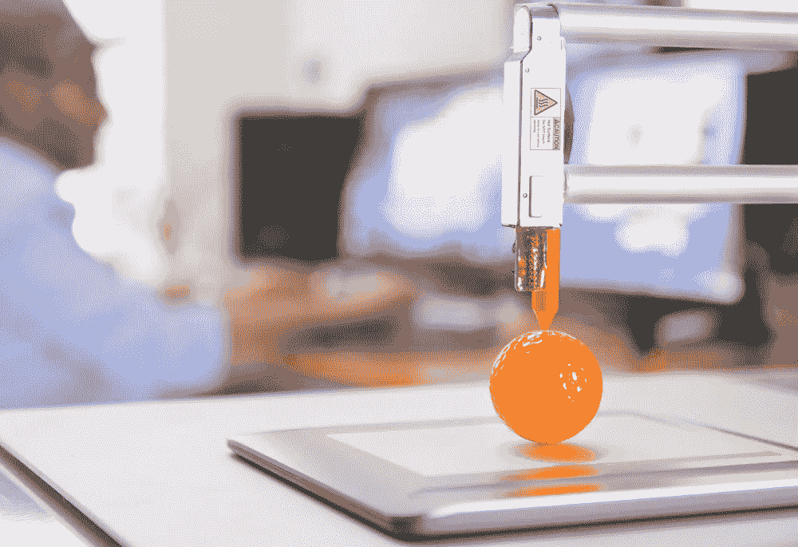

# 区块链会把供应链变成需求链。原因如下

> 原文：<https://medium.com/hackernoon/blockchain-will-turn-the-supply-chain-into-a-demand-chain-heres-why-c039f4649cd0>

如果你想知道未来的创新将如何改变供应链，你可能问错了问题。

即将到来的变化不仅会调整供应链，还会彻底改变供应链。

假设一家航空航天公司需要在迪拜为他们的一台喷气式发动机制造一个风扇叶片。在未来，他们将为设计文件付费，将它们发送到现场的自动机器上，然后等待零件在需要的地方生产出来。

不点餐。不发货。欺诈的空间很小。

> 这将是从传统供应链到新系统——需求链的巨大转变。

需求链是对现状的彻底背离，它塑造了一个可能的未来，在这个未来中，生产是本地化和即时的，公司不再依赖于集中的制造商来创造产品。

当你第一次听到这个想法时，它可能看起来很牵强，但是一旦你明白它看起来像什么，它就非常合理。它已经开始成形了。

以下是技术让我们远离供应驱动型社会的原因:

# **当前的制造系统需要一个欺诈解决方案。**

为了完善设计文件，公司每年都要花费数千万甚至上亿美元进行研发。

专利保护某些复制和数据，但事实是，蓝图仍然会泄露。更重要的是，那些蓝图中的元数据泄露了。在元数据中有一些指令，告诉机器如何生产产品。

> 当谈到[增材制造](https://www.technologyreview.com/s/513716/additive-manufacturing/)——一次一层材料制造产品的过程——元数据会有难以置信的价值。

如果区块链科技被用于增材制造，智能合同可以在公司和制造零件的机器之间建立直接关系，而不是涉及制造商复制或出售数据的关系。

这种直接联系增加了知识产权的安全性，并消除了硬件行业中许多关于假冒产品和转移的问题。

但这并不是唯一的影响。区块链技术的使用也将推动我们更接近建立需求链。

# 区块链的增材制造将消除对集中制造商的需求。

未来，区块链上运行的更多机器将会自动生产商品。因此，无论您使用的是一台还是 100 台机器，都可以快速保持制造产品的质量。

当一家公司与生产其产品的机器有直接联系时，没有理由将它们都集中在一个地方，这就需要将货物运送到全球各地。

这意味着零件——比如喷气风扇叶片——可以在需要的时候在当地制造。

> 公司可以按需获得产品，而不必经历订购、等待发货和跟踪交货的复杂过程。

一旦这一点开始成为更多公司的现实，整个行业将开始脱离当前的供应链规范。

# **一个基于区块链的系统将为公司打开全新的视角、机遇和挑战。**

关于需求链仍有许多问题需要回答，但基础已经具备。

在一种情况下，完成工作的机器将由使用它们的公司部分拥有。每个公司都参与到网络中，并信任分散的 OME，而不是使用另一家公司来进行制造。

> ***比起大量生产服装的工厂，服装和其他商品可以在当地的中心按需生产，这些服装最终可能被购买，也可能不被购买。***

想象一下布鲁明戴尔百货公司，但是没有现场的大量库存。相反，顾客走进去，选择他们喜欢的品牌和服装，然后短暂地等待一台 3D 服装机器使用耐克、J. Crew、李维斯或顾客选择的任何品牌的设计文件制作衣服。

在这种情况下，企业不必担心产生过剩库存，或者在误读需求时出现短缺。他们也不必担心专有信息的泄露，或者在他们制造商的工厂里非法的“三班倒”。

这是一个更可持续的系统，可以为我们节省大量的原材料和能源，并且比许多人想象的更接近于成为现实。

**感谢阅读！**

**关注我的** [**推特**](https://twitter.com/iamSamsterdam) **和** [**Quora**](https://www.quora.com/profile/Samantha-Radocchia) **了解更多关于区块链技术的见解。或者在这里** **与实录团队** [**取得联系。**](https://chronicled.typeform.com/to/y80B2Y)