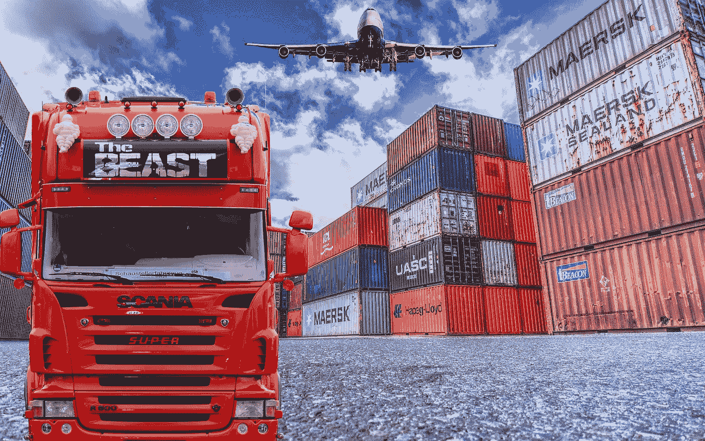

# 区块链为汽车行业谱写新篇章

> 原文：<https://medium.com/hackernoon/blockchain-writing-a-new-chapter-for-automotive-industry-48a8151eec99>

## 已经颠覆了金融服务和供应链行业的区块链技术终于来到了汽车行业。

我们将看看区块链在汽车行业的一些潜在应用，以及一些现实生活中的例子。所以，坐稳了！

到目前为止，你一定已经阅读了数百篇关于什么是区块链及其优势的文章。所以，我们不要再浪费时间了，直接进入正题吧。让我们来谈谈区块链能为汽车工业做些什么。自从汽车问世以来，汽车行业一直在拥抱技术进步，但变化的速度如此之快，以至于全球的汽车原始设备制造商(OEM)都在努力跟上。汽车行业正在发生变化，区块链将对这种变化产生重大影响。相信我，区块链将是下一个大事件，它不会跳过汽车行业。在过去一年左右的时间里，汽车行业的利益相关者一直在研究如何将区块链技术应用于商业，并寻求推出重大举措。

汽车行业是一个复杂的生态系统，多方参与汽车的设计、生产、分销、营销、销售、融资和服务。

**以下是一些示例场景:**

# 汽车互动

随着自动驾驶汽车和数百万相互通信的设备的兴起。需要这些交互和事务存在于共享、安全和高度许可访问的不可变数据库上。汽车原始设备制造商、零件分销商、经销商、维修技工、保险提供商和其他人之间的共享分类账可以支持汽车内零件或设备自主感知自身需求的能力。例如，汽车可以建议驾驶员需要维修，联系远程用户更新或附近的供应商更换零件，协商服务和维修的价格和预约，认证合适的技术人员，并处理相应的服务付款。

**雷诺推出了跨互动的区块链透明度的最新例子。这家法国汽车制造商正在试验一个数字化汽车维护程序******，该程序使用区块链作为共享分类账，在一个地方记录所有汽车维修和维护历史。它表示，下一个试点将专注于基于车辆的微交易，这对于将物联网与价值交换相结合至关重要。****

******Oaken Innovation 最近展示了一个由区块链启用的收费站******的想法，其中特斯拉汽车在通过收费站**时自动支付，因为两个节点(汽车和收费站)都有以太坊节点，它们使用智能合约来触发机器对机器(M2M)的交易。******

# ****零件认证****

****外表真实的假冒汽车零件经常进入供应链，并到达经销商服务中心。这些零件通常在安装后很快就会出现故障，进而对汽车制造商和零件供应商品牌造成损害。为了打击这些欺诈行为，汽车制造商已经使用了许多反欺诈技术和操作，但不知何故，假冒零部件总是能够渗入供应链。****

****区块链可以解决这个问题，为每个部分创建独特的 ID，以及从该部分创建时起不可变的时间戳。这些标签连接到区块链，可以设置到零件中，以增加真实性保护级别。车主可以访问关于真实性的信息，以确认哪些零件已经更换，制造商可以更有效地执行召回，或者服务中心可以在零件达到使用极限时发出信号。****

******一家德国公用事业公司**[**innogy SE**](https://www.innogy.com/web/cms/en/3087918/for-your-home/)**，推出了“数字双胞胎”平台来培养区块链的这种用法。**Digital Twin platform 旨在为每件产品提供一个用于认证的“Digital Twin”。****

# ****制造商、销售和服务金融****

****汽车制造商必须等待几周或几个月才能从进口商/分销商/经销商处收到车辆装运的付款。由于多方控制着供应链中的不同步骤，这是一个繁重的文书工作流程。基于区块链的系统将使不同方之间的准确信息更加透明，更快地处理进出口和银行文件，并最终缩短结算时间。****

****汽车金融提供商通常不了解汽车司机的真实驾驶行为或汽车的服务历史。基于区块链的系统将使驾驶模式和服务事件能够被发送到各方都可以访问的共享账本。车辆实际磨损信息的透明度将有助于汽车金融提供商更准确地评估车辆的剩余价值。典型的汽车融资包括一系列验证步骤，区块链可用于提高效率。****

******印度汽车 OEM** [**马恒达**](https://www.ibm.com/blogs/blockchain/2017/03/disrupting-supply-chain-financing-mahindra/) **，创建了一个专门专注于汽车融资的区块链孵化器**用例。****

********

# ****供应链****

****制造工厂必须与多层供应商、第三方物流和运输公司有效协调，以确保零件及时交付和优化库存水平。汽车供应链极其复杂，由众多类型的零件、硬件、软件和固件供应商、分销商、经销商、监管机构、保险公司等组成。基于区块链的系统将使不同方之间的准确信息更加透明；改善即时物流，减少错误订单，提高库存周转率。各种区块链技术也可以应用于多个阶段。安全、身份和许可影响供应链中的防伪措施；智能合同、oracles 和自定义代码支持安全性和合规性；付款和合同转移，以加快交易的对帐，并将资金和资产从一方转移到另一方。****

******[**丰田研究院(TRI)**](http://corporatenews.pressroom.toyota.com/releases/toyota+research+institute+explores+blockchain+technology.htm) **今天宣布，它正在探索区块链和分布式账本技术，用于开发一个新的移动生态系统，该系统可以加速自动驾驶技术的发展。**区块链技术通过独立计算机网络发送信息，称为分布式账本，旨在确保交易安全，保护数据/财产的所有权。TRI 认为，区块链可以在用户中建立透明度和信任，降低欺诈风险，减少或消除交易成本，如第三方机构收取的费用或附加费******

# ****车辆跟踪****

****一种常见的、不道德的汽车经销商做法是出售一辆展示车，然后不向为该车提供贷款的银行报告出售情况。这种做法使经销商有周转资金来支付工资和供应商。如果银行发现了，它会立即对交易商采取行动。但由于汽车是合法出售的，银行对车辆没有索赔权。同时，给经销商的融资已经花完，必须核销。有了透明的数据访问，允许这种行为发生的信息不对称就不复存在了。随着更多利益相关者选择加入，区块链提供了即时的透明度并获得了价值。****

****[**Carpass 项目**](https://www.car-pass.be/en) **旨在通过跟踪车辆“生活事件”的“数字钱包”来促进车辆跟踪**它整合了远程信息处理数据，可监控汽车行驶的位置和方式，主要是在发动机运转困难的情况下。通过使用汽车历史，人工智能算法可以准确预测汽车在任何给定时间的转售价值。能够跟踪车辆也意味着更好地执行环境法和对制造商进行审计。车辆跟踪也让制造商有机会向客户销售增值服务。****

# ****电动汽车****

****随着电动汽车越来越流行，它将需要一个新的机器对机器(M2M)基础设施，包括能源提供商、充电站所有者、汽车制造商、零部件供应商和车主。没有一个企业能够管理错综复杂的关系来团结利益相关者，也没有一个实体应该拥有这个平台，这会造成垄断。****

****德国能源集团 RWE 的子公司 Innogy SE 宣布，它已经通过其电动汽车创业公司 [Share & Charge](https://shareandcharge.com/) 在德国各地推出了数百个区块链供电的电动汽车充电站。新的电动汽车解决方案允许电动汽车的所有者在 innogy Innovation Hub 的初创企业 Share & Charge 设立的任何新充电站为他们的汽车充电，以及通过使用 Share & Charge 应用程序以欧元进行数字支付的现有充电点充电。这个应用程序是世界上第一个使用区块链技术的电子移动社区平台。****

# ****自主拼车****

****Lyft 和优步等打车服务已经彻底改变了我们使用汽车的方式。只需在应用上轻轻一划，司机就会开车接你，把你带到目的地。****

****区块链可以帮助实现这一愿景。【2017 年 8 月，咨询公司 [**安永&(EY)宣布**](https://webforms.ey.com/gl/en/newsroom/news-releases/news-ey-advancing-future-of-transportation-with-launch-of-blockchain-based-integrated-mobility-platform) **推出宇宙魔方。这个位于区块链的系统不仅促进了乘车的共享，也促进了车辆所有权的共享。最终，它可以帮助车主管理整个自动驾驶汽车车队。该系统将在业主同意的任何基础上自动结算付款。******

# ****值得注意的提及****

*   ******从 IBM 和 Context Labs 到福特和宝马等公司在今年迪拜的未来区块链峰会上宣布合作**，并聚集在一起成立了移动开放区块链倡议(MOBI)。该协会将进一步探索区块链的用途，并研究其技术如何使全球运输行业更便宜、更安全，并更广泛地为世界各地的公民所用。****
*   ******保时捷称赞自己是业内第一家在系统中测试区块链实施的公司。**二月份，他们在官方博客上宣布,与柏林的初创公司 XAIN 合作，他们正在汽车上直接测试区块链应用。****
*   ****2017 年 2 月。以品牌**梅赛德斯-奔驰而闻名的戴姆勒股份公司加入 Hyperledger 组织，成为其高级会员。** Hyperledger 是一个跨行业的合作项目，旨在推动区块链技术的发展。****
*   ******CarVertical 正在开发一个基于区块链的解决方案，该方案解决了汽车历史不透明的问题。**如果我们考虑到每辆车在其生命周期中平均有 3 到 5 个车主，很明显 80%的车主对他们的车一无所知。这家初创公司表示，他们将从不同来源收集尽可能多的汽车历史信息，并将其输入区块链注册表。这样，如果你想买一辆二手车，你总是可以检查汽车的历史。****
*   ****IBM 和马士基最近[宣布合作](http://www-03.ibm.com/press/us/en/pressrelease/51712.wss)创建一个基于区块链的全行业全球贸易数字化解决方案，以转变全球跨境供应链。****

# ****未来会带来什么****

****虽然区块链技术的这些应用确实有很强的理由改变汽车行业的许多方面，但创新者才刚刚开始触及区块链在汽车行业应用的皮毛。****

****有无限的可能性，其中一些已经形成了概念——区块链鼓励更环保的驾驶，区块链的汽车保险和融资，区块链的汽车公司，区块链的远程锁定和解锁车辆——不胜枚举。随着区块链被证明是安全的未来，以及汽车本质上成为物联网设备，两者的融合似乎是理所当然的。对于领先的汽车制造商来说，成为这一尖端技术的第一选择是完全合理的，毫无疑问，区块链将在汽车行业的未来扮演重要角色。****

****来源:[https://www.azom.com/](https://www.azom.com/)，[https://www.tractica.com/](https://www.tractica.com/)****