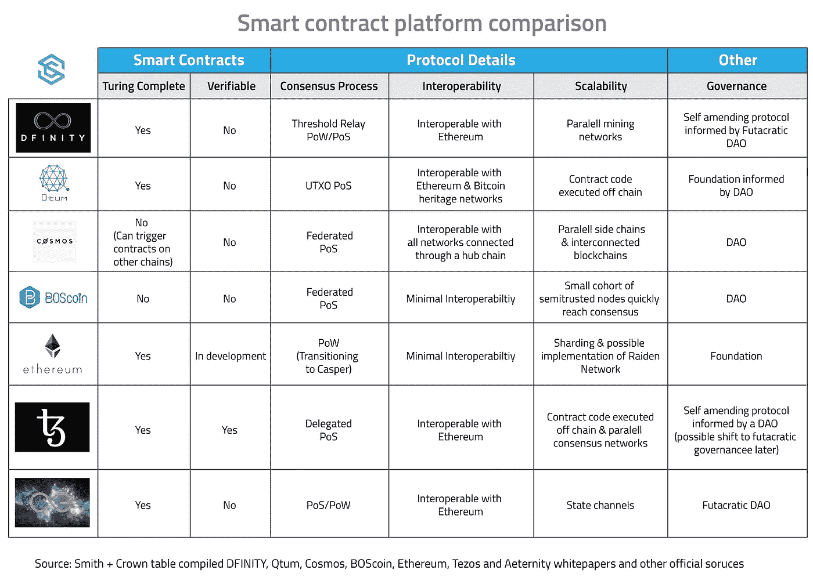
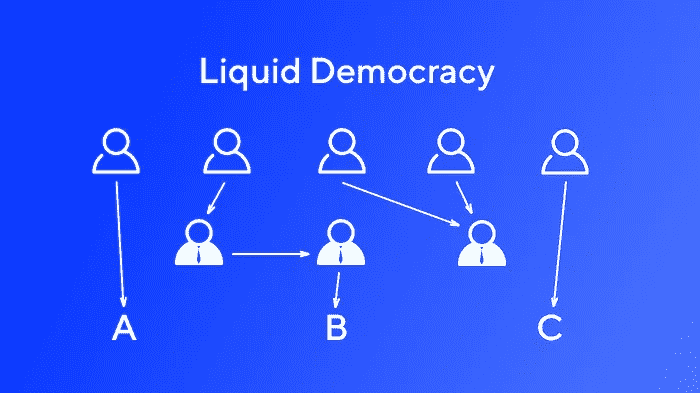

# 区块链不应该是民主国家

> 原文：<https://medium.com/hackernoon/blockchains-should-not-be-democracies-14379e0e23ad>

你如何治理区块链？

这听起来可能是个奇怪的问题。理论上，区块链根本不应该被治理——它们应该是“没有权限的分散账本”

但是区块链不仅仅是一本账簿。它也是一个软件生态系统，一个商人、公司和交易所的经济，在这一切之下，是一个开发者、矿工和用户的社区。

归根结底，区块链必须生活在人类及其争吵的混乱世界中。否则，账本上的数据在现实世界中就没有任何影响力。

区块链的发展需要做出许多重要的决定。因此，区块链必须得到治理。他们的统治者必然是人类。唯一的问题是:哪些人，以及这些人的决定是如何执行的？

# 区块链治理的方法

概括地说，治理区块链有两种方法。

第一种方法是**链外治理**。这基本上是大多数私人机构的治理方式——得到社区信任的个人走到一起，组成一个团体，负责区块链的治理和福祉。该小组的任务是修复错误和安全漏洞，增加功能和提高可扩展性，在公共讨论中代表区块链，并维护用户、公司和矿工之间的权力平衡。

乍一看，这看起来相当集中。但是叛乱的可能性总是存在的。如果足够多的用户不同意协议治理，他们可以发起一个[硬分叉](https://masterthecrypto.com/guide-to-forks-hard-fork-soft-fork/)并创建一个平行的区块链，这正是比特币现金和以太坊经典所发生的事情。分叉的威胁是对核心团队不良治理的有力检查。

大多数主要的区块链都是由这样的软治理过程治理的。比特币、以太坊、莱特币、Monero、ZCash 都遵循这个模式。

但是还有第二种类型的治理模式正在兴起，被称为**链上治理**。链上治理拒绝链外模式中固有的集中化。在链上治理模型中，区块链*中的用户直接投票*做出决策。根据投票结果，区块链会自动执行投票结果。这一切都发生在协议内。

链上治理是许多“区块链 3.0”项目的核心，比如 Tezos、DFINITY 和 Cosmos。其他的，比如 0x 和 Maker，正在计划通过一个更加渐进的过渡最终实现链上治理。

链上治理是一个激进的主张。它试图避开传统组织中混乱的人际关系。相反，它想把区块链变成一个自治的、机械的民主国家。

正如比特币允许用户对他们的钱拥有主权一样，链上治理将允许用户管理他们的整个金融系统。它呼应了启蒙运动和法国大革命时诱人的理想主义。作为一个抽象的想法，听起来很宏大。

但是链上治理是危险的，我担心它会导致灾难性的后果。**区块链不应该是民主国家，**而其中的原因是微妙而违反直觉的。

# 在区块链，没有人知道你是谁

民主是在“一人一票”的原则下运作的。但是区块链是化名的——你只能通过你的密钥被人知道。这意味着任何人都可以通过生成一组新的密钥来创建一个新的身份。

这带来了一个问题:要在区块链建立民主，你需要解决[西比尔问题](https://en.wikipedia.org/wiki/Sybil_attack)，这意味着你需要知道每个人在现实世界中的身份。这将需要一个全球信任的身份代理。到目前为止，还没有这样的经纪人存在，也很难想象这样的东西会很快出现。

因此，鉴于我们没有全球身份系统，链上治理方案实际上不会试图实施一人一票的规则。**相反，他们实行“一币一票”的规则，通过** [**股权证明**](https://en.wikipedia.org/wiki/Proof-of-stake) **。**

这是民主的一个松散的代理，因为硬币是稀缺的，不可能轻易产生。但是利害关系的证明意味着硬币越多的人在他们的投票中就越有分量。这显然不是民主——充其量是财阀统治。

也许这没关系。你可能会说，这迫使投票者在游戏中有更多的参与，也许大硬币持有者*应该在协议治理中有更多的发言权，因为他们会失去更多。*

另一方面，你可以提出同样的论点，即大公司应该对政府立法有更大的影响力——与普通公民相比，他们在财务上有更多的利害关系，所以公司不应该有更多的立法控制权吗？

很明显，这个论点忽略了一些重要的东西。财阀统治明确赋予金融权贵特权，让他们剥削资源较少的人。

但是有什么选择呢？开发团队中的一群人做所有重要的决定？哪个政府是由一群开发商管理的？

# 不要把区块链和其他国家混为一谈

让我们回避财阀政治的问题，假设“一币一票”是民主的有效代表。

我承认民主是治理一个国家的绝妙制度。但是区块链不是国家，大多数政府都不是民主的。

商业不是民主，军队不是民主，非营利组织不是民主，开源软件项目也不是民主。这是有充分理由的。

记住，区块链首先是实验软件。它们发展迅速，有许多未解决的技术挑战。例如，以太坊的路线图包括将其共识协议转换为利害关系证明，完全重写其虚拟机，并实现一个分片方案，还有一堆其他的。

这是很难的，技术性的东西。这更像是管理欧洲核子研究中心，而不是管理一个国家。对于如何治理困难的技术项目，我们有很好的模型:它们看起来像 Linux 基金会或 IETF。他们看起来不像群众领导的民主机构。

一个好的技术治理过程应该围绕有能力的技术专家的专业知识来构建，这些技术专家能够平衡技术健壮性和实际问题。他们应该规划并交付技术路线图。简而言之，他们应该把事情做好。

民主国家恰恰相反。他们竞选，他们宣传，他们阻挠议事，他们把自己分成党派，避开风险。在这种制度下，任何没有共识的东西都会被抛弃，而在政策的某一点上，人们会花费巨大的精力去说服普通选民。

不要误解我的意思:尽管有这些摩擦，民主是治理一个民族国家的正确过程！但这显然是管理实验技术的错误模式。

实话实说吧。这个东西仍然是非常早期的阶段。我不希望我的祖母*现在甚至使用*区块链，我也绝对不希望她在协议升级上投票。

但区块链和国家之间的类比被打破还有第二个原因:你随时可以退出区块链。

# 自由、分叉和退出

离开一个国家很难。即使不喜欢自己国家的治理方式，也不一定有资源移民。即使你离开了，政府也不一定会让你离开，邻国也不一定会热情好客。

一个人不能选择自己的出生地。生来就有一些固有的压力。因此，你可以说一个国家有义务保护其公民的福利，因为这些公民不能总是用脚投票。

区块链是不同的。如果你不喜欢你的区块链的选择，你可以卖掉你的硬币，移居到一个不同的区块链。更好的是，你可以为一个分支争取支持——或者，如果你足够有进取心，自己管理一个新的分支，就像去年几个团体对比特币所做的那样。

明确一点，分叉不是免费的。但相对于从一个国家移民，这是相当便宜的。在一个每个人都可以用自己的钱包投票的生态系统中，不清楚民主作为一种治理模式能给你带来多少好处。

# 民主的极端

此外，民主是非常棘手的权利。

以 [DFINITY](https://dfinity.org/) 为例。DFINITY 声称[允许通过他们的“区块链神经系统”进行链重写想象一下，有人在区块链被偷了硬币。受害方可以向网络提议取消交易。如果足够多的同伴在审查证据后同意，交易将被恢复，他们的硬币将被退还。选民的法定人数可以有效地改写这份账本。](/dfinity/the-dfinity-blockchain-nervous-system-a5dd1783288e)

乍一看，这听起来像是一个解决困扰许多其他区块链的加密货币黑客问题的聪明办法。但是如果你仔细观察，你会发现 DFINITY 走私了更糟糕的东西:暴民统治。

詹姆斯·麦迪森和托马斯·杰弗逊深刻理解[民主中隐含的危险。在《联邦党人文集》(Federalist Papers)中，他们明确表示，他们认为美国不应该实施直接民主，相反，他们提倡一种具有精心制衡机制的共和党模式。历史证明，直接民主](http://eyler.freeservers.com/JeffPers/jefpco55.htm)[通常](https://phys.org/news/2009-10-athenians-history.html) [会](http://www.spiegel.de/international/europe/brexit-editorial-the-trouble-with-plebiscites-a-1101235.html) [可怕](https://www.economist.com/node/18586520)。

有一句老话:“民主是两只狼和一只羊投票决定午餐吃什么。”更一般地说，任何 51%的多数总能剥夺剩下的 49%的权利(政治上类似于 51%的攻击)。这个问题被称为多数人的暴政，这是民主制度中众所周知的失败模式。怎样才能防止这种情况在区块链上发生？

利他主义和惰性可能使它不太可能，但我们以前见过这种事情。人们可以想象派系斗争、政治迫害、大阻挡者对小阻挡者的全面战争。如果打响第一枪，零和政治斗争中可能会出现各种各样的部落主义。

但是 DFINITY 的并不是唯一提出的模型。许多这种链上治理模式将采用[液体民主](https://en.wikipedia.org/wiki/Delegative_democracy)，选民可以将他们的选票委托给一个可以代表他们投票的代表。然后，这些代表会因其投票活动而获得报酬。

所有的民主国家都在努力解决投票率低的问题(甚至以太坊的 [DAO Carbonvote](http://carbonvote.com/) 也只有 4.5%的投票率)。流动性民主巧妙地解决了这个问题，让硬币持有者将他们的选票委托给更知情的选民。

这更接近于大多数现代代议制民主，在精神上也类似于[授权利益证明](https://hackernoon.com/explain-delegated-proof-of-stake-like-im-5-888b2a74897d)。但是任何委托投票方案都有其自身的问题。

这些网络中的大多数还没有上线。但是，在这些国家中，考虑到现在追求利润的代表之间为选票而竞争，你期望看到什么？

你可能已经猜到了:[竞选](http://jesta.us/witness-update/@jesta/witness-roadmap-potentially-for-jesta-in-2018)，[贿赂](https://earnlisk.com/)，[宣传](https://steemit.com/steemit/@cryptofreedom/steemit-is-so-much-more-than-just-a-method-for-individuals-to-get-paid-for-blogging-the-philosophy-behind-the-steemit-platform)，以及其他各种令人厌恶的政治。大量的精力花费在征集和说服随机硬币持有者与某些代表结盟上，而不仅仅是一心一意地改进协议。

为什么我们看不到呢？当代表因投票而获得报酬时，这些都是对激励的自然反应。现实世界的民主是充满制衡的复杂系统，这是有原因的。任其溃烂，民主很容易演变成任人唯亲。

# 民主是给失败者的

归根结底，民主的目的并不主要在于更好的决策。也许民主最有价值的地方在于它如何在有争议的分歧面前维持和平。换句话说，通过坚持民主制度，我们可以虚拟化一场否则可能演变成内战的争端。

这是一个戏剧性的说法，所以让我假设一下。

想象一下，有两个派别对一些立法有不同意见——比如说一个宗教法规。在一个霍布斯式的原始国家里，两个对立的宗教派别会宣战，互相残杀，直到分出胜负。获胜的团体会将其意志强加给幸存的少数派。

但是民主完全避免了这一点。在一个民主国家，双方都去投票站，统计争议双方的投票人数。票数少的一方可以想象他们试图起义，但作为少数，被击溃。因此，他们承认失败而不反抗，节省了宝贵的资源(例如，他们自己的生命)。

在某种程度上，这使得民主成为一种优雅高效的制度。投票为获胜的一方提供合法性，并确保失败的少数人不必为失败而流血。这样，民主有助于保护一个国家免于暴力分裂。

但是在区块链，当有争议的协议内 55:45 投票时会发生什么呢？为什么 45%的人会接受失败，并在多数人的统治下继续下去？如果变化是有意义的，并且有足够多的支持者希望朝着不同的方向发展，我们应该期待一个协议分叉。

如果链上治理在这里失败了——民主制度的首要价值是什么——它到底应该为我们做什么？

# 小心围栏

尽管我有疑虑，但我不能对链上治理太苛刻。这是一个迷人的想法，其背后的动机是真实的。但归根结底，这源于困扰区块链大部分地区的同样的傲慢。

1929 年，G.K .切斯特顿阐述了一个现在被称为*切斯特顿的栅栏*的原则:

> *在这种情况下存在着某种制度或法律；为了简单起见，让我们说一个横跨马路的栅栏或大门。更现代的改革家兴高采烈地走上前去说，“我看不出这有什么用；让我们清除它。”对于这个问题，更聪明的改革家会很好地回答:“如果你看不到它的用处，我当然不会让你把它清理掉。走开想一想。然后，当你能回来告诉我你看到它的使用，我可能允许你摧毁它。”*

不是所有的事情都应该是民主的——事实上，大多数事情都不应该。这里有栅栏，清除是不明智的。

也许有一天，区块链会足够强大和稳定，不再需要有能力的技术专家的指导。但我认为这不会很快发生。这项技术发展速度太快，任何陷入治理战的区块链都将被甩在后面。

尽管如此，我实际上并不反对尝试这些治理体系。我很可能是错的，区块链的魅力在于，与其他国家不同，这个实验既便宜又容易操作。所以让我们看看会发生什么。我会密切关注并希望成功。

或者至少是为了一些好看的烟火。

# 进一步阅读

如果你对区块链治理的话题很感兴趣，这里有一些好的资源可以开始你的探索之旅:

Fred Ehrsam 在这里为治理模型提供了一个很好的[概述](/@FEhrsam/blockchain-governance-programming-our-future-c3bfe30f2d74)。

Vlad Zamfir [反驳 Fred 的帖子](/@Vlad_Zamfir/against-on-chain-governance-a4ceacd040ca)，强烈反对链上治理。

维塔利克·布特林对网上投票的[陷阱进行了权衡。](https://vitalik.ca/general/2017/12/17/voting.html)

*哈苏卜*