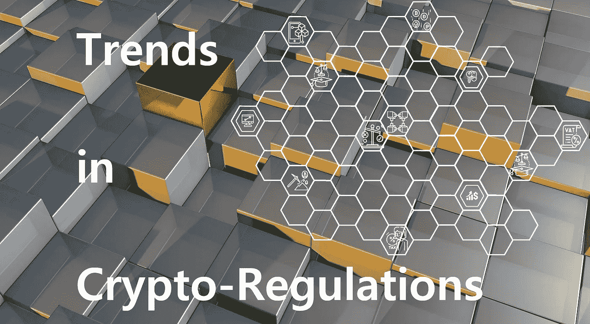

# 区块链的法规趋势和现实核查(聚焦以色列)

> 原文：<https://medium.com/hackernoon/blockchains-trends-and-reality-checks-with-a-focus-on-israel-ea1dbddda45b>

随着监管机构和立法者越来越多地接受区块链技术和加密货币远非昙花一现，法律和财政规则正在以越来越快的速度起草和实施。对于那些参与开发或使用加密货币和代币的人来说，很难跟上变化并确保他们跟上最新的发展。

幸运的是，一些律师很慷慨，愿意花时间详细解释即将到来的变化。Yigal Arnon 公司的合伙人阿德里安·丹尼尔斯(Adv. Adrian Daniels)就是其中之一。

他在 2018 年 11 月 6 日由 [Rise Tel Aviv](https://www.facebook.com/thinkrisetlv/) 主办的“区块链法律和投资者活动”上开始了他关于“alt coins——以色列的监管和法律发展”的演讲，并对加密货币市场的现状进行了简短的评估。

*请注意，以下信息无意作为请求，也不传达或构成法律建议，也不作为从合格律师处获得法律建议的替代。在未就您的具体问题寻求合格的专业顾问之前，您不应根据任何此类信息采取行动。*

# 2018 年区块链趋势

# 坏消息是

Daniels 首先提请注意过去一年区块链市场趋势的显著负面。对区块链和加密货币预示的光明未来的大肆宣传膨胀了吗？这个充满希望的新市场注定要失败还是正在经历根本性的转变？

2018 年 1 月，加密市场的估值市场约为 7000 亿美元。到同年 11 月 5 日，这一估值已跌至区区 2040 亿美元。

同样，贸易额从 1 月份的大约 400 亿美元下降到 11 月份的大约 130 亿美元。
接下来是坏消息，他指出，根据各种报告，目前大约 60%的顶级区块链项目没有有用的功能，在基于以太坊和 EOS 协议的 1000 多个 Dapps 中，只有 8 个拥有超过 300 个活跃用户，从而引起了对现有区块链缺乏实际使用和用户的关注。

从表面上看，如果与 2017 年相比，2018 年的实际筹资额要乐观得多。从 2017 年的 60 亿美元分散在 350 个 ico 周围，到 2018 年 10 月底的 800 个 ico 筹集了 200 亿美元。然而，2018 年的大部分投资发生在 Q1 期间，在接下来的两个季度中，ICO 的数量和每个 ICO 的筹资额都急剧下降。

总的来说，这看起来并不特别感人…

然而，评估区块链和加密货币市场的健康状况和潜在未来，不仅仅是单纯的金融趋势和当前实际用户的采用情况。

# 现状核实

丹尼尔斯接着分析了这个市场即将全面崩溃背后的潜在原因。

在去年冬天的炒作之后比特币和以太坊的崩溃、SEC 执法力度的加大以及随之而来的监管未来的不确定性、投资者对平台实体化不足的失望以及对市场充斥着无用数字资产的理解之间，市场正在走向成熟，并开始抓住现实。

那么，泡沫破裂了吗？

丹尼尔斯更愿意说它只是缩小到了现实的规模，并相信加密革命将会持续下去。他令人信服地支持这种说法，指出区块链技术中潜在的改变游戏规则的因素。这项技术将彻底改变金融交易的执行方式，以及我们将所有资产数字化并将其转化为区块链出现之前从未有过的赚钱方式。

有一些迹象表明，市场实际上正在走向成熟。监管机构越来越有效地进行监管，从而消除了投资者和企业家在监管方面的不确定性。

因此，发行证券代币和通过 sto 筹集资金的选择越来越受欢迎，监管机构越是跟上市场对明确界定边界的需求，投资者的信心就越有可能上升，无论是风投还是个人投资者。

# 2018 年区块链法规

# 位置

现在，在区块链的项目中，就像在当今世界的所有事情中一样，位置是至关重要的，因为每个位置都有自己的一套规则。迄今为止，直布罗陀、马耳他、瑞士和爱沙尼亚是 ICO 最友好的管辖区。

在光谱的另一端，美国历史上对 ico 极其不友好，SEC 在 2018 年 11 月首次声明，他们将提供一些关于哪些代币将被视为证券的指导。

以色列有一个不同的方法，介于美国强硬的 SEC 和上面提到的 ICO 友好管辖区之间。

2018 年 3 月[ *我在演示文稿中的错别字*],[ISA](http://www.isa.gov.il)(以色列安全当局)发布了一份[讨论文件](http://www.isa.gov.il/sites/ISAEng/1489/1511/Pages/eitinot220318.aspx)，其中将加密货币令牌分为三类。在现阶段，本文件中的建议没有一项被纳入实际规章，但它们表明了国际海底管理局遵循的推理路线。

# 聚焦以色列 2018–2019

# 以色列安全局的提议

ISA 建议将加密货币分为三大类

纯货币——这仅仅是一种支付方式，就像比特币或以太坊一样。作为货币，它们不具备证券的资格

安全令牌—授予令牌持有者公司的成员资格、参与权或所有权。

实用工具令牌—授予未来服务的权利

ISA 的主要问题是实用令牌是否也是安全令牌。它提出了几种区分不受证券法约束和将受证券法约束的实用代币的方法。

对于被归类为安全令牌的令牌，ISA 正在考虑提供安全令牌的不同方法。

a)众筹

例如，他们正在考虑扩大以色列的众筹规则。目前，以色列的众筹规则规定，可合法筹集的最高金额为 400 万至 500 万 NIS，投资者可投资的最高金额根据投资者的身份在 10 万至 20 万尼斯之间不等。ISA 的建议之一是取消对以色列境外投资者的限制，允许非以色列人随心所欲地投资，并取消投资上限，只要资本来自以色列境外。

b)双重上市机制

目前，在某些知名公开市场上市的公司也可以在以色列股票市场上市，无需任何额外的重大备案要求。ISA 正在考虑对 sto 应用同样的规则。

c)降低上市要求

ISA 也在考虑对已经获准在 ISA 认为足够有信誉的其他国家融资的 sto 采取类似的方法。这种推理背后的逻辑是，如果一家公司已经通过了另一个国家的要求测试，那么它们已经得到了验证，应该被允许在以色列筹集资金。

d)定制法规的沙盒

定制监管的沙箱需要 ISA 采取更加实际的方法。面对潜在的安全令牌发行者关于他们可以合法操作的方式的请求，ISA 将联系相关的财政、法律、金融和其他当局，以便共同确定申请人合法地从公众筹集资金的最佳方式。

在美国，SEC 在今年 11 月早些时候的华盛顿金融科技周会议上宣布，他们打算发布关于加密货币何时应被分类为 s 证券的指导意见，同时，可以通过 SEC 的新 [FinHub](https://www.sec.gov/finhub) 对代币的正确分类进行查询。

# 2016 年金融服务法

2016 年以色列金融服务法旨在监管非机构货币服务和信贷市场。它们定义了适用于金融资产保管、转换、传输和管理提供商的法规，并于 2018 年 10 月开始适用。

10 月 1 日，以色列首次将加密货币定义为金融资产。因此，提供上述服务的人必须获得许可。

# 反洗钱

以色列金融服务监管机构正致力于制定一套可能是世界上最详尽、最有效的反洗钱法规。这些措施本应在今年 10 月生效，但出现了延迟，未来的日期尚未确定。与此同时，我们已经知道它们包含了金融服务提供商关于他们收到的加密资金来源的披露和文件要求清单。

他们将需要通过披露来报告加密资产的来源

1)存放资金的个人或实体的地址(公钥)

2)他们的 IP 地址

3)涉及以下任何一项交易(将自动认定该交易为可疑交易)

**使用基于 ZKP** (零知识协议)的加密资金进行交易。ZKP 所涉及的技术导致其用户高度甚至完全匿名，从而实际上不可能安全地记录使用其服务的个人或实体的身份。ZCash 和 Monero 就是这种 ZKP 货币的例子，虽然用这些货币进行交易并不违法，但这种交易可能会被列为可疑交易，必须报告。

**来自 mixer 平台的交易** —在 Mixer 平台上，资金被混合在一起并随机分配到钱包，从而无法正确识别加密资金的来源。

**暗网交易**

**IP 地址和其他地理指示符不一致的交易**

# 加密资产的征税

2018 年 3 月，ITA(以色列税务机关)发布了两份关于数字资产征税的通知，一份涉及虚拟货币，另一份在世界上首次涉及 ICO 发行的公用事业令牌。

**虚拟货币**
——与法定货币不同，数字货币被 ITA 定义为数字资产。这具有财政影响，因为适用于法定货币的税收规则不同于适用于资产的税收规则。例如，在美元相对于以色列谢克尔升值后出售美元，将不会被征收资本利得税。另一方面，由于其定义为资产，对销售加密货币所得收益的税收将按公司税率和个人私人税率作为资本利得征税，金融服务提供商将承担增值税。
—矿商还必须根据这是一项业务(而非定期投资)来纳税。

**公用事业代币** —公用事业代币发行者在代币发行时，或者换句话说，在他们收到钱的时候，不必缴税。出售已发行代币所得的税收将推迟到平台开始提供服务时，或者如果公司破产，如果这种情况发生得更早。—员工收到公用事业代币作为其薪酬的一部分时，通常无需在收到代币承诺时纳税。这些代币的税收将在这些代币的销售或行使(以较早者为准)时以边际税率支付。但是，员工可以请求税务机关在授予代币时根据代币的价值以边际税率向员工征税，此后的任何销售都将根据他们收到代币的时间和他们出售代币的时间之间的价值差异作为资本收益征税。这种向员工发放代币作为奖励的征税方式可能是世界上第一个，很可能成为世界其他地方类似税收制度的基础。

# 银行和虚拟货币

尽管在监管方面取得了进展，但在以色列，银行仍然不愿意接收加密交易的收益。
例如，Bits of Gold 是一家以色列货币交易所，自 2013 年以来，它可以将加密货币兑换成法定货币，反之亦然。2014 年，以色列银行、司法部和其他金融监管机构发布的一份联合新闻稿警告称，加密货币具有高风险。他们没有试图指出如何减轻这些风险。

因此，Leumi 银行冻结了 Bits Golds 银行账户的所有活动。比特金将此事告上法庭。法院做出了有利于 Leumi 银行的裁决，但再次未能提供任何补救措施的建议，以降低黄金的风险水平。此事目前正在向以色列最高法院上诉，最高法院发布了一项临时命令，要求银行允许黄金的某些银行活动。Hapoalim 银行目前正在逐案跟踪 Leumi 银行的情况。

# 未来 12 个月的预测和结论

# 预言

就法规而言，以色列处于一个相当好的位置

1.  ISA 最终确定了区分不同类型加密货币的规则，ISO
2.  反洗钱条例草案将通过成为法律
3.  ITA 将发布一份关于证券代币征税的通知
4.  最高法院将对少量黄金做出裁决，以色列银行和财政部有望就银行如何处理加密货币交易发布指导方针。

# 结论

区块链/加密货币市场的明显降温，而不是泡沫破裂的迹象，是市场成熟的标志。以色列在游戏中很早就跳上了监管列车，目前正在进行的所有监管努力很可能将在 2019 年联合起来，为市场的未来增长提供坚实的基础。

*联系我上* [*蒙哥市场*](http://meerkatthemarket.com/) *或者上* [*LinkedIn*](http://linkedin.com/in/patriciadehemricourt)