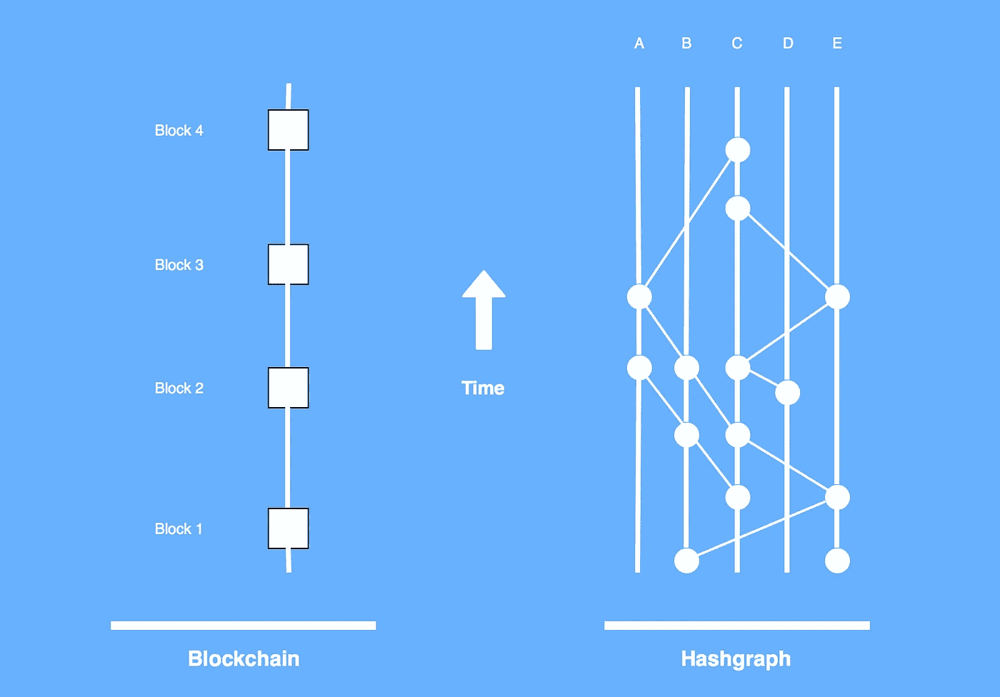
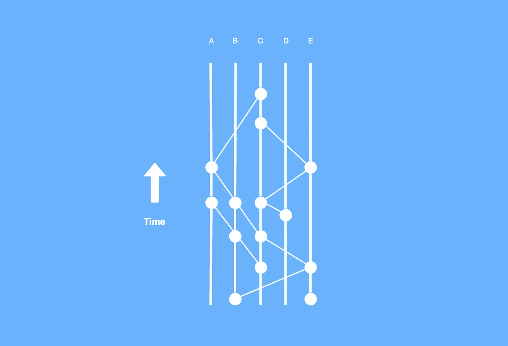

# 区块链对哈希表

> 原文：<https://medium.com/hackernoon/blockchains-vs-hashgraphs-66a2058c8b43>

Blockchain and Hashgraph data structures.

**区块链技术**

区块链是分布式账本技术的一种形式。并非所有的分布式分类帐都采用块链来提供安全有效的分布式共识。

区块链分布在对等网络中并由对等网络管理。因为它是分布式分类帐，所以它可以在没有中央机构或服务器管理的情况下存在，并且它的数据质量可以通过数据库复制和计算信任来维护。

然而，区块链的结构使其有别于其他类型的分布式分类账。区块链上的数据被分组在一起并组织成块。然后将这些块相互连接起来，并使用加密技术进行保护。

区块链本质上是一个不断增长的记录列表。它的仅追加结构只允许向数据库添加数据:不可能修改或删除先前块中先前输入的数据。因此，区块链技术非常适合记录事件、管理记录、处理交易、追踪资产和投票。

比特币等加密货币开创了区块链技术。比特币在 2017 年底的大反弹，以及随后的媒体狂热，将加密货币带入了主流公众的想象中。政府、企业、经济学家和热心人士现在正在考虑将区块链技术应用于其他用途的方法。

Blockchain Structure.

**哈希图技术**

哈希表也是一种分布式分类帐技术。

hashgraph 是一种获得专利的算法，它保证了区块链的好处(分散化、分布和通过使用散列的安全性),而没有低事务速度的缺点。它是由 Leemon Baird 创建的，是 Baird 创建的漩涡公司的知识产权。

虽然比特币每秒允许大约 5 次交易，以太坊每秒允许大约 15 次交易，但 hashgraph 每秒可以处理数千次交易。

hashgraph 算法通过两种技术运行:关于流言蜚语的流言蜚语和虚拟投票。

为了理解关于流言蜚语的流言蜚语，想象五个成员:A、B、C、D 和 e。每个成员从一个交易开始，这个交易导致一个‘事件’。然后，每个成员打电话给另一个随机选择的成员，两人分享他们的交易历史。例如，D 呼叫 B 并与 B 共享 D 的交易历史。这种类型的呼叫重复发生，每个成员随机呼叫另一个成员并共享其交易历史。于是，B 现在随机选择另一个成员(假设 C)，分享其交易历史，其中包括 D 的交易历史。同时，E 可能调用了 A，依此类推。每个调用都会导致一个事件，每个事件都包含所有以前块的散列。因此，一旦一个成员了解到一条新的信息，这条信息就会迅速传播，直到所有人都知道它。

虚拟投票旨在就交易顺序达成共识。它是这样工作的:首先，事件被分成几轮。hashgraph 算法对于何时创建一轮有明确的数学答案。这里，为了简单起见，假设一轮大约有十个事件。现在，每个成员投票决定哪一个事件有资格成为“著名证人”。为了理解这是如何发生的，想象下一轮中有事件的每个成员回顾当前轮中的每个事件，以查看它是否可以追溯到当前轮的事件。如果它可以追溯到某个事件，它会对该事件投“是”票，否则，它会投“否”票。获得最多票数的当前一轮事件将成为当前一轮的著名见证，并提供事务的最终顺序。

Hashgraph Structure.

**私有和公有**

哈希图和区块链都可以以公共形式存在，也可以以企业使用的许可私有形式存在。任何人都可以参与这些技术的公共开放版本。虽然有一些公共的区块链，比如以太坊，但是哈希图的唯一公共版本叫做 Hedera Hashgraph。

**开源与专利**

区块链技术大多是开源的，并且有一个巨大的社区，该社区建立并促进各种区块链工作，从加密货币到公用事业令牌。此外，区块链的狂热分子普遍怀疑传统机构的可信度，并强调区块链的去中心化本质是它们的特征。

另一方面，hashgraph 是基于一个专利算法的，这个专利算法属于 swirleds，因此任何新的 hashgraph 计划都将依赖于 swirleds。

**结论**

区块链和哈希图是分布式账本技术的两种实现。区块链采用单个块链来提供经过验证的、安全的和分布式的共识。这项技术是比特币和加密货币的基础，也是包括支付、供应链和身份管理在内的一系列用例的基础。与此同时，hashgraph 是一种专利算法，它使用关于流言蜚语的流言蜚语和跨几条平行线的虚拟投票技术来实现快速和安全的分类帐。区块链更主流，更可能公开。Hadera Hasgraph 是 hashgraph 算法的唯一公共实现。

很快，除了区块链和 hashgraph 之外，我们将开始看到分布式账本技术更新颖的实现。

—

[陕雷](http://www.shaanray.com)

关注 [Lansaar Research](https://medium.com/lansaar) 关于媒体的最新新兴技术和新商业模式。