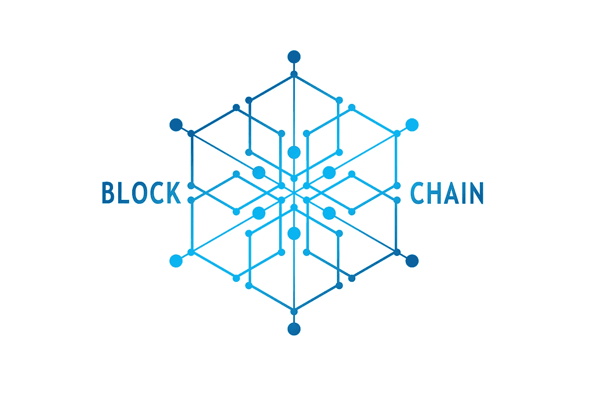

# 区块链:我为什么要在乎？概述和采用

> 原文：<https://medium.com/hackernoon/blockchains-why-should-i-care-overview-adoption-8cb6b319314c>

## 你未来做的每一笔交易都可能在用区块链技术

我从“我不是在追最新闪亮的物体”到“这个[区块链](https://hackernoon.com/tagged/blockchain) [技术](https://hackernoon.com/tagged/technology)有潜力”。我在 2017 年初踏上了这段旅程——我拿起了威廉·穆加亚尔的书《商业区块链》。虽然我最初并不理解所有的技术方面，但我被它的含义所震撼。如果这是真的和可行的，这项技术有可能改变我们的日常生活，不仅扰乱公司，而且重塑整个世界的生态系统。我将在这里提取一些基础知识，这样你就不必浪费时间了。

**我为什么要关心？**

区块链技术可能会取代你的工作！不尽然，你的角色可能会转变成包括其他职责。在与 AI/ML/IoT 集成的特定用例中，或者如果您为中介方工作，那么这是非常可能的。然而，这可能需要几年才能实现。

随着短期内的大规模采用，我们如何持有资金(支票、储蓄)，我们如何纳税，我们如何获得报酬，我们如何找到工作，我们如何购买财产，我们如何访问/维护医疗记录，我们如何确保隐私，这些都是我们将问自己的问题。

区块链技术目前处于初级阶段，主要是一种成本游戏，例如实现低成本的全球汇款，这将破坏高费用的当前汇款系统。金融业将在未来几年内发生重大变化—新的收入流和将当前产品扩展到更大市场(全球)的潜力。

**采用:**

区块链技术的采用将远远快于互联网的采用。互联网被广泛采用花了大约十年或更长时间(80 年代到 90 年代末)。另一方面，由于互联网的存在，区块链将大大缩短主流采用的时间。

过去，互联网技术局限于硅谷和其他特定的创新地域。另一方面，区块链是全球性的(多亏了互联网)——想象一下讲世界上每一种主要语言的工程师同时改进了技术发展！我的一些担心通常是通过问自己“嗯，这可能是一个有效的问题”来解决的。5000 名工程师能想出解决方案吗？然后，我的顾虑通常会转变为‘我们什么时候可以实施这个解决方案？’这是一个“什么时候”的问题？。

**一些使用案例和潜力:**

金融生态系统是最先见证这种颠覆的行业之一。具体来说，在支付领域，区块链能够维护多方的公共总账。通过优化(或替换)授权-冲销-异常对账流程，可以获得显著的效率，该流程被亲切地称为夜间噩梦批处理流程。这种方法的一个主要好处是减少了需求或最终消除了调节过程。

一个最新的、接近实时的对账账本展现了一个可能性的“新世界”(以及过多的问题)。在成千上万的使用案例中，以下是几个:

商户支付

*   商家服务将有更多的选择，并降低交换费
*   当商品售出、交付后，商家付款可以自动支付[~50%的美国 B2B 付款仍然通过纸质支票]
*   当前的现金流挑战将演变成更短的周期(几天/几周而不是几个月，这将扰乱发票重构行业)

全球支付

*   已经探索并实施了跨国支付，从而以更低的成本实现了近乎实时的资金可用性

征税

*   税收是对我们所有人都有直接影响的一个领域。当前的纳税到期日可以在线安排，下一个自然的进展是利用类似的“智能合同”支付到期的税款。同样，问题不在于如何利用这项技术来替代现有系统，而在于如何超越传统的替代系统。理论上，我们可以利用区块链技术为每笔交易支付联邦和州税，类似于我们支付销售/县/市税的方式。我曾经写过个人纳税是一年一度的事情，在我们方便的时候在这里报税。
*   目前，对于大多数公司来说，财政年度的最后一个月是一段疯狂的时间，活动停滞不前，因此可以进行准确的会计核算。基于 GAAP 或其他会计惯例创建财务年终报表的劳动密集型行为可以简化。
*   有人估计，大约 5%的国内生产总值(无人认领的国税局付款、未存入银行的支票、丢失的支票等)是“流动的”，即“正在流向”目标收款人的资金。这个宏观周期时间可能从几天到几个月不等。区块链提供了一种替代方案，可以将这些周期时间减少到几分钟或几小时，从而潜在地“释放”额外的资金。

员工工资

*   我们都是按周、双月或月领工资的——这种节奏是出于方便和减少雇主处理工资的开销而确定的。有了“始终一致”的分类账，我们可以选择按日支付或缩短支付周期

区块链技术仍处于起步阶段，有许多挑战需要解决。是的，进步是有飞跃的，有时就像一个蹒跚学步的孩子一样可靠和负责，就好像一个蹒跚学步的孩子现在的特征在她的余生中是永久的一样。

政策制定者必须铺平道路，为区块链社区的贡献和建设提供障碍最小的最佳条件。过度限制性的法规会抑制创新，并且可能是推动这一运动的最重要的催化剂。技术本身不应受到监管，但可以执行的活动(在全球层面上)必须受到监管，并有具体的指导方针。让这项有前途的技术发展下去，也许它会加速我们社会的繁荣。

我一直期待听到您在这个领域的经历，请随时联系我们，探索我们如何能够互相帮助，并思考各种可能性！[Twitter](https://twitter.com/kumarlax)|[LinkedIn](http://linkedin.com/in/kumarlax)|[Medium](/@kumarlax)

**推荐阅读:**

这项技术正在快速发展，今天出版的一本书可能在几个月后就不再适用了。

商业:

区块链:[它们是如何工作的，为什么它们会改变世界](https://spectrum.ieee.org/computing/networks/blockchains-how-they-work-and-why-theyll-change-the-world)，摩根·e·佩克，IEEE Spectrum

Naval Ravikant 关于区块链网络的[推特风暴](/the-naked-founder/naval-ravikants-36-tweets-on-cryptocurrencies-f9b2b64106c1)

技术:

区块链:[房西苑的实用介绍，](https://youtu.be/jtznBfOhl3Q)加州大学柏克莱分校的区块链

通过建造一座建筑来了解区块链

像往常一样，任何错误显然是我的。