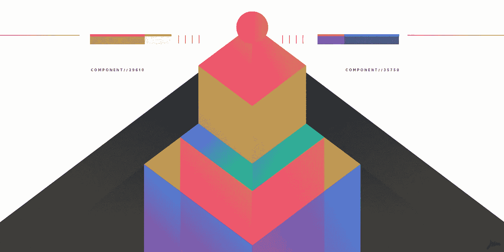

# 块，而不是页面，是网络的未来

> 原文：<https://medium.com/hackernoon/blocks-not-pages-are-the-future-of-the-web-16f2be8342dd>

网络现在正处于一个尴尬的阶段。我们正在从一个网站仅仅是链接页面的集合的时代过渡到一个甚至用术语“页面”来描述一个特定的屏幕是一个巨大的过度简化的时代。

我刚开始做 web 开发的时候，工作主要是。。。

1.  打一些 HTML
2.  添加一点造型
3.  把那个文件传输到你的服务器上。。。

Boom 你已经在网上发布了。只能说事情很少再这么简单了。

虽然人们很容易哀叹早期简单网络的消失，但重要的是要认识到早期网络之所以简单，是因为用例很简单。网络主要是可以相互链接的在线文档索引。

现代 web 是复杂交互、响应内容和社交层的混合体，这使得以文档为中心的方法成为一种笨拙的范式，不能很好地适应用户的期望或需求。

# 网络不应该是这样的

一个鲜为人知的事实是，简单的基于文档的网络方法并不是为我们现在所知的网络奠定基础的早期创新者想要的结果。

像[泰德·尼尔森](https://en.wikipedia.org/wiki/Ted_Nelson)、[艾伦·凯](https://en.wikipedia.org/wiki/Alan_Kay)和[道格·恩格尔巴特](https://en.wikipedia.org/wiki/Douglas_Engelbart)这样的先驱推动了远远超出我们今天所拥有的想法。他们展示了一个奇妙的未来愿景，在这个愿景中，计算将拥抱其真正的数字化和协作性，成为一种全新的、更强大的东西。

相反，我们得到的是数字文件夹中的一堆数字文档；它完成了工作，它熟悉而舒适，但我们走这条路已经失去了很多。

The web we wanted / The web we got

对于现代网络来说，文档和页面是错误的结构。我认为网络应该以模块(或者组件，如果你愿意的话)来构建，而不是文档。

块提供了一种将 web 内容视为自包含单元的不同方式。也许这有助于想象你可以用乐高积木来构建文档(或应用程序)。

在开发人员的世界中，我们称之为“组件”，而内容创建者可能称之为“微内容”在这篇文章中，我将这两个问题，以及其他问题，简单地称为阻塞。

我将解释我的意思，以及为什么对于出版商、最终用户和开发者来说这是一个更好的方法。

# 1.块是结构化的

一个开放的文本文档，它是网络的起点，没有继承的意义。任何添加的含义都必须通过标签、元信息或格式分层。多年来，人们一直在努力用更结构化的含义来丰富文本内容，但大多数努力都失败了(例如，语义网)。

问题是多方面的，但我认为问题的根源是意义和结构是在之后的*上分层的，而不是作为*创作过程的核心部分*。*

Blocks 颠倒了这个想法:你不把内容标记为标题，你*创建*内容作为标题。这是一个微妙但深刻的区别。

# 2.积木是可组合的

块提供了一种方法，在不牺牲系统完整性的情况下，将内容和功能的离散单元以不同的方式组合在一起。

通过复杂的 CSS 方案(BEM、SMACKS 等),“本地”web 技术已经花费了大量的努力。)、XML、web 组件等。虽然有些解决方案比其他解决方案更优雅，但这些技术试图在以文档为中心的介质上强加一个模块化的、以块为中心的工作流，结果充其量只能说是笨拙和麻烦。

这个问题在很大程度上通过以组件为中心的框架得到了解决，比如 React 或 Vue，它们使组件成为了第一等公民。

也就是说，这些框架必须依赖复杂的工具来摆脱以文档为中心的范式，并将组件(块)放在它们应该在的顶部。

# 3.积木是有弹性的

几十年来，封装是程序员用来使代码更加可重用和可靠的原则，但它同样适用于块。

把你的内容和用户界面想象成模块化的单元，然后*实际上以这种方式开发它们*消除了试图用基于文档的技术开发基于块的内容的不协调，并且更容易保证质量。

我们的团队拥有我们多年未接触过的组件，它们完全独立，只是 Work。

# 4.区块改善协作

块的结构足以支持比文档更丰富的协作形式。历史上，编辑不得不“拿出红笔”或突出显示、下划线，并在空白处留下注释，以对文档提供反馈。

想象一下，如果反馈和参考工具真的*知道*所参考的内容类型，那该有多好？例如，在视频块上留下反馈可能会将时间戳精确地标记为反馈的位置。检查报价的来源可以在报价块中自动完成。

当一段内容的结构和意义从一开始就知道，而不仅仅是事后才知道时，内容编辑工具就要强大得多。

我可以详细说明所有这些，但这篇文章很长，所以我留给你这个:

虽然现在的 web 开发很尴尬，但我认为潮流正在改变。我们正朝着更好的方向前进，去拥抱数字媒体的真实本质。

目前，我们必须通过基于工具和组件的 web 框架来规避 web 开发的以文档为中心的特性，但是我乐观地认为，随着时间的推移，这些模式将变得更加适用于平台。

与此同时，一些未来的内容创建工具正在使用以块为中心的方法构建，因此您已经可以亲自体验其中的差异。

这里有几个我最喜欢的例子:

*   [概念](https://www.notion.so/):一个基于块的协作工作区，适用于几乎任何类型的内容。content 可能是基于块的协作内容方法的力量的最好例子。
*   [宇宙](https://www.onuniverse.com/):一款 iOS 应用，使用简单而强大的模块在手机上创建网页。
*   [Qwilr](https://qwilr.com/) :一个基于块的工具，用于创建销售页面、建议书和合同。这一条对于创建看起来很棒、转化起来更好的快速提案非常有帮助。
*   Wordpress Gutenberg :新的 Wordpress 编辑器在基于块的内容发布方法上下了很大的赌注(在这一点上有点尴尬，我认为)。

我们才刚刚开始转变。我希望我们能一起努力，一步一步地建立我们一直想要的网络。

🤘挡住。

*最初发表于*[*www.pathwright.com*](https://www.pathwright.com/blog/blocks-are-the-future-of-the-web/)*。*