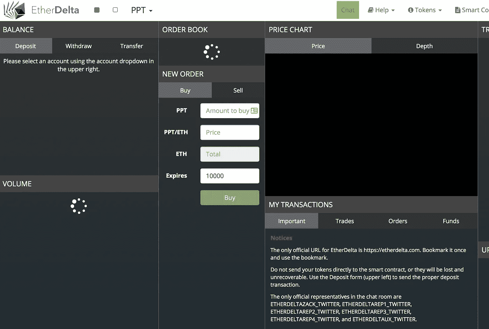
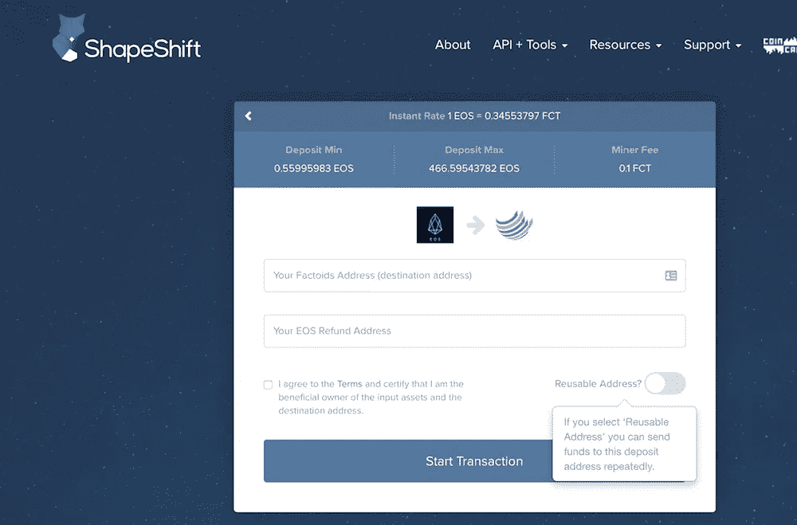
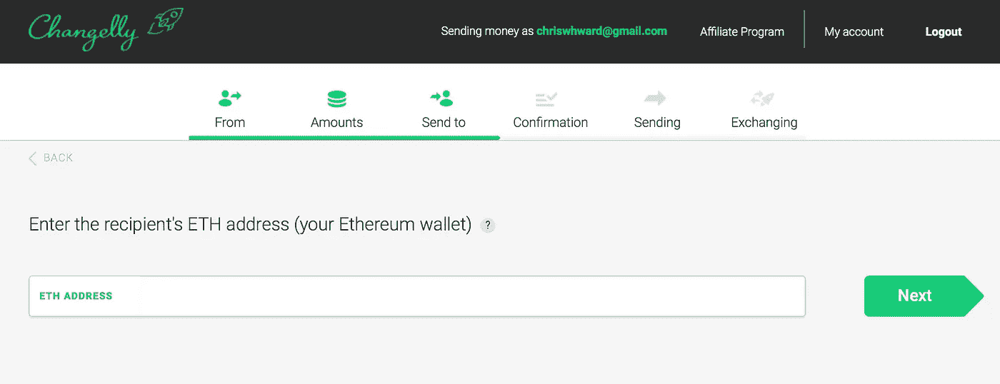
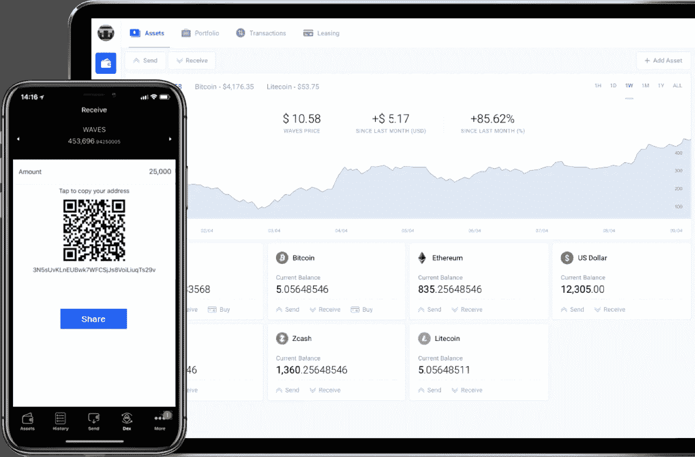
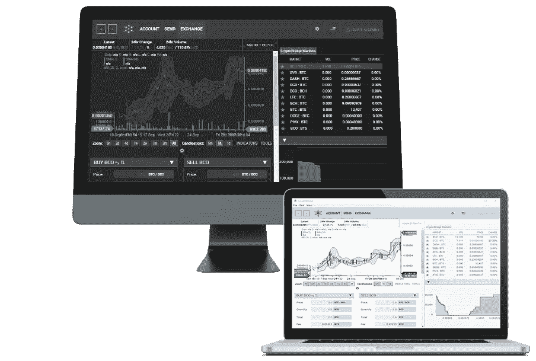
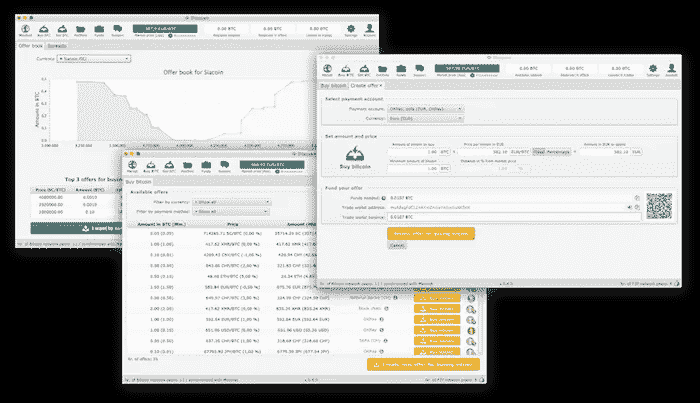
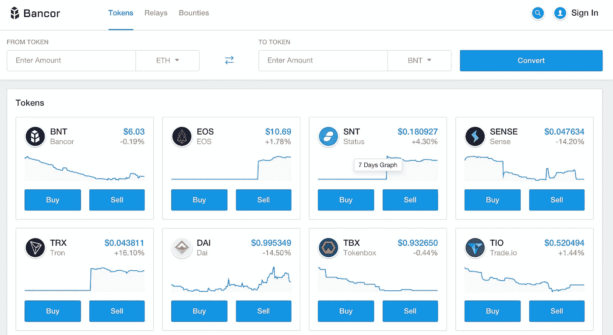

# Blockwatch:什么是去中心化交易所？

> 原文：<https://medium.com/hackernoon/blockwatch-what-is-a-decentralized-exchange-49f4ffbe8b70>

分散式交易所(dex)正在成为集中式交易所的一种可行替代方案，它更多地是为寻求交易的人们提供一个上市平台，而不是为交易本身提供便利。这使得 dex 听起来像是一种美化的 crypto-craigslist，容易受到这些平台的所有问题的影响。然而，有显著的差异，使 DEX 成为值得考虑的下一次加密货币交易的替代选择。

# dex 是如何工作的？

它因平台而异，但通常 DEX 为买家和卖家提供列表，并提供 oracle 或其他形式的指导，告诉你每个令牌的价格是否合理。一旦你决定进行交换，网络在代币的基础区块链之间发行一个‘IOU’代币，交换就发生了。

这一过程将更多的工作和责任放在双方手中，这使得 dex(目前)比一些集中式交易所更不便于用户使用，但这将随着时间的推移而改善。

这意味着您可以在任何您想要的地方保存您的令牌，这再次增加了复杂性，但是如果您设置好这些存储位置，可以降低您的安全(和集中化)风险。

根据网络的不同，DEX 可能会显示交易者的交易历史和可信度，也可能由你使用区块链特有的工具进行尽职调查。dex 远非完美，也有相当多的安全问题，所以，一如既往地与密码世界，做你的研究。

# 有哪些可用的 dex？

# 空中巡逻

在采访了负责机场战略的山姆·泰伯里之后，我决定写这篇文章。通过他们的网络，你可以交易任何基于 ERC20 标准的代币。

# 以太三角洲

[EtherDelta](https://etherdelta.com/) 是一个更知名和更老的 dex，这是一个喜忧参半的消息，因为它的用户界面更加“开发者友好”并且[它最近被妥协](https://mashable.com/2017/12/21/etherdelta-hacked/#cgmD0R53nqq9)。

# 变形

Shapeshift 提供了一种简单的方式来换取速度和没有额外功能的目标。我不清楚他们是如何定义当前汇率的，也不清楚你在和谁交易，但对于快速交易来说，这可能是理想的。

# 改变地

[changely](https://changelly.com/)的独特卖点之一是，它们也接受信用卡支付，向尚未投资加密货币的人或希望自己兑换货币的人开放 dex。同样，该平台如何确定当前汇率，以及你与谁交易，还不完全清楚(除了钱包地址)，但看起来该公司正在努力为没有经验的交易者创造良好的用户体验。

# 波

[去年我遇到了一些在](https://dzone.com/articles/blockwatch-berlin-blockchain-day-panel) [Waves](https://wavesplatform.com/) 背后的团队，他们的目标是广泛的用例，而不仅仅是人们之间的交易。他们的 DEX 项目提供了交易和开采代币的方法，比列表中的其他项目提供的更多。然而，这是一个雄心勃勃的项目，他们能实现多少还有待观察。

# 密码桥

Cryptobridge 除了典型的 DEX 特性范围之外，并没有提供更多，但是为所有主要的操作系统提供了桌面客户端。

# 开放式分类帐

尽管名字如此， [Openledger](https://openledger.info/) 并不是开源的，同样，它旨在为个人交易之外的其他用例提供解决方案。其中一些产品可以很好地组合在一起，例如钱包和信用卡。该网站有点过头，我无法让交易所加载，所以你的里程可能会有所不同。

# Bisq

[Bisq](https://bisq.network/) 是开源的，由于您必须自己构建和运行项目，它是这个列表中“最纯粹”的 dex 之一，但是需要更多的知识才能开始。一旦你运行了它，界面就会显示一个潜在交易列表和一个价格指南。

# 班科尔

作为 2017 年最成功的 ico 之一， [Bancor](https://www.bancor.network/discover) 除了拥有大量现有的集成选项外，并没有比名单上其他许多使用中间令牌在区块链之间进行交换的 ico 提供更多。

# 赫迪乌斯

作为一名来自我的家乡柏林的新人，Herdius 声称他做的每一件事都与提到的其他选择略有不同。它完全是区块链不可知论者，这意味着你可以交易任何令牌，而不需要 Herdius 首先添加一个集成。正因为如此，Herdius 不使用任何“IOU”令牌，而是在其他区块链之上添加一个区块链层，只要它使用密钥(任何值得考虑的区块链都应该使用)，它就应该与 Herdius 一起工作。

*最初发表于*[T5【dzone.com】](https://dzone.com/articles/blockwatch-what-is-a-decentralized-exchange)*。*