# 带有地形的蓝色/绿色基础设施

> 原文：<https://medium.com/hackernoon/blue-green-infrastructure-with-terraform-d5f9e8f79ed4>

## 降低在云中引入突破性变化的恐惧


I 作为代码的基础结构现在是很酷的事情之一。在过去的两年里，每一次与 DevOps 相关的会议都会有一两次关于这个主题的演讲，这是一件好事。

随着 DevOps 运动的开展，T2 哈希公司成为该领域最受尊敬的公司之一。今天我将谈论他们的一种产品: [**Terraform**](https://www.hashicorp.com/products/terraform) 。

# 什么是地形？

Terraform 是一种工具，允许以声明的方式轻松管理云资源。使用一种简单的编程语言，它可以让您定义云基础设施的大致形状，包括 VPC、子网、计算实例、负载平衡器、DNS 记录等。它适用于所有主要的云提供商，但并不是与云无关。这意味着，例如，您可以在 AWS 或 Google Cloud 中创建一个负载平衡器，但是每个负载平衡器的代码都略有不同。

# 什么是蓝色/绿色部署？

蓝色/绿色部署是 DevOps 的一种做法，旨在通过创建所需组件的新副本来减少更新时的停机时间，同时保持当前的。
鉴于此，您将看到系统的两个版本:一个是实际版本(*蓝色*)另一个是新版本(*绿色*)。当新版本启动并运行时，您可以无缝切换流量。这不仅有助于减少停机时间，也有助于在发生错误时缩短回滚时间。

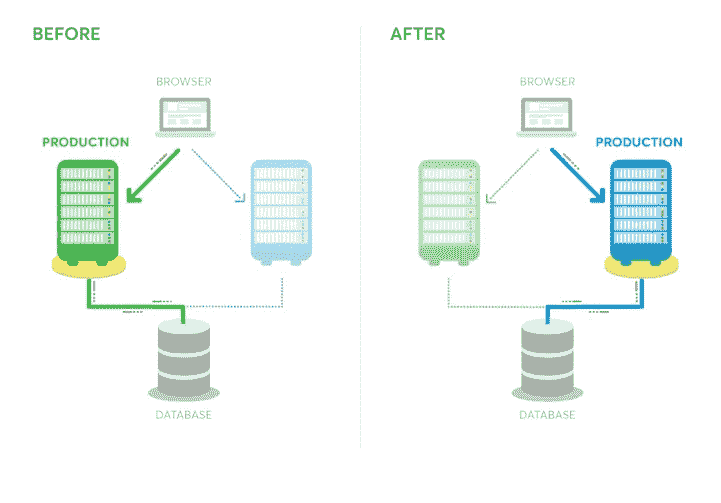

Example 1

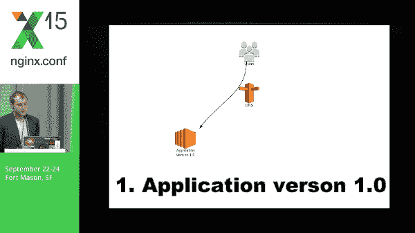

Example 2

# 蓝色/绿色基础设施

虽然蓝色/绿色部署是一种更常用于应用程序部署的技术，但云成本的降低，加上我们现在拥有的工具，使得拥有整个云基础架构的两个拷贝几乎没有痛苦成为可能。

需要注意的是，对整个云基础架构进行蓝色/绿色部署不是一个万灵药，如果您要做一些小的更改(例如，向堆栈中添加一个新的 EC2 实例)，肯定会有点过分。但是对于重大/突破性的变化来说，这是一个胜利，我个人建议这样做。

# 地形前来救援！

在本教程中，我将使用亚马逊网络服务，但是代码不会因其他供应商而有太大变化。

完成此操作后，您将能够创建一个包含以下内容的基础架构:

*   虚拟私有云
*   三个子网，每个子网位于不同的可用性区域
*   安全小组
*   三个 EC2 实例服务于端口 80 上的 NGINX 服务器(每个实例位于不同的子网中)
*   指向这些实例的负载平衡器

然后，您将能够:

*   改变基础设施
*   利用这一变化创建全新的基础架构
*   通过新的基础架构切换流量
*   摧毁旧的基础设施
*   利润

完整示例可在[https://github . com/santiagopoli/terra form-examples/tree/master/blue-green](https://github.com/santiagopoli/terraform-examples/tree/master/blue-green)上查看

为了遵循本教程，您需要在您的环境中配置您的 AWS 凭证，并且至少附加了 **EC2FullAccess** 策略。

## 创建 VPC(虚拟私有云)

我知道这是一个地形教程，但推荐的做法是有一个手动创建的 VPC。您可以使用 Terraform 创建 VPC，但有许多外部服务需要事先知道您的 VPC ID，因此最好不要每次在蓝/绿部署时都创建新的 VPC。

此外，您可能拥有由组织中的另一个团队在外部创建的安全组。为此，我们将使用 AWS 控制台创建一个 VPC。您也可以通过命令行执行以下操作来创建 VPC:

```
(change the CIDR block to anything you like)**> aws ec2 create-vpc --cidr-block 10.0.0.0/16**{
  "Vpc": {
      "VpcId": "**vpc-ff7bbf86**",
      "InstanceTenancy": "default",
      "Tags": [],
      "CidrBlockAssociations": [
          {
              "AssociationId": "vpc-cidr-assoc-6e42b505",
              "CidrBlock": "10.0.0.0/16",
              "CidrBlockState": {
                  "State": "associated"
              }
          }
      ],
      "Ipv6CidrBlockAssociationSet": [],
      "State": "pending",
      "DhcpOptionsId": "dopt-38f7a057",
      "CidrBlock": "10.0.0.0/16",
      "IsDefault": false
  }
}
```

记下你的 **VpcId** ，因为你马上就会用到它。

## 安装 Terraform

你可以通过[这个链接](https://www.terraform.io/downloads.html)或者使用任何软件包管理器(brew，apt)来下载 Terraform

## 创建项目

在你的工作区创建一个新文件夹，命名为 **terraform_blue_green。**然后，初始化一个 GIT 存储库，添加一个简单的。忽略。terraform 文件夹，用你喜欢的文本编辑器打开文件夹。在我的例子中，我将使用 [Visual Studio 代码](https://code.visualstudio.com/)。

```
**> mkdir terraform_blue_green
> cd terraform_blue_green
> git init
> echo .terraform >> .gitignore
> code .**
```

## 初始化地形状态

Terraform 将基础设施的状态存储在一个 JSON 文件中。建议(也是本教程的要求)将该文件存储在外部后端，如亚马逊 S3。由于我在本教程中使用 AWS，我将坚持使用 S3，但是 [Terraform 在每个提供者](https://www.terraform.io/docs/backends/types/index.html)中支持相同的功能。

首先，您需要创建状态所在的 S3 存储桶。您可以通过转到 S3 控制台或执行以下操作来完成此操作:

```
**> aws s3api create-bucket --bucket terraform-bluegreen**
```

然后，在项目文件夹中创建一个名为 **bootstrap.tf** 的文件，内容如下。

在这个文件中，我们定义了

*   基础设施的**版本**
*   我们将使用的**云提供商**(在这里是 AWS)
*   将保存状态的**后端**(在本例中是 S3)，以及附加到它的配置。

文件准备就绪后，在项目文件夹中运行以下命令:

```
**> terraform init**Initializing the backend...Successfully configured the backend "s3"! Terraform will automatically
use this backend unless the backend configuration changes.Initializing provider plugins...
- Checking for available provider plugins on [https://releases.hashicorp.com](https://releases.hashicorp.com)...
- Downloading plugin for provider "aws" (1.11.0)...Terraform has been successfully initialized!
```

## 使用 Terraform 中的现有资源

因为我们需要之前创建的 VPC 的 ID 来在我们的基础设施中做任何事情，所以我们将把它存储在一个变量中。为此，创建一个名为 **vpc.tf** 的文件，内容如下:

## 创建我们的第一个资源:子网

要做任何有用的事情，我们首先需要子网。我们将创建三个，每个位于不同的可用性区域。创建一个名为 **subnets.tf，**的文件，内容如下:

在该文件中，我们创建了三个子网，分别指定:

*   **计数:**我们想要创建的子网数量
*   **Availability zone:** 在本例中，我们使用了 *element()* 函数，该函数接受一个列表和一个索引，并返回元素，即使索引大于元素的数量。这有助于为每个子网分配不同的可用性区域。
*   **VPC ID**
*   **CIDR 阻滞:**这可能是最令人困惑的部分。我们将之前定义的 **infrastructure_version** 变量插入到 CIDR 块中。这将有助于将来创建第二个版本。您可以使用您在 VPC 中定义的块来更改 CIDR 块。
*   默认情况下，为分配给该子网的任何网络接口分配一个**公共 IP**
*   **名称:**我们已经将基础设施版本添加到其中

文件准备就绪后，首先执行以下操作:

```
**> terraform plan**+ aws_subnet.terraform-blue-green[0]
...+ aws_subnet.terraform-blue-green[1]
...+ aws_subnet.terraform-blue-green[2]
...Plan: 3 to add, 0 to change, 0 to destroy.
```

计划命令做一次预演，告诉你将要做什么改变。在做任何事情之前做计划是很重要的，因为你可以发现错误。在这种情况下，计划告诉我们，它将添加三个子网，这就是我们想要的。

所以现在我们可以运行这个:

```
**> terraform apply**Do you want to perform these actions?
  Terraform will perform the actions described above.
  Only 'yes' will be accepted to approve.Enter a value: **yes**aws_subnet.terraform-blue-green[0]: Creating...
...
aws_subnet.terraform-blue-green[1]: Creating...
...
aws_subnet.terraform-blue-green[2]: Creating...
...
aws_subnet.terraform-blue-green[0]: Creation complete after 5s 
aws_subnet.terraform-blue-green[1]: Creation complete after 5s 
aws_subnet.terraform-blue-green[2]: Creation complete after 5sApply complete! Resources: 3 added, 0 changed, 0 destroyed.
```

现在，您可以转到 AWS 控制台(在*VPC/子网*部分下)，您的子网应该会出现

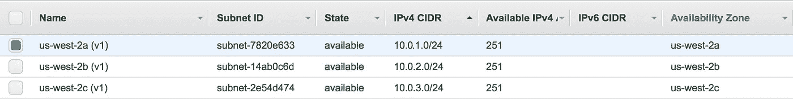

## 创建安全组

为了能够在将来访问我们的资源，我们需要在我们的 VPC 中创建一个安全组。为了简单起见，我们将创建一个安全组来启用来自任何地方的所有入站流量。

在您的项目中创建一个名为 **security_groups.tf** 的文件，内容如下:

在该文件中，我们为 VPC 创建了一个安全组(使用其 VPC ID)和两条规则:一条用于入站流量，一条用于出站流量。最重要的部分是:

*   **起始/终止端口:**规则适用的端口范围。在这种情况下，我们以所有可能的端口范围为目标
*   **协议:**您可以使用 HTTP、TCP 或“-1”，这适用于 TCP 和 HTTP
*   **CIDR 块:**规则启用的 CIDR 块列表。在我们的例子中，我们启用了所有 ipv4 流量。

文件准备就绪后，运行**地形计划**和**地形应用**。之后，我们应该能够在 AWS 控制台中看到我们的安全组(在*EC2/安全组*下)。

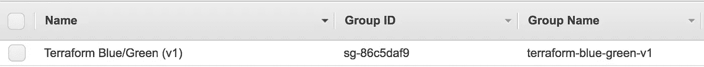

## 创建 SSH 密钥

为了以后能够访问 AWS 实例，我们需要为它分配一个 SSH 密钥。

首先，使用 **ssh-keygen:** 创建一个密钥对

```
**> mkdir keypairs**
**> ssh-keygen -f keypairs/keypair -P ""**Generating public/private rsa key pair.
Your identification has been saved in keypairs/keypair.
Your public key has been saved in keypairs/keypair.pub.
```

鉴于这是一个教程，不要费心将私钥移动到一个安全的地方(但你一定要这样做)。

然后，在项目的根文件夹中创建一个名为 **keypairs.tf** 的文件。给它这个内容:

然后做:

```
**> terraform plan**+ aws_key_pair.key_pair
...Plan: 1 to add, 0 to change, 0 to destroy.**> terraform apply**Terraform will perform the following actions:+ aws_key_pair.terraform-blue-green
...Plan: 1 to add, 0 to change, 0 to destroy.Do you want to perform these actions?
  Terraform will perform the actions described above.
  Only 'yes' will be accepted to approve.Enter a value: yesApply complete! Resources: 1 added, 0 changed, 0 destroyed.
```

现在，密钥出现在 AWS 控制台上(在*EC2/密钥对*下)

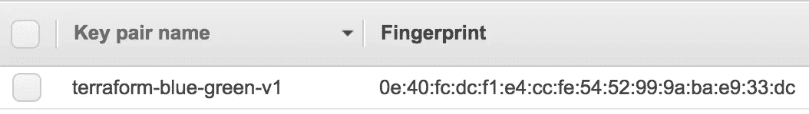

## 创造(终于！)EC2 实例

创建一个名为 **instances.tf** 的文件，并粘贴以下内容:

让我们稍微解释一下这个文件:

我们已经创建了一个类型为 **aws_instance** 的资源，参数如下:

*   **计数:**该类型资源的数量。在这种情况下，我们将创建 3 个实例
*   **AMI:** 实例的 Amazon 映像。在本例中，我们选择了官方的 AWS ECS 映像，因为我们将在其中运行一个 docker 容器。请记住，这个 AMI 只在美国-西方-2 地区有效，所以如果你在另一个地区，请检查这个链接。
*   **实例类型:**实例的实例类型
*   **子网 Id:** 如上所述， *element()* 函数接受一个列表和一个索引，并返回元素，即使索引大于元素的数量。这允许我们为每个实例分配不同的子网 id。
*   **密钥名:**密钥对的名称。我们选择了之前创建的那个
*   **用户数据:**这允许我们为实例分配一个初始化脚本。在我们的例子中，我们运行一个 NGINX Docker 容器，并在端口 80 公开它。有更好的方法来定义用户数据脚本，但是我们现在保持简单。

文件就绪后，运行:

```
**> terraform plan**Terraform will perform the following actions:+ aws_instance.terraform-blue-green[0]
...+ aws_instance.terraform-blue-green[1]
...
+ aws_instance.terraform-blue-green[2]
...Plan: 3 to add, 0 to change, 0 to destroy.**> terraform apply**Terraform will perform the following actions:+ aws_instance.terraform-blue-green[0]
...
+ aws_instance.terraform-blue-green[1]
...
+ aws_instance.terraform-blue-green[2]
...Plan: 3 to add, 0 to change, 0 to destroy.Do you want to perform these actions?
  Terraform will perform the actions described above.
  Only 'yes' will be accepted to approve.Enter a value: **yes**....Apply complete! Resources: 3 added, 0 changed, 0 destroyed.**Outputs:****instance_public_ips = [
    ip1,
    ip2,
    ip3
]**
```

当命令完成时，您将能够在 AWS 控制台中看到实例

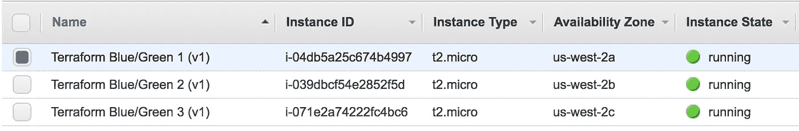

As you see, every of them are on different availability zones.

从浏览器访问您的任何实例(通过它们的公共 IP)应该会显示:

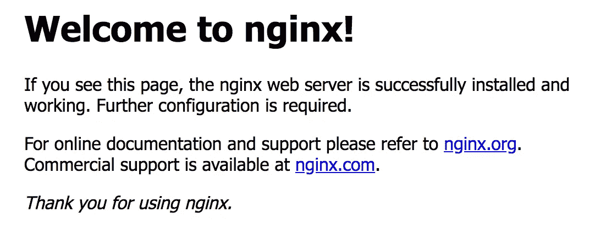

## 添加负载平衡器

使用以下内容创建一个名为 load_balancers.tf 的文件:

在这个文件中，我们创建了一个负载平衡器

*   **名称**:不言自明
*   **子网**:负载平衡器可用的子网
*   **安全组:**我们已经添加了之前创建的安全组，以便能够访问它
*   **实例:**我们已经添加了之前创建的实例
*   **监听器:**我们添加了一个监听器，监听负载平衡器的 80 端口，并指向实例的 80 端口
*   **Healthcheck:** 我们添加了一个简单的 HTTP Healthcheck，目标是实例的端口 80。
*   **输出:**我们添加了一个显示负载平衡器公共 DNS 的输出

文件准备就绪后，进行**地形计划**和**地形应用。当执行结束时，它应该输出负载平衡器的公共 dns。**

```
**> terraform apply**....Outputs:
...**load_balancer_dns = terraform-blue-green-v1-xxxxxx.us-west-2.elb.amazonaws.com**
```

从浏览器访问负载平衡器的公共 DNS 应该会显示 NGINX 页面。


Yes, I’ve used the same screenshot twice

您也应该能够在 AWS 控制台中看到它(在*EC2/负载平衡器*下)

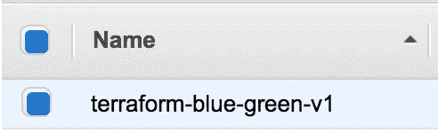

**(可选)为负载平衡器 V1 分配一个 DNS 记录**

我不打算过多地讨论这种情况，但是我最终在生产中所做的是创建一个指向负载平衡器的特定版本的 DNS 记录。terraform 中的一个例子是:

## 提交您的更改

提交到目前为止所做的更改

```
**> git add .
> git commit -m "Version 1"**
```

## 手动将 DNS 记录指向负载平衡器

**DevOps 不仅仅是自动化**。在某些情况下，进行最少的人际互动是一个很好的实践。在我们的例子中，我们将为所需的基础设施版本分配一个 DNS 记录(通过负载平衡器)。

为了能够执行这一步，你需要有一个注册域和相应的 Route 53 托管区域。

进入所需的托管区域，创建一个 **A 记录**，其**别名为之前创建的**负载平衡器**(地形-蓝色-绿色-v1……)。**

这是您的系统的入口点，也是您的客户端将要访问的内容。

## 创建 V2 基础设施

首先，在您的存储库中创建一个新的分支(我强烈建议删除。terraform 文件夹):

```
**> git checkout -b v2
> rm -rf .terraform**
```

现在，用以下代码修改 bootstrap.tf:

如您所见，您需要修改 **infrastructure_version** 变量和 S3 存储桶的**键。如果 terraform 允许在密钥中插入 infrastructure_version 变量，我会很高兴，但目前还不可能。但是 Github 有一个问题。**

现在你删除了。terraform 文件夹，您需要重新初始化状态:

```
**> terraform init**
```

现在用以下内容修改 instances.tf:

(我们已经**将实例大小从 t2.micro 更改为 t2.medium** 。你可以选择你喜欢的任何东西

做一个 **terraform 计划**会发现，其实 terraform 会重新创造所有资源。

```
**> terraform plan**
...
Plan: 11 to add, 0 to change, 0 to destroy.
```

完成 **terraform apply 后，**您将拥有一个全新的基础设施，而无需改变旧的基础设施。

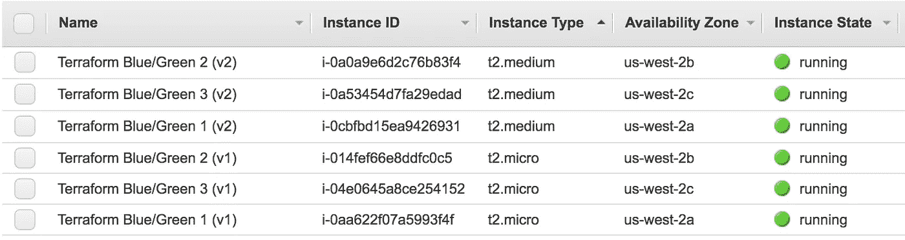

Instances

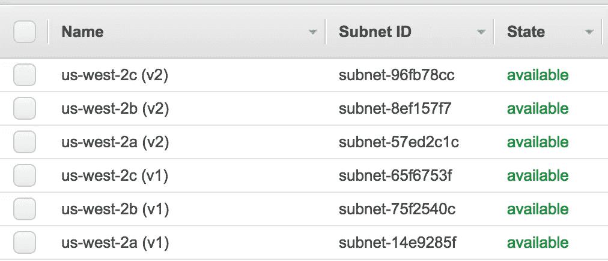

Subnets

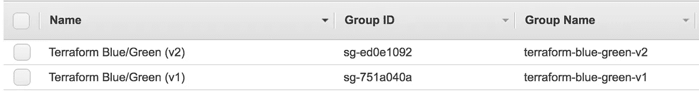

Security Groups

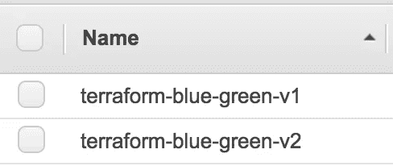

Load Balancers

## 通过新的基础设施路由流量

正如我们之前在版本 1 中所做的那样，使用别名将您的 DNS 记录指向新的负载平衡器。

## 删除旧的基础设施

当所有流量都开始流向新的负载平衡器时，就该删除基础架构的版本 1 了。

为此，首先提交版本 2 中的所有更改，然后再次签出旧版本。删除。terraform 文件夹并再次初始化状态。

```
**> git add .
> git commit -m "Version 2"
> git checkout master
> rm -rf .terraform
> terraform init**
```

然后，简单地做:

```
**> terraform destroy**Terraform will perform the following actions:- aws_elb.terraform-blue-green- aws_instance.terraform-blue-green[0]- aws_instance.terraform-blue-green[1]- aws_instance.terraform-blue-green[2]- aws_key_pair.terraform-blue-green- aws_security_group.terraform-blue-green- aws_security_group_rule.terraform-blue-green-inbound- aws_security_group_rule.terraform-blue-green-outbound- aws_subnet.terraform-blue-green[0]- aws_subnet.terraform-blue-green[1]- aws_subnet.terraform-blue-green[2]Plan: 0 to add, 0 to change, 11 to destroy.Do you really want to destroy?
  Terraform will destroy all your managed infrastructure, as shown above.
  There is no undo. Only 'yes' will be accepted to confirm.Enter a value: **yes**...Destroy complete! Resources: 11 destroyed.
```

现在，如果您转到 AWS 控制台，您应该只能看到 V2 资源。例如，这是销毁版本 1 后实例的屏幕截图:

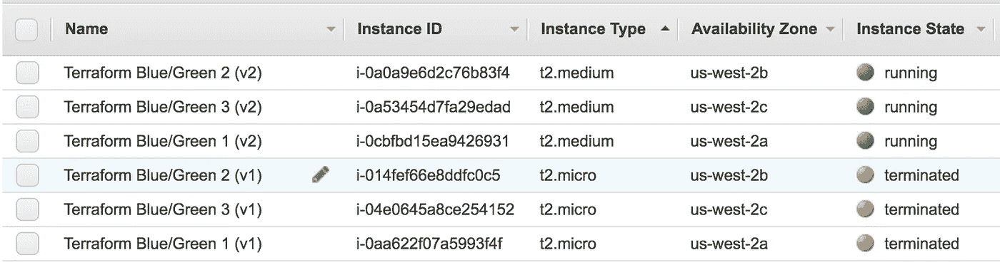

现在，您可以将 v2 分支合并到主服务器中。如果你这么做只是为了好玩，请为 v2 做一个**terra form destroy**；)

请记住，您可以在[https://github . com/santiagopoli/terra form-examples/tree/master/blue-green](https://github.com/santiagopoli/terraform-examples/tree/master/blue-green)上看到完整的示例

## 一个警告

在本指南中，我们使用 DNS 记录来选择哪个基础架构版本是生产版本。虽然这在大多数情况下是可行的，但在某些情况下，一些客户端库会缓存 DNS 条目，因此您应该等待一段时间，让流量从旧的平衡器中流出。您可以通过维护一个手动创建的负载平衡器并更改其实例来解决这个问题。

## 结论

Terraform 提供了一种清晰的声明式方法，将基础设施定义为代码。由于这一点，我们可以用它来完成几年前似乎不可能的事情。

我想以这种方法有几个缺点来结束这篇文章，我将在将来写一篇文章解释如何通过使用 Terraform 模块来实现相同的结果(事实上，这些模块总体上提供了更好的灵活性)。

> 感谢阅读！