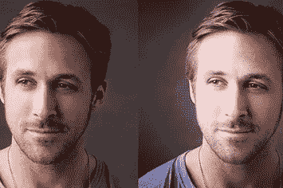

# 身体改造增强现实是我们的未来

> 原文：<https://medium.com/hackernoon/body-modification-augmented-reality-is-your-future-f7a959010d7b>

## 你的长相是由你的基因控制的，但如果不是呢？

我们每一个人都被我们物种的局限所约束，以至于我们能够投射到外部世界的样子。当然，你可以穿透和改变你身体的某些方面，但是我们作为一幅画布，在致命或太有害之前，我们可以做出的改变是有限的。

这在多大程度上是真实的，几乎每一种文化都验证过。部落的铜颈环、唇板、耳撑、划痕都是历史和现代的例子。无论是象征宗教仪式，增加美丽还是帮助你向外界展示你是谁，每一个都涉及到我们是谁的改变。

我们即将开始身体改造，其程度是迄今无法想象的。技术将使我们能够不受限制或没有损害的风险地操纵我们的外表，更多的表达和更少的伤害听起来像是一个重大的飞跃。

# BodyMod AR 是自我表达的下一次革命

*   用燃烧的火焰代替你的头发
*   插入游动的金鱼来代替你的瞳孔
*   观看纹身生动地在你的皮肤上移动

未来是虚拟的。增强现实将使个人表达成为可能，只受你想象力的限制。消费将通过植入我们视网膜或隐形眼镜的永久性增强现实装置进行，这使我们能够参与这个新世界。

Instagram 可能让我们能够上传最美的自己的照片，但下一阶段的技术创新将让我们不仅能改变自己的长相，还能改变周围所有人对我们的永久印象。

当然，人们将有能力关掉，抛弃我们为自己创造的奇妙现实，并按照基因的意图来消耗我们的肉体。其他人将选择无限期地保持这种替代现实。从表面上看，世界可能会一如既往地出现，而 ar 会在你的人身上显示你想象的深度。

为什么我们必须接受我们基因强加的限制——为什么我们不能是绿色或蓝色？为什么我们必须有雀斑和化妆，如果我们可以使用美化过滤器来修复我们的肤色，安全地知道“我们”将消费的永远是我们最好的自己？

*   当我们知道头发在 AR 中总是完美的造型，并且可以通过触摸屏幕来改变时，谁还需要头发呢？想要新颜色？就这么简单。
*   当我们完美的服装可以放在我们实际穿着的乏味的垃圾衣服上时，谁还需要新衣服呢？
*   当我们可以虚拟设计任何我们想要的动态显示并随意改变时，谁需要决定一个永久的静态纹身？

未来的科技将会让我们每个人在看到我们的人眼中成为我们一直想要成为的人。我们再也不用担心今天的发型不好，你的衣服不干净，或者你不再喜欢 18 岁和朋友度假时纹的纹身。

我们的身体将成为一个平台，投射我们的思想和视觉感受，我们的身体能力将不再限制什么是可能的。

我们的祖先将产品涂在脸上以获得更美丽的外观，然后演变成美发产品，再用技术进行改造，这一切都将在下一波可能性中发生革命性变化。

您想永久佩戴 SnapChat 滤镜吗？

## 当你描绘你的生活时，你的眼睛是什么颜色？

# 当我们赋予自己能力去改变我们居住的和其他人感知的现实时，这仅仅是可能的开始