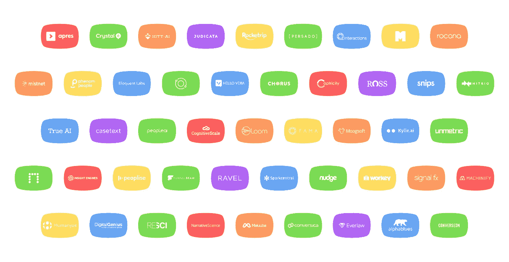

# 外挂式 AI:这是我们一直在寻找的 AI 捷径吗？

> 原文：<https://medium.com/hackernoon/bolt-on-ai-is-this-the-ai-shortcut-weve-been-looking-for-c2771c62d179>

## 看看第三方人工智能工具和服务，发现轻松获胜，以及在自动化世界中投资何处

人工智能已经成为一个有点分裂的话题。虽然一些行业已经将他们的整个业务定位于技术，但其他行业正在努力制定战略。

> 好消息是，采用人工智能不需要这么戏剧化。

一个完整的应用和服务生态系统已经出现，以弥合今天的业务流程和明天的智能流程之间的差距。

采用人工智能解决方案可以帮助公司简化运营，消除重复性任务。从通过智能客户参与提高销售额，到通过自动化 IT 运营降低运营支出，企业中的每个部门都可以获得新的工具支持。

这里有一些你今天可以集成的工具，无论你对人工智能有什么样的阶段或观点。

**跨职能解决方案**

哪里有数据，哪里就有智能系统(AI)做事情的机会。许多公司已经构建了跨职能解决方案来全面应对数据机遇。

缺点是这些解决方案确实需要协作(不是即插即用)来开发最适合您的用例的模型，但是影响可能是巨大的。

[**Apres**](http://www.apres.io) :人类自动化的 API。

[**CognitiveScale**](https://www.cognitivescale.com/) :为医疗保健、商业和金融市场构建增强智能软件。

[**capricity**](http://captricity.com/):将手写纸质表格转化为数字数据的云软件。

[**Machinify**](https://www.machinify.com/) :简化并加速你使用 AI 解锁数据中价值的能力。

**Insight Engines****:**Splunk 的自然语言处理(NLP)技术使您能够对您的机器数据进行“简单英语”查询。

[**叙事科学**](https://narrativescience.com/) **:** 通过高级自然语言生成(高级 NLG)为企业实现数据影响最大化。

**人力资源**

人力资源是运营密集型的，结构僵化，采用新技术的速度通常很慢。仅招聘人员就花了超过 60%的时间阅读简历——这些时间花在候选人身上更好。人力资源为人工智能提供了一个明显的机会来提高角色的效率:

*   **优化招聘:**在任何给定的时间，任何时候都积极寻找市场上所有可信的候选人——根据为您的企业量身定制的合适标准进行匹配。
*   **个性化职业发展:**将员工作为人而不是职能来对待的机会，并创造量身定制的里程碑和目标。
*   **员工情绪分析:**能够分析市场和内部的信息，并做出相应的调整。
*   量身定制的福利:为员工的隐性需求量身定制的套餐，比如健身追踪器和健康保险计划。

[**FAMA**](https://www.fama.io/)**:**通过分析一个人公开的在线表现，使用机器学习来帮助组织更聪明地招聘。

[**Mya**](https://hiremya.com/)**:**你团队的人工智能招聘人员。

[**幸灾乐祸**](https://www.gloat.com/) **:** 基于人工智能的匿名职业发展平台，让用户既能知道自己的价值，又能实时获得具体的聘用。

[**更好理解**](https://understandbetter.co/) **:** AI 驱动的员工挽留工具。

[**rocket rip**](https://www.rocketrip.com/)**:**通过奖励员工的节约来减少公司差旅支出。

****:**云人力资源服务，为所有招聘需求提供集成的、支持视频的数字平台。**

**[**Phenom 人**](https://www.phenompeople.com/) **:** 人才关系营销(TRM)云平台连接人与理想工作。**

**[**Koru**](https://www.joinkoru.com/)**:**预测招聘平台，在你见到他们之前就通知你要聘用谁**

**[**Humanyze**](https://www.humanyze.com/)**:**帮助企业更好地了解员工。**

****

****客服****

****

**自然语言处理(NLP)的进步为公司创造了与客户互动的新机会。从聊天机器人到语音助手，人工智能现在可以模拟人类互动，筛选所需的服务，并相应地路由解决方案。这简化了客户服务中心，使客户服务个性化，并使供应商和消费者之间的互动更加有效。**

*   ****与众不同的客户体验:**针对客户端上所有可用数据进行个性化调整的服务，以及作为界面层的智能虚拟助理。**
*   ****更智能的运营:**简化查询捕获和解决流程、主动支持以及账户/客户管理。**
*   ****智能洞察:**持续的数据分析——发现新的收入来源并减少流失。**

**[**数字天才**](https://www.digitalgenius.com/) **:** 为大公司的客服运营带来深度学习&人工智能的实际应用。**

**[**雄辩实验室**](https://www.eloquent.ai/) **:** 提供人工智能来增强和取代电子商务公司的实时聊天客户支持代理。**

**[**Kylie . ai**](https://www.kylie.ai/)**:**自动化客户关怀对话。**

**[**交互**](https://www.kylie.ai/) **:** 虚拟助理解决方案。**

**[**阿尔法布鲁斯**](https://alphablues.com/) **:** 提供人工智能驱动的客户服务。**

******:一个**自动化的客户支持。****

****[**Hello Vera**](https://www.hellovera.ai/)**:**跨越聊天、邮件、短信、Facebook Messenger、Twitter 等多个渠道的高级 AI 客服。****

****[**HelpScout**](https://www.helpscout.net/)**:**AI 为客户服务。****

****[**spark central**](https://www.sparkcentral.com/)**:**社交媒体客服。****

****[**Snips**](https://snips.ai/)**:**连接设备的 AI 语音平台。****

********

******销售&营销******

********

****SAAS 在过去十年中巩固了销售和营销数据的价值，使历史记录变得司空见惯，成为应用人工智能的理想选择。专注于转换的工具有望对收入和利润产生重大影响:****

*   ******优化的客户开发:**以最高价值的潜在客户为目标的自动化外向战略，在正确的时间交付合格的潜在客户。****
*   ******提高销售队伍的生产力:**人工智能系统通过相关见解、市场动向和持续培训/辅导来支持销售队伍。****
*   ******智能客户互动:**个性化客户互动、预测性营销和信息传递。****
*   ******自动化营销:** AI 生成内容和分发，预测营销增加留存，实时竞争情报。****

****[**节点**](https://hello.node.io/) **:** 以人为本的智能通过根据使用它的人来重组网络上的信息。****

****[**推动**](https://nudge.ai/) **:** 人工智能驱动的销售智能与您的买家建立关系，并增加您的销售额。****

****[**Conversica**](https://www.conversica.com/)**:**用于营销和销售使能的 AI 软件。****

****[**合唱**](https://www.chorus.ai/) **:** 实时记录、转录、分析销售对话，突出重要时刻，揭示你赢得和失去交易的原因。****

****[**漏斗梁**](https://www.funnelbeam.com/index) **:** 通过分析程序和创新的组织工具，为用户提供一个最大化销售线索的平台。****

****[**Nitrio**](http://www.nitr.io/) **:** 通过学习最佳销售代表如何与客户有效沟通的人工智能，帮助内部销售代表赢得更多。****

****[**艾登**](https://www.aiden.ai/) **:** AI 驱动的营销分析师。****

****[**people . ai**](https://people.ai/)**:**自动捕捉所有销售活动，推动智能销售管理和营销问责。****

****[**minti go**](http://www.mintigo.com/)**:**面向企业的预测营销平台，实现洞察驱动的客户参与，赢得并留住客户。****

****[**水晶**](https://www.crystalknows.com/) **:** 根据任何潜在客户、客户或同事的独特个性，向你展示与他们沟通的最佳方式。****

****[**克拉拉**](https://claralabs.com/) **:** 安排会议的虚拟助手。****

****[**留存科学**](https://www.retentionscience.com/) **:** 向每一位客户交付个性化体验的营销自动化 AI。****

****[**珀萨多**](https://www.persado.com/) **:** AI 生成的语言最能引起任何受众、细分群体或个人的共鸣。****

********:**AI 助力营销洞察，打造引人注目的内容。******

****[**conversion**](https://converseon.com/)**:**提供 Convey 的社交策略和分析公司。AI 语义机器学习技术和 Conversus App。****

********

******法律******

********

****法律部门将其大部分资源用于运营开销—文档解析、研究和发现。已经开发了各种人工智能工具来支持这些耗时的任务，通常比人类工具更有效。用人工智能充实现有的法律团队可以极大地提高生产力。****

*   ******法律研究:**提供法律摘要快速分析和总结的 AI 助手。****
*   ******契约勤奋:** AI 能够识别相关概要，并自动生成下一步和其他研究任务。****
*   ******发现:**文档审查和优先排序、自动化故事构建器、即时翻译。****

****[**罗斯**](https://rossintelligence.com/) **:** 人工智能律师通过法律研究帮助权力。****

****[**case text**](https://casetext.com/)**:**case text 的 CARA，自动执行关键的法律研究任务来分析诉讼文件，并使用这些信息通过算法查询法律。****

****[**Ravel:**](http://ravellaw.com/) 法律搜索、分析和可视化平台。****

****[**Everlaw:**](https://www.everlaw.com/) 法律法律文书审查与发现平台。****

****[**司法**](https://www.judicata.com/) **:** 法律技术公司提供研究和分析工具，将非结构化的判例法转化为结构化的数据。****

****[**LawGeex**](https://www.lawgeex.com/)**:**让每个人都能看到深入的合同评审。****

********

******IT 运营******

********

****越来越复杂的 IT 运营正在改变基础架构攻击面，使组织不断面临新的威胁载体。我们确实需要能够提供必要的智能和速度的工具，以跟上当今公司面临的日益增长的安全威胁。****

****除了能够接管容易出现人为错误的手动任务，人工智能还将实现实时威胁检测，最重要的是，在威胁造成损害之前阻止它们。****

*   ******安全:**异常检测与预防，实时监控，自主补救。****
*   ******认知洞察:**模拟用户如何调查、监控和解决事件的人工智能系统。****
*   ******简化的操作:** RPA 工具取代手动任务，并提供流程工作流的实时视图，以及自学式拓扑分析。****
*   ******改善客户体验:**支持 NLP 机器人与系统对话，以识别和解决性能问题，监控 IT 基础设施的数字性能。****

****[**罗卡纳**](https://www.splunk.com/en_us/newsroom/press-releases/2017/splunk-acquires-rocana-assets.html) :被 Splunk 收购的根源分析软件公司。****

****[**SignalFx**](https://signalfx.com/) :现代应用的先进监控平台。****

****[**Moogsoft**](https://www.moogsoft.com/) :以人为中心的[技术](https://hackernoon.com/tagged/technology)，帮助人和机器协同工作，在混乱中寻找清晰，加速创新。****

****[**LoomSystems**](https://www.loomsystems.com/) :人工智能日志分析解决方案，实时监控您的所有 IT 堆栈，在问题影响业务之前预测它们，并帮助您更快地解决它们。****

******:教会机器思考、推理和交流，被微软收购。******

******[**凯特。AI**](http://kitt.ai/) :多回合，简单易用，容易创作的聊天机器人。******

****[**Mistnet**](https://www.mistnet.ai/) : AI 驱动的[安全](https://hackernoon.com/tagged/security)威胁检测与防范解决方案。****

****[**dark trace**](https://www.darktrace.com/):**面向网络安全的企业免疫系统技术。******

******[**PatternEx**](https://www.patternex.com/) :将人类和机器结合成一个 AI 系统，能够大规模实时检测网络威胁。******

********

******结论******

****在内部建立人工智能并不是每个公司的正确策略。也就是说，利用人工智能是所有公司在任何市场保持领先的必要条件。如果竞争运行得更有效率，你已经落后一步了。****

****人工智能将影响每个行业，每个地方。不管你今天是否看到这种变化，开始为此做计划是很重要的。在这里领先是值得的。****

*****披露:Juniper Networks 是其中一家公司的投资者。*****