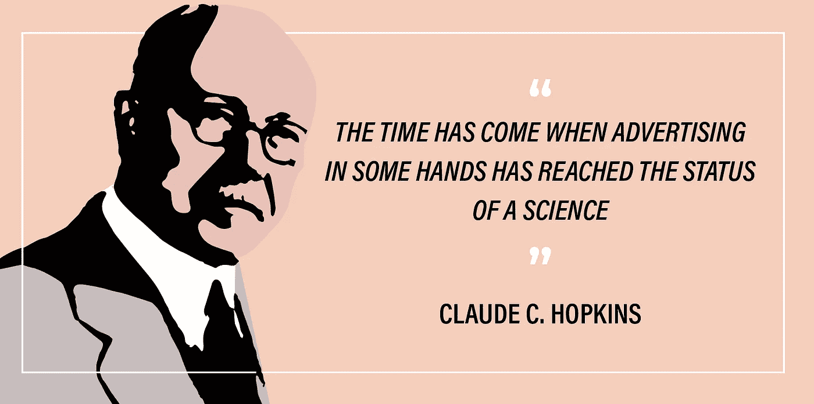

# 书评:科学广告又名 OG 增长圣经

> 原文：<https://medium.com/hackernoon/book-review-scientific-advertising-aka-original-growth-bible-e55e77067729>

Claude Hopkins 的*科学广告介绍了一种永恒的、数据驱动的广告方法。他的原则有助于完善我的思维，我认为他是一个值得信赖的导师。*

**

*很少拿起一本书，揭开这么多根本的真相。因此，霍普金斯在 20 世纪初的第一原则思想导致了许多其他伟大的广告人，包括[大卫·奥格威](https://en.wikipedia.org/wiki/David_Ogilvy_(businessman))，并已传播到所有现代实践中。他是分割测试、迭代改进和迎合消费者心理的鼻祖。更广泛地说，他有一套自己遵循的流程，而不是盲目跟随自己(或客户)的直觉。*

*我发现能够在我作为增长总监的角色中立即应用这些原则的好处，这围绕着吸引和获得 Rev 的[转录](http://rev.com/transcription)、[字幕](http://rev.com/caption)、[字幕](http://rev.com/subtitle)和[翻译](http://rev.com/translation)服务的客户。更广泛地说，这本书与任何使用文字和图像与他人交流的人相关，从广告到销售到产品。*

*这些原则直接涉及人类心理学。*

*这本电子书是免费的(一本实体书 4.29 美元，所以我把我最喜欢的名言留给你。*

# *测试一切*

> *“因此，我们测试所有与广告相关的东西。我们通过大量的追踪反馈回答了几乎所有可能的问题。”*

# *广告=销售*

> *“广告的唯一目的是销售……把它当作推销员。逼其自圆其说。”*

# *着眼于奖品*

> *“我们总是在寻找新客户。”*

# *高效的客户获取*

> *“不要仅仅为了兴趣、娱乐或吸引而做任何事情……只做那些能以最廉价的方式赢得你所追求的人的事情。”*

# *头条才是王道*

> *"花更多的时间在标题上，而不是写作上."*

# *特定>一般*

> *“一个论点的分量常常可以通过使其具体化而成倍增加”*
> 
> *“一个做出明确声明的人要么是在说真话，要么是在撒谎。人们不希望广告商撒谎。”*

# *简洁明了*

> *"一个人必须能够简洁、清晰、令人信服地表达自己，就像一个推销员必须做到的那样。"*

# *人都是自私的*

> *“记住，你所称呼的人都是自私的，我们都是如此。他们不关心你的利益或利润。他们为自己寻求服务。”*

# *准备战斗*

> *“广告很像战争……我们必须有技能和知识。我们必须有训练和经验，还有合适的设备。我们必须有足够的弹药。我们不敢低估对手。”*

# *初学者的心态*

> *“对所有渠道的信息传递保持初学者的心态”*

# *从小处着手*

> *"花大笔钱去冒险肯定是不明智的。"*

# *有条不紊*

> *“广告在某些人手中已经达到一门科学的地位的时候到了。它基于固定的原则，相当精确……每一个过程都有图表。准确知识的罗盘指引最短、最安全、最便宜的路线到达任何目的地。”*

# *永远不要停止测试*

> *"我们不断寻求更好的方法，而不中断已经证明的计划."*

*特别感谢[大卫·卡塞](https://medium.com/u/52d45a2865c1?source=post_page-----e55e77067729--------------------------------)和[戴夫·格哈特](https://medium.com/u/2d9925ac1dda?source=post_page-----e55e77067729--------------------------------)推荐这本关于[寻求智慧](https://medium.com/u/e40c315ebb0?source=post_page-----e55e77067729--------------------------------)的书。它已经改善了 Rev 的增长团队的决策框架，特别是在持续测试已经在工作的渠道和在新渠道下小赌注方面。*

*如果你有问题或想谈论增长、营销或广告，请联系:Barron.Caster@gmail.com 或 [LinkedIn](https://www.linkedin.com/in/barroncaster) **。***