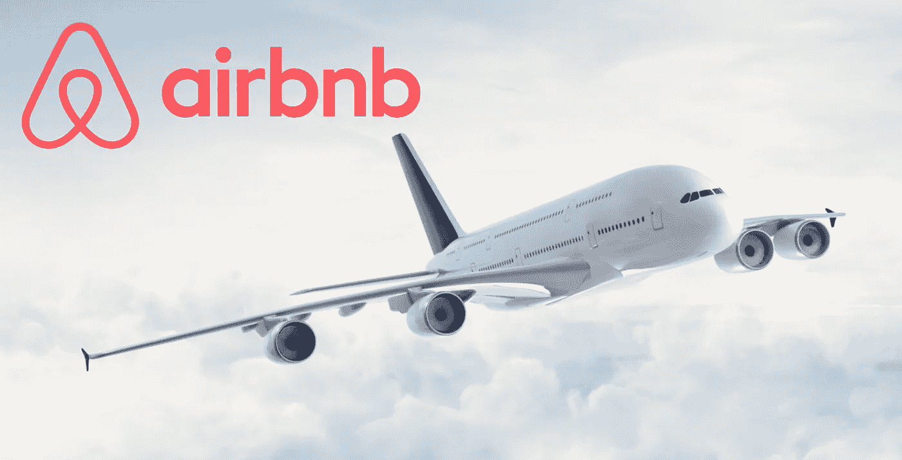
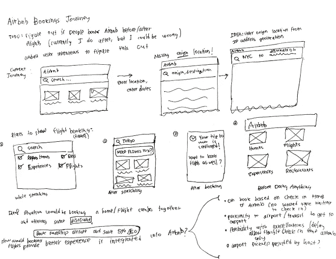
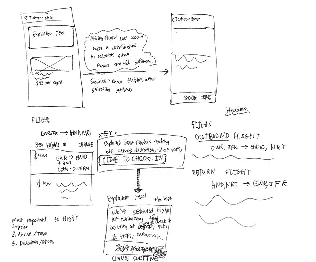
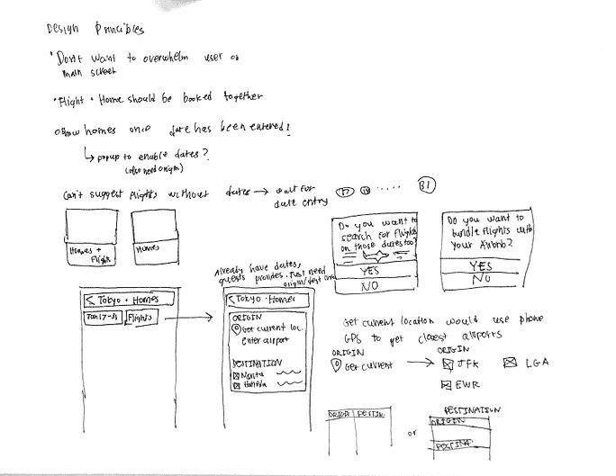
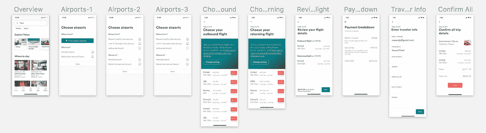

# 在 Airbnb 上预订航班

> 原文：<https://medium.com/hackernoon/booking-flights-on-airbnb-b2933d3cac29>

## 原型概念

[Source](http://stylecaster.com/google-flight-tracker/)

## 背景

去年夏天，我有幸去了八个国家(瑞士、意大利、挪威、新加坡、马来西亚、日本、泰国、印度)进行国际旅行，一路上住了十几家航空旅馆。在我的旅行计划中，我一个接一个地重复预订机场和航班，真的希望这两个过程能更无缝地结合在一起。

布莱恩·切斯基去年关于重新设计飞行体验的推文也引起了我的兴趣:

再加上 Brian 在这个[播客](https://soundcloud.com/best-of-tech-startups/masters-of-scale-uncut-interview-airbnbs-brian-chesky)中的一些主要想法，以及最近推出的 Airbnb [体验](https://www.airbnb.com/experiences)和[餐厅](http://airbnb.com/restaurants)，我很清楚 Airbnb 的长期愿景是控制从抵达到离开的整个端到端旅行体验。也许有一天 Airbnb 将运营自己的航空公司，但与此同时，我认为帮助客人在他们的住所旁边预订航班是更直接的第一步。

## 头脑风暴

我的大部分头脑风暴都是在思考，当我在不同的网站上预订 Airbnbs 和航班时，我个人在寻找什么，以及如何将这一过程结合起来才能更有效，并带来其他具体的优势。我也问了一些有类似旅行经历的朋友关于他们的旅行计划和他们通常遇到的任何问题。

Some of my messy notes and sketches while thinking about this feature

最后，我总结出以下想法，这些想法不仅能加快双重流程，还能为顾客带来更多价值:

*   Airbnb 可以提供更智能的房屋和航班选择。例如，靠近机场或机场交通的住宅可以优先于需要乘坐昂贵的优步车才能到达的住宅。此外，Airbnb 可以建议符合家庭入住或退房政策的航班，以尽量减少携带行李的时间。
*   获得客人的航班信息可以改善客人和主人之间的沟通，因为 Airbnb 可以通过跟踪航班延误自动通知主人入住延误。
*   客人可以使用一个应用程序进行所有的旅行预订——航班、房屋、通过体验做的事情以及通过餐厅吃饭的地方。

## 设计

为了开始设计我认为在 Airbnb 上预订航班会是什么样子，我从 Airbnb 当前的 [iOS 应用程序](https://itunes.apple.com/us/app/airbnb/id401626263?mt=8)中截取了几十张截图，并使用现有屏幕中的[设计](https://hackernoon.com/tagged/design)图案来保持与 Airbnb 的风格一致。

Final artboards in Sketch

在[草图镜](https://itunes.apple.com/us/app/sketch-mirror/id677296955?mt=8)的帮助下创建和调整新屏幕后，我决定[学习](https://hackernoon.com/tagged/learn)一些[帧流程](https://blog.framer.com/framer-flows-bd18617bbcf5)背后的基础知识，以更直观地感受这些屏幕在当前应用程序中的位置。幸运的是，将我现有的草图文件导入 Framer 并在所有屏幕之间添加过渡非常容易:

## 结论

我对最终的框架原型非常满意。这是一个值得思考的有趣功能，我希望在我预订下一次旅行之前，Airbnb 能增加这个功能。我在建立这一点的过程中的大部分假设都是围绕着我个人和我朋友的经历，所以我很好奇 Airbnb 在采访了数百名用户后会做出什么决定。此外，我正努力在这方面做得更好，所以任何反馈都很感谢。谢谢大家！