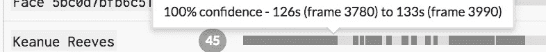

# 通过这一快速步骤提高您的面部识别准确性

> 原文：<https://medium.com/hackernoon/boost-your-face-recognition-accuracy-with-this-quick-step-e038efb97dc6>

我承认，[我们已经让](https://machinebox.io/docs/facebox?utm_source=Medium&utm_medium=Post&utm_campaign=The%20right%20way%20to%20train%20face%20recognition)部署最先进的人脸识别机器学习模型变得几乎太容易了。如此简单，事实上，您只需要知道如何将命令复制并粘贴到终端中(以及如何打开 web 浏览器)就可以亲自尝试了。

让事情变得如此简单很好，但为了充分利用这些工具，你仍然需要记住一些基本的机器学习原则。我看到人们在试图训练他们的人脸识别模型时最常见的错误之一是过于关注正确的算法，而对正确的训练数据关注太少。

让我们看一个简单但非常常见的人脸识别用例；在媒体内容中寻找名人。[例如，Facebox](https://machinebox.io/docs/facebox?utm_source=Medium&utm_medium=Post&utm_campaign=The%20right%20way%20to%20train%20face%20recognition) 可以很容易地找到你的名人照片，用一张照片教会模特这张脸，然后开始用它与你所有的媒体进行对比。

> 针对大量视频文件运行 Facebox 确实需要一些额外的工具和工作流程。例如，Machine Box 的母公司 Veritone 在[有一个平台](https://www.veritone.com/)，可以对这些东西进行分类，以便进行生产和规模化。

这在某些情况下会很有效，但你也会看到很多假阴性(在视频中没有检测到名人的情况)。

如何避免这种情况？幸运的是，答案也很简单。使用视频中您想要识别的人的照片。

例如，我们可以尝试使用这张来自互联网的光线充足、专业的山谬·里维照片，尝试在我们数千小时的吉米·法伦深夜片段中找到他，我们肯定会得到一些正面的结果。

但是，如果我们真的想提高准确性，我们还会加入基努中期句子定格的宝石。

Freeze frame from video we want to recognize him in

当我通过 [Videobox](https://machinebox.io/docs/videobox?utm_source=Medium&utm_medium=Post&utm_campaign=The%20right%20way%20to%20train%20face%20recognition) (另一个漂亮的工具)运行吉米·法伦深夜的一个视频时，它在上面山谬·里维的一张专业照片上进行了训练，它在整个视频中都找到了他，但许多结果的置信度得分在 50-65%左右。这是唯一一个高于 65%的实例:

当我再次运行相同的视频时，在从视频本身教会 Facebox 一个定格后，我们不仅增加了信心(在某些地方高达 100%)，而且我们还在视频中的许多更多地方找到了他。

当你与数百名不同的名人一起训练，并针对数千小时的视频运行模型时，这变得更加重要。

是不是每次都要百分百准确？当然不是。但是，你在自己的收藏中寻找山谬·里维剪辑的时间将会大大减少。

顺便问一下，你知道如何识别深度假货吗？寻找不眨眼的地方。不眨眼是仅使用睁着眼睛的人的训练图像的假象。我不是超级兴奋的教你怎么做更好的深度假视频，但这是一个关于训练数据和准确率的有趣案例。在[数据怀疑论者](https://overcast.fm/+BzxOeqqMs)上有一个关于这个主题的很棒的播客。

# 什么是机器盒子？

[Machine Box](https://machinebox.io/?utm_source=Medium&utm_medium=Post&utm_campaign=The%20right%20way%20to%20train%20face%20recognition) 将最先进的**机器学习**功能放入 **Docker 容器**中，这样像你这样的开发人员就可以轻松地将自然语言处理、面部检测、对象识别等融入其中。到您自己的应用程序中。

这些盒子是为了扩展而建造的，所以当你的应用真正起飞时，只需要水平地添加更多的盒子，直到无限甚至更远。哦，它比任何云服务都便宜**([它们可能更好](https://hackernoon.com/which-face-recognition-technology-performs-best-c2c839eb04e7))……而且**你的数据不会离开你的基础设施**。**