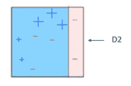

# 增强算法:AdaBoost、梯度增强和 XGBoost

> 原文：<https://medium.com/hackernoon/boosting-algorithms-adaboost-gradient-boosting-and-xgboost-f74991cad38c>


神经网络和遗传算法是我们模仿自然的天真方法。它们很好地解决了一类问题，但它们确实有各种障碍，如过拟合、局部极小值、消失梯度等等。与其他算法相比，还有一组算法没有得到太多的认可(在我看来),它们是助推算法。

## 什么是助推？

强化是一种将一组弱学习者转化为强学习者的方法。假设我们有一个二元分类任务。弱学习者在对对象进行分类时具有略小于 0.5 的错误率，即弱学习者比通过掷硬币来决定略好。强学习者的错误率更接近于 0。为了把一个弱学习者转变成强学习者，我们找来一个弱学习者家庭，把他们结合起来，然后投票。这就把这个弱学习者家庭变成了强学习者。

这里的想法是，弱学习者的家庭之间应该有一个最小的相关性。


这里设 A，B，C 是不同的量词。它们的区域 A 表示分类器 A 错误分类(出错)的地方，区域 B 表示分类器 B 错误分类的地方，区域 C 表示分类器 C 错误分类的地方。由于每个分类器的误差之间没有相关性，将它们组合起来并使用民主投票技术来对每个对象进行分类，这个分类器家族永远不会出错。我想这将提供一个基本的理解升压。继续推进[算法](https://hackernoon.com/tagged/algorithm)的类型。

## 升压算法的类型:

我想解释不同的升压算法，但不涉及任何数学，因为我觉得这会使事情复杂化，并违背本文的目的，即简单性(希望如此)。不同类型的升压算法包括:

*   adaboost 算法
*   梯度推进
*   XGBoost

这三种算法获得了巨大的人气，尤其是 XGBoost，它赢得了许多数据科学比赛。

## AdaBoost(自适应升压):

适应性增强技术是由 Yoav Freund 和 Robert Schapire 提出的，他们因其工作获得了哥德尔奖。AdaBoost 致力于改善基础学习者失败的地方。基础学习器是一个[机器学习](https://hackernoon.com/tagged/machine-learning)算法，它是一个弱学习器，在此基础上应用 boosting 方法将其转变为强学习器。任何接受训练数据权重的机器学习算法都可以用作基础学习器。在下面的例子中，[决策树桩](https://en.wikipedia.org/wiki/Decision_stump)被用作基本学习者。

我们获取训练数据，并从该数据中随机采样点，然后应用决策树桩算法对这些点进行分类。在对采样点进行分类之后，我们将决策树的树桩与完整的训练数据进行拟合。这个过程反复发生，直到完整的训练数据无任何误差地拟合，或者直到指定的最大估计数。

从训练数据中取样并应用决策树桩后，模型符合如下所示。


Decision Stump 1

我们可以观察到三个阳性样本被错误分类为阴性。因此，我们夸大了这些错误分类样本的权重，以便它们在再次采样时有更好的机会被选中。



Decision Stump 2

当下次对数据进行采样时，将决策树桩 2 与决策树桩 1 相结合，以拟合训练数据。因此，我们这里有一个微型系综，试图完美地拟合数据。这两个决策树桩的微型集合将三个阴性样本误分类为阳性。因此，我们夸大了这些错误分类样本的权重，以便它们在再次采样时有更好的机会被选中。


Decision Stump 3

选择先前错误分类的样本，并应用判定树桩 3 来拟合训练数据。我们可以发现两个阳性样本归类为阴性，一个阴性样本归类为阳性。然后，使用三个决策树桩(1、2 和 3)的集合来拟合完整的训练数据。当使用这三个决策树桩的集合时，该模型完美地拟合了训练数据。


Ensemble of 3 Decision Stumps

AdaBoost 的缺点是它很容易被噪声数据击败，算法的效率受离群值的影响很大，因为算法试图完美地拟合每个点。你可能会想，既然算法试图去适应每一个点，它不会过度适应吗？不，不是的。答案已经通过实验结果找到了，有各种猜测，但没有具体的推理。

代码:

```
# AdaBoost Algorithm
from sklearn.ensemble import AdaBoostClassifierclf = AdaBoostClassifier()
# n_estimators = 50 (default value) 
# base_estimator = DecisionTreeClassifier (default value)
clf.fit(x_train,y_train)
clf.predict(x_test)
```

继续解释梯度增强和 XGBoost 将进一步增加这篇已经很长的文章的长度。因此，我决定把它们作为另一篇文章来写。请点击下面的链接。

链接:[https://medium . com/@ grohith 327/gradient-boosting-and-xgboost-90862 daa6c 77](/@grohith327/gradient-boosting-and-xgboost-90862daa6c77)

## 参考资料:

[https://www . analyticsvidhya . com/blog/2015/11/quick-introduction-boosting-algorithms-machine-learning/](https://www.analyticsvidhya.com/blog/2015/11/quick-introduction-boosting-algorithms-machine-learning/)