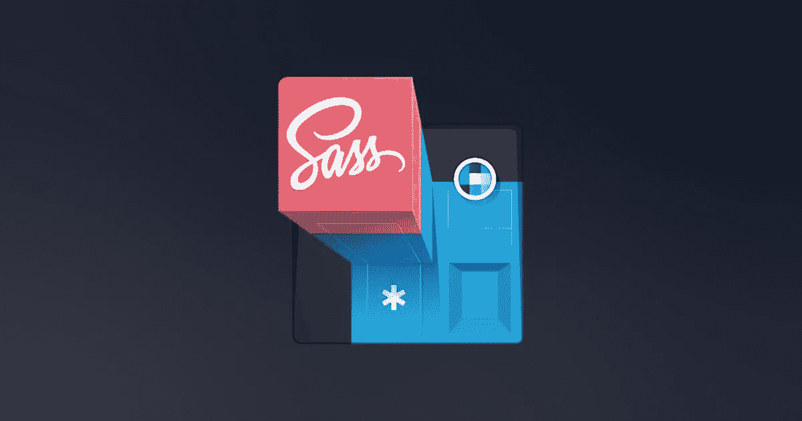

# 如何充分利用用 Sass lang 编写的 CSS 框架？

> 原文：<https://medium.com/hackernoon/bootstrap-framework-best-practises-b1d81c02d6cf>

有没有想过如何充分利用每一个 CSS 框架，这些框架都是用 [Sass 语言](https://sass-lang.com/)编写的？我是来给你指路的。

我们将使用[引导框架](https://getbootstrap.com/)，具体来说就是 [v4.5.3](https://github.com/twbs/bootstrap/tree/v4.5.3) 。为什么不是[自举 v5](https://v5.getbootstrap.com/) ？因为在我写这篇文章的时候，它还处于初级阶段，核心的东西将会改变。我会给它一个 Bootstrap v5 的更新，或者在它发布时为它写一个新的专用帖子。



Sass Illustration by [Maggie Appleton](https://dribbble.com/shots/3277558-Super-Extending-Sass).

# 先决条件

*   启动一个 NPM 项目
*   项目使用 NPM 脚本或捆绑器(例如 [Webpack](https://webpack.js.org/) )进行 Sass
*   将 Bootstrap 或任何其他 Sass/Scss 框架作为依赖项安装在您的项目中

# 入门指南

我们不会关注这个框架的 JS 方面。我们就假设它是一个纯 CSS 框架，没有其他的添加。

让我们开始构建我们的项目。在我的项目中，我总是有一个名为`src`的源代码目录，在这个目录中，我有多个目录，这些目录根据它们所代表的内容来命名。

这里是代表项目结构的 ASCII 树，它只关注于`styles`。在现实世界的项目中，会有许多其他的目录和文件，但是出于本指南的考虑，没有额外的文件或目录。

```
.
└── project/
    └── src/
        └── styles/
            ├── app/
            │   ├── base.scss
            │   └── variables.scss
            ├── vendor/
            │   └── bootstrap/
            │       ├── core.scss
            │       ├── main.scss
            │       └── variables.scss
            ├── app.scss
            └── vendor.scss
```

让我们先关注一下`app.scss`和`vendor.scss`文件。它们是你的`style`资产的切入点。它们的唯一目的是导入相应目录中的所有文件，只有一个例外。

让我们导入其中的文件，尽管我们要导入的文件是空的。

**文件:**...你拥有的一切。

```
// Bootstrap's Core
[@import](http://twitter.com/import) 'vendor/bootstrap/core';// App
[@import](http://twitter.com/import) 'app/variables.scss';
[@import](http://twitter.com/import) 'app/base.scss';
```

我说，在每个文件中，我们将从它们对应的目录中导入文件。例外是，在我们的`app.scss`中我从`vendor`中导入了`bootstrap/core`。

*   `core`是这种分离最重要的文件，这就是为什么我们在所有应用程序导入之前，在顶部添加一次它
*   在`variables`中，你可以为你的应用编写任何额外的变量
*   在`base`中，你可以编写任何基础样式*(例如，扩展一个重置 css)*

**文件:** `**vendor.scss**`您可以将这个文件用于所有的依赖项...你通过 [NPM](https://www.npmjs.com/) 安装的一切。

```
[@import](http://twitter.com/import) 'vendor/bootstrap/main';
```

现在让我们填写`vendor/bootstrap`文件。如果你看一下 [Bootstrap 的主 SCSS 文件](https://github.com/twbs/bootstrap/blob/v4.5.3/scss/bootstrap.scss)，你会注意到它包含了框架必须提供的所有东西的导入。

我们需要利用这一点，以便我们能够从中获得最大收益。

不要试图用复制/粘贴和移动片段来迷惑你，最好看一下这个例子: [Webpack Config](https://github.com/dvlden/webpack-config/tree/master/src/styles)

简而言之，我们从 Bootstrap 中取出最重要的文件，并将它们移动到`core`文件中，这样我们就可以在我们的应用程序中重用它的所有功能。

# 我们通过分离获得了什么？

通过所有的分离，我们现在可以完全控制 Bootstrap 框架。如前所述，它可以是任何用 Sass lang 编写的框架。不一定是自举。

我们实现了以下目标:

*   `app`和`vendor`风格编译捆绑分离
*   覆盖默认引导变量值。这是通过在我们的自定义`vendor/bootstrap/variables.scss`文件中写入任何引导现有变量并设置不同的值来完成的
*   删除不必要/未使用的组件，只需从我们的`vendor/bootstrap/main.scss`文件中注释掉所需的`@import`行
*   在我们的应用程序目录中的文件中使用引导函数、mixins 和变量

现在，我们为我们的应用程序额外编写的所有东西都可以有 Bootstrap 的原始感觉，因为你将直接从 Bootstrap 使用相同的变量、函数和混合。

# 通过完整示例了解更多信息

因为最初可能很难从上下文中理解一切；从完整的例子中可能更容易更好的理解。

看看下面我的 Webpack 配置，它实现了这个逻辑和更多。

[https://github.com/dvlden/webpack-config](https://github.com/dvlden/webpack-config)