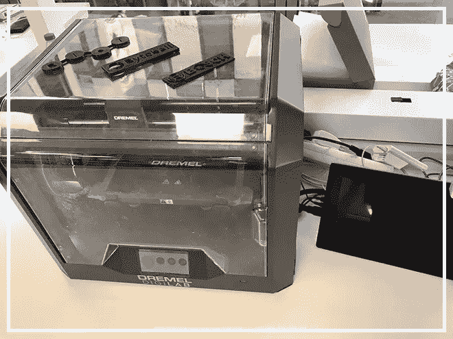
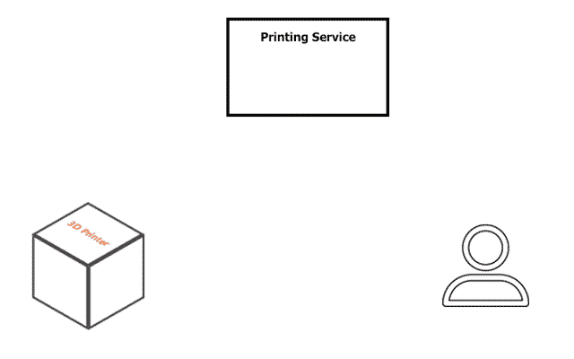
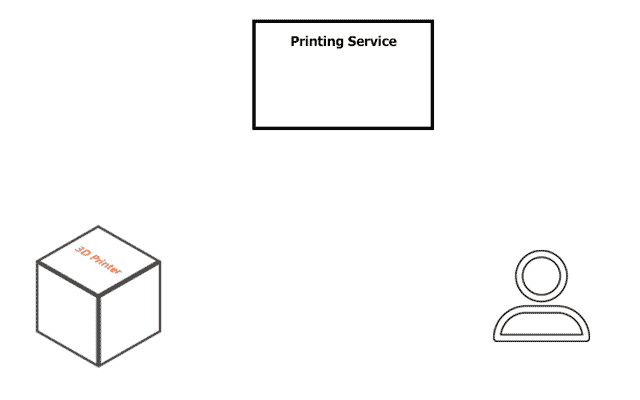
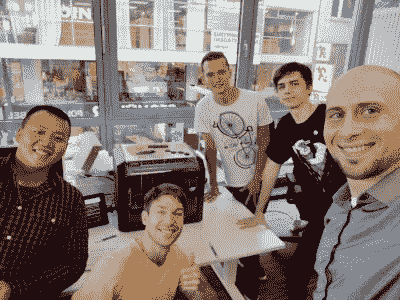

# 博世-毕奥:自给自足的 3D 打印服务

> 原文：<https://medium.com/hackernoon/bosch-biot-self-sustaining-3d-printing-service-f6c925b07355>

[Dremel 3D45](https://dremel3d.co.uk/3d45-printer-benefits)

基于熟悉设备的自持系统越来越受欢迎。这使您可以消除中间环节，降低维护设备的成本。我们很高兴介绍我们与 [Dremel](http://dremel3d.co.uk/) 和博世的合作，这导致了一个有趣项目的诞生——一个自我维持的 3D 打印服务。

## **项目描述**

该项目的本质是创建一个远程 3D 打印服务。其中用户上传 3D 模型，之后向他显示关于 3D 模型打印的大约时间和成本的信息。然后服务提供两种支付方式:立即支付和按次支付。印刷成本是根据花费的时间和材料的数量来计算的。根据打印前付款的大致时间立即付款。Bosch Connectory 的团队实施了这一方法，因为他们拥有通过使用 Bosch 硬币付款制造一台[咖啡机](/@Suirelav/buy-premium-coffee-with-bosch-coins-and-more-report-from-the-bosch-iot-a-thon-4b071f62a5fb)所获得的经验。

当用户选择按时间付费的方式，付款将通过支付渠道每 n 次的打印机工作。这种方法优于立即付款:用户在使用服务和材料时付款，仅此而已；双方都受到保护，每个人都可以在任何时候根据完成的工作得到他们的钱。这个方法是我们团队实现的。字节球网络交易的速度和便宜让你在几秒钟内打开一个支付通道，所有交易都是免费的，数量不限。仅支付通道的打开和关闭，其小于 0.0001 €。

选择支付方式后，用户会看到二维码。扫描后，您将收到博世硬币形式的支付信息。最后，当用户确认付款后，打印机将开始打印。

在博世连接器办公室的一周工作中，我们实现了这个项目的主要核心。这不是我们工作的结束，我们将远程继续。在这个阶段，我们需要“润色”已实现的并扩展功能。

## **在决赛中**

我们的团队非常感谢有机会参与如此有趣的项目。一个有趣的项目，如没有人激励工作富有成效。我要特别感谢博世连接器的团队:Gress Antonius、Tran Rui Lun 和 Roth 汉尼斯。

## 联系我们

关注我们的 [*Twitter*](https://twitter.com/BIoT_ws) 获取最新消息，并在 [*Telegram*](https://t.me/BIoTOfficial) *上加入我们的社区。*将您的问题和建议发送至—[*team @ biot . ws*](mailto:team@biot.ws)*。我们的网站—*[https://biot.ws/](https://biot.ws/)