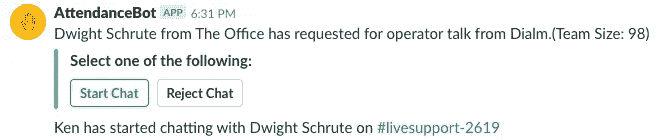
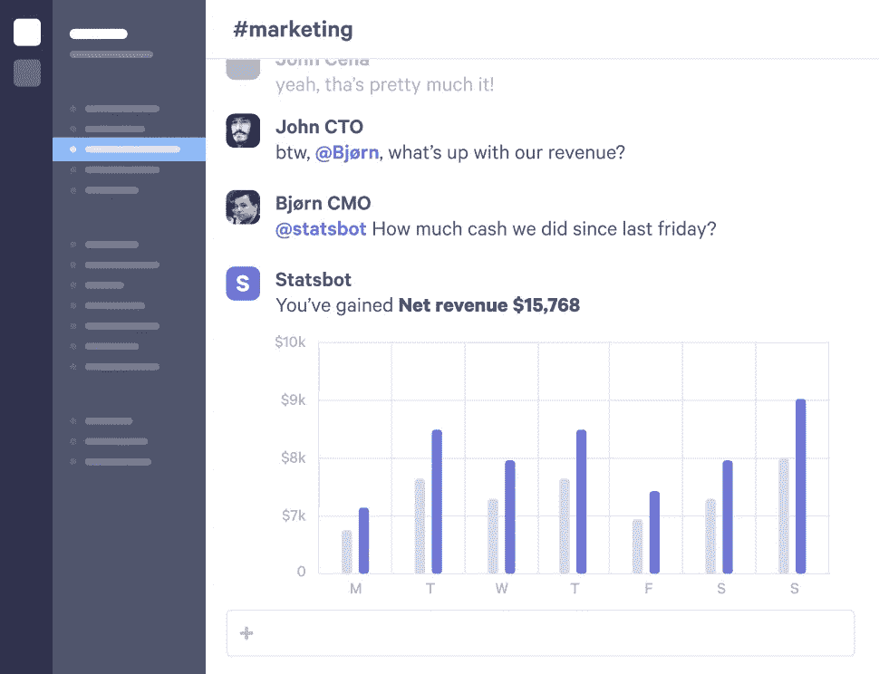
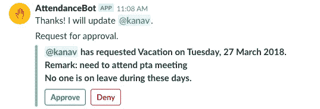
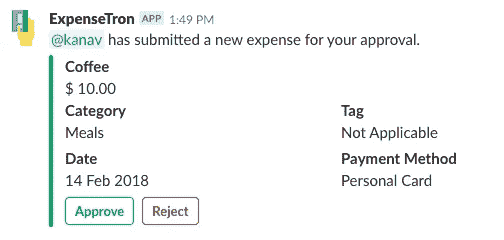
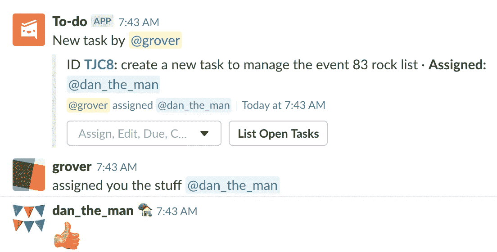

# 什么都用机器人？或者是？

> 原文：<https://medium.com/hackernoon/bots-for-everything-or-is-it-74775ce2499e>

The best part about business bots is that they are built around collaboration.

《连线》杂志最近发表了关于为什么聊天是工作的未来的观点。我们相信这一未来愿景，并把我们众所周知的房子押在了这一愿景上。我们从 2016 年开始构建一套应用程序，利用 Slack 帮助公司大幅提高生产力。

就像《连线》的文章提到的，chat 有很多明显的早期用例，包括费用申报、[知识管理](https://www.officeamp.com/qna/)和客户支持。我们同意这些例子，但是这是否意味着每个商业活动都同样适用于聊天界面呢？嗯，显然不是，但是用例从它们对聊天界面的适用性来看属于一个范围。

以下是如何判断何时将一个功能移至聊天是有意义的

**1。当你正在做的事情实际上是聊天时**——客户支持就是一个很好的例子。当通过聊天帮助某人时，无论是在组织内部还是通过实时聊天插件与网站上的潜在客户交谈。这里的原生交互单元是纯粹的聊天，所以把这些聊天带到你内部用来聊天的任何平台上是有意义的。这就是我们在向客户提供支持时所做的事情。

When a customer reaches out to us for a chat, anyone on our support team can claim the chat and start talking

通过这种方式，我们能够将产品和网站支持带到一个页面，整个团队的每个人都可以登录。如果我们看到支持量激增，团队中的任何人都可以参与进来，因为每个人都可以看到所有传入的请求。在我们构建此解决方案之前，只有支持团队登录到客户支持门户网站，这意味着当票证数量激增时需要等待很长时间。这不仅通过减少等待时间使客户受益，还意味着团队中的每个人都在提供支持，并每周至少与客户交谈几次。

我们在 [**Intercom**](https://www.intercom.com/integrations/slack) 的朋友似乎同意我们的观点，他们最近发布了他们的 Slack bot，通过他们的 web/app widget 将与客户的对话带到 Slack，以便支持人员始终处于 Slack 状态。

**2。当将数据拉入上下文时** — [**Statsbot**](https://statsbot.co/) 和 [**Polly**](https://www.polly.ai/) 是这里的完美例子。它们都允许你从其他来源获取数据，或者简单地询问你公司的其他人，这与当时的讨论有关。数据可以用来轻松解决所有争论，它带来的彻底透明有助于将组织的各个部分对准数字驱动的目标。

Statsbot in action. Image courtesy Statsbot.com

**3。顺序工作流** —这些是经典的工作流，其中一个人的动作触发另一个人执行后续动作。想象有人使用 AttendanceBot 申请休假。员工说他们正在休假，然后 [**出勤**](http://www.attendancebot.com) 得到经理的批准。

Leave application by an employee triggering an approval process by the manager

在这种情况下，虽然 Slack 中的动作非常简单，但在幕后却有很多魔法。申请休假时，AttendanceBot 会检查员工是否拥有给定休假类型所需的剩余假期，确定给定休假类型是否需要经理的明确批准，并检查团队中是否有其他人在这些确切的日期休假，以便经理可以做出明智的决定。

当经理批准休假时，AttendanceBot 会立即通知员工，自动更新休假余额，将休假同步到团队的共享日历，并为休假期间设置一条消息。想想看，与其他方式相比，这是多么容易。

[**ExpenseTron**](http://www.expensetron.com) 是这里的另一个主要例子。它允许员工将他们的费用提交给经理审批，审批通过后，ExpenseTron 会将这些费用同步到 Xero 或 Quickbooks 等会计软件中。一旦同步，财务团队就可以使用会计软件报销费用，并且只要费用在 Xero 或 QuickBooks 中被标记为已支付，ExpenseTron 就会通过在 Slack 中通知员工来结束与员工的循环。

Another sequential workflow where an Employee submits an expense that is sent to manager for approval

**4。** **待办事项/清单** —这里有很多很好的例子，从通用的[**To-do**](https://www.todobot.io/)**bot**让任何人向团队中的其他人分配待办事项，到更适合的 [**OfficeAmp**](http://www.officeamp.com) 用于管理办公室中与设施、IT、人力资源、餐具室等相关的任务。****

********

****To-Do bot in action.****

******在聊天中没有意义的工作流**——这是一个更短暂的类别。在聊天的有限交互元素上没有意义或者需要更大画布的东西。也可能是没有人在这方面做得足够好。如果你正在开发以下类别的机器人，不要因此而气馁。****

*   ******购物** —无论是购买普通商品、预订航班或酒店，还是任何其他发现是互动重要组成部分的场景，对话界面都变得有点麻烦。Discovery 需要一个大画布来让我们快速浏览大量选项并缩小选择范围，这通常意味着使用过滤器或分面搜索，这对于应用程序来说更自然。微软团队最近引入了标签的[概念，这可能会使在消息平台中构建此类应用更容易，但标签实际上并不是聊天界面。](https://docs.microsoft.com/en-us/microsoftteams/platform/concepts/tabs/tabs-overview)****
*   ******预订优步** —考虑到在 Slack 上构建时无法访问 GPS 数据的技术限制，这种用例基本上在到达时就失效了。鉴于我们对优步和 Slack 的热爱，[我们确实为 Slack 制作了一个优步机器人](https://chatbotsmagazine.com/how-i-built-my-personal-uber-bot-on-facebook-messenger-you-can-too-c990aa8e29f4?gi=d81bc1bf6574)，但它确实有很多不足之处。我确实认为这是一个唾手可得的果实，当 Slack 允许开发者访问 GPS 和其他移动传感器数据时，我们将开始在 Slack 上看到越来越多的新型机器人。****
*   ******银行和其他高安全性交易**—[**PayPal**](https://www.paypal.com/slack/)在 Slack 上确实有一个允许转账的机器人，但大多数银行还没有接受 Slack。像从 Slack 内部访问指纹传感器这样的事情可能会使这变得更容易。对其他传感器的访问也可能类似地使面临类似隐私和安全考虑的医疗保健机器人处于松弛状态。****
*   ******配置和数据管理** —虽然接收警报很好，但在空闲时间采取行动仍然很困难。除非你所需要做的只是接收一个警报，然后点击一个按钮。管理或配置多个元素仍然是留给浏览器上独立仪表板的问题。这就是为什么 Slack 上的大多数机器人仍然会带你离开 Slack 去组建你的团队，配置选项，设计工作流程等等。****

********

****总的来说，Slack(和其他即时通讯平台)显然是商业世界的新浏览器，也是未来的发展方向。****

****我们遗漏了什么用例吗？请在评论中告诉我们。****

****此外，一定要检查一下我们的机器人是否松弛。****