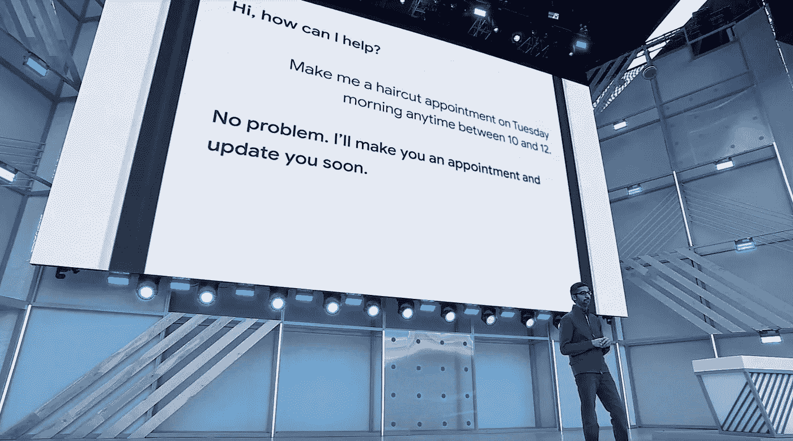

# 机器人伪装成人们穿越边界

> 原文：<https://medium.com/hackernoon/bots-masquerading-as-people-crosses-boundaries-6b25d0cec8a0>

## 从 22 世纪的角度来看，它们是工具，是粗制滥造的玩具，无论它们可能给 2018 年的穴居人留下多么深刻的印象。

当谷歌展示其新聊天机器人 Duplex 时，我对他们所实现的技术复杂性印象深刻。(是的，[有些人认为对话可能是经过精心编排的，或者至少是经过大量剪辑的](https://www.vanityfair.com/news/2018/05/uh-did-google-fake-its-big-ai-demo/amp)。)

伪装成人类的机器人确实存在问题。近十年来，我们已经看到 Twitter 上笨拙的机器人和[脸书](https://hackernoon.com/tagged/facebook)迷惑和迷惑了人们。我曾经用过 Andrew/Amy，一个令人印象深刻的日程安排机器人。但是当我意识到我所关心的人正在花时间将深思熟虑的信息写成剧本时，我就停止使用它了。浪费他们的时间和注意力。

X.AI(Amy 背后的公司)迅速解决了这种情况，现在[标记出消息来自 bo](https://x.ai/blog/our-response-to-google-duplex/) t。

我不是当今人工智能工具的狂热拟人化的忠实粉丝。这些是[工具](https://hackernoon.com/tagged/tools)、电子表格、锤子、打火石，再多一点神韵和仙女灯。他们令人印象深刻。他们使用更好的数学方法，比过去那些愚蠢的齿轮和轮子更少确定性地行动。正如这封信的长期读者所知，它们可以给我们带来一些相当显著的好处。但是今天，它们是工具。它们通过科学方法和良好工程的应用而得到改进。我们使用“训练”这样的词，因为这些过程类似于我们训练有意识的生物实体的方式。但这只是一个类比。

他们没有代理。即使是最大的(非)自我推销者(看看你，索菲亚和阿特拉斯)也没有代理，没有任何类似做人的东西。从 22 世纪的角度来看，它们是工具，是粗制滥造的玩具，无论它们可能给 2018 年的穴居人留下多么深刻的印象。我们都希望拥有的[金色实验室小狗](https://www.buzzfeed.com/gideonkidd/pet-that-dog-gideon?utm_source=dynamic&utm_campaign=bffbbuzzfeed&ref=bffbbuzzfeed&utm_term=.ub7VNelKy6#.wxM56Zx80K)有更多的代理，更好的自我意识。

因此，同样的道理，我们不应该把这些部分的可执行代码当作人，我们不应该让他们伪装成人(除非在某些治疗或专业的情况下)。在演示过程中，谷歌再次表明，这家科技公司已经掌握了它经常遇到的道德界限。它笨拙地越过了一条线。

这是一条我们也许有一天会忘记的线。科学可以帮助我们更好地理解一个系统的感知、代理或意识能力，从而帮助我们跨越这一障碍。但这不是我们今天需要跨越的界限。

我写了一份很棒的时事通讯，每周都会报道类似的话题。可以在[***【http://exvw.co】***](http://www.exvw.co)报名